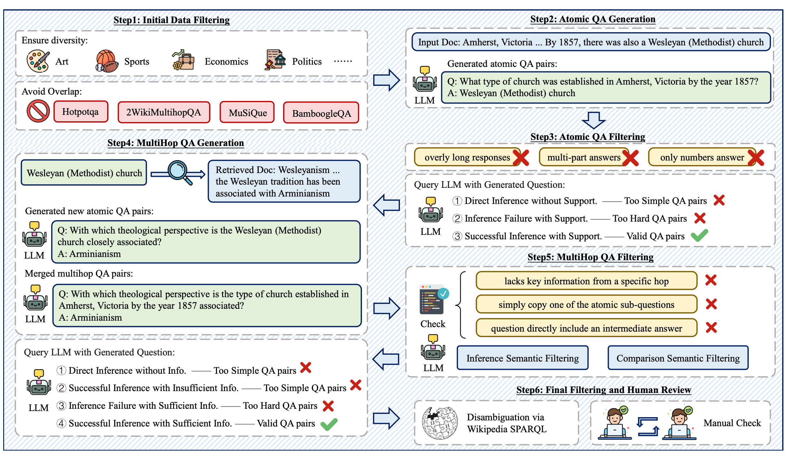
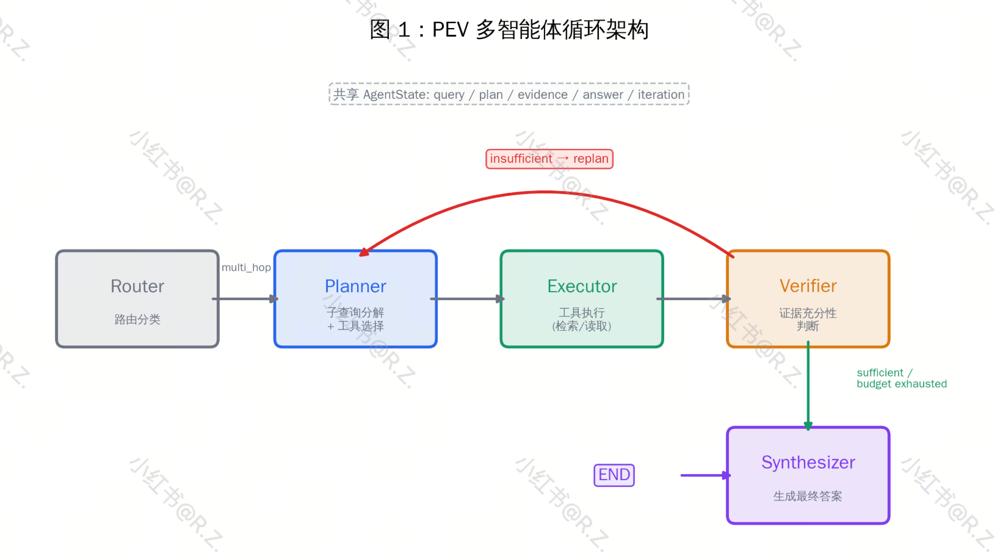
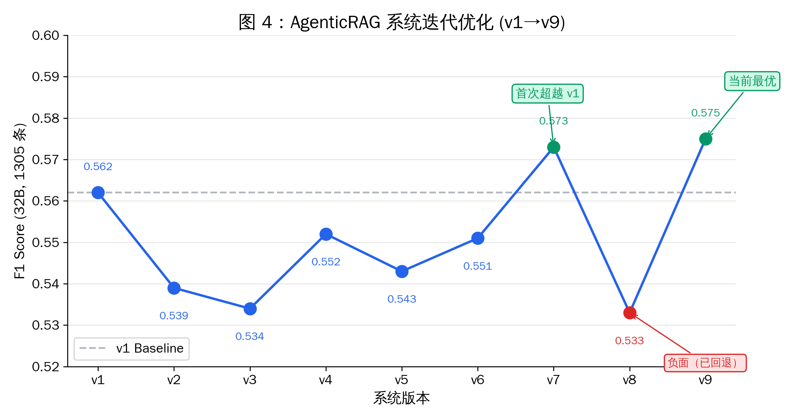
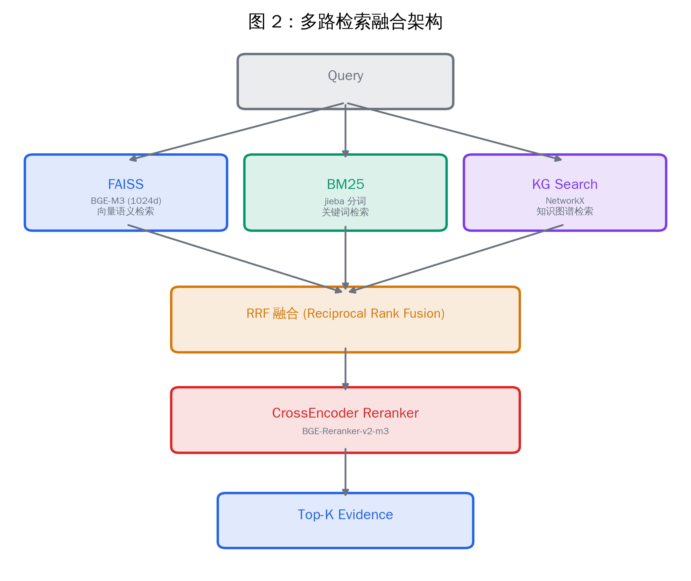
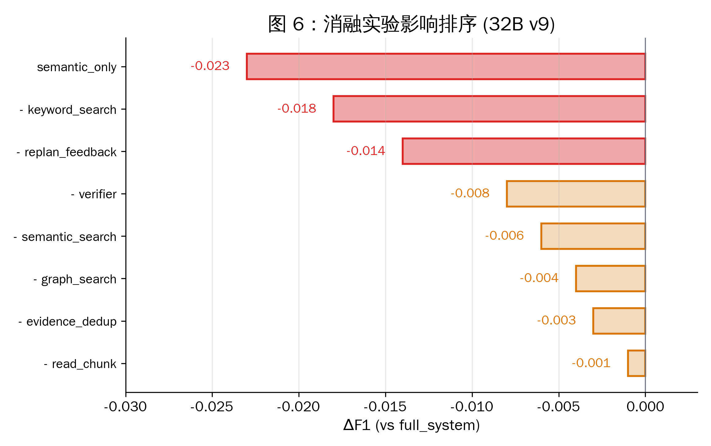
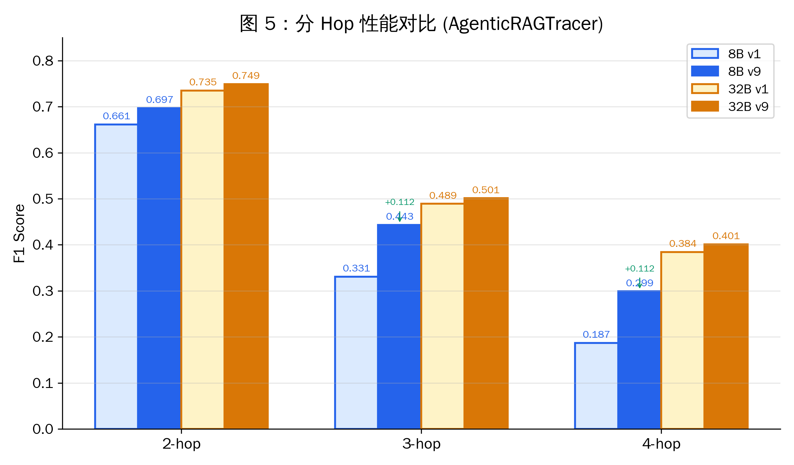
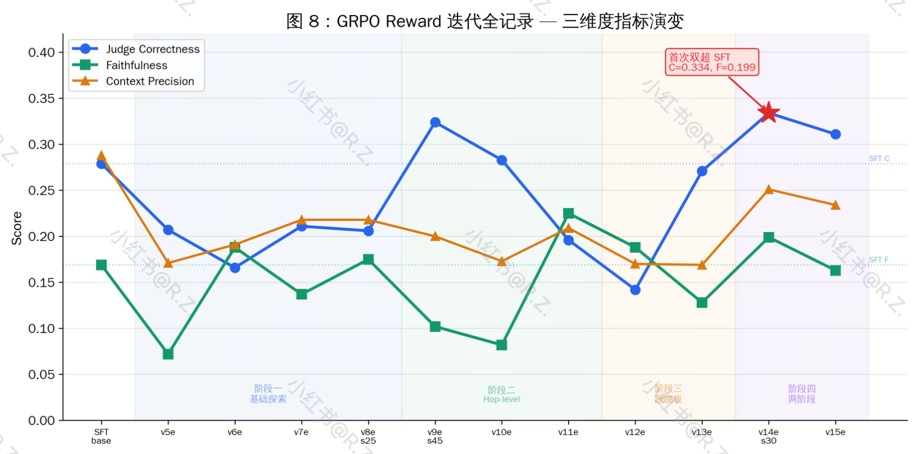
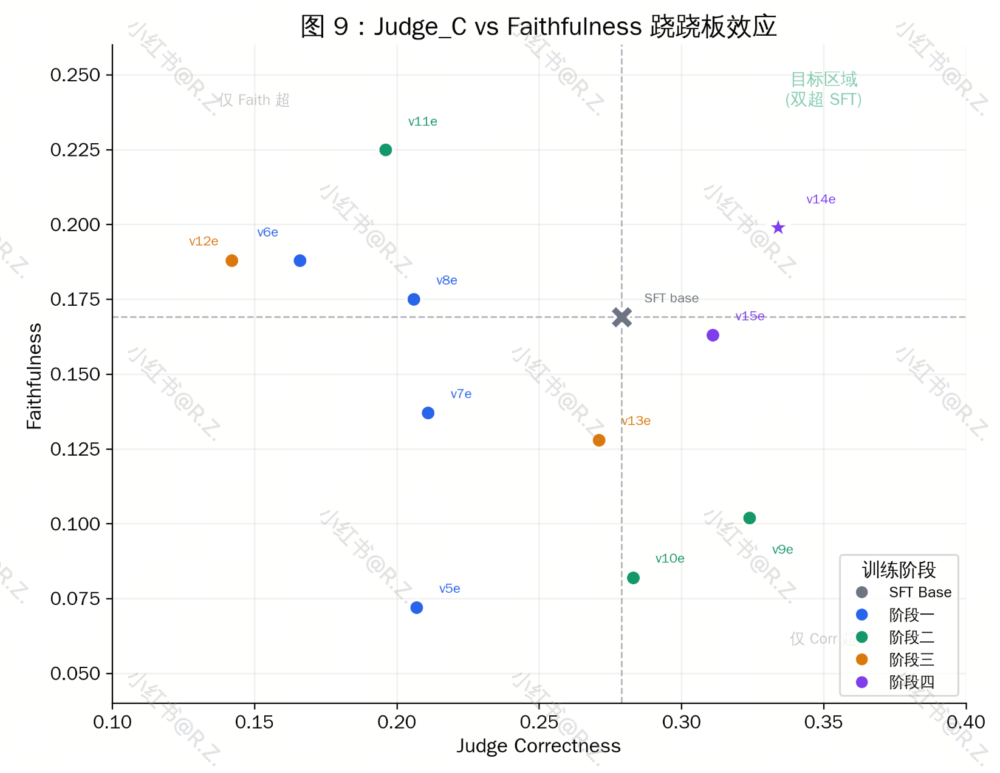
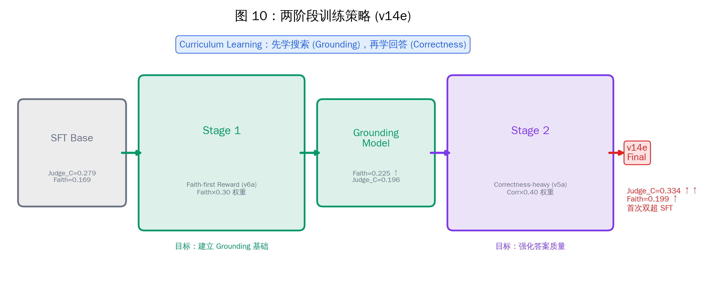

> 🔗 原文链接：[‌‍⁣⁢⁣‍⁣​‌⁡9.2.1 垂直领域多跳 Agentic RAG & RL 简历项目](https://kcnd4kn8i6ap.feishu.cn/wiki/U1h5wyrzQigEtlkBbskcxgEanHk#)

> ⏰ 剪存时间：2026-04-25 10:00:06

> ✂️ 本文档由 [游侠飞书剪存](https://pwwjpto7tva.feishu.cn/wiki/space/7517832277555544092) 一键生成

> 💖 更多好物请访问[游侠创客](https://uibot.cn) 微信：xuefuta

  

⚠️温馨提示：文档中包含【2个】暂不支持的区域，请通过搜索关键字【暂不支持的文档区域】进行后续处理

> # **知识回顾**
> 
> [**【飞书文档】6.3 RAG 检索增强生成**](https://kcnd4kn8i6ap.feishu.cn/wiki/WbKqww9vJi6g82kG7Ficpa4kn4f)
> 
> [**【飞书文档】6.4 RAG优化工作推荐**](https://kcnd4kn8i6ap.feishu.cn/wiki/GNOpwyVzqiMmK5ks3sdcUCLvnxP)
> 
> [**【飞书文档】6.5 Deep Research工作梳理及推荐**](https://kcnd4kn8i6ap.feishu.cn/wiki/PerNwCnPbijnRZkBAZwcztkCnI0)
> 
> [**【飞书文档】11.1 tool-use数据合成**](https://kcnd4kn8i6ap.feishu.cn/wiki/BHUQwJGh1iadUakIgV7cVOG5nmq)
> 
> [**【飞书文档】11.4 AgenticRL 项目推荐**](https://kcnd4kn8i6ap.feishu.cn/wiki/Gg1Mwohg0iGPHbkT3jvciSJ9n1c)
> 
> [**【飞书文档】3.3 RLHF 基于人类反馈的强化学习**](https://kcnd4kn8i6ap.feishu.cn/wiki/TQqTwh2uwiSrqYktIPccTQOcn0g)
> 
> [**【飞书文档】3.5 PEFT 参数高效微调**](https://kcnd4kn8i6ap.feishu.cn/wiki/OYA5wHPWoit8mpkCAqIcdN0hnQK)

⚠️ 暂不支持的文档区域，请手动复制这部分: task

> # **使用指南**
> 
> **项目的所有代码可以在** [**【飞书文档】大模型笔记代码及简历模板下载**](https://kcnd4kn8i6ap.feishu.cn/wiki/AOoGwwuF4ix3HLkwM1Bc1TBynab)**里面下载**
> 
> **项目详细讲解：** [**AgneticRAG+RL 项目详解**](https://kcnd4kn8i6ap.feishu.cn/wiki/U1h5wyrzQigEtlkBbskcxgEanHk#UNksdebWao9C4xx1HKkcvsVxnGR)
> 
> **代码详细使用教程：**[**AgenticRAG+RL代码实战操作指南**](https://kcnd4kn8i6ap.feishu.cn/wiki/U1h5wyrzQigEtlkBbskcxgEanHk#WUe7d4fnJoyI4rxIVayc0uOlnGI)
> 
> **面试表达：** [**AgenticRAG+RL 项目面试如何描述？**](https://kcnd4kn8i6ap.feishu.cn/wiki/U1h5wyrzQigEtlkBbskcxgEanHk#MxIjdUKKtouHDtxr7Z5c0Ucknwc)
> 
> **面试题库：** [**AgenticRAG+RL 项目面试题库**](https://kcnd4kn8i6ap.feishu.cn/wiki/U1h5wyrzQigEtlkBbskcxgEanHk#LAHrd2cWIoJGzFxfPtvc8XiIn0f)
> 
> **看不懂的地方，或者面试遇到问题，可以划线评论提问，或者在文档底部对整个文档进行评论**

> # **简历写法**
> 
> > 注：为了尽可能防止大规模撞车，建议参考 [**【飞书文档】大模型笔记代码及简历模板下载**](https://kcnd4kn8i6ap.feishu.cn/wiki/AOoGwwuF4ix3HLkwM1Bc1TBynab)**里面**的简历模板自行根据项目详细内容，挑选你认为的重点进行描述。**当然最好的防止撞车方法是换一个垂域数据、语料（推荐项目内部数据，避免和开源数据撞车），进行全面/有限的复现以及改进**（看自己的资源情况决定，本项目并不是完美的项目，也存在缺陷和需要改进的点，这样才是比较真实的项目。具体数据量可以自己再去多搜集一些 PDF 文档，可以是其他领域的，然后利用数据 pipeline 进行数据扩充，顺便进行垂域迁移。算法也可以扩展和消融，跑一跑 DAPO、GSPO 等优化 GRPO 的算法）
> > 
> > 简历可以写的重点：
> > 
> > 1.  **垂域数据收集和处理**
> > 
> > 2.  **数据合成 pipeline 和质量把控**
> > 
> > 3.  **AgenticRAG 系统设计和优化**
> > 
> > 4.  **训练指标和 reward 迭代优化**
> > 
> > **下面给出一个简历写法参考，可以包装成实验室项目，或者结合实习期间的经历，编造实习经历风险大，请慎重考虑此方法（不知名小公司可能会好一些）**
> 
> **AgenticRAG：金融垂域多跳问答的 Agentic RAG 系统** | Python, LangGraph, FAISS, BGE-M3, vLLM, verl
> 
> -   **垂域数据收集及知识库构建**：收集多家上市公司金融年报 PDF，完成 PyMuPDF 解析、段落切块、jieba 中英混合分词、BGE-M3 向量化，并通过 LLM (gpt-oss-120b) 三元组抽取构建知识图谱（11K+ 节点/边），建立 FAISS embedding + BM25 + KG 三路检索索引
> 
> -   **多跳数据合成与质量控制**：设计 6 阶段多跳 QA 合成 pipeline（种子 QA 提取、答案精炼、多跳组合、四重验证、LLM Judge 评分、检索可达性过滤），从 4000 条种子经逐层过滤产出 797 训练 + 185 测试数据集，Judge 均分 14.4/15
> 
> -   **AgenticRAG 系统优化**：基于 LangGraph 实现 PEV 多智能体循环框架（Planner, Executor, Verifier, Synthesizer），集成 embedding/BM25/轻量 GraphRAG 三路检索召回，RRF 融合 + CrossEncoder 重排。经 9 轮迭代，诊断出 Verifier 过度纠正问题的根因在于 replan 质量而非迭代次数，通过增强 replan feedback 机制将 F1 从 0.562 提升至 0.575
> 
> -   **SFT + GRPO 训练与 Reward 迭代**：基于 Qwen3-4B 完成 LoRA SFT（F1提升 26%）+ 多轮 Agentic GRPO 实验（verl 框架），系统探索 Token F1 / Token Faithfulness / LLM Judge / Hop Matching 四类 reward 信号。发现 Correctness 与 Faithfulness 的跷跷板效应后，应用两阶段课程学习策略（先 grounding 后 correctness），最终在两个维度同时超越 SFT 基线（Judge Correctness 提升6pp, Faithfulness 提升3pp）

⚠️ 暂不支持的文档区域，【文档小组件】

# **评测基准 AgenticRAGTracer**

## **概述**

AgenticRAGTracer 是一个用于诊断 Agentic RAG 系统多步检索推理能力的 hop-aware benchmark。它定义的任务是 **multi-hop question answering**：给定一个问题，Agent 需要通过多轮工具调用（检索），从 2-4 篇不同文档中收集证据，经过推理后给出答案。

与传统 multi-hop QA 数据集（MuSiQue、2WikiMultihopQA、HotpotQA）不同，AgenticRAGTracer 的核心设计目标不是"数据集本身有多难"，而是**诊断 Agent 系统在多步检索中哪里出了问题，**是规划错了、检索漏了、推理断了、还是过早放弃了

**关键特征**：

-   每条样本附带完整的 hop 结构（`hops` 字段），标注了每一步需要检索的文档 chunk

-   提供 hop-aware 评测指标（hop\_recall、premature\_collapse、over\_extension），可精确定位 Agent 在哪一跳失败

-   区分 comparison（比较）和 inference（推理）两种推理类型，分别评估 Agent 的不同能力

**论文、代码和数据集**：**https://arxiv.org/abs/2602.19127****，**[**HuggingFace: YqjMartin/AgenticRAGTracer**](https://huggingface.co/datasets/YqjMartin/AgenticRAGTracer)

## **数据集结构**

**规模**：1305 条 multi-hop QA，基于英文 Wikipedia 语料（1511 chunks，每 chunk 约 100 词）

**跳数分布**：

|     |     |     |
| --- | --- | --- |
| Hop | 样本数 | 占比  |
| 2-hop | 864 | 66.2% |
| 3-hop | 293 | 22.5% |
| 4-hop | 148 | 11.3% |

**6 个子集**（hop\_count × qa\_type）：

|     |     |     |
| --- | --- | --- |
| Subset | Count | 说明  |
| 2hop\_comparison | 471 | 两实体在同一维度比较 |
| 2hop\_inference | 393 | 链式推理（A→B→C） |
| 3hop\_comparison | 182 | 三实体比较 |
| 3hop\_inference | 111 | 三跳链式推理 |
| 4hop\_comparison | 64  | 四实体比较 |
| 4hop\_inference | 84  | 四跳链式推理 |

**每条样本字段：**

以 2hop\_comparison 为例

```JSON
{
  "final_question": "Which RLL encoding stores more data bits per inch, (1,3) RLL encoding or (2,7) RLL encoding?",
  "final_answer": "(1,3) RLL encoding",
  "hop_count": 2,
  "qa_type": "comparison",
  "subset": "2hop_comparison",
  "hops": [
    {
      "hop_idx": 1,
      "question": "How many encoded bits can be stored per inch on tape using (1,3) run-length limited encoding?",
      "answer": "6,400 bits per inch",
      "doc_chunk_id": "e743840e18a7",
      "qa_type": "initial_qa"
    },
    {
      "hop_idx": 2,
      "question": "What is the data storage capacity of (2,7) RLL encoding in data bits per inch?",
      "answer": "4,800 data bits per inch.",
      "doc_chunk_id": "964e2c5684ba",
      "qa_type": "comparison"
    }
  ]
}
```

对应的 corpus chunks：

-   `e743840e18a7`（标题：Run-length limited）："A Modified Frequency Modulation or (1,3) RLL encoding stores each data bit as two bits on tape, but since there is guaranteed to be one 0 (non flux reversal) bit between any 1 (flux reversal) bits then it is possible to store 6,400 encoded bits per inch on the tape..."

-   `964e2c5684ba`（标题：Run-length limited）："A (2,7) RLL encoding takes 2 encoded bits to store each data bit, but since there is guaranteed to be two 0 bits between any 1 bits then it is possible to store 9,600 encoded bits per inch on the tape, or 4,800 data bits per inch..."

|     |     |     |
| --- | --- | --- |
| 字段  | 类型  | 说明  |
| `final_question` | string | 需要 N 篇文档才能回答的多跳问题 |
| `final_answer` | string | 标准答案 |
| `hop_count` | int | 跳数（2/3/4） |
| `qa_type` | string | `comparison` 或 `inference` |
| `subset` | string | 子集名称，如 `2hop_comparison` |
| `hops` | array | 中间推理步骤链 |

每条 hop 记录包含：

|     |     |     |
| --- | --- | --- |
| 字段  | 类型  | 说明  |
| `hop_idx` | int | 跳的序号（1-based） |
| `question` | string | 该跳的子问题 |
| `answer` | string | 该跳的答案 |
| `doc_chunk_id` | string | 提供证据的 corpus chunk ID |
| `qa_type` | string | `initial_qa` / `inference` / `comparison` |

## **两种推理类型**

AgenticRAGTracer 明确区分两种推理模式，它们对 Agent 的要求不同：

### **Inference（链式推理）**

最终答案 = 最后一跳的答案。需要将前序跳的信息串联起来作为下一跳的查询条件

```Plain
例：Who is the father of the performer of 'Yesterday'?
  hop1: 'Yesterday' 的表演者是谁？ → The Beatles
  hop2: The Beatles 的主唱父亲是谁？ → Alfred Lennon
  final_answer: Alfred Lennon
```

Agent 需要能力：**信息传递，**将 hop1 的答案作为 hop2 的查询输入

**2hop\_inference 示例**：

```JSON
{
  "final_question": "When was the presidency of the person who received the Idaho Women Making History Award announced?",
  "final_answer": "2017-03-06",
  "hop_count": 2,
  "qa_type": "inference",
  "subset": "2hop_inference",
  "hops": [
    {
      "hop_idx": 1,
      "question": "Who received the Idaho Women Making History Award?",
      "answer": "Cheryl B. Schrader",
      "doc_chunk_id": "518837c44518",
      "qa_type": "initial_qa"
    },
    {
      "hop_idx": 2,
      "question": "When was Cheryl B. Schrader's presidency announced?",
      "answer": "2017-03-06",
      "doc_chunk_id": "5e4176cd6ee9",
      "qa_type": "inference"
    }
  ]
}
```

对应的 corpus chunks：

-   `518837c44518`（标题：Cheryl B. Schrader）："She received Presidential Award for Excellence in Science, Mathematics and Engineering Mentoring from the White House (2005); the IEEE Education Society Hewlett-Packard/Harriett B. Rigas Award; and the Idaho Women Making History Award..."

-   `5e4176cd6ee9`（标题：Cheryl B. Schrader）："Cheryl B. Schrader (born c. 1962) is an American educator and seventh president of Wright State University as of July 1, 2017. Previously she was the chancellor of Missouri University of Science and Technology. Her presidency was announced on March 6, 2017..."

推理链：先查"谁获得了 Idaho Women Making History Award" → 得到 Cheryl B. Schrader → 再查"Cheryl B. Schrader 的校长任命何时公布" → 得到 2017-03-06。hop2 的查询必须包含 hop1 的答案（人名），两跳串行依赖

**3hop\_inference 示例**：

```JSON
{
  "final_question": "What type of factory is located in the town where the diving bell, built by the engineer who was apprenticed to the designer of the Eddystone Lighthouse, was intended to be used?",
  "final_answer": "A chipboard factory.",
  "hop_count": 3,
  "qa_type": "inference",
  "subset": "3hop_inference",
  "hops": [
    {
      "hop_idx": 1,
      "question": "Who was Benjamin Henry Latrobe apprenticed to, known for designing the Eddystone Lighthouse?",
      "answer": "John Smeaton",
      "doc_chunk_id": "1c1a7159ef83",
      "qa_type": "initial_qa"
    },
    {
      "hop_idx": 2,
      "question": "Where was the diving bell built by John Smeaton intended to be used?",
      "answer": "Hexham.",
      "doc_chunk_id": "e1d47b0ce709",
      "qa_type": "inference"
    },
    {
      "hop_idx": 3,
      "question": "What type of factory is located in Hexham?",
      "answer": "A chipboard factory.",
      "doc_chunk_id": "7ed67b9d3739",
      "qa_type": "inference"
    }
  ]
}
```

对应的 corpus chunks：

-   `1c1a7159ef83`（标题：Benjamin Henry Latrobe）："Latrobe returned to England in 1784, and was apprenticed to John Smeaton, an engineer known for designing Eddystone Lighthouse..."

-   `e1d47b0ce709`（标题：John Smeaton）："In 1789 Smeaton applied an idea by Denis Papin, by using a force pump to maintain the pressure and fresh air inside a diving bell. This bell, built for the Hexham..."

-   `7ed67b9d3739`（标题：Hexham）："The town is also the site of a chipboard factory owned by the Austrian firm Egger Retail Products GmbH, which vents steam which can be seen from miles away..."

推理链：Eddystone Lighthouse 设计者 → John Smeaton → Smeaton 建造的潜水钟用于 Hexham → Hexham 有刨花板工厂。三跳严格串行，每跳的查询都依赖上一跳的答案。

**4hop\_inference 示例**：

```JSON
{
  "final_question": "What profession was the father of the Grand Duke named as the next Emperor of all the Russias by the Tsar who dismissed Oskar Ludwig Stark from his post on 24 February 1904 trained in?",
  "final_answer": "Engineering",
  "hop_count": 4,
  "qa_type": "inference",
  "subset": "4hop_inference",
  "hops": [
    {
      "hop_idx": 1,
      "question": "Who dismissed Oskar Ludwig Stark from his post on 24 February 1904?",
      "answer": "Tsar Nicholas II",
      "doc_chunk_id": "a32fa0ce9b9b",
      "qa_type": "initial_qa"
    },
    {
      "hop_idx": 2,
      "question": "Who was named as the next Emperor of all the Russias by Tsar Nicholas II?",
      "answer": "Grand Duke Michael.",
      "doc_chunk_id": "1590cfc56381",
      "qa_type": "inference"
    },
    {
      "hop_idx": 3,
      "question": "Who was Grand Duke Michael Nikolaevich's father?",
      "answer": "Tsar Nicholas I",
      "doc_chunk_id": "87cab8256499",
      "qa_type": "inference"
    },
    {
      "hop_idx": 4,
      "question": "What profession was Tsar Nicholas I trained in?",
      "answer": "Engineering",
      "doc_chunk_id": "de0927c61d9d",
      "qa_type": "inference"
    }
  ]
}
```

对应的 corpus chunks：

-   `a32fa0ce9b9b`（标题：Oskar Ludwig Stark）："...was subsequently sacked by Tsar Nicholas II from his post on 24 February 1904..."

-   `1590cfc56381`（标题：Nicholas II of Russia）："...drew up a new manifesto naming his brother, Grand Duke Michael, as the next Emperor of all the Russias..."

-   `87cab8256499`（标题：Grand Duke Michael Nikolaevich of Russia）："...was the fourth son and seventh child of Tsar Nicholas I of Russia and Charlotte of Prussia..."

-   `de0927c61d9d`（标题：Nicholas I of Russia）："...Trained as an engineer, he was a stickler for minute detail..."

四跳链：Stark 被谁解雇 → 那个人指定谁继位 → 继位者的父亲是谁 → 父亲学什么专业。每跳都是严格的信息传递。

### **Comparison（维度比较）**

最终问题比较各跳实体在同一可量化维度上的大小。每跳独立获取一个值，最终比较得出结论

```Plain
例：Which company has higher revenue, A or B?
  hop1: A 公司的收入是多少？ → X 元
  hop2: B 公司的收入是多少？ → Y 元
  final_answer: A 公司（假设 X > Y）
```

Agent 需要能力：**并行获取 + 数值推理**——分别查各实体的值，然后比较

**2hop\_comparison 示例**（即 1.2 的 RLL encoding 示例，不再重复）

**3hop\_comparison 示例**：

```JSON
{
  "final_question": "Which high school did the player who has more career passing yards, Anthony Calvillo or Randy Gold for the 1961 California Golden Bears football team, attend?",
  "final_answer": "La Puente High School",
  "hop_count": 3,
  "qa_type": "comparison",
  "subset": "3hop_comparison",
  "hops": [
    {
      "hop_idx": 1,
      "question": "How many passing yards did Randy Gold have for the 1961 California Golden Bears football team?",
      "answer": "403 passing yards",
      "doc_chunk_id": "e3a386f8e6bf",
      "qa_type": "initial_qa"
    },
    {
      "hop_idx": 2,
      "question": "How many career passing yards did Anthony Calvillo achieve?",
      "answer": "79,816 yards",
      "doc_chunk_id": "615743a24b46",
      "qa_type": "comparison"
    },
    {
      "hop_idx": 3,
      "question": "Which high school did Anthony Calvillo attend?",
      "answer": "La Puente High School",
      "doc_chunk_id": "a952f66cebe7",
      "qa_type": "inference"
    }
  ]
}
```

对应的 corpus chunks：

-   `e3a386f8e6bf`（标题：1961 California Golden Bears football team）："...The team's statistical leaders included Randy Gold with 403 passing yards, Alan Nelson with 331 rushing yards..."

-   `615743a24b46`（标题：Anthony Calvillo）："...he is a former Canadian Football League (CFL) quarterback. He is professional football's all-time passing yards leader... In his career, he passed for 79,816 yards..."

-   `a952f66cebe7`（标题：Anthony Calvillo）："...While attending La Puente High School, he was a two-sport standout in football and basketball..."

推理链：hop1 和 hop2 独立查两人的传球码数（403 vs 79,816）→ 比较得出 Calvillo 更多 → hop3 查 Calvillo 的高中（必须串行，因为只有比较完才知道查谁）。这是 comparison + inference 的混合模式。

**4hop\_comparison 示例**：

```JSON
{
  "final_question": "What is the location of the school district that serves the locality which has a higher median income for males, Dayton, Iowa or West Manchester Township?",
  "final_answer": "York County, South Central Pennsylvania, United States.",
  "hop_count": 4,
  "qa_type": "comparison",
  "subset": "4hop_comparison",
  "hops": [
    {
      "hop_idx": 1,
      "question": "What was the median income for males in Dayton, Iowa?",
      "answer": "$30,952",
      "doc_chunk_id": "c804b1233702",
      "qa_type": "initial_qa"
    },
    {
      "hop_idx": 2,
      "question": "What is the median income for a household in West Manchester Township?",
      "answer": "$45,212",
      "doc_chunk_id": "fdd85e2ec847",
      "qa_type": "comparison"
    },
    {
      "hop_idx": 3,
      "question": "Which school district serves West Manchester Township?",
      "answer": "West York Area School District.",
      "doc_chunk_id": "3e3e324ad75a",
      "qa_type": "inference"
    },
    {
      "hop_idx": 4,
      "question": "What is the location of the West York Area School District?",
      "answer": "York County, South Central Pennsylvania, United States.",
      "doc_chunk_id": "a838858ac130",
      "qa_type": "inference"
    }
  ]
}
```

对应的 corpus chunks：

-   `c804b1233702`（标题：Dayton, Iowa）："...Males had a median income of $30,952 versus $20,208 for females..."

-   `fdd85e2ec847`（标题：West Manchester Township, York County, Pennsylvania）："...The median income for a household in the township was $45,212... Males had a median income of $40,113 versus $24,787 for females..."

-   `3e3e324ad75a`（标题：West Manchester Township, York County, Pennsylvania）："...West Manchester Township is served by the West York Area School District..."

-   `a838858ac130`（标题：West York Area School District）："...West York Area School District is a midsized, suburban public school district located in York County in South Central Pennsylvania, United States..."

推理链：hop1/hop2 独立查两地男性收入（$30,952 vs $40,113）→ 比较得出 West Manchester Township 更高 → hop3 查该地属于哪个学区 → hop4 查学区位置。四跳中前两跳可并行，后两跳必须串行。

### **关键差异**

Inference 是串行依赖（hop2 必须等 hop1 结果），Comparison 是并行独立（hop1 和 hop2 可以同时查）。这对 Planner 的任务编排策略有直接影响

## **数据合成 Pipeline**

AgenticRAGTracer 提供了一套**自底向上**的多跳 QA 合成 pipeline（`multihop_pipeline.py` + `multihop_prompt.yaml`），核心思路是：从单跳种子 QA 出发，逐跳扩展为多跳链，每步经过严格验证。



**论文数据合成 pipeline**

**6 步流程**：

```Markdown
Step 1: 对每个 corpus chunk，用 LLM 提取原子 QA（1-hop 种子）
        要求答案必须是可验证的短文本（数字/日期/唯一实体名）

Step 2: 用上一跳的 answer 作为 query，检索新文档
        检索接口返回 top-k 相关 chunks

Step 3: 对新检索到的文档生成原子 QA
        应用质量过滤：答案≤10 tokens、无答案泄露、无重复

Step 4: 用 merge prompt 将 N-hop 链与新 QA 合并为 (N+1)-hop
        生成 final_question + final_answer
        自动判断类型：inference 或 comparison

Step 5: 四重验证（全部通过才保留）
        ├── 语义检查：多跳逻辑是否合理
        ├── 纯推理检查：不检索时 LLM 不能答对（确保需要检索）
        ├── 单文档检查：任何单篇文档都不能回答（确保多跳必要性）
        └── 全文档检查：给所有文档时 LLM 能答对（确保可回答性）

Step 6: 通过验证的链成为最终 QA 样本，保留完整 hop 结构
```

**设计约束**（来自 `multihop_prompt.yaml`）：

-   答案必须是可验证的（数字、日期、唯一实体名），不能是主观判断

-   最终问题中不能泄露中间答案

-   不能有虚假关联（不同实体因表面 token 相似而错误链接）

-   不能是简单拼接（必须需要推理整合）

-   最后一跳不能是"查表"式 trivial 操作

## **评测指标**

AgenticRAGTracer 的评测框架（`evaluation.py`）让模型作为 Agent 自主调用检索工具，然后评估最终答案质量：

**评测流程**：

1.  模型收到 `final_question` + `RAG_search` 和 `Final_Answer` 两个工具

1.  模型自主决定何时搜索、搜什么、搜几次（上限 10 步）

1.  模型最终调用 `Final_Answer` 给出答案

**核心指标**：

|     |     |
| --- | --- |
| 指标  | 说明  |
| **EM (Exact Match)** | 标准化后的精确匹配（去冠词/标点后比较） |
| **Token F1** | 预测答案与标准答案的 token 级别 F1 |
| **LLM Judge (EssEq)** | GPT-4o-mini 判断语义等价性（0/1/2 分，≥1.0 算对） |

**诊断指标**（hop-aware，用于定位失败原因）：

|     |     |
| --- | --- |
| 指标  | 说明  |
| hop\_recall | gold 支撑文档中被成功检索到的比例 |
| premature\_collapse | hop\_recall < 1.0 但 Agent 判定"证据已充分"（过早停止） |
| over\_extension | 实际工具调用次数 / 必要 hop 数 > 3（过度搜索） |
| step\_alignment | Agent 的检索步骤数与 gold hop\_count 的对齐度 |

# 基于金融领域财报的垂域多跳数据合成 pipeline

这里相当于是用垂域文档做迁移举例，**各位同学也可以随意进行垂域迁移（医疗、法律、农业 whatever）**

## **动机与设计思路**

AgenticRAGTracer 原版基于英文 Wikipedia 语料。其语料来源是 `wiki18_100w.jsonl`（100 万篇 Wikipedia 2018 文章的子集），从中抽样了 1511 chunks 作为检索语料，生成 1305 条 multi-hop QA。虽然源语料规模很大（100 万篇），但实际用于 QA 合成的 chunk 只有 1511 个，知识覆盖面相对集中。原版使用 **E5-base-v2 向量索引，在完整 100 万篇文章上检索**

本项目在评估 AgenticRAGTracer 时，使用**本地重建的全套索引**（BGE-M3 向量索引 + BM25 关键词索引 + 知识图谱 + 实体向量，仅覆盖被 QA 引用的 1511 chunks，而非完整 100 万篇文章），通过 `scripts/build_news_index.py` 构建，存储在 `data/indexes/`。这意味着检索难度低于原版，所有 gold chunks 都保证在索引中

> 为什么需要评估 AgenticRAGTracer？因为一开始对 AgenticRAG 框架的优化消融实验都是在 AgenticRAGTracer 数据上进行的，确定了效果比较好的框架方案后，再去向垂域迁移，可以先对架构整体有一个初步的评估

本项目目标是做一个金融垂域的多跳 QA benchmark，核心挑战是：

1.  **领域知识完全不同**：金融半年报、年报包含**财务指标、公司治理、股权结构等专业内容**

1.  **推理模式更复杂**：金融多跳不仅是"查人→查属性"，更多是"查公司 A 的指标→查公司 B 的指标→比较/计算"

1.  **数据量有限**：这里主包只下载使用了 7 家公司的半年报作为数据源（1933 chunks），实体间关联受限于同一行业、同一报告期，跨公司推理链的多样性可能不如 Wikipedia

**设计决策**：不从零设计数据合成方案，而是**基于 AgenticRAGTracer 官方的** `**multihop_pipeline.py**` **进行领域适配**。核心改动是将 Wikipedia 语料替换为金融 PDF，将英文 prompt 替换为中文，同时针对金融数据的特点优化 pipeline 的检索和验证逻辑

## **语料和索引构建**

**来源**：7 家中国零售上市公司 2025 年上半年度报告（PDF）

|     |     |     |
| --- | --- | --- |
| 前缀  | 公司  | Chunks |
| yh  | 永辉超市 | 377 |
| jjy | 家家悦 | 343 |
| bbg | 步步高 | 255 |
| zb  | 中百集团 | 244 |
| hq  | 红旗连锁 | 180 |
| mcyp | 名创优品 | 425 |
| gx  | 高鑫零售 | 109 |
| **合计** |     | **1933** |

**PDF 解析与切块**（`scripts/parse_pdf_corpus.py`）：

如果想要效果更好一些可以换 minerU 的在线服务，使用 api key 进行批量推理转换，可以省去本地构建环境成本

```Markdown
PDF → PyMuPDF 提取页面文本
  → 正则检测章节标题（中文标题模式）
  → 按段落切块，上限 500 字符，保留 50 字符重叠
  → 最小 50 字符
  → 输出 corpus.jsonl
```

每个 chunk 的结构：

```JSON
{
  "chunk_id": "yh_0004",
  "text": "永辉超市股份有限公司2025年半年度报告\n1/239\n公司代码：601933...",
  "title": "永辉超市股份有限公司2025年半年度报告",
  "pages": [1, 2],
  "section": ""
}
```

**检索索引**（`data/financial_all/indexes/`）：

所有索引通过一条命令构建（忽略 `build_news_index` 的命名，主包一开始用的开源的新闻语料，不太好做）：

```Bash
python scripts/build_news_index.py \
  --corpus-dir data/financial_all/ \
  --index-dir data/financial_all/indexes/
# 如需跳过知识图谱（耗时较长）：加 --skip-kg
# 如需构建 AgenticRAGTracer 的可以更换 data 下的目录就行
```

|     |     |
| --- | --- |
| 索引  | 说明  |
| `faiss.index` | BGE-M3 向量索引（FAISS IndexFlatIP） |
| `bm25.pkl` | BM25 关键词索引 |
| `knowledge_graph.json` | 知识图谱（16146 实体, 16634 边，覆盖 99% chunks） |
| `entity_embeddings.pkl` | 实体向量 |
| `chunk_store.pkl` | chunk 文本存储 |

**脚本具体执行流程：**

### **（1）FAISS 向量索引**（`faiss.index`）

|     |     |
| --- | --- |
| 项目  | 说明  |
| 构建脚本 | `data/build_index.py`（被 `build_news_index.py` 调用） |
| Embedding 模型 | BGE-M3（`/path/to/your/model_hub/bge-m3`）（换成自己的本地 embedding 模型路径，如果通过 api 调用 embedding 可能需要修改部分代码，不难） |
| 索引类型 | `faiss.IndexFlatIP`（精确内积，embedding 归一化后等价余弦相似度） |
| 编码参数 | batch\_size=64 |
| 输出  | `faiss.index`（每 chunk 一个 1024 维向量） |

将每个 chunk 文本编码为 1024 维向量，构建精确内积索引。核心流程：

```Python
# 1. 提取文本并建立位置对齐
texts = [doc["text"] for doc in corpus]
chunk_ids = [doc["chunk_id"] for doc in corpus]   # chunk_ids[i] 对应 FAISS 第 i 行

# 2. BGE-M3 编码（L2 归一化，使内积等价余弦相似度）
embeddings = encode(texts, batch_size=64)          # shape: (N, 1024), float32, normalized

# 3. 构建 FAISS 精确内积索引（无近似，暴力搜索）
index = faiss.IndexFlatIP(embeddings.shape[1])
index.add(embeddings)
faiss.write_index(index, "faiss.index")
```

`encode()` 内部调用 `SentenceTransformer(bge-m3).encode(..., normalize_embeddings=True)`，所有向量在编码时已做 L2 归一化，因此 `IndexFlatIP` 的内积运算等价于余弦相似度

### **（2）BM25 关键词索引**（`bm25.pkl`）

|     |     |
| --- | --- |
| 项目  | 说明  |
| 构建脚本 | `data/build_index.py`（与 FAISS 同一次构建） |
| 算法  | `rank_bm25.BM25Okapi` |
| 分词器 | 中英文都适用，jieba 中文分词 + 空格英文分词（`retrieval/keyword_search.py`） |
| 输出  | `bm25.pkl`（序列化的 BM25Okapi 对象） |

BM25 索引需要先对文本分词。由于金融语料是中文，分词器需要支持中英文混合：

```Python
# retrieval/keyword_search.py — tokenize()
def tokenize(text: str) -> list[str]:
    text = text.lower()
    # 用正则按中文/英文边界切分
    segments = re.findall(r'[\u4e00-\u9fff]+|[a-z0-9]+(?:\.[0-9]+)*', text)
    tokens = []
    for seg in segments:
        if re.match(r'[\u4e00-\u9fff]', seg):
            tokens.extend(jieba.lcut(seg))   # 中文段：jieba 分词
        else:
            tokens.append(seg)               # 英文/数字段：保持原样
    return [t for t in tokens if len(t.strip()) > 0]

# build_index.py — 构建 BM25
tokenized = [tokenize(t) for t in texts]     # 对每个 chunk 分词
bm25 = BM25Okapi(tokenized)                  # rank_bm25 库
pickle.dump(bm25, open("bm25.pkl", "wb"))
```

`tokenize()` 在索引构建和查询时共用同一份逻辑，确保分词一致性。查询时 BM25 返回 top-20 候选，再交给 reranker 精排到 top-5

### **（3）Chunk 元数据存储**（`chunk_store.pkl` + `chunk_ids.json`，同在 `data/build_index.py`）

|     |     |
| --- | --- |
| 项目  | 说明  |
| 构建脚本 | `data/build_index.py` |
| 用途  | FAISS 向量行号 ↔ chunk\_id ↔ 完整 chunk 文本的映射 |
| 输出  | `chunk_store.pkl`（chunk\_id → chunk dict），`chunk_ids.json`（与 FAISS 行对齐的 ID 列表） |

```Python
# chunk_ids: 有序列表，与 FAISS 向量行号一一对齐
#   chunk_ids[i] 就是 FAISS 第 i 行向量对应的 chunk_id
json.dump(chunk_ids, open("chunk_ids.json", "w"))

# chunk_store: chunk_id → 完整 chunk dict 的 O(1) 查找表
chunk_store = {doc["chunk_id"]: doc for doc in corpus}
pickle.dump(chunk_store, open("chunk_store.pkl", "wb"))
```

FAISS 检索返回的是行号 `indices`，通过 `chunk_ids[idx]` 映射到 chunk\_id，再通过 `chunk_store[chunk_id]` 获取完整文本

### **（4）知识图谱**（`knowledge_graph.json` + `entity_embeddings.pkl`）

|     |     |
| --- | --- |
| 项目  | 说明  |
| 构建脚本 | `scripts/build_knowledge_graph.py`（被 `build_news_index.py` 调用） |
| 三元组抽取模型 | gpt-oss-120b（这里主包用的本地 vLLM 部署的模型，20 并发 worker，自己去做的话需要搞点 API） |
| 抽取逻辑 | 对每个 chunk（截断 2000 字符）用 LLM 提取 3-8 条 (头实体, 关系, 尾实体) 三元组 |
| 实体向量化 | BGE-M3 编码所有实体名，batch\_size=256 |
| 图存储 | NetworkX MultiDiGraph，导出为 node\_link\_data JSON |
| 缓存  | `triples_cache.jsonl`（避免重复调用 LLM） |
| 输出  | `knowledge_graph.json`（16146 实体, 16634 边），`entity_embeddings.pkl` |

知识图谱的构建分三步：LLM 三元组抽取 → NetworkX 图组装 → 实体向量化。

-   **Step 1 — LLM 三元组抽取**：

对每个 chunk 调用 LLM（gpt-oss-120b），用中文 prompt 提取结构化三元组（`scripts/build_knowledge_graph.py` → `EXTRACTION_PROMPT_ZH`）：

```Markdown
你是一个知识图谱构建器。从给定文本中抽取事实性三元组。

每个三元组格式：(头实体, 关系, 尾实体)

规则：
- 抽取具体、明确的实体（人名、地名、机构、作品、概念、数字）
- 关系用简短的动词短语（如"是...的子公司"、"营业收入为"、"位于"、"担任"、"同比增长"）
- 每个三元组必须是文本中明确陈述的事实，不能推断
- 实体名称应使用规范全称（不用代词）
- 每段文本抽取 3-8 个三元组
- 如果文本太短或无实质信息，返回空列表

仅返回 JSON 数组：
[{"head": "实体1", "relation": "关系类型", "tail": "实体2"}, ...]

文本：
{text}
```

```Python
# 核心抽取逻辑（20 并发 ThreadPoolExecutor）
prompt = extraction_prompt.format(text=chunk_text[:2000])  # 截断 2000 字符
resp = get_from_ks_openai(prompt, model="gpt-oss-120b")    # 最多 3 次重试
triples = json.loads(resp)  # 解析后验证 head/relation/tail 三字段非空
```

抽取结果缓存到 `triples_cache.jsonl`（每行一条三元组 JSON），重新运行时直接加载缓存跳过 LLM 调用

-   **Step 2 — NetworkX 图组装**：

```Python
G = nx.MultiDiGraph()   # 有向多重图（同一对实体可有多种关系）

for triple in all_triples:
    head, tail, rel, chunk_id = triple["head"], triple["tail"], triple["relation"], triple["chunk_id"]
    # 添加节点，记录该实体出现在哪些 chunks
    G.add_node(head, mentions=[])
    G.nodes[head]["mentions"].append(chunk_id)  # 去重
    G.add_node(tail, mentions=[])
    G.nodes[tail]["mentions"].append(chunk_id)
    # 添加有向边，附带关系类型和来源 chunk
    G.add_edge(head, tail, relation=rel, chunk_id=chunk_id)

# 导出为 JSON
nx.node_link_data(G) → knowledge_graph.json
```

每个节点的 `mentions` 属性记录了该实体出现在哪些 chunks 中，查询时通过图遍历可以找到与目标实体相关的所有 chunks

-   **Step 3 — 实体向量化**：

```Python
entities = list(G.nodes())                         # 所有唯一实体名
embeddings = encode(entities, batch_size=256)       # BGE-M3 编码
entity_to_idx = {e: i for i, e in enumerate(entities)}

pickle.dump({
    "entities": entities,
    "entity_to_idx": entity_to_idx,   # 实体名 → 向量行号
    "embeddings": embeddings           # shape: (N_entities, 1024)
}, open("entity_embeddings.pkl", "wb"))
```

查询时用 query 向量与所有实体向量做内积，找到最相关的实体，再通过图遍历（BFS 1-2 跳）收集关联 chunks

### **（5）Graph Search — 知识图谱检索**（`retrieval/graph_search.py`）

基于知识图谱的结构化检索，适合跨文档实体跟踪（如"永辉超市的子公司"→ 跳到子公司的 chunk）：

> Tip：这里 Graph Search 内部已经做了一次重排，和其他 Search RRF 之后也会接重排，有一些设计冗余，无伤大雅

```Python
def graph_search(query, top_k=5):
    # Step 1: 实体匹配 — query 向量与所有实体向量做内积，取 top-5 种子实体
    q_vec = encode([query])                          # BGE-M3 编码
    scores = entity_embeddings @ q_vec.T             # (N_entities,)
    seed_entities = top_k_by_score(scores, k=5)      # [(entity_name, score), ...]

    # Step 2: BFS 图遍历 — 从种子实体出发，1-2 跳遍历，收集关联 chunks
    chunk_scores = {}
    queue = deque(seed_entities)
    while queue:
        entity, depth, base_score = queue.popleft()
        # 收集节点 mentions（该实体出现在哪些 chunks）
        for cid in G.nodes[entity]["mentions"]:
            chunk_scores[cid] = max(chunk_scores.get(cid, 0), base_score / (1 + depth))
        # 收集边上的 chunks + 扩展邻居（出边 + 入边）
        for _, neighbor, edge_data in G.edges(entity, data=True):
            chunk_scores[edge_data["chunk_id"]] = ...
            if depth < max_hops:
                queue.append((neighbor, depth + 1, base_score))

    # Step 3: CrossEncoder 重排 — top-20 候选 → top-5
    return rerank(query, top_candidates, top_k=top_k)
```

关键参数：`GRAPH_TOP_ENTITIES=5`（种子实体数）、`GRAPH_MAX_HOPS=2`（BFS 最大深度）、`GRAPH_MAX_CANDIDATES=20`（rerank 前最大候选数）

### **（6）Hybrid Search — RRF 多路融合**（`retrieval/hybrid_search.py`）

当 Agent（或 Planner）同时指定多个检索工具时，Hybrid Search 将多路结果融合为统一排序：

```Python
# retrieval/hybrid_search.py — RRF 融合核心逻辑
RRF_K = 60  # RRF 标准参数

def rrf_fuse(results_list: list[list[dict]], k: int = RRF_K) -> list[dict]:
    """多路检索结果按 chunk_id 去重，用 Reciprocal Rank Fusion 合并排名"""
    chunk_scores = {}
    for results in results_list:
        for rank, r in enumerate(results):
            cid = r["chunk_id"]
            chunk_scores[cid] = chunk_scores.get(cid, 0) + 1.0 / (k + rank + 1)
    # 按 RRF 分数降序排列
    return sorted(chunk_scores, key=chunk_scores.get, reverse=True)
```

完整的 Hybrid Search 是三步流水线：

```Python
def multi_tool_search(query, tool_names, tool_registry, top_k=5):
    # Step 1: 并行调用多个检索工具（ThreadPoolExecutor）
    results_list = [tool_registry[name](query) for name in tool_names]
    # Step 2: RRF 融合（多路结果按 chunk_id 去重合并排名）
    fused = rrf_fuse(results_list)
    # Step 3: CrossEncoder 重排（取 top-15 候选 → 精排到 top-5）
    return rerank(query, fused[:15], top_k=top_k)
```

**RRF 的好处**：不同检索工具的分数不可直接比较（BM25 分数和余弦相似度量纲不同），RRF 只用排名位置融合，天然归一化。同一 chunk 被多路命中时分数累加，排名更靠前

### **（7）重排模型**（运行时加载，非预构建索引）

|     |     |
| --- | --- |
| 项目  | 说明  |
| 加载脚本 | `retrieval/reranker.py` |
| 模型  | BGE-Reranker-v2-m3（`/path/to/your/model_hub/bge-reranker-v2-m3`） |
| 类型  | CrossEncoder，max\_length=512 |
| 用途  | 对 FAISS + BM25 的候选结果进行精排，取 top-5 |

CrossEncoder 不产生索引文件，而是在每次检索时实时对候选结果打分：

```Python
# retrieval/reranker.py
model = CrossEncoder("/path/to/model_hub/bge-reranker-v2-m3", max_length=512)

def rerank(query: str, passages: list[str], top_k: int = 5):
    scores = model.predict([[query, p] for p in passages])  # 逐对打分
    indexed = sorted(enumerate(scores), key=lambda x: x[1], reverse=True)
    return indexed[:top_k]   # 返回 [(原始索引, 分数), ...]
```

检索流程：FAISS/BM25 或者 hybrid 检索返回 top-20 候选 → reranker 逐对 (query, passage) 精排 → 取 top-5。reranker 的输入是 query 和 passage 的拼接，max\_length=512 限制了每对的总 token 数

## **种子 QA 生成**

**脚本**：`scripts/gen_seed_qa.py`

**流程**：对每个 chunk，用 LLM 提取原子 QA 对（每 chunk 最多 3 条）

**模型选择**：种子生成（gen\_qa）和答案精炼（refine）使用 MiniMax M2.5（便宜、高并发）；下一阶段的逐跳扩展阶段的多跳合并（merge）必须用 gpt-5、gpt-oss-120b 或者更强的模型（MiniMax merge 成功率仅 1.8%），四重验证（verify）仍用 MiniMax M2.5

**Prompt 核心要求**（`synthesis_prompts_zh.yaml` → `gen_qa_prompt`）：

-   **原子性**：每个 QA 只包含一个不可拆分的事实

-   **可验证性**：答案必须是数字、日期或唯一实体名，不能是主观判断

-   **时间明确**：问题中明确报告期间（"2025年上半年"）

-   **唯一答案**：答案不能有歧义

```Markdown
你是一个信息抽取和问题生成系统。

# 任务：
给定一份文档，提取一组**原子化、可验证的事实**，并将每个事实转化为**问答对**，其中：
- **问题**聚焦于文档中一个具体、可检索的细节。
- **答案**简洁、准确，直接来源于文档。
- 每份文档最多生成 **{gen_qa_num} 个问答对**。优先选择最具体、独特、可验证的事实。
- 只生成需要查阅文档才能回答的问题——避免常识性或琐碎的事实。

# 问答生成规则

1. 原子性
- 每个问答必须基于单一不可分割的事实（不含并列）。
  ✖ "A增长且B下降" → 必须拆分为两个问题。

2. 可验证性
- 答案必须包含至少一项：
  - ✓ 数值（如 59.0%）
  - ✓ 时间或日期（如 2025/04/28）
  - ✓ 唯一的名称/实体（如 张晓明）
- ✖ 拒绝模糊表述："业绩有所改善"

3. 时间明确性
- 包含时间敏感信息时，必须明确标注时间范围
- 示例：
  ✓ "2025年上半年营业收入同比增长3.0%"
  ✖ "近期营业收入增长3.0%"

4. 相关性与精确性
- 避免抽象问题，聚焦于可量化、可数据化的细节。

5. 答案唯一性
- 问题必须**足够具体**，使得文档中只有**唯一答案**。

6. 推理偏好
- 优先生成涉及因果关系、时间序列、条件逻辑或实体关系的问题，而非简单查表。
- ✓ "哪个子公司对营业收入增长的贡献最大？"
- ✖ "应付账款的期末余额是多少？"（简单查表）

# 输出格式：
JSON 数组，每个元素包含：
- question: 一个具体的、可回答的问题。
- answer: 来自文档的事实性答案。

文档：
{input_doc}
```

**提取示例**：

```Markdown
输入 chunk（永辉超市年报，现金流量表段落）：
  "永辉超市股份有限公司2025年半年度报告
   ...经营活动产生的现金流量净额 1234567890元..."

↓ LLM 提取

种子 QA: question = "永辉超市2025年上半年经营活动产生的现金流量净额是多少？"
        answer   = "1234567890元"
        chunk_id = "yh_0105"
```

**质量过滤**（`filter_qa()`）：

-   答案 ≤ 10 tokens

-   答案不能包含在问题中（避免答案泄露）

-   答案不能含"和"/"或"（避免复合答案）

-   问题不能含"根据"/"据"/"文档"（避免查表式问题）

-   按答案和问题去重

**答案精炼**（`refine_prompt`）：

-   将冗长回答压缩为简洁事实

-   统一格式：`8%` 而非"百分之八"，`YYYY-MM-DD` 日期

```Markdown
你是一个AI助手，负责清洗和提取问答对中的简洁答案。

## 输入：
给定一个**问题**及其对应的**原始答案**。你的任务是提取最精确、最简洁的信息来直接回答问题。

## 处理规则：
1. 只提取问题所要求的**确切信息**。
2. 如果存在原始序号或顺序，保持不变。
3. **不要**遗漏关键信息。
4. **绝不**添加或推断原始答案中未明确说明的信息。
5. 严格遵循格式规范：
  - 百分比：使用 8% 格式（而非"百分之八"）
  - 日期：使用 YYYY-MM-DD 格式
  - 单位：包含单位（如 5千克、10厘米）
6. 对于包含多个部分或比较性质的答案，应包含多个核心部分和比较陈述。

## 输出格式（JSON）：
{
  "question": "<原始问题>",
  "original_answer": "<原始答案>",
  "refined_answer": "<清洗后的简洁答案>"
}

## 示例：
输入：
问题：2025年上半年营业收入同比增长了多少？
原始答案：2025年上半年公司实现营业收入35.8亿元，同比增长12.5%。

输出：
{
  "question": "2025年上半年营业收入同比增长了多少？",
  "original_answer": "2025年上半年公司实现营业收入35.8亿元，同比增长12.5%。",
  "refined_answer": "12.5%"
}

以下是需要处理的数据：
问题：{question}
原始答案：{original_answer}
```

精炼后再次检查答案长度（≥ 10 tokens 则丢弃），确保最终答案足够简洁。

**产出**：`seeds_full.jsonl`，共 7437 条种子 QA，实际使用约 4000 条

## **逐跳扩展**

**脚本**：`scripts/domain_multihop_synthesis.py`（基于 AgenticRAGTracer `multihop_pipeline.py` 改造）

核心类 `DomainMultiHopPipeline.process_seed()` 从种子 QA 出发，逐跳扩展为多跳链

### **检索工具选择**

每次扩展一跳时，pipeline 使用**三路检索**并记录每个 chunk 的工具来源：

```Python
def _extend_one_hop(self, current_data, hop, ...):
    # 主查询：用 final_question 做 RRF 融合检索（semantic + keyword）
    retrieved_primary = self.retriever.search(query=primary_query, top_k=topk)

    # 辅查询：用 refined_answer 做实体检索（跳过纯数字答案）
    if not secondary_query.isdigit():
        retrieved_secondary = self.retriever.search(query=secondary_query, top_k=topk//2)

    # 图检索：知识图谱遍历
    retrieved_graph = graph_search(primary_query, top_k=topk)

    # 合并去重（primary 优先）+ 记录每个 chunk 的工具来源
    chunk_tool_sources = {}
    for r in retrieved_primary:
        chunk_tool_sources[r["chunk_id"]] = r.get("_sources", {"semantic_search"})
        # _sources 由底层 retriever 设置：
        #   FAISS 命中 → "semantic_search"
        #   BM25 命中  → "keyword_search"
        #   两者都命中 → {"semantic_search", "keyword_search"}
    for r in retrieved_graph:
        chunk_tool_sources[r["chunk_id"]].add("graph_search")
```

底层的 `retriever.search()` 内部实现了 FAISS + BM25 的 RRF 融合：

```Python
# domain_multihop_synthesis.py — _search_impl()
# 1. FAISS 语义检索
faiss_results = faiss_index.search(q_vec, top_k)  # source="semantic_search"
# 2. BM25 关键词检索
bm25_scores = bm25.get_scores(tokenize(query))    # source="keyword_search"
# 3. RRF 融合两路结果
for rank, r in enumerate(faiss_results):
    chunk_scores[cid] += 1.0 / (60 + rank + 1)
for rank, r in enumerate(bm25_results):
    chunk_scores[cid] += 1.0 / (60 + rank + 1)
# 4. CrossEncoder 重排 → top_k
# 5. 每个结果标记 _sources（被哪些工具命中）
```

最终每条合成 QA 的每一跳都记录了 `search_tools` 字段（如 `["keyword_search", "semantic_search"]` 或 `["graph_search"]`），这些信息后续用于构建 SFT 训练数据时选择对应的工具调用格式

#### **检索架构：为什么不是三路统一 RRF**

直觉上三路检索（FAISS + BM25 + Graph）应该统一做 RRF 融合，但实际实现中 **FAISS + BM25 走 RRF 融合，Graph Search 单独追加**。原因：

1.  **重排重复**：Graph Search 内部已经自带完整的 检索→BFS→CrossEncoder 重排流程，返回的是精排后的 top-k。如果再和 FAISS/BM25 的未重排原始排名做 RRF，排名信号不对等，graph 的第 1 名已经是精排后最优，而 FAISS 的第 1 名只是粗排最优，两者的排名含义不同

1.  **语义空间不同**：FAISS（语义匹配）和 BM25（关键词匹配）都是对 chunk 文本做全文匹配，天然互补，适合 RRF。Graph Search 是结构化遍历（实体→边→chunk），检索逻辑完全不同，它通过图结构找到的 chunk 可能 FAISS/BM25 根本搜不到（例如通过"永辉超市→子公司→云金科技"的图路径找到的 chunk，纯文本检索不一定能命中）

因此实现上分两层：

```Plain
第一层：FAISS + BM25 → RRF 融合 → CrossEncoder 重排 → 主检索结果
第二层：Graph Search（自带重排）→ 结果直接追加到候选池（按 chunk_id 去重）
```

每个 chunk 通过 `_sources` 字段记录它被哪些工具命中，用于后续 SFT 训练数据的工具调用格式选择

> Tip：这里其实算是设计冗余了，前面提到 Graph Search 多余做了一步重排。除了做数据，实际上在实际评估推理使用的时候，hybrid Search 如果三个都用还是会一起 RRF 的，所以上面的解释是**强行解释**一波

### **扩展流程（以生成一条 3hop\_inference 为例）**

```Plain
输入种子：
  hop1: question = "步步高2025年上半年经营活动产生的现金流量净额是多少？"
        answer   = "6,342,817.55元"
        chunk_id = "bbg_0150"

── 第 1 轮扩展（hop1 → hop2）──

(a) 检索新文档（三路检索）：
    主查询: 用 hop1 的 final_question 检索（语义搜索）
    副查询: 用 hop1 的 answer 检索（实体搜索，跳过纯数字）
    图搜索: 知识图谱遍历
    → 三路结果合并去重，优先跨公司文档

(b) 对每个候选 chunk 生成原子 QA：
    chunk hq_0200（红旗连锁现金流量表）→
      QA: question = "红旗连锁2025年上半年筹资活动现金流入小计是多少？"
          answer   = "804,287,597.35元"
          chunk_id = "hq_0200"

(c) 合并为 2-hop：
    输入: hop1(步步高现金流) + 新QA(红旗连锁现金流)
    ↓ merge prompt (gpt-oss-120b)
    输出: final_question = "步步高和红旗连锁，哪家公司2025年上半年
                           经营活动现金流入小计更高？"
          final_answer = "红旗连锁"
          type = comparison

(d) 四重验证 → 通过

── 第 2 轮扩展（hop2 → hop3）──

(a) 检索: 用 hop2 的 final_question 检索
    → 返回红旗连锁法人代表相关 chunks

(b) 生成 QA:
    chunk hq_0005（红旗连锁公司简介）→
      QA: question = "红旗连锁的法定代表人是谁？"
          answer   = "曹世如"
          chunk_id = "hq_0005"

(c) 合并为 3-hop：
    输入: 完整 hop1 + hop2 + 新QA
    ↓ merge prompt
    输出: final_question = "步步高和红旗连锁2025年上半年经营活动现金流入小计
                           哪家更高，那家公司的法定代表人是谁？"
          final_answer = "曹世如"
          type = inference

(d) 四重验证 → 通过

输出：一条完整的 3hop_inference 样本
```

### **与 AgenticRAGTracer 原版的关键差异**

相比原版的 **AgenticRAGTracer** 配的数据合成 pipeline 做的领域适配的优化**：**

|     |     |     |
| --- | --- | --- |
| 维度  | AgenticRAGTracer 原版 | 本项目适配 |
| 检索 query | 用 answer 检索 | **用 question 检索**（重要改进，产出 +112%） |
| 检索方式 | 单一 dense | **三路融合**（semantic + entity + graph） |
| 跨文档策略 | 无   | **优先跨公司**（interleaving，同一公司 chunk 降权） |
| Merge 模型 | GPT-4o-mini | **gpt-5 和 gpt-oss-120b 混用**（测试过MiniMax2.5 仅 1.8% 成功率，淘汰） |
| 类型配额 | 无   | **comparison ≤ 60%**（避免生成的 inference 类别偏少） |
| Chunk 去重 | 无   | **≥80% 重叠则跳过** |
| 推理深度过滤 | 无   | **过滤 trivial 最后一跳**（如"期末余额是多少"） |

### **检索 query 改为 question 的原因（重要优化修改）**

原版用 answer 做检索 query。金融场景下 answer 通常是纯数字（如"1234567890元"），语义检索几乎无意义。改为 question 后：

-   产出从 ~350 条/100 seeds 提升到 ~740 条/100 seeds（+112%）

-   跨公司数据从 5% 提升到 26%（+420%）

## **四重验证**

每条扩展出的多跳链必须通过四重验证才能保留。验证逻辑与 AgenticRAGTracer 原版一致，但 prompt 中文化并适配金融场景。所有 prompt 位于 `scripts/synthesis_prompts_zh.yaml`

### **Stage 1: 语义检查**

检查多跳问题的推理逻辑是否有效。inference 和 comparison 使用不同 prompt

**inference\_check\_prompt**（推理类验证）：

```Markdown
你是一个多跳QA验证系统。

## 任务
给定基于两个问题-答案-文档三元组构建的多跳QA：
(Question1, Answer1, Doc1) 和 (Question2, Answer2, Doc2)，以及最终多跳QA：
- Final_question
- Final_answer
- 类型: "inference"

你的工作是**验证最终QA是否逻辑有效**。

## 输出格式
返回 JSON 对象：
{
  "valid": "true" | "false",
  "error_type": "bad_linkage" | "entity_false_link" | "trivial_concatenation" | "other",
  "justification": "简短的问题说明"
}

## 定义与规则
- "inference": 最终问题需要将QA1和QA2组合成推理链。final_answer 必须与 Answer2 完全匹配。
  中间答案不应出现在 final_question 中。
- "bad_linkage"（弱关联）: 两个QA-文档对包含表面相似但逻辑断开的无关事实。
- "entity_false_link"（实体误连）: 仅因不同实体拥有相同或高度相似的名称建立了虚假联系。
- "trivial_concatenation"（琐碎拼接）: 最终问题仅将两个独立事实拼接成一个句子，缺乏逻辑推理。
```

**comparison\_check\_prompt**（比较类验证）：

```Markdown
你是一个多跳QA验证系统。

## 任务
给定两个问题-答案-文档三元组：
(Question1, Answer1, Doc1) 和 (Question2, Answer2, Doc2)，以及最终多跳QA：
- Final_question
- Final_answer
- 类型: "comparison"

你的工作是**验证最终QA是否逻辑有效**。

## 输出格式
返回 JSON 对象：
{
  "valid": "true" | "false",
  "error_type": "forced_pairing" | "lacking_evidence" | "trivial_concatenation" | "other",
  "justification": "简短的问题说明"
}

## 定义与规则
- "comparison": 最终问题比较来自QA1和QA2的两个实体的**共同属性/维度**。
- "forced_pairing"（强制配对）: 两个QA-文档对不共享有意义的可比维度。
- "lacking_evidence"（证据不足）: 一个或两个比较值在提供的文档中未被明确支撑。
- "trivial_concatenation"（琐碎拼接）: 最终问题仅拼接两个事实，缺乏逻辑比较。
```

### **Stage 2: 纯推理检查**

不给任何文档，直接让 LLM 回答。如果 LLM 能答对，说明不需要检索（常识题），该样本被淘汰

**reasoning\_prompt**（inference 类）：

```Markdown
请解决以下问题并返回结果。确保回答尽可能简洁，只关注关键信息，省略冗余细节。
问题是：
{problem}
```

**comparison\_reasoning\_prompt**（comparison 类，增加了"不确定就不要猜"的约束）：

```Markdown
请解决以下问题并返回结果。
对于比较类问题，如果你不确定答案，请不要猜测或随机选择。而是返回"我无法回答这个问题。"
问题是：
{problem}
确保回答尽可能简洁，只关注关键信息，省略冗余细节。
```

判定逻辑：用 `EssEq_prompt` 评估 LLM 回答与 gold answer 的语义等价性（0/1/2 分）。得分 ≥ 1.0 表示答对了 → **FAIL**（不需要检索就能答对）

### **Stage 3: 单文档检查**

给 N-1 篇文档（每次去掉一篇），让 LLM 回答。如果任何 N-1 组合能答对，说明不需要全部文档

**singlehop\_prompt**：

```Plain
以下是包含相关信息的文档，用于帮助回答问题。
文档：
{Document}
问题：
{Question}
请使用提供的文档中的信息回答问题。确保回答尽可能简洁，只关注关键信息，省略冗余细节。
如果你无法回答该问题，请返回"我无法回答这个问题。<无法回答的原因>"。
```

对 N 篇文档的所有 N-1 子集分别测试。任何子集能答对 → **FAIL**（不需要多跳）

### **Stage 4: 全文档检查**

给所有 N 篇文档，让 LLM 回答。如果 LLM 答不对，说明即使有全部信息也无法回答（问题本身有问题）

**multihop\_inference\_prompt\_morehop**（inference 类）：

```Plain
你是解题专家。现在你需要解决一个多跳推理问题。
多跳推理问题：需要将多个来源的信息按逻辑链组合才能得出答案的问题。

## 以下是一些支撑事实，用于帮助回答问题。
{Data}
最终问题: {FinalQuestion}
请解决这个问题并返回结果。确保回答尽可能简洁，只关注关键信息，省略冗余细节。
```

**multihop\_comparison\_prompt\_morehop**（comparison 类）：

```Plain
你是解题专家。现在你需要解决一个多跳比较问题。
多跳比较问题：需要从多个来源检索和比较信息以确定相对事实的问题。

## 以下是一些支撑事实，用于帮助回答问题。
{Data}
最终问题: {FinalQuestion}
请解决这个问题并返回结果。确保回答尽可能简洁，只关注关键信息，省略冗余细节。
```

判定逻辑：LLM 回答与 gold answer 语义等价（EssEq ≥ 1.0）→ **PASS**。否则 → **FAIL**（给了所有信息也答不对）。

### **验证示例**

以一条 2hop\_comparison 样本的验证过程为例：

```Plain
final_question: "步步高和红旗连锁，哪家公司2025年上半年
                 经营活动现金流入小计更高？"
final_answer: "红旗连锁"
hop1: 步步高经营活动现金流入小计 = 6,342,817.55元 (bbg_0150)
hop2: 红旗连锁经营活动现金流入小计 = 804,287,597.35元 (hq_0200)

── Stage 1: 语义检查 ──
Prompt: "判断以下多跳问题的推理逻辑是否合理..."
LLM: {valid: true, justification: "比较两家公司的同一财务指标，逻辑清晰"}
→ PASS

── Stage 2: 纯推理检查 ──
Prompt: "在不检索任何文档的情况下，回答以下问题..."
LLM: "无法确定"（不知道具体数值）
→ PASS（LLM 无法答对 = 需要检索）

── Stage 3: 单文档检查 ──
只给 bbg_0150 → LLM 只知道步步高，无法比较 → PASS
只给 hq_0200 → LLM 只知道红旗连锁，无法比较 → PASS
→ PASS（任何单篇都不能回答 = 多跳必要性）

── Stage 4: 全文档检查 ──
同时给 bbg_0150 + hq_0200 →
LLM: "红旗连锁的经营活动现金流入小计（804,287,597.35元）高于
      步步高（6,342,817.55元），所以答案是红旗连锁"
F1(gold, pred) >= 1.0 → PASS（给全部文档能答对 = 可回答性）
```

**四重验证的失败率**：

|     |     |     |
| --- | --- | --- |
| 阶段  | 失败率 | 主要失败原因 |
| 语义检查 | ~47% | 多跳逻辑不合理，简单拼接无推理链 |
| 纯推理检查 | ~6% | LLM 靠常识就能答对（不需要检索） |
| 单文档检查 | ~40% | 只需一篇文档就能回答（不需要多跳） |
| 全文档检查 | ~1% | 给了所有文档也答不对 |

**单文档检查是最大瓶颈，金融数据中同一张报表的不同行经常能独立回答问题**

## **清洗与评分**

数据合成分多批次执行（详见 2.8 各批次耗时），每批次独立经过规则清洗和 LLM Judge 评分，最终合并为统一数据集

### **规则清洗（**`scripts/clean_synthesis.py`**）**

对每批次的原始合成产出应用四层过滤器：

1.  **过滤 trivial 最后一跳**：3hop+ 样本中，最后一跳是"期末余额是多少"/"总计是多少"等查表操作 → 删除

1.  **过滤全 trivial**：所有跳都是简单查表 → 删除

1.  **问题前缀去重**：前 80 字符匹配已有条目 → 删除

1.  **Chunk 重叠去重**：chunk\_id 重叠 ≥ 80% → 删除

**保留率**：~75%（如首批 1412 → 1103）

**按类型分布**（规则清洗后 1103 条）：

|     |     |     |     |
| --- | --- | --- | --- |
| Hop | Total | Inference | Comparison |
| 2-hop | 789 (71.5%) | 332 | 457 |
| 3-hop | 287 (26.0%) | 236 | 51  |
| 4-hop | 27 (2.4%) | 7   | 20  |

4-hop 产出极少（27 条），因为 4-hop 的合成成本极高（~700 LLM calls/seed vs 2-hop 的 ~50），单文档检查失败率 60%

### **LLM Judge 评分（**`scripts/judge_synthesis.py`**）**

对规则清洗后的样本进行三维度质量评分，各 1-5 分（总分 3-15）：

|     |     |
| --- | --- |
| 维度  | 说明  |
| `answer_correctness` | 答案能否从 chunk 内容中验证 |
| `multihop_necessity` | 是否真正需要所有跳才能回答 |
| `question_clarity` | 问题是否清晰、无歧义 |

Judge prompt 输入包含：完整的 hop 链（每跳的 question/answer）+ 每个支撑 chunk 的前 500 字符作为证据预览

**过滤阈值**：2hop/3hop 要求总分 ≥ 13，4hop 放宽到 ≥ 11（4hop 产出极少，适当放宽以保留更多样本）

**首批评分分布**（1103 条，阈值 ≥ 13）：

|     |     |     |
| --- | --- | --- |
| 分数段 | 样本数 | 占比  |
| 15（满分） | 515 | 46.7% |
| 14  | 268 | 24.3% |
| 13  | 69  | 6.3% |
| < 13 | 251 | 22.7% |

**Judge 模型**：gpt-oss-120b，20 并发 worker，每条最多 3 次重试

### **多批次合并**

各批次清洗+评分后合并为最终数据集：

|     |     |     |     |     |     |
| --- | --- | --- | --- | --- | --- |
| 批次  | Seeds | Raw | Clean | Judge 通过 | 阈值  |
| 首批  | 2000 | 1412 | 1103 | 852 | ≥ 13 |
| 补充  | 1000 | 674 | 534 | 397 | ≥ 13 |
| 4hop 专补 | 1000 | 64  | 40  | 59  | ≥ 11 |
| 2hop→4hop 扩展 | 886 条 2hop | 62  | 31  | 48  | ≥ 11 |

> 注：4hop 两批次 Judge 阈值放宽到 ≥ 11，因为 4hop 产出极少（全量 1000 seeds 仅 64 条 raw），放宽阈值后 4hop 从 13 条增加到 59+48=107 条

**合并后最终数据集**：

|     |     |     |
| --- | --- | --- |
| Hop | 数量  | 占比  |
| 2hop | 886 | 66.1% |
| 3hop | 347 | 25.9% |
| 4hop | 107 | 8.0% |
| **合计** | **1340** |     |

Judge 均分：14.4/15

## **训测集划分与搜索可达性过滤**

### **训测集划分（**`scripts/split_train_test.py`**）**

**输入**：合并后的 1340 条

**策略**：按种子 chunk 分层抽样，80/20 比例

关键约束：**同一种子 chunk 的 QA 不能跨训测集**（防止数据泄露——模型在训练时见过同一 chunk 的其他 QA，可能间接"见过"测试集信息）

划分后：Train 1065 条，Test 275 条

### **搜索可达性过滤（**`scripts/annotate_search_tools.py`**）**

划分后还有一步关键过滤：**检查每一跳的 gold chunk 是否能被搜索工具实际检索到**

```Python
# annotate_search_tools.py — 对每条 QA 的每一跳（hop_idx > 1）做可达性检测
# 测试 3 个单工具 + 4 个融合组合，看 gold chunk_id 是否在 top-10 中

单工具测试:
  - keyword_search(hop.question) → top-10 是否含 hop.doc_chunk_id
  - semantic_search(hop.question) → top-10 是否含 hop.doc_chunk_id
  - graph_search(hop.question)   → top-10 是否含 hop.doc_chunk_id

融合组合测试（RRF + CrossEncoder）:
  - keyword + semantic
  - keyword + graph
  - semantic + graph
  - keyword + semantic + graph

只要任何一种方式命中 → 该跳 reachable
所有非首跳都 reachable → 该 QA 保留
任何一跳 unreachable → 该 QA 移除
```

**过滤效果**：

|     |     |     |     |
| --- | --- | --- | --- |
| Split | 过滤前 | 过滤后 | 不可达占比 |
| Train | 1065 | **797** | 25.2% |
| Test | 275 | **185** | 32.7% |

约 1/4 到 1/3 的样本因某一跳的 gold chunk 无法被任何搜索工具检索到而被移除。这保证了最终测试集中的每道题在理论上都是 Agent 可以通过正确的搜索策略解决的，评测结果反映的是模型的推理和检索能力，而非索引覆盖缺陷

> Tip：再次提醒，这里是因为前面提到的实际使用和多跳扩展应用 hybrid Search 的逻辑不同造成的坑，没时间重头再来，所以做了上述的进一步的可达性过滤

**最终数据集统计**：

|     |     |     |     |     |
| --- | --- | --- | --- | --- |
| Split | Total | 2hop | 3hop | 4hop |
| Train | 797 | 575 | 177 | 45  |
| Test/Eval | 185 | 130 | 45  | 10  |
| **合计** | **982** | **705** | **222** | **55** |

## **Pipeline 转化漏斗**

```Plain
种子 QA                ~4000 条（从 7437 中分批使用）
  ↓ 逐跳扩展（多批次：首批 + 补充 + 4hop 专补 + 2hop→4hop 扩展）
原始产出               2212 条（1412 + 674 + 64 + 62）
  ↓ 规则清洗（trivial 过滤 + 去重，每批独立执行）
规则清洗后              ~1708 条（~75% 保留）
  ↓ LLM Judge 评分（2hop/3hop ≥ 13，4hop ≥ 11）
高质量子集              1340 条（886 2hop + 347 3hop + 107 4hop）
  ↓ 训测集划分（80/20，按种子 chunk 分层）
训练集                 1065 条
测试集                  275 条
  ↓ 搜索可达性过滤（annotate_search_tools.py）
最终训练集              797 条（74.8% 可达）
最终测试集              185 条（67.3% 可达）
```

### **各批次实际耗时**

数据合成分多批次执行，总计约 60 万次 LLM 调用：

|     |     |     |     |     |     |
| --- | --- | --- | --- | --- | --- |
| 批次  | Seeds | hop 配额 | Raw 产出 | 耗时  | LLM 调用 |
| 首批  | 2000 | {2:2, 3:2, 4:1} | 1412 条 | ~24h | ~23 万次 |
| 补充  | 1000 | {2:1, 3:1, 4:3} | 674 条 | ~12h | ~12 万次 |
| 4hop 专补 | 1000 | {2:0, 3:0, 4:5} | 64 条 | ~18h | ~30 万次 |
| 2hop→4hop 扩展 | 886 条 2hop | —   | 62 条 | ~10h | ~17 万次 |

4hop 成本极高：专补批次 1000 seeds 耗时 18 小时、30 万次 LLM 调用，仅产出 64 条（每条约 4700 次调用）。相比之下，首批 2000 seeds 产出 1412 条（每条约 163 次调用），4hop 单条成本是 2hop 的约 30 倍

## **合成 QA 示例**

**2hop\_comparison**：

```Plain
final_question: "在中期报告中提到股息已经股东会批准的公司，其名下
                 某品牌的投后估值是多少？"
final_answer: "100亿港元"

hop1: question = "哪家公司的中期报告提到股息已获2025年8月14日股东会批准？"
      answer   = "高鑫零售"
      chunk    = gx_0088
      corpus: "高鑫零售2025年半年度报告...截至二零二五年八月十四日
               举行的股东週年大会已批准派发股息..."

hop2: question = "名创优品2025年半年度报告中，TOP TOY的投后估值是多少？"
      answer   = "100亿港元"
      chunk    = mcyp_0302
      corpus: "名创优品2025年半年度报告...TOP TOY...投后估值约100亿港元..."

推理链：先查哪家报告提到股息批准（高鑫零售）→ 再查名创优品旗下
       TOP TOY 估值 → 两个独立信息通过"中期报告"主题关联
```

**3hop\_inference**：

```Plain
final_question: "步步高和红旗连锁2025年上半年经营活动现金流入小计
                 哪家更高，那家公司的法定代表人是谁？"
final_answer: "曹世如"

hop1: question = "步步高2025年上半年经营活动现金流入小计是多少？"
      answer   = "6,342,817.55元"
      chunk    = bbg_0150

hop2: question = "红旗连锁2025年上半年经营活动现金流入小计是多少？"
      answer   = "804,287,597.35元"
      chunk    = hq_0200

hop3: question = "红旗连锁的法定代表人是谁？"
      answer   = "曹世如"
      chunk    = hq_0005

推理链：查步步高现金流 → 查红旗连锁现金流 → 比较得出红旗更高
       → 查红旗法人代表。前两跳可并行，第三跳依赖比较结果
```

# **基于 LangGraph 的 AgenticRAG（Multi-Agent）架构及评估**

## **架构总览：PEV 多智能体编排**

本项目使用 LangGraph 的 `StateGraph` 构建了一个 **PEV（Plan-Execute-Verify）循环架构**，将多跳 QA 的处理分解为 5 个独立 Agent 节点

**流程图**（`agents/graph.py`）：

```Plain
[Router]
   ├── "simple" ──→ [Simple RAG] ──→ END ⚠️ 预留功能，未在当前评测中使用
   └── "multi_hop" ──→ [Planner] ──→ [Executor] ──→ [Verifier]
                          ↑                           /        \
                       (replan)                 sufficient   budget_exhausted
                          │                        │              │
                          └── insufficient ────    ↓              ↓
                                              [Synthesizer] ──→ END
```

**为什么是循环而非线性 pipeline**：多跳问题的核心挑战是**"Agent 不知道自己是否已经收集到足够证据"**。线性 pipeline（plan → execute → synthesize）在 Planner 首次规划不完整时无法补救。PEV 循环通过 Verifier 检查证据充分性，不充分时触发 replan，Planner 基于 Verifier 反馈调整搜索策略，形成闭环自我纠正



### **AgentState：共享状态定义**

所有节点共享一个 `AgentState`，通过 LangGraph 的状态图机制传递（`agents/state.py`）：

```Python
class AgentState(TypedDict):
    query: str                                           # 原始查询
    query_type: Literal["simple", "multi_hop"]           # 路由结果，simple 为预留功能（当前评测集均为 multi_hop）
    plan: list[dict]                                     # 子任务 DAG
    current_step: int                                    # 当前执行步骤索引
    evidence: Annotated[list[dict], operator.add]        # 累积证据（自动追加）
    tool_calls: Annotated[list[dict], operator.add]      # 工具调用日志（自动追加）
    verification_result: str                             # sufficient | insufficient
    verification_feedback: str                           # 重规划指导
    final_answer: str                                    # 最终答案
    iteration_count: int                                 # PEV 循环次数
    total_tool_calls: int                                # 总工具调用次数
    trace: Annotated[list[dict], operator.add]           # 执行轨迹（自动追加）
```

**关键设计**：`evidence`、`tool_calls`、`trace` 三个字段使用 `Annotated[list[dict], operator.add]`。这是 LangGraph 的 reducer 机制，当节点返回 `{"evidence": [new_item]}`时，LangGraph 不会替换原有列表，而是将 `new_item` **追加**到已有列表末尾。这保证了多轮 PEV 循环中，每一轮的证据都会累积，Verifier 和 Synthesizer 能看到所有历史证据

**各节点的读写关系**：

|     |     |     |
| --- | --- | --- |
| 字段  | 写入节点 | 读取节点 |
| `query` | 初始化 | Router, Planner, Synthesizer |
| `query_type` | Router | 条件边（route\_decision） |
| `plan` | Planner | Executor |
| `current_step` | Executor | Executor（循环） |
| `evidence` | Executor（追加） | Verifier, Synthesizer |
| `verification_result` | Verifier | 条件边（after\_verification） |
| `verification_feedback` | Verifier | Planner（replan 时） |
| `iteration_count` | Planner（+1） | Verifier（预算检查） |
| `total_tool_calls` | Executor（+N） | Executor, Verifier（预算检查） |
| `final_answer` | Synthesizer | 输出  |

### **LangGraph StateGraph 组装**

`build_graph()` 函数是整个系统的核心入口（`agents/graph.py`）。它接受两个参数用于消融实验控制：

```Python
def build_graph(enable_verifier: bool = True, enabled_tools: list[str] | None = None):
    """
    enable_verifier=False → executor 完成后直接跳到 synthesizer，跳过 verifier 和 replan 循环
    enabled_tools → 限制 TOOL_REGISTRY 中可用的工具（None 表示使用全部工具）
    """
    # 每次构建先恢复完整工具集，再按需过滤
    from agents.executor import TOOL_REGISTRY, _ensure_tools, _ALL_TOOLS
    _ensure_tools()            # 懒加载所有 4 个工具
    TOOL_REGISTRY.clear()      # 清空当前注册
    if enabled_tools is not None:
        for name in enabled_tools:
            if name in _ALL_TOOLS:
                TOOL_REGISTRY[name] = _ALL_TOOLS[name]
    else:
        TOOL_REGISTRY.update(_ALL_TOOLS)  # 恢复全部

    graph = StateGraph(AgentState)

    # 添加 5 个节点
    graph.add_node("router", route_query)
    graph.add_node("simple_rag", simple_rag)
    graph.add_node("planner", plan)
    graph.add_node("executor", execute_step)
    graph.add_node("synthesizer", synthesize)

    graph.set_entry_point("router")

    # Router 条件边：simple → simple_rag, multi_hop → planner
    graph.add_conditional_edges("router", route_decision,
        {"simple": "simple_rag", "multi_hop": "planner"})
    graph.add_edge("simple_rag", END)
    graph.add_edge("planner", "executor")

    if enable_verifier:
        graph.add_node("verifier", verify)
        # Executor 条件边：步骤未完成 → 继续执行, 全部完成 → 进入验证
        graph.add_conditional_edges("executor", should_continue_executing,
            {"execute": "executor", "verify": "verifier"})
        # Verifier 条件边：sufficient → 合成, insufficient → 重规划
        graph.add_conditional_edges("verifier", after_verification,
            {"synthesize": "synthesizer", "replan": "planner"})
    else:
        # 无验证器：executor 完成后直接进入 synthesizer
        graph.add_conditional_edges("executor", should_continue_executing,
            {"execute": "executor", "verify": "synthesizer"})

    graph.add_edge("synthesizer", END)
    return graph.compile()
```

**消融实验支持**：通过 `enable_verifier` 和 `enabled_tools` 两个参数，可以在不修改任何节点代码的情况下构造出 5 种消融配置：

|     |     |     |
| --- | --- | --- |
| 消融配置 | enable\_verifier | enabled\_tools |
| full\_system | True | 全部 4 个 |
| no\_keyword | True | semantic\_search, read\_chunk, graph\_search |
| no\_read\_chunk | True | keyword\_search, semantic\_search, graph\_search |
| no\_verifier | False | 全部 4 个 |
| semantic\_only | False | semantic\_search |

> semantic\_search 就是 embedding 召回

### **执行流程 Walkthrough**

以第一章的 2hop\_inference 示例走一遍完整 PEV 流程：

```Plain
问题: "When was the presidency of the person who received the
       Idaho Women Making History Award announced?"
答案: "2017-03-06"

═══ Step 1: Router ═══
输入: query = "When was the presidency of..."
Router LLM 判断: {"query_type": "multi_hop", "reasoning": "需要先找获奖者再查任命日期"}
→ 进入 Planner

═══ Step 2: Planner（iteration=0，首次规划）═══
输入: query, iteration_count=0, verification_feedback=""
Planner LLM 输出 plan:
[
  {"id": 1, "sub_query": "Idaho Women Making History Award recipient",
   "tool": "semantic_search", "depends_on": []},
  {"id": 2, "sub_query": "presidency announcement date",
   "tool": "keyword_search", "depends_on": [1]}
]
→ plan 写入 state, iteration_count=1

═══ Step 3: Executor（执行 step 1）═══
Step 1 依赖: [] → 已满足
调用: semantic_search("Idaho Women Making History Award recipient")
返回: [{"chunk_id": "518837c44518", "text": "...the Idaho Women Making History Award..."}]
→ evidence 追加 [{step_id: 1, sub_query: "...", results: [...]}]
→ current_step=1, total_tool_calls=1

═══ Step 4: Executor（执行 step 2，依赖 step 1）═══
Step 2 依赖: [1] → step 1 已完成 ✓
上下文增强: "presidency announcement date (context: Cheryl B. Schrader...)"
调用: keyword_search("Cheryl B. Schrader presidency announcement date")
返回: [{"chunk_id": "5e4176cd6ee9", "text": "...announced on March 6, 2017..."}]
→ evidence 追加 [{step_id: 2, sub_query: "...", results: [...]}]
→ current_step=2, total_tool_calls=2

should_continue_executing(): current(2) >= plan_length(2) → "verify"

═══ Step 5: Verifier ═══
构建 evidence_text: step 1 和 step 2 的 top-3 结果，各截断 500 字符
Verifier LLM 判断: {"verdict": "sufficient", "feedback": "证据覆盖获奖者和任命日期"}
→ verification_result="sufficient"

after_verification(): verdict=="sufficient" → "synthesize"

═══ Step 6: Synthesizer ═══
构建 evidence_text，调用 Synthesizer LLM
输出: "The presidency was announced on 2017-03-06"
_extract_short_answer() 后处理: → "2017-03-06"
→ final_answer="2017-03-06"
→ END
```

## **各 Agent 节点详解**

### **Router：查询复杂度分类（**`agents/router.py`**）**

Router 将 query 分为 `simple`（单次检索可答）和 `multi_hop`（需多次检索推理），决定走 Simple RAG 快速路径还是完整 PEV 循环

> 注：本项目评估全部都是 multi-hop，所以 router 这里强制走了 `multi_hop`，各位同学可以实际去使用本项目的时候，在这一点上做拓展，增加项目深度和丰富度，构造一些 1-hop 的简单评测数据，走 simple 路径

**核心代码**：

```Python
def route_query(state: AgentState) -> AgentState:
    query = state["query"]
    profile = get_profile()
    result = agent_chat_json(profile["router"].format(query=query))
    query_type = "multi_hop"  # 默认 multi_hop，解析失败时兜底
    if result and result.get("query_type") == "simple":
        query_type = "simple"
    return {"query_type": query_type, "trace": [...]}

def route_decision(state: AgentState) -> str:
    return state.get("query_type", "multi_hop")  # 条件边 key
```

**Router 中文 Prompt**（`agents/prompts.py` → `_ROUTER_PROMPT_ZH`）：

```Plain
你是一个查询复杂度分类器。分析问题并判断它需要：
- "simple"：单次检索即可回答（单一事实查找）
- "multi_hop"：需要多次检索、比较或跨文档推理

问题：{query}

以 JSON 格式回复：{"query_type": "simple" 或 "multi_hop", "reasoning": "简要说明"}
```

### **Planner：查询分解与工具选择（**`agents/planner.py`**）**

Planner 将问题分解为子任务 DAG，每个子任务指定检索 query、工具和依赖关系

**核心代码**：

```Python
def plan(state: AgentState) -> AgentState:
    query = state["query"]
    iteration = state.get("iteration_count", 0)
    profile = get_profile()

    # 增强 replan feedback 注入：告诉 Planner 之前用过哪些工具和 query
    feedback_section = ""
    if iteration > 0 and state.get("verification_feedback"):
        evidence_summary = "\n".join(
            f"- Step {e['step_id']} [{e.get('tool', '?')}]: "
            f"\"{e['sub_query']}\" -> {len(e.get('results', []))} results"
            for e in state.get("evidence", [])
        )
        feedback_section = profile["replan_feedback"].format(
            feedback=state["verification_feedback"],
            evidence_summary=evidence_summary or "No evidence yet",
        )

    # 动态生成可用工具列表（消融实验时可能被过滤）
    tools_section = "\n".join(
        f"- {name}: {TOOL_DESCRIPTIONS.get(name, 'search tool')}"
        for name in TOOL_REGISTRY
    )

    prompt = profile["planner"].format(
        query=query, feedback_section=feedback_section, tools_section=tools_section)
    result = agent_chat_json(prompt)

    # 解析失败兜底：单步 semantic_search
    if not result or not isinstance(result, list):
        result = [{"id": 1, "sub_query": query,
                   "tool": "semantic_search", "depends_on": []}]

    return {"plan": result, "current_step": 0,
            "iteration_count": iteration + 1, "trace": [...]}
```

**Planner 当前使用的中文 Prompt**（最终统一采用 `agents/prompts.py` → `_PLANNER_PROMPT_LARGE_ZH`）：

```Markdown
你是一个多跳问答系统的查询分解规划器。

将复杂问题拆解为可通过知识库检索逐一回答的子查询序列。

问题：{query}

{feedback_section}

每个子查询可用的工具：
{tools_section}

以 JSON 数组格式回复：
[
  {"id": 1, "sub_query": "...", "tool": "<工具名>", "depends_on": []},
  {"id": 2, "sub_query": "...", "tool": "<工具名>", "depends_on": [1]},
  ...
]

重要规则：
- 计划尽量精简。每步只检索一个具体实体或事实，只添加真正必要的步骤。
- 为每个子查询选择最佳工具：精确名称/代码用 keyword_search，概念性或描述性查询用 semantic_search，跨文档实体关系追踪用 graph_search（如比较两个实体、或"出演X的电影的导演"这类链式推理）。
- 对召回率要求高的关键步骤，可以指定多个工具（如 "tool": ["semantic_search", "keyword_search"]）来融合多路检索结果。
- 不要创建用不同工具搜索相同内容的冗余步骤。
- 不要添加验证或确认步骤——只搜索所需的事实。
```

**补充说明**：small → large 是框架迭代过程中的中间阶段，用于适配小模型能力边界；small/large 的演化差异放到 3.4 迭代部分说明

**增强 Replan Feedback Prompt**（`_REPLAN_FEEDBACK_ZH`）：

```Plain
上一轮计划不充分。验证器反馈：
{feedback}

已尝试的检索（工具 + 查询）：
{evidence_summary}

请制定改进的计划来弥补不足。重要：
- 不要重复上面列出的相同工具+查询组合。
- 尝试不同的工具（如从 semantic_search 切换到 keyword_search 或 graph_search）
  或用不同的关键词重新表述查询。
- 聚焦于反馈中提到的具体缺失实体/事实。
```

**这是当前版本的核心创新，之前 Planner 只知道"证据不够"，不知道已经搜过什么；通过把完整的 tool+query 历史告诉 Planner，引导其换策略而非重复搜索**

**Plan 输出示例**（3hop\_comparison，金融场景）：

```JSON
[
  {"id": 1, "sub_query": "步步高2025年上半年经营活动现金流入小计",
   "tool": "keyword_search", "depends_on": []},
  {"id": 2, "sub_query": "红旗连锁2025年上半年经营活动现金流入小计",
   "tool": "keyword_search", "depends_on": []},
  {"id": 3, "sub_query": "红旗连锁法定代表人",
   "tool": "semantic_search", "depends_on": [1, 2]}
]
```

Step 1 和 2 无依赖（可并行），step 3 依赖前两步的比较结果

### **Executor：工具调用与证据收集（**`agents/executor.py`**）**

Executor 按 plan 顺序执行工具调用，处理依赖关系，支持单工具和多工具（Hybrid）两种模式

**核心执行循环**：

```Python
def execute_step(state: AgentState) -> AgentState:
    plan = state["plan"]
    current = state.get("current_step", 0)
    total_calls = state.get("total_tool_calls", 0)
    max_calls = get_profile()["max_retrieval_calls"]

    while current < len(plan) and total_calls < max_calls:
        step = plan[current]

        # 1. 依赖检查：deps 中的 step 都完成了才能执行
        deps = step.get("depends_on", [])
        completed_ids = {e["step_id"] for e in all_evidence}
        if deps and not all(d in completed_ids for d in deps):
            break  # 依赖未满足，暂停

        # 2. 工具规范化
        tool_names, is_hybrid = _normalize_tool(step.get("tool"))

        # 3. 上下文增强：非首步拼接上一步结果的前 200 字符
        if current > 0 and prev_evidence:
            sub_query = f"{sub_query} (context: {prev_answer[:200]})"

        # 4. 执行：多工具 → RRF 融合，单工具 → 直接调用
        if len(tool_names) > 1 or is_hybrid:
            results = multi_tool_search(sub_query, tool_names, TOOL_REGISTRY)
        else:
            results = TOOL_REGISTRY[tool_names[0]](sub_query)

        # 5. 保存证据（top-5）
        evidence_entry = {"step_id": step["id"], "sub_query": step["sub_query"],
                         "tool": tool_label, "results": results[:5]}
        total_calls += 1
        current += 1

    return {"current_step": current, "evidence": new_evidence,
            "total_tool_calls": total_calls, ...}
```

**工具规范化**（`_normalize_tool()`）处理三种 `tool` 字段格式：

|     |     |     |
| --- | --- | --- |
| 输入格式 | 来源  | 处理  |
| `"semantic_search"` | Planner 常规输出 | → `(["semantic_search"], False)` |
| `["semantic_search", "keyword_search"]` | Planner 指定多工具 | → `([...], True)` → RRF 融合 |
| `"hybrid_search"` | SFT 训练模型遗留标记 | → `([], True)` → 从 step\["tools"\] 取列表 |

**预算控制**（`should_continue_executing()`）：

```Python
def should_continue_executing(state) -> str:
    if current >= len(plan) or total_calls >= max_calls:
        return "verify"   # 进入验证
    return "execute"      # 继续执行下一步
```

### **Verifier：证据充分性校验（**`agents/verifier.py`**）**

Verifier 判断已收集的证据是否足以回答问题，不充分时触发 replan。核心包含两个机制：**LLM 判定** + **evidence 去重检测**

**核心代码**：

```Python
EVIDENCE_OVERLAP_THRESHOLD = 0.9

def verify(state: AgentState) -> AgentState:
    # 构建 evidence_text：每步 top-3 结果，各截断 500 字符
    evidence_text = ""
    for e in evidence:
        evidence_text += f"\n--- Step {e['step_id']}: {e['sub_query']} ---\n"
        for r in e.get("results", [])[:3]:
            evidence_text += f"[{r['chunk_id']}] {r['text'][:500]}\n"

    # LLM 判定
    result = agent_chat_json(profile["verifier"].format(
        query=query, evidence_text=evidence_text))
    verdict = result.get("verdict", "sufficient")
    feedback = result.get("feedback", "")

    # Evidence 去重检测：replan 后新检索与旧检索 chunk 重叠 ≥90% 时强制 sufficient
    if verdict == "insufficient" and iteration >= 1:
        prev_chunks = _get_chunk_ids(prev_round_evidence)
        curr_chunks = _get_chunk_ids(curr_round_evidence)
        if curr_chunks and prev_chunks:
            overlap = len(curr_chunks & prev_chunks) / len(curr_chunks)
            if overlap >= EVIDENCE_OVERLAP_THRESHOLD:
                verdict = "sufficient"  # 强制通过，防止无效重复
                feedback = f"evidence_dedup: {overlap:.0%} overlap"

    return {"verification_result": verdict, "verification_feedback": feedback}
```

**Dedup 检测参数**：当前使用 90% chunk\_id 重叠阈值。阈值选择逻辑见 §3.4 框架迭代部分。

**Small vs Large Verifier 中文 Prompt 差异**：

-   **Small（宽松）**（`_VERIFIER_PROMPT_SMALL_ZH`）：

```Markdown
...
重要：请宽松判定。如果证据包含问题中提到的关键实体的相关信息，
就判定为"sufficient"。仅当关键实体在所有证据中完全缺失时才判定为"insufficient"。
```

-   **Large（严格）**（`_VERIFIER_PROMPT_LARGE_ZH`）：

```Markdown
...
检查以下几点：
1. 证据是否覆盖了问题中提到的所有关键实体。
2. 回答所需的具体事实（如国籍、日期、属性）是否存在。
3. 对于比较类问题，是否每个被比较的实体都有对应证据。
```

**设计原因**：8B 模型的 Verifier 倾向于过度拒绝（即使证据已足够也判 insufficient），导致无效 replan 循环。LENIENT prompt 降低了 8B 的误拒率。32B 有足够能力做精细判断，严格 prompt 能发现真正缺失的证据

**预算控制**（`after_verification()`）：

```Python
def after_verification(state) -> str:
    budget_exhausted = (iteration >= profile["max_iterations"]
                        or total_calls >= profile["max_retrieval_calls"])
    if verdict == "sufficient" or budget_exhausted:
        return "synthesize"  # 证据够了 或 预算用完，都进入合成
    return "replan"          # 不够且还有预算，重规划
```

|     |     |     |
| --- | --- | --- |
| Profile | max\_iterations | max\_retrieval\_calls |
| small | 3   | 10  |
| large | 5   | 15  |

### **Synthesizer：答案生成（**`agents/synthesizer.py`**）**

Synthesizer 基于累积的证据生成最终答案，并通过后处理确保答案简短精确

**核心代码**：

```Python
def synthesize(state: AgentState) -> AgentState:
    # 构建证据文本：每步 top-3 结果，各截断 500 字符
    evidence_text = ""
    for e in evidence:
        for r in e.get("results", [])[:3]:
            evidence_text += f"[{r['chunk_id']}] {r['text'][:500]}\n\n"

    prompt = profile["synthesizer"].format(query=query, evidence_text=evidence_text)
    answer = agent_chat(prompt)       # 注意：用 agent_chat 而非 agent_chat_json
    answer = _extract_short_answer(answer)  # 后处理
    return {"final_answer": answer}
```

**Synthesizer 中文 Prompt**（`_SYNTHESIZER_PROMPT_ZH`）：

```Plain
你是一个问答基准测试的答案合成器。根据收集到的证据回答问题。

问题：{query}

证据：
{evidence_text}

关键规则：
- 只输出答案本身，不要输出其他任何内容
- 答案应该是简短的实体、名称、数字、是/否或简短短语
- 不要解释推理过程
- 不要添加限定词、注意事项或"根据证据"等短语
- 不要重复问题
- 好的答案示例："巴黎"、"是"、"42"、"爱因斯坦"、"蓝色的那个"

答案：
```

`**_extract_short_answer()**` **后处理管线**：

```Python
def _extract_short_answer(text: str) -> str:
    # 1. 提取 <answer>...</answer> 标签内容
    m = re.search(r"<answer>(.*?)</answer>", text, re.DOTALL)
    if m: text = m.group(1).strip()
    # 2. 去掉常见前缀（"Answer:", "Based on the evidence," 等）
    for prefix in ["Answer:", "The answer is", "Based on the evidence,"]:
        if text.startswith(prefix): text = text[len(prefix):].strip()
    # 3. 取第一行
    first_line = text.split("\n")[0].strip()
    # 4. 超过 150 字符则截断到第一句
    if len(first_line) > 150:
        for sep in [". ", "。", "; "]:
            if sep in first_line:
                first_line = first_line[:first_line.index(sep)].strip()
                break
    # 5. 去掉尾部句号
    return first_line.rstrip(".")
```

**为什么同时需要 prompt 约束 + 代码后处理**：8B 模型经常忽略 prompt 中"只输出答案"的指令，输出 "Based on the evidence, the operating revenue is 28,508,799,741 yuan, which is higher than..." 这类冗长文本。Prompt 约束是"软约束"（模型可能不遵守），`_extract_short_answer()` 是"硬保障"（代码层面强制截取）。这是 8B EM=0 问题的核心修复

**Simple RAG 快速路径**（`simple_rag()`，预留功能，当前评测未使用）：

```Python
def simple_rag(state: AgentState) -> AgentState:
    results = semantic_search(query)  # 单次语义检索
    context = "\n\n".join(r["text"][:500] for r in results[:3])
    prompt = profile["simple_rag"].format(context=context, query=query)
    answer = _extract_short_answer(agent_chat(prompt))
    return {"final_answer": answer, "evidence": [...], "total_tool_calls": 1}
```

Router 判定为 `simple` 时走此路径，跳过整个 PEV 循环，单次 semantic\_search + LLM 生成，`total_tool_calls=1`

## **Prompt 分级管理系统**

`agents/prompts.py` 中保留了按模型能力区分的 prompt/profile 机制；但从最终系统落地的角度，最后统一以 **large profile** 作为当前方案描述，small profile 主要用于记录早期为小模型做的能力适配

**Profile 选择逻辑**：

```Python
_SMALL_PATTERN = re.compile(r"(?:^|[^0-9])(?:7|8|14)[Bb]", re.IGNORECASE)

def get_profile(model_name=None) -> dict:
    size = "small" if _SMALL_PATTERN.search(model_name) else "large"
    lang_suffix = "_zh" if config.PROMPT_LANG == "zh" else ""
    return PROMPT_PROFILES[size + lang_suffix]
```

正则 `(?:^|[^0-9])(?:7|8|14)[Bb]` 匹配 `7B`/`8B`/`14B`，通过 `[^0-9]` 前缀避免误匹配 `72B` 中的 `2B`

**当前方案（large / large\_zh）的关键参数**：

|     |     |
| --- | --- |
| 参数  | 当前配置 |
| max\_iterations | 5   |
| max\_retrieval\_calls | 15  |
| Planner 工具选择 | 为每个子查询选择最佳工具 |
| Verifier 严格度 | 3 点检查清单（Strict） |
| Synthesizer | 固定统一 |
| Router | 固定统一 |
| Replan Feedback | 固定统一 |

**为什么历史上保留 small / large 两套 profile**：

|     |     |     |
| --- | --- | --- |
| 维度  | small（早期小模型适配） | large（最终主方案） |
| 工具选择指导 | "默认 semantic\_search" | "为每个子查询选择最佳工具" |
| Verifier 风格 | 宽松判定（LENIENT） | 严格充分性检查 |
| 使用背景 | 为 7B/8B/14B 降低误判与乱选工具 | 用于 32B 及最终系统配置 |

**设计原因**：8B 和 32B 的失败模式完全相反：

|     |     |     |
| --- | --- | --- |
| 问题  | 8B（早期 small profile） | 32B / 最终方案（large profile） |
| Planner | 工具选择经常出错，指定不存在的工具 | 能准确判断最佳工具 |
| Verifier | 过度拒绝（即使证据充分也判 insufficient） | 判断准确，漏检较少 |
| 循环次数 | 无效循环多，需要限制（max\_iter=3） | 有效循环多，需要放宽（max\_iter=5） |

**验证数据**：在 32B 上，使用 Large Profile 后 `full_system` 首次稳定超越 `no_verifier`（EM +0.04）。而早期若沿用 Small Profile，32B 的 `full_system` 反而低于 `no_verifier`（EM -0.02），因为 LENIENT verifier 会让 32B 错过本该触发的 replan

## **框架迭代：从 v1 到 v9 的系统优化**

本节回顾系统在 **AgenticRAGTracer 评估阶段**从 v1 到 v9 的历史迭代过程，用于说明系统是如何逐步收敛到当前方案的；这些版本本身并不是当前默认配置，下面按版本记录各次改动、结果与结论



### **v1：Baseline**

**核心改动**：PEV 循环初始实现

```Python
# v1 关键参数
max_iterations = 5           # 最大 5 轮 PEV 循环
evidence_truncate = 300      # evidence 截断 300 字符
planner_prompt = "原版"       # 步数硬编码 "最多 3 步"
verifier_prompt = "原版"      # 无 dedup 检测
```

**原版 verifier 实现**（agents/verifier.py:24-67）：

-   **核心逻辑**：纯 LLM 判断，给定 query + evidence，让 LLM 输出 `{"verdict": "sufficient"/"insufficient", "feedback": "reasoning"}`

-   **evidence 截断**：每条 evidence 截取前 300 字符（`[:300]`）

-   **无工程化 heuristic**：没有 evidence 去重检测，没有 overlap 阈值判断

-   **Prompt 模板**：在 `prompts.py` 的 `profile["verifier"]` 中，核心是让 LLM 判断"当前证据是否足以回答 query"

**Baseline 结果**（Qwen3-32B，1305 条）：

|     |     |
| --- | --- |
| 指标  | 数值  |
| EM  | 0.463 |
| F1  | 0.562 |
| avg\_iter | 2.57 |
| latency | 22s |

**问题诊断**：

-   69.5% 样本一次通过（iter=1）

-   19.2% 样本跑满 5 轮（iter=5）

-   iter=2/3 的样本 F1 反而低于 iter=1，说明 replan 质量不高

### **v2：Lenient Verifier + max\_iter=2**

**动机**：v1 中 verifier 过于严格，导致很多不必要的 replan，浪费 budget。

**核心改动**：

```Python
max_iterations = 2           # 激进限制：最多 2 轮
evidence_truncate = 300
verifier_prompt = "LENIENT"   # "请宽松判定，只要有一点相关就认为 sufficient"
```

**结果**：

|     |     |     |     |
| --- | --- | --- | --- |
| 指标  | v1  | v2  | Δ   |
| EM  | 0.463 | 0.446 | \-0.017 |
| F1  | 0.562 | 0.539 | \-0.023 |
| avg\_iter | 2.57 | 1.65 | \-0.92 |

**分析**：v2 过于激进，68% 本该 replan 的样本被 verifier 放过了（应该 insufficient 但判 sufficient），导致最终答案质量下降

### **v3：原版 Verifier + max\_iter=2**

**动机**：v2 的 LENIENT 太宽松，换回原版 verifier 但保留 2 轮限制。

**核心改动**：

```Python
max_iterations = 2
evidence_truncate = 300
verifier_prompt = "原版"
```

**结果**：

|     |     |     |     |
| --- | --- | --- | --- |
| 指标  | v1  | v3  | Δ   |
| EM  | 0.463 | 0.441 | \-0.022 |
| F1  | 0.562 | 0.534 | \-0.028 |

**分析**：max\_iter=2 对 3hop+ 样本过于激进，2 轮不够完成复杂推理

### **v4：原版 Verifier + max\_iter=3**

**动机**：放宽到 3 轮，给 3hop+ 更多机会

**核心改动**：

```Python
max_iterations = 3
evidence_truncate = 300
verifier_prompt = "原版"
```

**结果**：

|     |     |     |     |
| --- | --- | --- | --- |
| 指标  | v1  | v4  | Δ   |
| EM  | 0.463 | 0.457 | \-0.006 |
| F1  | 0.562 | 0.552 | \-0.010 |

**分析**：3 轮比 2 轮好，但仍未超越 v1。核心问题是迭代次数本身，不是限制迭代次数能解决的

### **v5：Evidence Dedup 70% + max\_iter=5**

**动机**：v1 的问题不是迭代次数，而是**重复检索**——replan 后大概率检索到相同内容，反复重试无增量价值，累积噪声

**核心改动**：

```Python
max_iterations = 5
evidence_truncate = 300
# 新增：evidence dedup 检测
dedup_threshold = 0.70   # 70% chunk_id 重叠 → 强制 sufficient
```

**结果**：

|     |     |     |     |
| --- | --- | --- | --- |
| 指标  | v1  | v5  | Δ   |
| EM  | 0.463 | 0.450 | \-0.013 |
| F1  | 0.562 | 0.543 | \-0.019 |

**分析**：dedup\_threshold=0.70 太激进，误拦了很多有效的 replan（例如换搜索词后确实检索到新内容，但与历史 evidence 有 30% 重叠）

### **v6：Evidence Dedup 90% + max\_iter=5**

**动机**：放宽 dedup 阈值，减少误拦

**核心改动**：

```Python
dedup_threshold = 0.90   # 90% chunk_id 重叠才强制 sufficient
```

**结果**：

|     |     |     |     |
| --- | --- | --- | --- |
| 指标  | v1  | v6  | Δ   |
| EM  | 0.463 | 0.461 | \-0.002 |
| F1  | 0.562 | 0.551 | \-0.011 |

**分析**：比 v5 好，但仍低于 v1。单纯靠 dedup 检测无法解决 replan 质量问题。

### **v7：增强 Replan Feedback + Dedup 90%（★ 首次超越 v1）**

**动机**：问题的根源不是 verifier 的判断逻辑，而是 **replan 质量**——Planner 不知道之前搜索过什么、用了什么工具/关键词，导致 replan 时大概率重蹈覆辙

**核心改动**：

```Python
max_iterations = 5
evidence_truncate = 500     # v1: 300 → v7: 500
dedup_threshold = 0.90

# 新增：replan 时告诉 planner 已搜索过的 tool+query 组合
# agents/planner.py 的 prompt 中注入：
"""
已用工具组合（请避免重复）：
- tool: semantic_search, query: "X"
- tool: keyword_search, query: "Y"

请选择不同工具或不同查询词。
"""
# 同时去掉 planner prompt 中的步数硬编码
# v1: "请规划最多 3 个步骤"
# v7: "保持计划 MINIMAL（Keep the plan MINIMAL）"
```

**结果**：

|     |     |     |     |
| --- | --- | --- | --- |
| 指标  | v1  | v7  | Δ   |
| EM  | 0.463 | **0.480** | **+0.017** |
| F1  | 0.562 | **0.573** | **+0.011** |
| avg\_iter | 2.57 | 2.61 | +0.04 |

**分析**：v7 是**首次超越 v1**。关键改进是增强 replan feedback——让 Planner 知道"搜索历史"，引导它换工具或换关键词，而不是在死胡同里打转

**v7 全部改动总结**（相比 v1）：

1.  Planner prompt 去掉步数硬编码 → "MINIMAL"

1.  Evidence 截断 300→500 字符（verifier.py）

1.  max\_iterations=5（恢复）

1.  Evidence dedup 90% chunk\_id 重叠时强制 sufficient（verifier.py）

1.  增强 replan feedback：告诉 planner 已用过的 tool+query（planner.py）

### **v8：Executor Chunk 去重（★ 负面效果，回退）**

**动机**：v7 成功的基础上，尝试在 Executor 层面也做去重，同一个 chunk 没必要重复读取

**核心改动**（agents/executor.py）：

```Python
# 新增：维护 seen_chunks 集合，跳过已读取的 chunk
seen_chunks = set()
for chunk in retrieval_results:
    if chunk["chunk_id"] in seen_chunks:
        continue  # 跳过已读
    seen_chunks.add(chunk["chunk_id"])
    # ... 处理
```

**结果**：

|     |     |     |     |
| --- | --- | --- | --- |
| 指标  | v7  | v8  | Δ   |
| EM  | 0.480 | 0.441 | \-0.039 |
| F1  | 0.573 | 0.533 | \-0.040 |
| 2hop\_comp | 0.735 | 0.674 | \-0.061 |

**分析**：**负面效果，紧急回退**。原因：comparison 类问题的两个实体常在同一文档中，过滤"已见 chunk"导致正确 evidence 被排除。2hop\_comparison 退化最明显（-0.061）

**教训**：executor 层面的粗暴去重不可行。同一 chunk 可能是多个子查询的正确答案，不能因为见过就跳过

### **v9：Hybrid RRF 融合（★ 当前最优）**

**动机**：Planner 大部分时候选单工具已足够，但偶尔需要多工具融合。给 Executor 支持多工具并行调用 + RRF 融合

**核心改动**：

```Python
# agents/executor.py: 支持 tool 为 list
# 原来: tool = "semantic_search"
# v9:   tool = ["semantic_search", "keyword_search"]

# 并行调用 → RRF 融合 → CrossEncoder 重排
if isinstance(tool, list):
    results = parallel_retrieve(tool, query)
    fused = rrf_fusion(results)
    reranked = cross_encoder_rerank(fused, query)
    return reranked
```



**Planner 改动**：支持输出 tool 为 list（需要 prompt 引导）

**结果**（Qwen3-32B）：

|     |     |     |     |
| --- | --- | --- | --- |
| 指标  | v7  | v9  | Δ   |
| EM  | 0.480 | **0.484** | **+0.004** |
| F1  | 0.573 | **0.575** | **+0.002** |
| 2hop\_comp | 0.735 | **0.749** | **+0.014** |

**结果**（Qwen3-8B）：

|     |     |     |     |
| --- | --- | --- | --- |
| 指标  | v1  | v9  | Δ   |
| EM  | 0.404 | **0.458** | **+0.054** |
| F1  | 0.519 | **0.541** | **+0.022** |
| 3hop | 0.331 | **0.443** | **+0.112** |
| 4hop | 0.187 | **0.299** | **+0.112** |

**分析**：

-   32B：小幅提升（+0.002 F1），2hop\_comparison 提升明显（+0.014）

-   8B：**大幅提升**（+0.022 F1），3hop/4hop 提升 +0.112，说明 8B 之前缺乏有效调用多工具的能力，v9 的 hybrid 融合让它能更好地组合搜索结果

-   Planner 自主选择 hybrid 的调用率：32B 约 15%，8B 仅 8%

**v9 当前最优配置总结**：

-   max\_iterations = 5

-   evidence\_truncate = 500

-   dedup\_threshold = 0.90

-   增强 replan feedback

-   支持 tool 为 list（hybrid RRF）

## **消融实验**

在 AgenticRAGTracer 基准上系统地做了以下消融实验。

### **工具消融**

在 32B + v9 配置下，逐一移除每个工具：

|     |     |     |     |
| --- | --- | --- | --- |
| 消融配置 | EM  | F1  | Δ F1 vs Full |
| full\_system（4 工具） | 0.484 | 0.575 | —   |
| \- keyword\_search | 0.465 | 0.557 | \-0.018 |
| \- semantic\_search | 0.478 | 0.569 | \-0.006 |
| \- graph\_search | 0.479 | 0.571 | \-0.004 |
| \- read\_chunk | 0.482 | 0.574 | \-0.001 |
| semantic\_only | 0.461 | 0.552 | \-0.023 |

**发现**：

-   **keyword\_search 影响最大**（-0.018），因为金融语料中很多实体/日期依赖精确匹配

-   semantic\_search 也有较大影响（-0.006）

-   graph\_search 和 read\_chunk 影响较小

-   semantic\_only 下降最多（-0.023），说明多工具协同是必要的

### **组件消融**

|     |     |     |     |     |     |     |
| --- | --- | --- | --- | --- | --- | --- |
| 消融配置 | 32B EM | 32B F1 | Δ F1 | MiniMaxM2.5 EM | MiniMaxM2.5 F1 | Δ F1 |
| v9\_full\_system | 0.484 | 0.575 | —   | 0.646 | 0.730 | —   |
| v9\_no\_verifier | 0.472 | 0.567 | \-0.008 | 0.521 | 0.590 | \-0.140 |
| v9\_no\_replan\_feedback | 0.465 | 0.561 | \-0.014 | —   | —   | —   |
| v9\_no\_evidence\_dedup | 0.479 | 0.572 | \-0.003 | —   | —   | —   |

**发现**：

-   **Verifier 对强模型影响更大**：MiniMax2.5 移除 verifier 后 F1 下降 0.140，而 32B 仅 -0.008

-   **强模型更依赖验证机制**：MiniMax2.5 的推理能力强，但没有 verifier 约束容易过度自信导致错误累积

-   **Replan feedback 对 32B 影响显著**（-0.014 F1），告诉模型"搜索历史"能有效避免重复检索



### **模型规模消融**

|     |     |     |     |     |
| --- | --- | --- | --- | --- |
| 模型  | Profile | EM  | F1  | avg\_iter |
| Qwen3-8B | Small | 0.414 | 0.527 | 1.02 |
| Qwen3-8B | Large | 0.458 | 0.541 | 1.05 |
| Qwen3-32B | Small | 0.441 | 0.557 | 2.45 |
| Qwen3-32B | Large | 0.484 | 0.575 | 2.61 |

**发现**：

-   8B 几乎不触发 verifier（avg\_iter≈1.0）——说明 8B 的 planner/verifier 能力不足，无法判断何时需要 replan

-   32B + Large Profile 达到最优，说明 verifier 需要足够强的 LLM 才能发挥作用

-   8B 使用 Large Profile 提升显著（+0.014 F1），但仍比 32B + Small Profile 差

## **评测结果汇总**

### **全量评测（AgenticRAGTracer 1305 条）**

|     |     |     |     |     |     |     |     |
| --- | --- | --- | --- | --- | --- | --- | --- |
| 模型  | 系统版本 | EM  | F1  | Judge\_C | Faith | CtxP | avg\_iter |
| Qwen3-8B | v1  | 0.404 | 0.519 | 0.599 | 0.578 | 0.822 | 1.08 |
| Qwen3-8B | v9  | 0.458 | 0.541 | —   | —   | —   | 1.05 |
| Qwen3-32B | v1  | 0.463 | 0.562 | 0.633 | 0.587 | 0.796 | 2.57 |
| Qwen3-32B | v9  | 0.484 | 0.575 | —   | —   | —   | 2.61 |
| MiniMaxM2.5 | v9  | 0.647 | 0.731 | 0.817 | —   | —   | —   |

> **Judge 指标说明：**
> 
> -   Judge\_C (Correctness)：模型判断答案正确性的准确率（与 EM/F1 的一致性）
> 
> -   Faith (Faithfulness)：答案是否忠实于检索到的证据（无幻觉）
> 
> -   CtxP (Context Precision)：检索到的证据是否精准相关（无冗余）
> 
> 全量评估主要看了 F1 和 EM 来做系统迭代，model judge 指标都比较高，用 gpt-oss-120b judge 的

**关键发现**：

-   **MiniMax2.5 大幅领先**：F1=0.731 vs 32B v9 F1=0.575（+0.156），Judge\_C=0.817 显著高于 Qwen3-32B 的 0.633。**模型推理能力是多跳任务的核心瓶颈，**至少对于 **AgenticRAGTracer** 的评估来说，MiniMax M2.5 甚至更好的模型就很够用了

-   **8B 的 CtxP 更高**（0.822 vs 32B 0.796）：小模型检索更保守，返回的证据更精准但可能不够全面

-   **32B 的 Faith 更高**（0.587 vs 8B 0.578）：大模型更善于基于证据推理，减少幻觉

-   **v9 对 8B 提升更大**：8B 从 0.519→0.541（+0.022），而 32B 仅 +0.013

### **分跳评测**

|     |     |     |     |
| --- | --- | --- | --- |
| 模型  | 2hop F1 | 3hop F1 | 4hop F1 |
| 8B v1 | 0.661 | 0.331 | 0.187 |
| 8B v9 | 0.697 | 0.443 | 0.299 |
| Δ   | +0.036 | **+0.112** | **+0.112** |
| 32B v1 | 0.735 | 0.489 | 0.384 |
| 32B v9 | 0.749 | 0.501 | 0.401 |
| Δ   | +0.014 | +0.012 | +0.017 |



**发现**：

-   8B 在 3hop/4hop 上提升最显著（+0.112），说明 v9 的 hybrid 融合和增强 replan feedback 弥补了 8B 的工具组合能力不足

-   32B 提升相对平稳（+0.012~+0.017），因为它本身工具选择能力已经较强

-   两模型差距缩小：2hop 差距从 0.074→0.052，4hop 差距从 0.197→0.102

### **类型评测**

|     |     |     |     |
| --- | --- | --- | --- |
| 推理类型 | 8B v1 F1 | 32B v1 F1 | Δ   |
| inference | 0.451 | 0.477 | +0.026 |
| comparison | 0.592 | 0.618 | +0.026 |

**发现**：

-   **comparison 类整体表现更好**（8B 0.592 vs inference 0.451），因为对比类问题的证据更明确，推理链更短

## **关键发现与结论**

1.  **Verifier 过度纠正问题**：v1~v6 所有"限制迭代"方案都无法超越 v1，问题根源在于 replan 质量而非 verifier 判断逻辑。v7 通过增强 replan feedback 首次实现超越

1.  **Executor 去重不可行**：v8 实验证明，同一 chunk 可能是多个子查询的正确答案，executor 层面的去重会破坏比较类问题的证据完整性

1.  **Hybrid 融合对小模型价值更大**：8B 从 hybrid 融合中获益（+0.022 F1）远超 32B（+0.002），因为小模型缺乏自主多工具组合能力，系统层面的融合能弥补这一缺陷

1.  **模型规模与系统复杂度的匹配**：8B 几乎不触发 verifier（avg\_iter≈1.05），说明给它复杂的 PEV 循环是浪费；32B 才能充分利用 verifier 的判断能力

1.  **MiniMax2.5 的统治级表现**：在完全相同的系统配置下，F1=0.731 超越 32B 最优配置达 +0.156，说明当前 AgenticRAG 系统的瓶颈在**模型推理能力**而非系统设计

1.  **消融实验验证**：
    
    -   keyword\_search 影响最大（-0.018 F1），金融语料需要精确匹配
    
    -   Verifier 组件最关键（-0.008 F1），无验证则整体下降
    
    -   Planner replan feedback 其次（-0.014 F1），告诉模型"搜索历史"非常有效

# **自主 Search Agent 的 SFT + AgenticRL 训练及评估**

第三章展示了 PEV 多智能体架构在 AgenticRAGTracer 和金融垂域上的完整评估。核心发现是：**模型推理能力是多跳任务的瓶颈**（MiniMax2.5 F1=0.731 vs 32B v9 F1=0.575），大模型在 AgenticRAG 系统中表现出色但 API 调用成本高昂，PEV 架构每条 query 需要多轮 Planner/Verifier/Synthesizer 调用，多跳问题平均 2-3 轮迭代意味着单条 query 的推理成本是直接问答的 6-10 倍。当规模从百条评测扩展到生产环境时，成本不可接受。因此本章转向**用本地 Qwen3-4B 小模型替代大模型 API**，通过 SFT + GRPO 端到端训练让 4B 学会自主搜索推理

## **金融评测集各模型 AgenticRAG 基线**

在正式进入训练之前，先确认各模型在金融垂域多跳 QA 上的能力上界。以下结果基于 **185 条中文金融测试集**，使用 v9 全系统（4 工具 + Verifier + 中文 prompt）进行评测，即使用第三章的 AgenticRAG 系统（Multi-Agent）评测

评估维度：Token F1/EM + LLM Judge 三维度（Correctness / Faithfulness / Context Precision），其中 LLM Judge 使用 gpt-oss-120b

### Pipeline 评测（PEV 多智能体架构）

模型作为 Planner/Verifier/Synthesizer 各节点的 LLM 后端，系统控制整体流程：

|     |     |     |     |     |     |
| --- | --- | --- | --- | --- | --- |
| 模型  | EM  | F1  | Judge\_C | Judge\_F | Ctx\_P |
| gpt-oss-120b | 0.157 | 0.182 | **0.475** | 0.448 | **0.531** |
| MiniMax M2.5 | 0.205 | 0.217 | 0.419 | **0.477** | 0.516 |
| Qwen3-4B (base) | 0.097 | 0.114 | 0.290 | 0.381 | 0.488 |

### Agentic 评测（单 Agent 自主搜索）

模型作为单一 Agent，自主决定 `<tool_call>` → 接收环境返回 → 继续推理 → 输出 `<answer>`：

|     |     |     |     |     |     |     |
| --- | --- | --- | --- | --- | --- | --- |
| 模型  | EM  | F1  | Judge\_C | Turns | Tools | 说明  |
| Qwen3-4B (base) | 0.000 | 0.026 | 0.000 | 1.8 | 0.8 | 偶尔调工具，无有效答案 |

**核心发现**：

1.  **金融多跳 QA 远比 AgenticRAGTracer 英文数据难**：MiniMax2.5 在英文 1305 条上 Judge\_C=0.824，金融数据集仅 0.419（-0.405）。根因是中文金融专业术语、跨报告多跳推理、数值计算和比较

1.  **Token F1 严重低估中文 QA 表现**：MiniMax Judge\_C=0.419 vs F1=0.217（差 0.202），gpt-oss Judge\_C=0.475 vs F1=0.182（差 0.293）。Token F1 在中文分词粒度和同义表达上系统性失效

1.  **gpt-oss Judge\_C 反超 MiniMax**（0.475 vs 0.419）：虽然 Token F1 更低，但 LLM Judge 认为 gpt-oss 的答案正确率更高，说明 Token F1 在中文场景的排序信度低

1.  **4B base 能力严重不足**（Judge\_C=0.290）：与 gpt-oss 的 0.475 差距 0.185；Agentic 下更是完全失效——**必须通过训练让它学会 tool-calling 交互协议**

## **为什么训练端到端 Search Agent 而非单独训练 Planner**

### **小模型的现实需求：从大模型 API 到本地 4B**

第三章和 4.1 的评测共同揭示了一个现实困境：大模型在 PEV Pipeline 中表现出色（gpt-oss Judge\_C=0.475），但 API 调用成本高昂，PEV 架构每条 query 需要多轮 Planner/Verifier/Synthesizer 调用，多跳问题平均 2-3 轮迭代意味着单条 query 的推理成本是直接问答的 6-10 倍

因此，自然想到用本地部署的小模型(Qwen3-4B)替代。但 4.1 的基线评测显示4B base 的 Judge\_C 仅 0.290，远低于 gpt-oss-120b 的0.475，**必须通过训练来弥补这一差距**

### **训练 Planner 的直觉方案及其问题**

> 注：主包这里没有测试过单独训练 planner 的效果，感兴趣的同学可以用后续提供的原始数据组织成 planner 的训练格式，测试一下训练 planner 的效果

面对 4B 的能力缺口，第一直觉是在 PEV 架构内对 **Planner** 做 SFT，Planner 是子查询分解和工具选择的核心节点，似乎是最值得训练的组件。然而，PEV Planner 的**一次性规划**机制与训练数据的**逐步生成**机制存在根本冲突：

**PEV Planner 的工作方式**：接收 query，**一次性输出完整 JSON plan**（所有 sub-queries + 工具选择 + 依赖关系），Executor 批量执行

**数据合成的实际过程**（第二章）：逐跳生成，先检索第一篇文档，根据召回内容决定下一步搜什么，再检索第二篇文档，依此类推。这种**根据中间结果自适应决策**的过程，是多跳 QA 的本质需求。

两者的矛盾在不同推理类型上表现不同：

-   **Comparison 类**（"哪家公司营收更高"）：各跳相对独立（分别查 A 公司和 B 公司），一次性规划尚可——Planner 可以并行规划两条查询

-   **Inference 类**（"X 公司 CEO 的母校在哪个城市"）：各跳严格串行——必须先查到 CEO 是谁，才能查其母校，必须知道母校名才能查所在城市。**一次性规划无法覆盖后续跳的查询内容**，因为前一跳的答案是后一跳的 query 输入

对于 inference 类的链式推理，PEV 的应对方式是 **Verifier 判定证据不足 → replan**。但第三章的实验已经证明：

|     |     |     |
| --- | --- | --- |
| 模型  | avg\_iter | 说明  |
| Qwen3-8B | 1.02~1.05 | 几乎不触发 Verifier，replan 机制形同虚设 |
| Qwen3-32B | 2.45~2.61 | 能利用 replan，但 multi-iteration 的 F1 反而更差（过度纠正） |

8B 的 Verifier 都无法有效判断证据充分性，**4B 更不可能**。这意味着：即使训好了 Planner 的一次性规划能力，在 inference 类问题上仍然依赖 replan 来补救，而 4B 的 replan 机制基本失效。

此外，直接训练 Planner 一次性输出全部规划，其泛化性也令人担忧。训练数据中的 oracle plan 是基于已知 hop 结构构建的"完美分解"，但真实 query 的 hop 结构是未知的，模型需要在**没有先验知识**的情况下判断该分几步、每步搜什么。一次性规划要求模型**在看到任何检索结果之前**就做出所有决策，这对 4B 的规划能力要求过高。

### **端到端 Search Agent：逐步决策 + 自适应搜索**

与 Planner 的一次性规划相反，端到端 Search Agent 采用**逐轮决策**——每一步都基于已有的检索结果来决定下一步行动：

```Plain
Agent 逐轮决策循环：
  Think: 根据问题和已有 evidence，决定下一步搜什么
  Tool_call: 选择工具 + 构造查询
  Observe: 收到检索结果
  Think: 证据够了吗？还需要搜什么？
  ...（重复直到证据充分）
  Answer: 基于全部 evidence 合成答案
```

这种设计与数据合成过程**天然对齐**：

1.  **训练数据就是逐步搜索的轨迹**：Oracle Trajectory 中每一跳都是"搜索 → 观察 → 决定下一步"，模型从完整轨迹中同时学习搜索策略、证据判断和答案合成

1.  **对 inference 类问题友好**：不需要提前规划所有跳，模型看到第一跳结果后自然知道下一步该搜什么

1.  **泛化性更强**：模型学到的是"根据当前 evidence 状态决定下一步行动"的通用策略，而非"对特定 query 模式输出特定 plan 模板"的映射

1.  **与 GRPO 多轮 rollout 完全对齐**：verl 的 `tool_agent` 模式下，模型自主 `<tool_call>` → 环境返回 → 继续推理，训练和评测使用完全相同的交互协议

**核心结论**：对于 4B 小模型，与其训练它做一次性规划然后依赖失效的 replan 机制，不如训练它**根据中间结果逐步搜索，**后者的泛化性更强、与训练数据更对齐、对推理类多跳问题更友好。而这条路径确实可行：经过 SFT + GRPO 训练后的 4B，在 Agentic 模式下 Judge\_C=0.334（4.8节）

## **SFT 训练数据准备与格式设计**

### **数据处理流水线**

从第二章合成的 QA 数据到 SFT 训练数据，经过以下处理步骤：

-   **Step 1：Answer Aliases 增强**

Token F1 在中文金融场景严重失准，F1=0 的样本中 30% 实际答对（4.1节），主要原因是 comparison 类答案的表述变体过多（如"步步高" vs "步步高商业连锁股份有限公司" vs "步步高的营业收入更高"）。通过 LLM 生成增强 aliases：

```Bash
python scripts/gen_enhanced_aliases.py \
  --input data/financial_eval/qa_pairs_zh.json \
  --output data/financial_eval/qa_pairs_zh_enhanced.json
```

效果：新增 2102 条 aliases（平均 14 aliases/条），大幅提升 Token F1 的准确性

最终数据量：1,065 条训练 + 185 条测试（经搜索可达性过滤后）

-   **Step2:：Oracle Trajectory 构建**

SFT 需要高质量的搜索轨迹作为监督信号。本项目考虑了两种方案：

|     |     |     |     |
| --- | --- | --- | --- |
| 方案  | 思路  | 产出  | 问题  |
| 模型 Rollout | 用 GPT-5)跑训练集，收集正确轨迹 | ~320 条（答对率仅 30%） | 产出不足，且偏向简单样本 |
| **Oracle Trajectory** | 从 ground truth hop 结构直接构建理想轨迹 | **1065 条（100% 覆盖）** | 轨迹"太理想"，不含搜索失败 |

最终选择 Oracle 方案。每条 trace 利用 `hops[].doc_chunk_id` 直接从 corpus 读取 chunk text，构建逐跳搜索轨迹：

```Bash
python scripts/build_oracle_traces.py \
  --qa data/financial_all/synthesis_v2/train.jsonl \
  --corpus data/financial_all/corpus_all.json \
  --output data/financial_eval/traces_oracle.jsonl
```

-   **Step3：三种 SFT 数据格式**

`scripts/trace_to_sft.py` 支持将 Oracle Trajectory 转换为三种格式：

|     |     |     |     |     |
| --- | --- | --- | --- | --- |
| 格式  | 结构  | 平均 tokens | train\_loss | eval\_loss |
| **ReAct** | `<think>` + `<tool_call>` + observation 循环 | ~474 | 0.292 | 0.189 |
| Function Call | assistant + tool 多轮（OpenAI 格式） | ~574 | 0.384 | 0.279 |
| Plan-Execute | PLAN→EXECUTE→VERIFY→ANSWER 单 turn | ~430 | 0.991 | 0.837 |

**ReAct 格式示例**：

```Markdown
[system] 你是一个金融文档问答 Agent。通过搜索相关文档来回答用户的问题。

[user] 在包含"长期应收款情况"表格的报告中，"实收资本(或股本)"报告的金额是多少？

[assistant] <think>I need to search for: 报告的标题是什么？</think>
<tool_call>
{"name": "keyword_search", "arguments": {"query": "报告的标题是什么？"}}
</tool_call>

[tool] [yh_0227] □适用√不适用 ...永辉超市股份有限公司2025年半年度报告 140/239...

[assistant] <think>Now I need to find: "实收资本(或股本)"报告的金额是多少？</think>
<tool_call>
{"name": "graph_search", "arguments": {"query": ""实收资本(或股本)"报告的金额是多少？"}}
</tool_call>

[tool] [yh_0146] 488,768,297.30 989,510.11 ...永辉超市股份有限公司2025年半年度报告...

[assistant] <answer>488,768,297.3</answer>
```

> 注意：LlamaFactory 格式（`lf_react.jsonl`）中 system prompt 会额外注入 `# Tools` 段（通过 `apply_chat_template(tools=TOOL_SCHEMAS)`），tool response 以 `<tool_response>` 标签包裹并放在 user role 中，与 GRPO rollout 的 tokenization 完全对齐

**Plan-Execute loss 高的原因**：所有内容压缩到单个 assistant turn（包含 PLAN/EXECUTE/VERIFY/ANSWER 角色信息），模型需要学习的格式变换比 ReAct 复杂得多

## **SFT 训练与评测**

### **训练配置**

|     |     |
| --- | --- |
| 参数  | 值   |
| 基础模型 | Qwen3-4B |
| 方法  | LoRA（rank=64, target=all） |
| 框架  | LLaMA-Factory |
| 数据  | 797 条中文 Oracle Trajectory |
| Epochs | 3（save\_steps=45，共 135 steps） |
| 学习率 | 1e-4，cosine schedule，warmup=0.1 |
| Batch | per\_device=2 × grad\_accum=8 = effective 16 |
| 精度  | fp16 |
| cutoff\_len | 2048 |

### **SFT Base 定义**

训练 3 个 epoch 后，Epoch 2（ckpt90）在 EM/F1/Judge\_C 三个维度均最优，之后开始过拟合。确定后续 GRPO 的基线模型为 **react 格式 ckpt90**（`qwen3-4b-sft-zh-react-checkpoint-90-merged`），其 Agentic 评测指标（185 条中文金融测试集）：

|     |     |     |     |     |     |     |
| --- | --- | --- | --- | --- | --- | --- |
| Judge\_C | Faith | CtxP | F1  | EM  | Avg Turns | Avg Tools |
| 0.279 | 0.169 | 0.288 | 0.281 | 0.178 | 3.4 | 2.4 |

相比 4B base（Pipeline Judge\_C=0.290, Agentic Judge\_C=0.000），SFT 训练让模型学会了 tool-calling 交互协议，在 Agentic 模式下从完全无法工作提升到 Judge\_C=0.279、平均每条 query 调用 2.4 次工具。后续所有 GRPO 实验均以此为基线

## **Agentic GRPO 框架设计**

### **设计思路：Search-R1 风格多轮 RL**

参考 Search-R1 的思路，使用 verl 框架内置的 multi-turn rollout 实现端到端的 Agentic GRPO 训练。与单轮 GRPO（将 evidence 预嵌入 prompt，模型只需输出 `<answer>`）完全不同，让模型**自主决定搜什么、用什么工具、搜几次、何时停止**：

```Markdown
Prompt: [system: 工具描述] [user: 问题]
Rollout:
  Turn 1: <think>需要搜索...</think><tool_call>{"name":"keyword_search","arguments":{"query":"xxx"}}</tool_call>
  环境返回: [chunk_id] 文本...
  Turn 2: <think>还需要...</think><tool_call>{"name":"semantic_search","arguments":{"query":"yyy"}}</tool_call>
  环境返回: [chunk_id] 文本...
  Turn 3: <think>证据充分</think><answer>最终答案</answer>
Reward: 基于最终答案与 gold 的多维评分
```

### **关键技术配置**

|     |     |     |
| --- | --- | --- |
| 参数  | 值   | 说明  |
| `rollout.name` | vllm | vllm 原生支持 multi-turn |
| `rollout.agent.default_agent_loop` | **tool\_agent** | 激活 ToolAgentLoop 状态机 |
| `data.return_raw_chat` | True | 传递 chat list 给 agent loop |
| `rollout.multi_turn.enable` | True | 启用多轮 rollout |
| `rollout.multi_turn.max_assistant_turns` | **7** | 最多 7 轮（4hop=4 tool+1 answer+2 余量） |
| `rollout.multi_turn.format` | hermes | 匹配 `<tool_call>` JSON 格式 |
| `data.max_response_length` | 1024 | 多轮 response 长度 |
| `actor.kl_loss_coef` | 0.05 | 防止偏离 SFT 分布 |
| `data.train_batch_size` | 32  | 每步 32 条 |
| `rollout.n` | 4   | 每 prompt 采样 4 条 |
| `trainer.n_gpus_per_node` | 4   | 4 × A100 40GB |

> 关键教训：`multi_turn.enable=True`只是允许多轮，但不会自动激活 `ToolAgentLoop`。必须显式设置 `default_agent_loop=tool_agent`，否则默认用 `single_turn_agent` 跳过所有工具解析
> 
> max\_assistant\_turns 设置：不能太小。设为 3 时，2hop 需 3 轮（2 tool + 1 answer），3hop 需 4 轮，模型用完所有轮次调工具，没有空间输出 `<answer>`，val reward=0。最终设为 7（4hop=5 轮+2 余量）

### **GRPO 数据格式**

Agentic GRPO 需要特殊的 parquet 格式（verl 要求），包含 prompt（system + user messages）和 ground\_truth（answer + aliases + gold\_chunks + hop\_count）：

```Python
# verl agentic 格式
{
  "prompt": [
    {"role": "system", "content": SYSTEM_PROMPT_ZH},
    {"role": "user", "content": question}
  ],
  "reward_model": {
    "ground_truth": {
      "target": gold_answer,
      "question": question,
      "answer_aliases": aliases,
      "gold_chunks": gold_chunks,
      "hop_count": hop_count
    }
  }
}
```

数据量：718 条训练 + 79 条验证，verl自动划分了797条数据集

### **检索工具：HTTP Retrieval Server**

Agentic GRPO rollout 中，AgentLoopWorker 是无 GPU 资源的 Ray actor，无法直接加载 BGE-M3/reranker 模型。解决方案：部署独立的 HTTP retrieval server

```Bash
# 在独立 GPU 上启动
CUDA_VISIBLE_DEVICES=7 python training/tools/retrieval_server.py \
  --port 8790 --index_dir data/financial_all/indexes
```

GRPO 训练通过 HTTP `localhost:8790/search` 调用。训练脚本开头检查 `curl -s` `http://localhost:8790/health` 确保 server 就绪。4 卡训练 + 独立 retrieval server 完全解耦

### GPU 资源管理

-   **4 卡上限**：A100-40GB 上 4B 模型 + FSDP + vLLM 最多用 4 卡。6 卡时 FSDP 每卡参数更少但 vLLM KV cache 分配不变，总显存需求不降反增

-   **hybrid\_engine 同步模式**：FSDP 和 vLLM 交替使用显存（sleep/wake），`gpu_memory_utilization=0.35` + `max_model_len=4096` 可跑通

**GRPO 使用全参数训练（FSDP）**，不是 LoRA

### SFT-GRPO 格式对齐：四次返工（关键工程教训）

从初版 SFT 数据到最终可用于 GRPO 的版本，经历了四次返工。这是整个项目中最大的工程教训：

|     |     |     |     |
| --- | --- | --- | --- |
| #   | 问题  | 根因  | 修复  |
| 1   | hybrid\_search 多工具融合丢失 | `trace_to_sft.py` 对 `list` 类型 tool 取 `tool[0]`，38.7% 的 RRF 融合调用退化为单工具 | 生成 `hybrid_search(query, tools=[...])` 格式 |
| 2   | 最终答案无 `<answer>` 标签 | SFT 最后一轮 assistant 直接输出裸文本答案 | 用 `<answer>答案</answer>` 包裹 |
| 3   | tool\_call JSON 字段名不匹配 | SFT 用 `{"tool": ..., "query": ...}`，verl hermes parser 期望 `{"name": ..., "arguments": {...}}` | 改为 hermes 格式 |
| 4   | 纯文本拼接无多轮对话结构 | react 格式用文本拼接角色标签，模型没学到工具交互模式 | 改为 messages list（system/user/assistant/tool 多轮） |

此外，SFT tokenization 必须与 GRPO rollout 完全对齐：

-   GRPO 中 verl 会用 `apply_chat_template(tools=tool_schemas)` 注入 `# Tools` 段

-   SFT 数据必须用相同方式生成训练文本，否则分布不匹配

-   Qwen3 的 chat\_template 有 `if tools` 分支，SFT 不注入 → GRPO 注入 = 格式不一致

**教训**：SFT 和 GRPO 的 system prompt、tool\_call JSON 格式（hermes `name/arguments`）、对话结构（multi-turn messages）、答案格式（`<answer>` 标签）四者缺一不可，全部对齐

## GRPO Reward 迭代全记录

这是本项目最核心的实验迭代，历经 12 个版本（v4e~v15e）、9 种 reward 函数（v1a~v9a）的探索。以下按四个阶段记录完整迭代过程



### **阶段一：基础 reward 探索（v4e~v7e）**

#### **v4e — 首次多轮成功，但答案能力退化**

**改进**：首次正确启用 `tool_agent`（修复 v3 的 single\_turn\_agent bug），HTTP retrieval server 部署

**Reward v1a**：最简单的 F1 + 格式

```Plain
score = token_F1 × 0.9 + (0.1 if has_<answer> else 0)
```

附加：`</think>` 重复 >5 次 → score=0（防退化）；支持 answer\_aliases 多答案匹配

**训练指标**：

-   配置：4×A100，hybrid\_engine，kl\_coef=0.01，3 epochs（66 步）

-   Train score：0.04 → 0.35（上升）

-   Val reward：step 5 达 0.263，之后**持续为 0**

-   Num turns：恒定 4.0（仅 2 轮 assistant）

**评测**：Agentic F1=0.014（SFT base F1=0.281）——**完全退化**

模型学会了调工具（tool\_calls>0），但丢失了答案生成能力，GRPO 把 SFT 学到的"收到工具结果 → 输出 `<answer>`"能力覆盖了

**失败根因**：

1.  Reward 信号过于稀疏：正确搜索 + 正确回答才有分，两步都对的概率很低

1.  KL 约束过弱（0.01）：模型快速偏离 SFT 分布

1.  Val 使用 greedy decoding：sampling 下偶尔能答对（train=0.35），greedy 下总选择 `<think>`→EOS

#### **v5e — 解决退化，但学会"编答案"**

**改进**：

|     |     |     |
| --- | --- | --- |
| 参数  | v4e | v5e |
| Reward | v1a（纯 F1） | **v2a**（+format bonus） |
| kl\_coef | 0.01 | **0.05** |
| Epochs | 3（66 步） | **1（22 步）** |

**Reward v2a**：

```Plain
score = token_F1 × 0.7 + <answer>_bonus × 0.15 + <tool_call>_bonus × 0.05 + 格式 0.05
```

**训练指标**：Val reward 稳定 0.337（不再崩到 0），train score 0.35→0.465

**评测**（三维 Judge）：

|     |     |     |
| --- | --- | --- |
| 维度  | SFT base | v5e step22 |
| Judge\_C | **0.279** | 0.207 |
| Faith | **0.169** | 0.072 |
| CtxP | **0.288** | 0.171 |
| F1  | **0.281** | 0.239 |

**分析**：v5e 解决了 v4e 的完全退化（F1=0.014→0.239），但三维全面低于 SFT base。核心问题：**Reward 只看最终答案 F1，不看答案是否基于 evidence**。模型学会"编答案"（Faith=0.072），搜索轮次固化在 2 次（SFT base 3hop 搜 3.2 次）

#### **v6e — Faithfulness 回升，但 Correctness 下降**

**改进**：在 reward 中加入 faithfulness 信号

**Reward v3a**：

```Plain
score = token_F1 × 0.5 + pred-evidence_token_overlap × 0.25 + 格式 0.25
```

Evidence 从 `solution_str` 中的 `<tool_response>` 标签提取，faithfulness 用 pred token 在 evidence 中的召回率衡量

**训练指标**：Val reward 持续上升到 0.467（v5e 仅 0.337），num\_turns 从 3.0 涨到 6.6（模型学会多轮搜索）

**评测**：

|     |     |     |     |
| --- | --- | --- | --- |
| 维度  | SFT base | v5e | v6e |
| Judge\_C | **0.279** | 0.207 | 0.166 |
| Faith | 0.169 | 0.072 | **0.188** |
| CtxP | **0.288** | 0.171 | 0.191 |

**分析**：Faithfulness 从 0.072 回升到 0.188（超越 SFT base 0.169），但 Correctness 从 0.207 下降到 0.166。Token overlap 太粗糙——pred 和 evidence 有共同 token ≠ 答案正确。这是 Faith vs Correctness 的首次显性 **tradeoff**

#### **v7e — LLM Judge 三维 reward，4hop 突破**

**改进**：用 gpt-oss-120b 作为 LLM Judge 替代规则打分。

**Reward v4a**：

```Plain
score = Judge_Correctness × 0.6 + Judge_Faithfulness × 0.15 + Judge_Ctx_Precision × 0.15 + 格式 0.10
```

API 优化：EM=1 或 F1≥0.8 跳过 correctness judge；三维并发调用（~2-3s/样本）。

**训练指标**：耗时 37 分钟（vs v5e/v6e 21 分钟），额外来自 judge API。

**评测**：

|     |     |     |     |     |
| --- | --- | --- | --- | --- |
| 维度  | SFT base | v5e | v6e | v7e |
| Judge\_C | **0.279** | 0.207 | 0.166 | 0.211 |
| Faith | 0.169 | 0.072 | **0.188** | 0.137 |
| CtxP | **0.288** | 0.171 | 0.191 | 0.218 |

**4hop 突破**：

|     |     |     |     |     |
| --- | --- | --- | --- | --- |
| 维度  | SFT base | v5e | v6e | v7e |
| 4hop Judge\_C | 0.160 | 0.000 | 0.000 | **0.270** |
| 4hop Faith | 0.000 | 0.000 | 0.050 | **0.330** |

v7e 是四版中**最均衡的**：Correctness/CtxP 接近 SFT base，4hop 大幅超越。LLM judge 在复杂多跳场景的精准 reward 信号发挥了关键作用

**阶段一小结**：

|     |     |     |
| --- | --- | --- |
| 版本  | Reward 策略 | 核心发现 |
| v4e | 纯 F1 | 完全退化，reward 太稀疏 + KL 太弱 |
| v5e | +format bonus | 解决退化但"编答案"（Faith=0.072） |
| v6e | +token overlap faith | Faith 超 SFT（0.188），但 Corr 下降 |
| v7e | LLM judge 三维 | 最均衡，4hop 突破，但整体仍未超 SFT |

### **阶段二：Hop-level reward 与 Correctness 突破（v8e~v10e）**

#### **v8e — 3 epochs 多训，Faith 首超 SFT**

基于 v7e（v4a reward），增加训练量到 3 epochs（66 步），同时修复 aliases 数据（797 条全匹配，avg 14 aliases/条）

**评测**（最优 checkpoint）：

|     |     |     |     |     |
| --- | --- | --- | --- | --- |
| 维度  | SFT base | v7e | v8e s25 | v8e s55 |
| Judge\_C | **0.279** | 0.211 | 0.206 | 0.190 |
| Faith | 0.169 | 0.137 | 0.175 | **0.200** |
| CtxP | **0.288** | 0.218 | 0.218 | 0.195 |

Step 55 Faithfulness=0.200，**首次超越 SFT base（0.169）**。但 Correctness 随训练步数持续下降（0.211→0.206→0.190），faithfulness vs correctness 的 tradeoff 再次出现

#### **v9e — hop\_recall + ground\_truth 修复，Judge\_C 首超 SFT**

**核心改进**：

1.  **Reward v5a**：加入 hop-level chunk matching

```Plain
score = Judge_Correctness × 0.40
      + hop_recall × 0.25        # 检索到的 chunk 命中 gold chunk_id 的比例
      + Judge_Faithfulness × 0.15
      + format × 0.10
      + search_effort × 0.10     # tool_calls ≥ hop_count 才满分
```

1.  **ground\_truth 数据结构修复**：之前 verl 传给 reward 的 `ground_truth` 是字符串，question/aliases/gold\_chunks 都没传入。v9e 改为 dict 结构，是**第一个完整利用所有信息的版本**

**训练指标**：Initial val=0.359（比 v8e 0.076 高，因为 ground\_truth 修复），峰值 step 36 val=0.423

**评测**：

|     |     |     |     |
| --- | --- | --- | --- |
| 维度  | SFT base | v8e s25 | v9e s45 |
| **Judge\_C** | 0.279 | 0.206 | **0.324** ✅ |
| Faith | **0.169** | 0.175 | 0.102 |
| CtxP | **0.288** | 0.218 | 0.200 |

**突破**：Judge\_C=0.324，**首次超越 SFT base（0.279，+16%）**。2hop Judge\_C 达 0.405（vs SFT 0.326，+24%）。hop\_recall reward 成功驱动模型提升了检索质量和最终答案正确率

**但代价显著**：Faith=0.102 是所有版本最低——模型学会搜到正确文档，但用记忆回答而非从 evidence 中提取

**v9e 逐条样本分析**（185 条 SFT vs GRPO 对比）：

典型"答对但不 grounded"案例：

-   IDX 23：GRPO 答对但 evidence 全是无关 chunk（faith=0, ctx=0）——**靠语义猜测，非基于 evidence**

-   IDX 69：GRPO 给出语义正确但非精确值的回答——**LLM judge 对语义类答案更宽松，给了模型一条"不抽取精确值"的捷径**

典型"SFT 对、GRPO 错"案例：

-   IDX 48：GRPO 把多跳问题压缩成中间结论，**过早停止**

-   IDX 116：GRPO 搜到了两边数据但选错了——**搜到不等于会用，evidence consumption 能力退化**

#### **v10e — 权重微调，无突破**

v10e 在 v5a 基础上微调权重（v5b），但效果不如 v9e。Judge\_C=0.283（<0.324），Faith=0.082，无亮点。说明简单调权重无法解决 Faith-Correctness 的根本矛盾

### **阶段三：Faithfulness-Correctness 跷跷板（v11e~v13e）**

#### **v11e — Grounding - first reward（v6a）**

**设计动机**：v9e 的核心问题是 `correctness=0.40` 权重过高，模型学到"答得像对"比"答得有据"更重要。v11e 将训练目标**反转为 grounding-first**

**Reward v6a**：

```Plain
score = Judge_Faithfulness × 0.30      # 主要激励（vs v5a 0.15）
      + Judge_Correctness × 0.25       # 降低（vs v5a 0.40）
      + hop_precision_recall(F1) × 0.20 # 改为 F1，同时考虑命中和噪声
      + grounded_answer × 0.15          # 新增：答案关键 token 必须在 evidence 中
      + format × 0.10
      + insufficient_search penalty = -0.05  # 只惩罚搜太少，不奖励搜多
```

关键设计变化：

-   **hop\_precision\_recall**：用 F1 组合 recall 和 precision，惩罚"搜到 gold 但混入大量噪声"

-   **grounded\_answer**：检查 pred 的关键 token 是否出现在 evidence 中

-   **去掉 search\_effort 正奖励**：避免"为拿分而多搜"

**训练指标**：Val reward 持续上升（0.167→0.346），step 45 峰值后微降

**评测**：

|     |     |     |     |
| --- | --- | --- | --- |
| 维度  | SFT base | v9e s45 | v11e s45 |
| Judge\_C | 0.279 | **0.324** | 0.196 |
| **Faith** | 0.169 | 0.102 | **0.225** |
| CtxP | **0.288** | 0.200 | 0.209 |
| F1  | 0.281 | 0.250 | **0.285** |

**核心发现：Faithfulness-Correctness 跷跷板效应**：

-   v9e（Corr×0.40）：Judge\_C=**0.324** 但 Faith=0.102

-   v11e（Faith×0.30）：Faith=**0.225** 但 Judge\_C=0.196

-   单阶段训练中调整权重只能在两者之间移动，无法同时优化

v11e 的 Faith=0.225 超越 SFT base（0.169），Token F1=0.285 接近 SFT base（0.281），是 GRPO 版本中 F1 最高的。但 Judge\_C 严重退化到 0.196



#### **v12e — 条件奖励（硬门控），完全失败**

**设计动机**：既然调权重无法同时优化，尝试**条件奖励**——从根本上绑定 grounding 和 correctness。

**Reward v7a**：

```Plain
grounding_gate = 1.0  if grounded (answer token ≥50% 在 evidence 中)
                 0.3  if ungrounded
gated_correctness = corr_score × grounding_gate

score = gated_correctness × 0.35 + Faith × 0.25 + hop_pr × 0.20 + grounded × 0.10 + format × 0.10
```

核心思想：答对但 ungrounded 的收益从 0.50 骤降到 0.21，模型无法通过"猜答案"获利。

**评测**：

|     |     |     |
| --- | --- | --- |
| 维度  | SFT base | v12e s25 |
| Judge\_C | 0.279 | 0.142 |
| Faith | 0.169 | 0.188 |
| F1  | 0.281 | 0.128 |

**完全失败**。硬门控阈值（grounded≥0.5）惩罚过重：大量"部分 grounded"的正确答案被严重惩罚。3hop/4hop 几乎完全崩溃（F1=0.053/0.000）

#### **v13e — 均衡权重折中**

**Reward v8a**：v9e 和 v11e 的纯权重折中，无门控

```Plain
score = Correctness × 0.30 + Faithfulness × 0.25 + hop_pr × 0.20 + grounded × 0.15 + format × 0.10
```

**训练指标**：Val reward 呈"W 型"——epoch 2 回调后 epoch 3 创新高（0.345）。

**评测**（多 checkpoint）：

|     |     |     |     |     |
| --- | --- | --- | --- | --- |
| 维度  | SFT base | v13e s20 | v13e s50 | v13e s60 |
| Judge\_C | **0.279** | 0.271 | 0.213 | 0.202 |
| Faith | 0.169 | 0.128 | 0.173 | **0.184** |

**分析**：

1.  Step 20 Judge\_C=0.271，是所有 GRPO 版本中**最接近全面追平 SFT base** 的方案

1.  训练越久 Faith↑ Judge\_C↓，跷跷板在均衡权重方案中同样存在

1.  **Val reward 峰值 ≠ 评测最优**：val 峰值 step 60（0.345）的 Judge\_C=0.202，远不如 val 较低的 step 20（Judge\_C=0.271）

### **阶段四：两阶段训练突破跷跷板（v14e~v15e）**

#### **v14e — 两阶段训练：首次同时超越 SFT base**

**设计动机**：v9e 和 v11e 暴露了单阶段训练的根本限制。核心假设：将训练分为两个阶段——Stage 1 先学会 grounding，Stage 2 在此基础上强化 correctness。由于 Stage 2 的 correctness-heavy reward 不会主动破坏已学好的 grounding 行为，两个维度可以同时保持

**两阶段策略**：



|     |     |     |     |     |     |
| --- | --- | --- | --- | --- | --- |
| 阶段  | 版本  | Base Model | Reward | Epochs | 目标  |
| Stage 1 | v11e | SFT ckpt90 | v6a（Faith×0.30） | 3（66 步） | 学会 grounding |
| Stage 2 | v14e | v11e step45 merged | v5a（Corr×0.40） | 2（44 步） | 强化 correctness |

Stage 2 使用与 v9e **完全相同的 reward 函数**（v5a），唯一区别是 base model 不同（v9e 用 SFT ckpt90，v14e 用 v11e step45 merged）

**Stage 2 训练指标**：Initial val=0.374（比 v9e 的 0.359 高），峰值 step 30 val=0.460。Val 全程高于 v9e，说明 v11e base 提供了更好的 grounding 基础

**评测**（多 checkpoint）：

|     |     |     |     |     |     |
| --- | --- | --- | --- | --- | --- |
| 维度  | SFT base | v9e s45 | v11e s45 | **v14e s30** | v14e s40 |
| **Judge\_C** | 0.279 | 0.324 | 0.196 | **0.334** | **0.352** |
| **Faith** | 0.169 | 0.102 | **0.225** | **0.199** | 0.170 |
| **CtxP** | **0.288** | 0.200 | 0.209 | **0.251** | 0.246 |
| F1  | **0.281** | 0.250 | 0.285 | 0.267 | **0.277** |
| EM  | **0.178** | 0.114 | 0.097 | 0.130 | 0.130 |

按 hop（v14e step30）：

|     |     |     |     |     |     |
| --- | --- | --- | --- | --- | --- |
| Hop | N   | Judge\_C | Faith | CtxP | F1  |
| 2hop | 130 | 0.378 | 0.210 | 0.295 | 0.288 |
| 3hop | 45  | 0.222 | 0.189 | 0.133 | 0.222 |
| 4hop | 10  | 0.350 | 0.100 | 0.100 | 0.200 |

**突破**：

1.  **Judge\_C=0.334（s30）/ 0.352（s40）**——超越 SFT base（0.279）和 v9e（0.324）

1.  **Faith=0.199（s30）**——超越 SFT base（0.169），虽低于 v11e（0.225），但 Stage 2 的 correctness-heavy reward 没有完全破坏 Stage 1 的 grounding 基础

1.  **Judge\_C 和 Faith 首次同时超越 SFT base**——这是单阶段训练从未做到的

1.  **CtxP=0.251**——GRPO 版本中最高

**两阶段有效的根因**：

Stage 1（v11e）用 Faith×0.30 让模型学会了"基于 evidence 回答"，这种 grounding 行为被编码到模型权重中。Stage 2（v14e）用 Corr×0.40 强化"答对题"能力，但模型不会退回"不看 evidence 直接猜"的状态——因为那是比"看 evidence 再答"更差的策略

关键证据——与 v9e 直接对比（相同 reward v5a，不同 base）：

|     |     |     |     |
| --- | --- | --- | --- |
| 维度  | v9e（base=SFT） | v14e（base=v11e） | 差值  |
| Judge\_C | 0.324 | 0.334 | +0.010 |
| Faith | 0.102 | 0.199 | **+0.097** |
| CtxP | 0.200 | 0.251 | **+0.051** |

Faith 和 CtxP 的巨大差距完全来自 Stage 1 的 grounding 基础

#### **v15e — Stage 3 尝试提升检索质量，失败**

**设计动机**：v14e 的 CtxP=0.251 仍低于 SFT base（0.288），Stage 3 试图通过提高 hop\_precision\_recall 权重改善检索精度

**Reward v9a**：

```Plain
score = hop_precision_recall(F1) × 0.30  # vs v5a hop_recall 0.25
      + Faithfulness × 0.25
      + Correctness × 0.25
      + grounded × 0.10
      + format × 0.10
```

**训练过程**：Val 从 0.237 不升反降到 0.230，1 epoch 无学习。添加 `hop_pr=0 → -0.05` 硬惩罚后重训 2 epochs，Val 在 0.23-0.25 间波动，仍无改善

**评测**：

|     |     |     |     |
| --- | --- | --- | --- |
| 维度  | SFT base | v14e s30 | v15e s10 |
| Judge\_C | 0.279 | **0.334** | 0.311 |
| Faith | 0.169 | **0.199** | 0.163 |
| F1  | 0.281 | 0.267 | **0.285** |

v15e 未能在 v14e 基础上提升任何维度

**失败根因——Reward 信号稀疏**：

训练 rollout 中的 reward 分布（215 个样本）：

|     |     |     |
| --- | --- | --- |
| 维度  | 值=0 的占比 | 说明  |
| hop\_pr | **66%**（142/215） | 2/3 样本完全没命中 gold chunks |
| faith | **100%**（215/215） | LLM judge 全判 0 分 |

当 66% 的样本 hop\_pr=0、100% 的样本 faith=0 时，提高这两项权重不会产生任何梯度信号。v14e base 的检索策略本身就不够精准——提高 hop\_pr 权重不改变这个事实，只会让分数更低。

**结论**：Stage 3 通过调权重后置补救检索质量不可行。需要在 Stage 1 就训练好检索精度。两阶段有效，三阶段失败

## **GRPO 全版本评测总结**

所有 GRPO 版本在 Agentic 评测（185 条中文金融测试集）下的五维度指标汇总：

|     |     |     |     |     |     |     |     |
| --- | --- | --- | --- | --- | --- | --- | --- |
| 模型  | Reward | Judge\_C | Faith | CtxP | F1  | EM  | 最优 step |
| **SFT base** | —   | 0.279 | 0.169 | **0.288** | **0.281** | **0.178** | —   |
| v5e s22 | v2a (F1+format) | 0.207 | 0.072 | 0.171 | 0.239 | 0.124 | 22  |
| v6e s22 | v3a (token faith) | 0.166 | 0.188 | 0.191 | 0.204 | 0.119 | 22  |
| v7e s22 | v4a (LLM judge) | 0.211 | 0.137 | 0.218 | 0.233 | 0.124 | 22  |
| v8e s25 | v4a (3 epochs) | 0.206 | 0.175 | 0.218 | 0.214 | 0.124 | 25  |
| v8e s55 | v4a (3 epochs) | 0.190 | 0.200 | 0.195 | 0.193 | 0.141 | —   |
| v9e s45 | v5a (Corr×0.40+hop) | **0.324** | 0.102 | 0.200 | 0.250 | 0.114 | 45  |
| v10e s25 | v5b (weight adj) | 0.283 | 0.082 | 0.173 | 0.218 | 0.146 | 25  |
| v11e s45 | v6a (Faith×0.30) | 0.196 | **0.225** | 0.209 | 0.285 | 0.097 | 45  |
| v12e s25 | v7a (hard gate) | 0.142 | 0.188 | 0.170 | 0.128 | 0.076 | —   |
| v13e s20 | v8a (balanced) | 0.271 | 0.128 | 0.169 | 0.244 | 0.130 | 20  |
| **v14e s30** | **v5a (2-stage)** | **0.334** | **0.199** | **0.251** | 0.267 | 0.130 | **30** |
| v14e s40 | v5a (2-stage) | **0.352** | 0.170 | 0.246 | 0.277 | 0.130 | —   |
| v15e s10 | v9a (Stage 3) | 0.311 | 0.163 | 0.234 | 0.285 | 0.146 | 10  |

当前最优：v14e step30——Judge\_C=0.334 和 Faith=0.199 同时超越 SFT base，是唯一实现这一目标的版本。v14e step40 的 Judge\_C 更高（0.352）但 Faith 回落到 0.170

**关键发现**：

1.  **两阶段训练首次在多个维度同时超越 SFT base**：Judge\_C=0.334（>0.279）和 Faith=0.199（>0.169）。单阶段训练从未做到

1.  **Judge\_C 和 Faith 存在根本性跷跷板**：单阶段训练中提高 correctness 权重 → Judge\_C↑ Faith↓，反之亦然。v9e（0.324/0.102）和 v11e（0.196/0.225）是两个极端

1.  **两阶段策略打破跷跷板**：Stage 1 的 grounding 基础让 Stage 2 的 correctness-heavy reward 不再需要牺牲 grounding

1.  **条件奖励（硬门控 v12e）完全失败**：惩罚过重导致全面退化，证明 reward 设计需要渐进式激励而非硬约束

1.  **Val reward 峰值不等于评测最优**：v13e val 峰值 step 60（0.345）的 Judge\_C=0.202，远不如 val 较低的 step 20（Judge\_C=0.271）。训练过程中的 reward 不能直接预测下游评测表现

1.  **Stage 3 reward 信号稀疏导致失败**：当 hop\_pr=0 占 66%、faith=0 占 100% 时，提高权重无法产生有效梯度

1.  **CtxP 仍是薄弱环节**：v14e 最优 CtxP=0.251，仍低于 SFT base 0.288。检索精度的提升需要更根本的方法

## **关键发现与经验教训**

### **Reward 设计经验**

|     |     |     |
| --- | --- | --- |
| 教训  | 来源  | 说明  |
| 简单 reward 往往最好 | v4e~v5e | 复杂 reward 容易引入噪声或产生 reward hacking |
| 格式约束不宜过严 | v12e | 硬门控（70% 降权）压制生成质量，导致全面退化 |
| Token overlap 不是好的 faithfulness 指标 | v6e | pred 和 evidence 有共同 token ≠ 答案正确 |
| LLM judge reward 信号更精准 | v7e→v9e | 在复杂多跳场景尤其显著（4hop 突破） |
| Hop-level chunk matching 有效 | v9e | 直接奖励检索到正确文档，比间接 faith 指标更精准 |
| Reward 信号密度是前提 | v15e | 当大部分样本得分为 0 时，调权重无效 |

### **SFT-GRPO 对齐教训**

SFT 与 GRPO 格式的完全对齐是 Agentic RL 成功的前提。本项目经历四次返工才达到对齐：

1.  **对话结构对齐**：SFT 从纯文本拼接改为 multi-turn messages（system/user/assistant/tool），与 GRPO rollout 的交互模式一致

1.  **工具调用格式对齐**：SFT 从自定义 `{"tool":..., "query":...}` 改为 hermes 标准 `{"name":..., "arguments":{...}}`，与 verl hermes parser 匹配

1.  **答案格式对齐**：SFT 最后一轮添加 `<answer>` 标签，与 GRPO reward 的提取逻辑匹配

1.  **Tokenization 对齐**：SFT 使用 `apply_chat_template(tools=TOOL_SCHEMAS)` 注入工具描述，与 GRPO rollout 的 template 完全一致

**核心原则**：`default_agent_loop=tool_agent` 是多轮 GRPO 的关键开关。`multi_turn.enable=True` 只是允许多轮，不会自动激活 ToolAgentLoop 状态机

### **训练 Judge 与评测 Judge 一致性**

v15e 暴露了训练时和评测时 LLM judge 行为不一致的问题：训练 rollout 中 faith=0 占 100%，但评测时同一模型能拿到 faith=0.199。可能原因：

-   训练时模型以陈述句式回答（"A 公司更大"），没引用 evidence 原文

-   评测时模型更接近 evidence 原文

-   或 LLM judge 在训练/评测时的判断标准有微妙差异

**建议**：训练 reward 中的 LLM judge prompt 应与评测 judge prompt 完全一致，避免分布偏移

### **两阶段训练方法论的通用性**

v14e 的两阶段训练本质上是一种 **curriculum learning** 策略：先学基础能力（grounding），再学进阶能力（correctness）。这种方法论可能具有通用性：

-   **Stage 1 先学"如何搜索"**：用 grounding-first reward 让模型建立"基于 evidence 回答"的行为基础

-   **Stage 2 再学"如何答对"**：在 grounding 基础上用 correctness-heavy reward 强化最终答案质量

关键证据：v14e 与 v9e 使用完全相同的 reward（v5a），唯一区别是 base model。v14e 的 Faith=0.199 比 v9e 的 0.102 高出 +0.097，完全来自 Stage 1 的 grounding 基础。这说明**两阶段有效的根因不是 reward 更好，而是训练顺序更合理**。

可能的改进方向：

1.  Stage 1 使用更强的检索 reward（提升 CtxP）

1.  Stage 2 适当增大 lr 或训练步数

1.  验证在更大 base model（8B/14B）上的效果

1.  探索更细粒度的阶段划分（如单独训练搜索策略、答案提取等）

# **代码实战操作指南**

## **环境准备**

### **目录结构总览**

```Plain
core/
├── config.py                  # 全局配置（模型路径、检索参数、语言设置）
├── requirements.txt           # Python 依赖清单
├── agents/                    # PEV 多智能体编排（Planner→Executor→Verifier→Synthesizer）
├── retrieval/                 # 检索工具（FAISS/BM25/KG/Hybrid + Embedder + Reranker）
├── evaluation/                # 评测框架（EM/F1 + hop-aware + LLM Judge 三维度）
├── llm/                       # LLM 统一接口（本地 vLLM + 云端 API，OpenAI 兼容协议）
├── api/                       # FastAPI 推理服务
├── training/                  # SFT 配置 + GRPO reward + 训练脚本
├── scripts/                   # 数据合成 + 评测 + 格式转换脚本
├── data/                      # 数据集 + 索引 + SFT/GRPO 训练数据
├── docs/                      # 技术报告
├── LLaMA-Factory/             # SFT 训练框架（LoRA 微调）
└── verl/                      # GRPO 训练框架（多轮 Agentic RL） 
```

### **Conda 环境**

> 注：以下配置仅为主包基于自己的实验环境的配置，实际操作需要根据自己的实验环境，选取 torch、CUDA 和 flash-attn 的最优组合

项目需要两个独立的 Conda 环境，**严格隔离，不可混装**（曾因 LLaMA-Factory 混装污染 agenticrag 环境，升级 safetensors/peft/transformers 导致 Reranker `meta tensor` 错误）：

**硬件与驱动要求**：NVIDIA GPU（A100-40GB × 4 推荐），CUDA 12.4+，Driver 470+

|     |     |     |     |     |     |
| --- | --- | --- | --- | --- | --- |
| 环境名 | 用途  | Python | PyTorch | CUDA | 核心依赖 |
| `agenticrag` | 推理 + 评测 + 数据合成 | 3.11+ | 2.10+ (cu128) | 12.8 | sentence-transformers, faiss-cpu, langgraph, openai |
| `verl` | GRPO 训练 + vLLM 服务 | 3.12+ | 2.8+ (cu128) | 12.8 | verl 0.8+, vllm 0.11, flash\_attn 2.6.3 |

```Bash
# 环境 1: agenticrag（推理/评测/数据合成/SFT）
conda create -n agenticrag python=3.11
conda activate agenticrag
pip install torch --index-url https://download.pytorch.org/whl/cu128
pip install -r requirements.txt
# SFT 训练额外安装：
cd LLaMA-Factory && pip install -e . && cd ..

# 环境 2: verl（GRPO 训练 + vLLM 服务）
conda create -n verl python=3.12
conda activate verl
pip install torch==2.8.0 --index-url https://download.pytorch.org/whl/cu128
cd verl && pip install -e . && cd ..
pip install -r requirements-verl.txt
pip install flash-attn==2.6.3 --no-build-isolation  # 需要 CUDA Toolkit 12.4+
```

> **flash\_attn 安装注意：**源码编译需要系统安装 CUDA Toolkit（nvcc 可用）和匹配的 GCC（推荐 GCC 12+）。常见问题及解决方案：
> 
> -   `**nvcc not found**`：安装 CUDA Toolkit（`conda install -c nvidia cuda-toolkit=12.4`）或设置 `export CUDA_HOME=/usr/local/cuda`
> 
> -   GCC 版本不兼容：`conda install -c conda-forge gcc_linux-64=12 gxx_linux-64=12`
> 
> -   编译超时/内存不足：设置 `MAX_JOBS=4` 限制并行编译数（`MAX_JOBS=4 pip install flash-attn==2.6.3 --no-build-isolation`）
> 
> -   跳过编译直接安装预编译 wheel：`pip install flash-attn==2.6.3 --no-build-isolation`会优先查找匹配的预编译包；也可从 **flash-attn GitHub Releases**(https://github.com/Dao-AILab/flash-attention/releases) 下载对应 CUDA/PyTorch 版本的 wheel 直接安装
> 
> **LLaMA-Factory SFT** 可复用 agenticrag 环境，需额外安装：`cd LLaMA-Factory && pip install -e .`

### **模型下载**

```Bash
mkdir -p models
# BGE-M3 (Embedding，1.7GB)
huggingface-cli download BAAI/bge-m3 --local-dir models/bge-m3
# BGE-Reranker-v2-m3 (重排，1.1GB)
huggingface-cli download BAAI/bge-reranker-v2-m3 --local-dir models/bge-reranker-v2-m3
# Qwen3-4B (Agent 基座模型，8.2GB)
huggingface-cli download Qwen/Qwen3-4B --local-dir models/Qwen3-4B
```

### **环境变量配置**

```Bash
# 模型路径
export MODEL_HUB=./models
export BGE_M3_PATH=./models/bge-m3
export BGE_RERANKER_PATH=./models/bge-reranker-v2-m3

# LLM 服务地址（启动 vLLM 后设置）
export VLLM_BASE_URL=http://localhost:9097/v1     # Agent 推理模型（本地 vLLM）

# Agent 配置
export AGENT_LLM_MODEL=Qwen3-4B
export PROMPT_LANG=zh

# Judge 模型配置（二选一）
# 方案 A：本地部署 Judge 模型（如 gpt-oss-120b/qwen3-32b via vLLM）
export JUDGE_BASE_URL=http://localhost:8086/v1
export JUDGE_LLM_MODEL=gpt-oss-120b

# 方案 B：通过云端 API 调用 Judge（推荐，大部分场景适用）
# 在 llm/client.py 的 MODEL_CONFIGS 中注册云端 Judge 模型：
#   MODEL_CONFIGS["gpt-4o-judge"] = ModelConfig(
#       url="https://api.openai.com/v1",  # 或其他 OpenAI 兼容 API，比如阿里云百炼平台
#       model_name="gpt-4o",
#       api_key=os.environ.get("OPENAI_API_KEY", ""),
#   )
# 然后设置：
# export JUDGE_LLM_MODEL=gpt-4o-judge
# export OPENAI_API_KEY=sk-your-api-key-here
```

## **索引构建**

### **AgenticRAGTracer 原始数据集索引**

数据已预置于 `data/datasets/`（1511 个 Wikipedia chunks）：

```Bash
conda activate agenticrag
# 构建 FAISS + BM25 索引（约 3 分钟，CPU）
python scripts/build_index.py \
  --corpus data/datasets/corpus.json \
  --index-dir data/indexes/
```

产出 4 个文件：

|     |     |     |
| --- | --- | --- |
| 文件  | 大小  | 说明  |
| `faiss.index` | 6.0M | FAISS IndexFlatIP（BGE-M3 1024 维） |
| `bm25.pkl` | 1.3M | BM25Okapi（jieba 分词） |
| `chunk_ids.json` | 24K | chunk ID 列表（与 FAISS 对齐） |
| `chunk_store.pkl` | 985K | chunk 全文存储（按 chunk\_id 索引） |

### **金融数据集索引**

金融语料索引已预构建于 `data/financial_all/indexes/`。如需从头构建：

```Bash
# 从 7 家上市公司半年报 PDF 提取语料（需 PyMuPDF）
python scripts/parse_pdf_corpus.py \
  --pdf original_files/永辉超市_2025半年报.pdf \
  --output data/financial_all/corpus_永辉超市.json
# 重复 7 次，然后合并为 corpus_all.json

# 构建索引
python scripts/build_index.py \
  --corpus data/financial_all/corpus_all.json \
  --index-dir data/financial_all/indexes/
```

### **知识图谱构建**

```Bash
# 三元组抽取 + 图构建 + 实体嵌入（首次需 LLM API，后续使用缓存）
python scripts/build_knowledge_graph.py \
  --corpus data/datasets/corpus.json \
  --output-graph data/indexes/knowledge_graph.json \
  --output-embeddings data/indexes/entity_embeddings.pkl \
  --triples-cache data/indexes/triples_cache.jsonl \
  --model gpt-oss-120b \
  --workers 20
```

> `triples_cache.jsonl` 已预置，首次运行会跳过 LLM 抽取步骤，直接从缓存构建图和嵌入。

## **Pipeline 推理**

### **启动 vLLM 服务**

```Bash
conda activate verl

# GPU 内存分配 0.45（需预留空间给 Embedder/Reranker）
python -m vllm.entrypoints.openai.api_server \
  --model models/Qwen3-4B \
  --served-model-name Qwen3-4B \
  --port 9097 \
  --gpu-memory-utilization 0.45 \
  --max-model-len 32768 \
  --trust-remote-code

# 等待启动（约 3-5 分钟）
curl http://localhost:9097/v1/models
```

> 关键：`--gpu-memory-utilization` ，vLLM 与 Reranker/Embedder 共享 GPU的时候设过高会 OOM

### **单条查询测试**

```Bash
conda activate agenticrag

# AgenticRAGTracer 数据集（英文 Wikipedia）
PROMPT_LANG=en python scripts/run_pipeline.py \
  "Were Scott Derrickson and Ed Wood of the same nationality?"

# 金融数据集（中文）
NEWS_CORPUS_DIR=data/financial_eval \
NEWS_INDEX_DIR=data/financial_all/indexes \
python scripts/run_pipeline.py \
  "永辉超市和红旗连锁哪家的营业收入更高？"
```

输出示例：

```Plain
Query: Were Scott Derrickson and Ed Wood of the same nationality?
Answer: yes
Query Type: multi_hop
Iterations: 5
Tool Calls: 10
LLM Stats: {'agent_calls': 12, 'judge_calls': 0, 'total_latency': 21.86}
```

### **全量评测（Pipeline 模式）**

```Bash
# AgenticRAGTracer 全量评测（1305 条）
python -u scripts/run_cloud_eval.py --model Qwen3-4B --workers 1

# 金融数据集评测（275 条）
NEWS_CORPUS_DIR=data/financial_eval \
NEWS_INDEX_DIR=data/financial_all/indexes \
python -u scripts/run_cloud_eval.py --model Qwen3-4B --workers 1
```

> `--workers` 必须设为 1：多 worker 会触发 Embedding 模型的 `meta tensor`错误。如果你的 embedding 部署了多个，或者是调用 API 的可以多设置 workers

### **Agentic 评测（单 Agent 自主搜索模式）**

此评测方式与 GRPO rollout 完全一致，模型自主决定搜索策略：

```Bash
python scripts/eval_agentic.py \
  --model Qwen3-4B \
  --port 9097 \
  --data-dir data/financial_eval \
  --index-dir data/financial_all/indexes \
  --max-samples 185 \
  --max-turns 7 \
  --workers 1 \
  --device cpu
```

输出包含 EM/F1 + 分跳统计 + 工具调用分析

### **LLM Judge 三维度评测**

EM/F1 是 token 级别的自动指标，存在系统性低估（如 comparison 类问题答案形式多样，F1=0 但实际答对）。LLM Judge 通过大模型对答案质量进行语义级评分，三个维度：

|     |     |     |
| --- | --- | --- |
| 维度  | 说明  | 输入  |
| **Judge Correctness** | 答案是否正确（语义匹配，非精确字符串） | question + pred + gold |
| **Judge Faithfulness** | 答案是否基于检索到的 evidence | question + pred + evidence |
| **Context Precision** | 检索内容是否覆盖了 gold 文档 | question + evidence + gold\_docs |

对已有的 Pipeline/Agentic 评测结果运行离线 Judge：

```Bash
# 对 Pipeline 评测结果运行三维度 Judge（需要 Judge 模型可用）
python scripts/run_llm_judge.py results/eval_Qwen3-4B.json

# 指定只评特定 config
python scripts/run_llm_judge.py results/eval_Qwen3-4B.json \
  --configs "Qwen3-4B" --max-samples 50

# 输出：results/eval_Qwen3-4B_judged.json
```

输出示例：

```Plain
==========================================================
Config                              EM     F1  Judge_C  Judge_F  Ctx_P     N
----------------------------------------------------------
Qwen3-4B                          0.245  0.296   0.290   0.186  0.288   275
==========================================================
```

> **注意：**
> 
> -   Judge Correctness 只需要 question/pred/gold，始终可评估
> 
> -   Faithfulness 和 Context Precision 需要 evidence\_text 字段，仅当评测结果中记录了检索内容时才可评估（Pipeline 模式会记录，Agentic 模式也会记录）
> 
> -   Judge 模型需要较强的语义理解能力，推荐使用 GPT-4o 级别以上的模型；使用较弱模型会导致 Judge 分数噪声大

## **金融数据合成 Pipeline**

完整 pipeline 从 PDF 到训练数据的 7 步流程：

```Plain
PDF → corpus → indexes → seeds → multihop → clean → judge → train/test
```

### **种子 QA 生成**

```Bash
# 从 1933 个语料 chunk 生成单跳种子 QA（需要 LLM API）
python scripts/gen_seed_qa.py \
  --corpus data/financial_all/corpus_all.json \
  --output data/financial_all/seeds.jsonl \
  --prompts scripts/synthesis_prompts_zh.yaml \
  --model gpt-oss-120b \
  --workers 20 \
  --gen-qa-num 3 \
  --resume
```

### **多跳 QA 合成**

```Bash
python scripts/domain_multihop_synthesis.py \
  --seeds data/financial_all/seeds.jsonl \
  --corpus data/financial_all/corpus_all.json \
  --index-dir data/financial_all/indexes/ \
  --output data/financial_all/synthesis_v2/multihop_results.jsonl \
  --num-hop 4 \
  --hop-quotas "2:2,3:2,4:1" \
  --workers 10 \
  --model gpt-oss-120b \
  --merge-model gpt-oss-120b \
  --prompts scripts/synthesis_prompts_zh.yaml \
  --gpu-ids 0 \
  --resume
```

合成质量与 `--merge-model` 强相关

### **质量过滤与评分**

```Bash
# 规则清洗（无需 LLM）
python scripts/clean_synthesis.py \
  --input data/financial_all/synthesis_v2/multihop_results.jsonl \
  --output data/financial_all/synthesis_v2/multihop_clean.jsonl

# LLM Judge 评分（三维度：answer_correctness / multihop_necessity / question_clarity）
python scripts/judge_synthesis.py \
  --input data/financial_all/synthesis_v2/multihop_clean.jsonl \
  --corpus data/financial_all/corpus_all.json \
  --output data/financial_all/synthesis_v2/multihop_judged.jsonl \
  --model gpt-oss-120b --workers 20

# 分数过滤（≥9 分，满分 15）
python scripts/judge_synthesis.py \
  --input data/financial_all/synthesis_v2/multihop_judged.jsonl \
  --filter-only --min-score 9 \
  --output data/financial_all/synthesis_v2/multihop_final.jsonl
```

### **训测集划分**

```Bash
# 分层抽样，按 seed chunk 分组防止泄露
python scripts/split_train_test.py \
  --input data/financial_all/synthesis_v2/multihop_final.jsonl \
  --output-dir data/financial_all/synthesis_v2/ \
  --test-size 275 \
  --seed 42
```

## **SFT 训练**

### **GPU 资源需求**

SFT 使用 LoRA 微调，显存开销极小，**单卡即可完成**：

|     |     |
| --- | --- |
| 组件  | 显存占用 |
| Qwen3-4B 基座 (fp16) | ~8 GB |
| LoRA rank 64 参数 | ~100 MB |
| AdamW 优化器（仅 LoRA 参数） | ~200 MB |
| 激活值（gradient checkpointing, batch=2, seq=2048） | ~2-4 GB |
| **总计** | **~12 GB** |

任意一张 A100-40GB / A100-80GB / RTX 4090 (24GB) 均可运行

### **训练数据准备**

从 Oracle Trajectory 构建 ReAct 格式 SFT 数据：

```Bash
# Step 1: 构建 Oracle Traces（从 ground truth hop 结构）
python scripts/build_oracle_traces.py \
  --qa data/financial_eval/train_qa_pairs_zh.json \
  --corpus data/financial_eval/corpus.json \
  --output data/financial_eval/traces_oracle_zh.jsonl \
  --use-zh

# Step 2: Trace → ReAct SFT 格式
python scripts/trace_to_sft.py \
  --input data/financial_eval/traces_oracle_zh.jsonl \
  --output-dir data/financial_eval/sft/ \
  --lang zh

# Step 3: 转换为 LLaMA-Factory sharegpt 格式
LLAMA_FACTORY=$(pwd)/LLaMA-Factory \
python scripts/convert_sft_to_llamafactory.py \
  --input-dir data/financial_eval/sft/ \
  --output-dir data/financial_eval/sft_zh_llamafactory/
```

### **启动 SFT 训练**

```Bash
conda activate agenticrag  # 需已安装 LLaMA-Factory

cd LLaMA-Factory
CUDA_VISIBLE_DEVICES=0 python -m llamafactory.cli train \
  ../training/sft_zh_react.yaml
```

训练配置（`training/sft_zh_react.yaml`）：

|     |     |
| --- | --- |
| 参数  | 值   |
| Base model | Qwen3-4B |
| 微调方式 | LoRA rank 64, all targets |
| 数据集 | `financial_agent_zh_react`（797 条 ReAct 格式） |
| Template | `qwen3_nothink` |
| Epochs | 3   |
| Batch size | 2 × grad\_accum 8 = effective 16 |
| Learning rate | 1e-4, cosine schedule |

### **LoRA 合并导出**

训练完成后合并 LoRA adapter 为完整模型权重：

```Bash
python -m llamafactory.cli export training/export_sft.yaml
# adapter_name_or_path → SFT checkpoint 目录
# export_dir → 合并后的完整模型目录
```

## **GRPO 训练**

GRPO 是全参数训练 + vLLM 多轮 rollout，显存需求远高于 SFT。当然换成 Lora 的话需求会下降很多

### **GPU 资源分析**

GRPO 训练时 单卡 显存布局（Qwen3-4B, fp16）：

|     |     |     |
| --- | --- | --- |
| 组件  | 显存  | 可否 CPU offload |
| Actor 参数 (fp16) | ~8 GB | 否（训练+推理共用） |
| AdamW 优化器 (fp32, 2× 参数量) | ~16 GB | 可（`optimizer_offload=True`） |
| 梯度 (fp16) | ~8 GB | 否   |
| Reference 模型 | ~8 GB | 可（`ref.param_offload=True`） |
| vLLM KV cache | 剩余显存 | 否   |

**推荐配置**：

|     |     |     |
| --- | --- | --- |
| GPU 配置 | 可行性 | 关键参数 |
| **4×A100-40GB** | 推荐（已验证） | `n_gpus=4, gpu_mem=0.35, optimizer_offload=False` |
| **1×A100-80GB** | 可行  | `n_gpus=1, gpu_mem=0.4, ref.param_offload=True` |
| **1×A100-40GB** | 极限可行 | `n_gpus=1, gpu_mem=0.25, ref.param_offload=True, optimizer_offload=True`，rollout 吞吐低 |
| **6×A100-40GB** | OOM | FSDP 分片更细但 vLLM 每卡仍需完整模型，超出 40GB 限制 |

单卡核心瓶颈：vLLM KV cache 大小决定了 rollout 并发能力。A100-40GB 单卡 offload 后剩余 ~16GB 给 actor+grad，留给 KV cache 仅 ~20GB，batch 必须很小，训练速度约为 4 卡的 1/8~1/10。A100-80GB 单卡则 KV cache 充裕，速度约为 4 卡的 1/3

### **准备 GRPO 训练数据**

```Bash
conda activate agenticrag
python scripts/prepare_agentic_grpo_data.py
# 产出: data/financial_eval/grpo_agentic_train.parquet (718 条)
#       data/financial_eval/grpo_agentic_val.parquet (79 条)
```

### **启动 Retrieval Server**

GRPO rollout 时模型调用工具需要实时检索。Retrieval Server 提供 Embedding + Reranker HTTP 服务：

```Bash
conda activate verl

# CPU 模式（推荐，不占 GPU 显存，但是会很慢，gpu 模式的话推荐单独部署一张卡，不和训练抢显存）
python training/tools/retrieval_server.py \
  --port 8790 \
  --device cpu \
  --embedding-model models/bge-m3 \
  --reranker-model models/bge-reranker-v2-m3

# 验证
curl http://localhost:8790/health  # {"status": "ok"}
```

### **启动 GRPO 训练（4 卡标准配置）**

```Bash
conda activate verl

export VERL_DIR=$(pwd)/verl
export PROJECT_DIR=$(pwd)
export CUDA_VISIBLE_DEVICES=0,1,2,3

# GRPO reward 中的 LLM Judge 地址（本地 vLLM 或云端 API 均可）
# 本地: export JUDGE_BASE_URL=http://localhost:8086/v1# 云端: export JUDGE_BASE_URL=https://api.openai.com/v1
#       export JUDGE_API_KEY=sk-your-key  (reward 函数通过此变量读取)
#       export JUDGE_MODEL=gpt-4o         (reward 函数通过此变量读取模型名)
export JUDGE_BASE_URL=http://localhost:8086/v1

# 需要先将 tool config 中的 ${PROJECT_DIR} 替换为实际路径
sed "s|\${PROJECT_DIR}|${PROJECT_DIR}|g" \
  training/config/financial_tool_config.yaml > /tmp/tool_config.yaml

cd $VERL_DIR
python -m verl.trainer.main_ppo \
  algorithm.adv_estimator=grpo \
  data.train_files=${PROJECT_DIR}/data/financial_eval/grpo_agentic_train.parquet \
  data.val_files=${PROJECT_DIR}/data/financial_eval/grpo_agentic_val.parquet \
  data.train_batch_size=32 \
  data.max_prompt_length=1024 \
  data.max_response_length=1024 \
  data.return_raw_chat=True \
  actor_rollout_ref.model.path=${PROJECT_DIR}/models/Qwen3-4B-SFT-merged \
  actor_rollout_ref.hybrid_engine=True \
  actor_rollout_ref.rollout.name=vllm \
  actor_rollout_ref.rollout.agent.default_agent_loop=tool_agent \
  actor_rollout_ref.rollout.gpu_memory_utilization=0.35 \
  actor_rollout_ref.rollout.multi_turn.enable=True \
  actor_rollout_ref.rollout.multi_turn.max_assistant_turns=7 \
  actor_rollout_ref.rollout.multi_turn.tool_config_path=/tmp/tool_config.yaml \
  actor_rollout_ref.rollout.multi_turn.format=hermes \
  actor_rollout_ref.rollout.n=4 \
  actor_rollout_ref.actor.use_kl_loss=True \
  actor_rollout_ref.actor.kl_loss_coef=0.05 \
  reward.custom_reward_function.path=${PROJECT_DIR}/training/reward_agentic_rag.py \
  reward.custom_reward_function.name=compute_score \
  trainer.n_gpus_per_node=4 \
  trainer.total_epochs=2 \
  trainer.save_freq=5
```

> 关键配置说明：
> 
> -   `default_agent_loop=tool_agent`：必须显式设置，否则模型不会触发多轮 tool calling（第四章 4.6.6 血泪教训）
> 
> -   `gpu_memory_utilization=0.35`：4B 模型在 A100-40GB 上的安全值（vLLM + FSDP actor/ref 共享显存）
> 
> -   `n=4`：每个 prompt 生成 4 个 rollout（GRPO 需要多个 sample 计算 group 优势）
> 
> -   `model.path`：指向 SFT 合并后的完整模型（非 LoRA adapter）

### **单卡 GRPO 配置（A100-80GB 或 A100-40GB）**

如果只有单卡，需要调整内存策略。关键差异：`n_gpus_per_node=1`，开启 ref/optimizer offload，缩小 batch 和 rollout 并发

**A100-80GB 单卡**（推荐单卡方案）：

```Bash
export CUDA_VISIBLE_DEVICES=0

python -m verl.trainer.main_ppo \
  # ... 数据和模型配置同上 ...
  actor_rollout_ref.rollout.gpu_memory_utilization=0.4 \
  actor_rollout_ref.rollout.n=2 \
  actor_rollout_ref.actor.ppo_mini_batch_size=4 \
  actor_rollout_ref.actor.ppo_micro_batch_size_per_gpu=1 \
  actor_rollout_ref.actor.fsdp_config.param_offload=False \
  actor_rollout_ref.actor.fsdp_config.optimizer_offload=False \
  actor_rollout_ref.ref.fsdp_config.param_offload=True \
  data.train_batch_size=8 \
  trainer.n_gpus_per_node=1 \
  trainer.total_epochs=2
```

**A100-40GB 单卡**（极限配置，速度较慢）：

```Bash
export CUDA_VISIBLE_DEVICES=0

python -m verl.trainer.main_ppo \
  # ... 数据和模型配置同上 ...
  actor_rollout_ref.rollout.gpu_memory_utilization=0.25 \
  actor_rollout_ref.rollout.n=1 \
  actor_rollout_ref.rollout.max_model_len=2048 \
  actor_rollout_ref.actor.ppo_mini_batch_size=2 \
  actor_rollout_ref.actor.ppo_micro_batch_size_per_gpu=1 \
  actor_rollout_ref.actor.fsdp_config.param_offload=False \
  actor_rollout_ref.actor.fsdp_config.optimizer_offload=True \
  actor_rollout_ref.ref.fsdp_config.param_offload=True \
  data.train_batch_size=4 \
  data.max_response_length=512 \
  trainer.n_gpus_per_node=1 \
  trainer.total_epochs=2
```

> 单卡注意事项：
> 
> -   Retrieval Server 必须用 CPU 模式（\--device cpu），不能占 GPU 显存
> 
> -   optimizer\_offload=True 会导致优化器步骤在 CPU 执行，每步训练增加 ~5-10 秒
> 
> -   n=1 意味着每个 prompt 只有 1 个 rollout，GRPO 的 group 优势估计方差更大
> 
> -   建议增大 total\_epochs 补偿较小的 effective batch size

### **Reward 函数说明**

`training/reward_agentic_rag.py`（v9a）采用 5 维度加权评分：

|     |     |     |
| --- | --- | --- |
| 维度  | 权重  | 说明  |
| hop\_precision\_recall | 0.30 | 检索的 chunk 与 gold chunks 的 F1（precision × recall） |
| Judge Faithfulness | 0.25 | 答案是否基于检索到的 evidence（LLM 评分） |
| Judge Correctness | 0.25 | 答案是否正确（LLM 评分） |
| grounded\_answer | 0.10 | 答案关键词是否出现在 evidence 中 |
| format | 0.10 | 格式合规（含 `<answer>` 标签 +0.06，含 `<tool_call>` +0.04） |

附加惩罚：`tool_calls < hop_count` 时扣 0.05（鼓励充分搜索）

### **GRPO Checkpoint 合并**

```Bash
bash training/merge_grpo.sh \
  training/outputs/grpo_agentic_v15e \  # GRPO 输出目录
  5 \                                    # checkpoint step 编号
  training/outputs/qwen3-4b-grpo-merged  # 合并后的模型目录
```

merge\_grpo.sh 内部调用 verl.model\_merger，\--local\_dir 必须指向 actor/ 子目录（含 fsdp\_config.json）

## **常见问题与排障**

### **Q1: vLLM 启动时 OOM**

```Plain
torch.cuda.OutOfMemoryError
```

**原因**：`--gpu-memory-utilization` 设置过高。vLLM 与 Embedder/Reranker 共享 GPU

**解决**：设为 0.45（Pipeline 评测）或 0.35（GRPO 训练）

### **Q2: 评测时**meta tensor **错误**

```Plain
RuntimeError: expected a non-meta tensor
```

**原因**：多 worker 并发加载 Embedding 模型时冲突

**解决**：`--workers 1`，或设置 `RETRIEVAL_DEVICE=cpu` 避免 CUDA 竞争

### **Q3: GRPO 训练 num\_turns=1, tool\_calls=0**

**原因**：未设置 `default_agent_loop=tool_agent`，模型走了 `single_turn_agent` 直接回答。

**解决**：确认配置中包含 `actor_rollout_ref.rollout.agent.default_agent_loop=tool_agent`。

### **Q4: GRPO 6 卡 OOM**

**原因**：A100-40GB 上 4B 模型最多 4 卡。6 卡 FSDP 分片更细但 vLLM 每卡仍需加载完整模型（~10GB），加上 actor/ref/optimizer 开销超限。

**解决**：固定 `n_gpus_per_node=4, CUDA_VISIBLE_DEVICES=0,1,2,3`。更多 GPU 用 `tensor_model_parallel_size=2` 或升级到 A100-80GB。

### **Q5: SFT 与 GRPO 格式不一致**

**原因**：GRPO rollout 使用 `apply_chat_template(tools=tool_schemas)` 注入 `# Tools` 段落，SFT 数据若缺少此段落会导致分布偏移。

**解决**：SFT 转换脚本 (`convert_sft_to_llamafactory.py`) 已使用 `tok.apply_chat_template(msgs, tools=TOOL_SCHEMAS, tokenize=False)` 确保格式对齐

# **面试表达**

> 以下是面试中讲述这个项目的口语化描述。按照**背景动机、数据、系统、训练、总结**的逻辑组织，对应简历四条主线，可根据面试时间和面试官兴趣灵活裁剪

## 开场（30 秒版本）

这个项目是我做的一个面向中文金融场景的 Agentic RAG 系统，解决的是多跳问答的问题，就是一个问题需要从多篇金融年报里检索 2-4 条线索、串起来推理才能回答。我从语料处理、数据合成、系统架构、SFT 微调到 GRPO 强化学习做了完整的链路。最核心的贡献是在 GRPO 阶段，提出了一个两阶段课程学习策略，解决了 Correctness 和 Faithfulness 之间的跷跷板问题，是十几轮实验里唯一在两个维度同时超过 SFT 基线的方案

## 详细版（5-8 分钟）

### 背景和动机

这个项目的出发点是：现在的 RAG 系统大多是单轮检索，用户问一个问题，系统检索一次，然后生成答案。但在金融场景里，很多问题天然是多跳的。比如"永辉超市和红旗连锁哪家营业收入更高？报告中法人代表是谁？"，这个问题你得先分别查两家公司的营业收入，比较之后才知道该查谁的法人代表，一共需要三跳，涉及三篇不同文档。单轮检索做不了这种事情。

所以我的目标是构建一个能自主做多轮检索和推理的 Agent 系统，然后通过 SFT 和 GRPO 训练让小模型（Qwen3-4B）也能掌握这种能力。

### 垂域数据收集和处理

先说数据侧。金融场景缺乏现成的多跳 QA 数据集，所以所有数据都需要从头构建。

语料来源是 7 家中国零售上市公司的 2025 年半年度报告 PDF。我用 PyMuPDF 做页面文本提取，然后按段落切块，每块上限 500 字符、保留 50 字符的重叠，最终切出 1933 个 chunks。

有了语料之后要建检索索引，我做了三路：第一路是 FAISS 向量检索，用 BGE-M3 把每个 chunk 编码成 1024 维向量，L2 归一化之后用内积索引做精确搜索；第二路是 BM25 关键词检索，这里有个细节是金融语料是中英混合的（公司名中文、财务术语有英文缩写），我写了一个 tokenize 函数，用正则把文本按中英文边界切分，中文段走 jieba 分词，英文段保持原样，保证索引和查询的分词逻辑一致；第三路是知识图谱检索，用 LLM 从每个 chunk 里抽取实体关系三元组，构建了一个一万多节点的 NetworkX 图，然后对实体做向量化，查询时先匹配种子实体，再 BFS 遍历收集关联 chunks。

### 数据合成 Pipeline 和质量控制

有了语料和索引之后，下一步是合成多跳 QA 训练数据。这个 pipeline 一共 6 个阶段：

第一步是种子 QA 提取，让 LLM 从每个 chunk 里提取原子化的事实型问答对，比如"永辉超市 2025 上半年经营活动现金流净额是多少？"这种。提取之后做答案精炼，把格式标准化（百分比、日期、单位等统一格式）。

第二步是多跳组合，这里分两种模式：inference 类型是把单跳 QA 串联起来，前一跳的答案是后一跳的查询条件；comparison 类型是让多个实体在同一维度上比较。组合之后用 LLM 生成一个自然的最终问题。

第三步是四重验证，这一步很关键：语义合理性检查、纯推理不可答检查（不给文档时 LLM 不应该能答对）、单文档不可答检查（只给一篇 chunk 不够回答）、全文档可答检查（给全部 chunks 后能答对）。任何一项不通过就丢弃。

第四步是 LLM Judge 三维度评分（答案正确性、多跳必要性、问题清晰度），每维 1-5 分，总分阈值 13/15 以上才保留。

最后一步是检索可达性过滤，我会实际跑一遍检索系统，看每一跳的 gold chunk 能不能被任意一种检索工具的 top-10 命中。如果有任何一跳搜不到，这条数据就不用了。

整个漏斗从 4000 个种子出发，原始产出 2212 条，规则清洗后 1708，LLM Judge 过滤后 1340（均分 14.4/15），训测划分加可达性过滤后最终 797 训练 + 185 测试。数据量不大，但每一条都经过了严格的多层质量验证。

还有一个值得提的点：4hop 数据产出极少，1000 个种子只能生成 64 条。我设计了从 2hop 扩展到 4hop 的策略，加上适当放宽 Judge 阈值，把 4hop 从 13 条补充到 107 条。

### AgenticRAG 系统设计和优化

系统的核心是一个基于 LangGraph 的多智能体循环架构，我叫它 PEV，也就是 Plan-Execute-Verify：

-   **Planner** 负责把用户问题分解成子查询，并选择用什么检索工具（语义检索、关键词检索、还是知识图谱检索）

-   **Executor** 执行检索，拿到文档片段作为证据

-   **Verifier** 判断当前收集到的证据是否足够回答问题。如果不够，它会生成反馈，告诉 Planner "你之前搜了什么、缺什么"，然后触发 replan

-   **Synthesizer** 在证据充分时基于所有证据生成最终答案

这四个节点形成一个循环，最多迭代 5 轮。关键设计点是 Verifier 和 replan 的闭环：Planner 在 replan 时能看到之前已经搜过什么，从而换策略。

检索侧就是前面提到的三路融合（FAISS + BM25 + KG），三路结果通过 RRF 融合，再用 CrossEncoder 重排序。我做了消融实验，关键词检索贡献最大（去掉后 F1 掉 0.018），知识图谱主要在 3-4 跳的复杂比较类问题上有用（+0.075~+0.098 F1）。

这个系统我做了 9 轮迭代优化。最开始的版本有个典型问题，就是 Verifier 过度纠正：它经常说"证据不够"，触发 replan，但 replan 之后大概率检索到相同的内容，反复重试只会累积噪声。我试了很多方案，包括限制最大迭代次数、调 Verifier 的宽松程度、做证据去重，这些"限制性"方案全部失败了。最终有效的是 v7 版本：在 replan 时把之前已搜过的 tool+query 组合告诉 Planner，引导它换策略。这个经历给我一个很深的体会：问题不在于迭代太多次，而在于 replan 的质量，治标不治本的方案往往不如直面根本原因。

### 训练指标和 Reward 迭代优化

前面说的 PEV 多智能体系统，用 32B 模型做推理效果还不错，但它有两个根本问题：一是对模型能力要求很高，8B 以下的模型几乎用不了这套架构（Planner 规划不好、Verifier 判断不准）；二是这套四节点架构推理成本很高，每个节点都要调一次 LLM。所以我想探索另一条路：能不能训练一个小模型（4B），让它自己学会什么时候搜、搜什么、什么时候停，不需要外部的 Planner 和 Verifier 来编排。这里还可以描述一下 [**4.2小节**](https://kcnd4kn8i6ap.feishu.cn/wiki/U1h5wyrzQigEtlkBbskcxgEanHk#share-MjlEdqztXoeqkxxJQ54cCYqDnlb) 的内容

我先测了一下 base 模型的能力：Qwen3-4B、MiniMax2.5、gpt-oss-120b 这些模型，在 Pipeline 模式下多少还能答对一些（Judge\_C 在 0.29~0.48 之间），但切到 Agentic 模式（让模型自己发起 tool\_call 做多轮搜索），Judge\_C 全部归零。说明"自主搜索推理"这个能力不是模型天然具备的，必须通过训练来教。这就是做 SFT 的动机。

SFT 用的是 Oracle Trajectory 数据，就是从 ground truth 的 hop 结构直接构建理想搜索轨迹。我一开始考虑过用大模型（GPT-5）rollout 来收集正确轨迹，但答对率只有 30%，产出不足。Oracle 方案虽然轨迹"太理想"，但能 100% 覆盖训练集。用 LLaMA-Factory 做 LoRA 微调，rank=64，训练了 3 个 epoch。效果很明显：4B 模型在 Agentic 模式下从完全不能用提升到 Judge\_C=0.279，平均每个问题能调用 2.4 次工具。

但 SFT 有一个天然的上限：它只能模仿训练数据里的搜索策略，没法自己探索更好的策略。而且 Oracle Trajectory 的搜索从不失败，模型没学过"搜错了怎么办"。所以 SFT 之后的模型虽然学会了工具调用的格式和基本流程，但搜索策略比较僵硬，遇到复杂情况容易卡住。这就是为什么要接 GRPO：让模型在真实的检索环境里自己探索，通过 reward 信号学习什么样的搜索策略能拿到更好的答案。

这里有一个关键教训：SFT 的数据格式必须和后续 GRPO rollout 的格式完全一致。我因为格式不对齐返工了四次，对话结构、工具调用格式、答案格式、tokenization 都需要严格匹配。

GRPO 用的是 verl 框架，参考 Search-R1 的思路做多轮 Agentic rollout：模型在 rollout 时自主决定搜什么、用什么工具、搜几次、什么时候停止。每次 tool\_call 后环境返回真实的检索结果，最终根据答案质量计算 reward。

这个过程我一共做了 15 轮实验迭代，核心是在探索 reward 怎么设计。按时间线来说：

-   最开始用 Token F1 做 reward（v5e），模型学会了"编答案"，不搜索直接靠参数记忆输出，Faithfulness 暴跌到 0.072

-   然后换成 Token Faithfulness（v6e），Faith 回升了但答案准确率下降，而且 token overlap 作为 faithfulness 的指标太粗糙

-   再换成 LLM Judge 做 reward（v7e-v8e），信号精准了很多，4hop 首次有突破

-   加入 Hop-level chunk matching（v9e），Judge\_C 到了 0.324，但 Faith 只有 0.102

-   还试过条件硬门控（v12e），给格式不好的样本大幅降权，结果惩罚过重导致全面退化

最大的发现是 **Correctness 和 Faithfulness 之间存在跷跷板效应**：偏重 Correctness，模型就"编答案"绕过检索；偏重 Faithfulness，模型学会引用证据但答不对。单阶段训练里无论怎么调权重，这两个指标此消彼长，从来没同时超过 SFT 基线。

我的解决方案是两阶段课程学习：Stage 1 用 faithfulness 权重高的 reward 训练，让模型先建立"基于证据回答"的行为基础（Faith 到 0.225）；Stage 2 以 Stage 1 的模型为起点，切换到 correctness 权重高的 reward 继续训练。

结果是 v14e 版本，Judge\_C=0.334（超过 SFT base 的 0.279），Faithfulness=0.199（超过 SFT base 的 0.169）。这是 15 轮实验里唯一在两个维度同时超越 SFT 基线的版本。

而且我做了对照实验：v14e 和 v9e 用的是完全相同的 reward 函数，唯一区别是基础模型不同。v14e 的 Faithfulness 比 v9e 高了 0.097，这个差距完全来自 Stage 1 的 grounding 基础。所以两阶段有效的原因不是 reward 更好，而是训练顺序更合理。

评测方面我也做了比较完整的体系：底层 Token F1/EM 加上 LLM Judge 三维度（Correctness / Faithfulness / Context Precision），还有 hop-aware 诊断指标（hop\_recall、premature\_collapse、over\_extension）可以精确定位 Agent 在哪一跳出了问题。一共对比了 7 个模型，包括 GPT-5、Qwen3-32B 等。

### 总结和反思

回顾这个项目，我觉得最有价值的几个经验是：

1.  **工程上的格式对齐至关重要**：SFT 和 GRPO 之间的格式不对齐是前期最大的坑。对话结构、tool calling 格式、答案标签、tokenization，任何一个环节不一致都会导致 GRPO 训练失败。这个看起来是工程问题，但本质上决定了训练能否成功

2.  **限制迭代不如提升 replan 质量**：系统优化阶段的 v2-v6 全部是"限制性"方案（减少迭代、放宽阈值、去重），全部不如原版。v7 通过增强 feedback 引导换策略，才真正解决了问题。治标不治本的方案往往不如直面根本原因

3.  **两阶段课程学习打破多目标冲突**：这是我认为最有意义的发现。在 multi-objective RL 中，直接调权重做 trade-off 不如按能力层级分阶段训练。先建立基础能力，再在此基础上强化高级能力，这个策略可能具有一定的通用性

4.  **Reward 信号密度是 RL 的前提**：再好的 reward 设计，如果大部分样本得分为 0，就无法产生有效梯度。这是 v15e Stage 3 失败给我的教训

5.  **小模型经过训练可以掌握 Agent 能力**：4B 模型从 Agentic 模式完全无法工作到 Judge\_C=0.334，证明自主搜索推理是可以通过 SFT+RL 训练获得的，不是只有大模型才能做

# 面试题库

> 以大模型算法岗面试官视角，围绕项目深挖 + 基础知识两个维度出题

## 一、项目深挖题（42 题）

### 数据侧（1-8）

**Q1: 你的金融语料只有多家公司的半年报，1933 个 chunks，这个规模会不会太小？对检索和合成有什么影响？**

规模确实不大，主要影响两方面：一是知识图谱的实体覆盖有限，跨公司的关联链条不够丰富，4hop 数据合成成功率很低（1000 seeds 只出 64 条）；二是检索空间小，BM25 和 FAISS 的区分度没有在大语料上那么明显，三路融合的增益不大。但对于验证方法论来说够用了，核心结论（两阶段课程学习、replan feedback 机制）不依赖于语料规模。如果要做生产级系统，语料至少要扩到百万级 chunks

> 此处可以自行做数据扩充

**Q2: PDF 解析用 PyMuPDF，金融年报里有大量表格，你怎么处理的？表格数据丢失了吗？**

坦率说 PyMuPDF 的表格提取能力比较弱，复杂表格会被拍平成纯文本，行列关系丢失。目前的处理是把表格内容和上下文段落一起切成 chunk，依赖 LLM 的理解能力去解读。这确实是一个局限，部分涉及精确数值比较的 QA 质量受影响。改进方向是引入专门的表格解析工具（比如 Camelot 或者用多模态模型直接读 PDF 页面图片），把表格结构化存储后再检索

> 或者使用 minerU、PaddleOCR 等模型比较一下效果

**Q3: 切块策略是固定 500 字符上限加 50 字符重叠，为什么选这个参数？有没有做过对比实验？**

500 字符是参考了 BGE-M3 的推荐输入长度（512 tokens 左右），中文大约对应 400-500 字符。太短会丢失上下文，太长会引入噪声稀释关键信息。50 字符重叠是为了避免关键句子被切断。没有做系统的参数搜索，这是一个可以改进的点。更好的做法是用语义切块（按段落边界或主题切换点切分），而不是固定长度

> 也可以说做了消融实验，对于语义切块可以说已经进行了一些初步研究和实验

**Q4: 你的 tokenize 函数用正则做中英文切分再分别处理，有没有遇到 edge case？比如"A股"这种中英混合词？**

这个确实有问题。"A股"会被正则切成"a"和"股"两个 token，BM25 搜索时如果 query 里出现"A股"就匹配不上了。目前的处理方式是在 jieba 里加了金融领域的自定义词典，把"A股""H股""IPO"这类高频术语加进去。但没有做到完全覆盖，长尾的混合词还是会有问题。更彻底的方案是用专门针对金融的分词器

**Q5: 数据合成的四重验证里，纯推理不可答检查具体怎么做的？如果 LLM 的参数知识里本来就有答案怎么办？**

具体做法是：不给任何文档，只把最终问题丢给 LLM，如果它能答对就说明这个问题不需要检索就能回答，数据就丢弃。但这有一个问题：用的是 gpt-oss-120b 做验证，它的参数知识和后续用来训练的 Qwen3-4B 的参数知识不一样。可能存在 120B 答不上但 4B 恰好知道的情况（虽然概率极低）。更严谨的做法是用同一个 base model 做这个检查，但当时 4B 还没训练，这里有一个 bootstrapping 的困难

**Q6: 检索可达性过滤会不会把有价值但检索困难的样本都过滤掉了？这样训练出来的模型只会做容易检索的题。**

这个观察很准确。可达性过滤确实引入了 selection bias，训练集偏向检索友好的样本。但在当前场景下这是有意为之：对于 SFT 来说，Oracle Trajectory 要求每一跳都能搜到对应文档，搜不到的样本构建不了有效的训练轨迹；对于 GRPO 来说，如果 gold chunk 本身检索不到，模型无论怎么搜都拿不到正向 reward，只会产生噪声梯度。所以这个过滤是必要的。但如果要提升模型在困难检索场景的泛化性，后续可以考虑在 GRPO 阶段混入一些检索困难样本，让模型学会在搜不到时合理处理

**Q7: LLM Judge 评分用的 gpt-oss-120b，它同时也是合成数据时用的模型。这会不会导致评分偏高，因为它更容易认可自己生成的内容？**

这个担忧合理，但实际影响不大。因为 Judge 评的是数据质量（答案正确性、多跳必要性、问题清晰度），不是评 LLM 生成的答案。而且种子生成阶段用的是 MiniMax2.5，只有 merge 阶段用了 120B。我也用评测数据验证过：120B 在评测中排倒数第二（F1=0.358），说明它并不会因为见过合成数据就表现更好。不过更好的做法确实是用不同的模型做合成和评分

**Q8: 4hop 数据是从 2hop 扩展来的，这种扩展方式生成的 4hop 质量和"原生"4hop 有区别吗？**

有区别。原生 4hop 的推理链是自然形成的四步串行依赖，逻辑连贯性更强。2hop 扩展到 4hop 本质上是把两个独立的 2hop 拼接起来，中间的逻辑衔接相对生硬，有时候最终问题读起来不太自然。但在 LLM Judge 评分上差别不大（放宽到 11 分阈值后基本都能过），因为从推理难度角度看，4 跳检索的挑战性是实在的。这是数据量和数据质量之间的 trade-off，在 4hop 极度稀缺的情况下，有比没有好

### 系统架构侧（9-18）

**Q9: PEV 循环里 Verifier 和 Synthesizer 为什么要分成两个节点？合并成一个"判断够不够，够就直接生成答案"的节点不行吗？**

可以合并，但分开有两个好处：一是 prompt 更聚焦，Verifier 只负责判断"证据够不够"，不需要同时做答案生成，任务更简单，判断更准确；二是解耦之后方便做消融实验和独立优化，比如可以单独换 Verifier 的 prompt 或者模型，不影响 Synthesizer。实际上消融实验也验证了去掉 Verifier 会导致 F1 下降 0.008，说明单独的证据充分性判断有独立价值

**Q10: RRF 融合的 k 参数怎么选的？为什么用 RRF 而不是 learned fusion（比如训一个小模型来加权）？**

k 用的是默认值 60，这是 RRF 原论文推荐的值，没有做调参。选 RRF 而不是 learned fusion 主要是两个原因：一是 RRF 不需要额外训练，zero-shot 就能用，开发成本低；二是 RRF 只用排名位置不用原始分数，天然解决了不同检索工具分数不可比的问题（BM25 分数和余弦相似度量纲不同）。Learned fusion 理论上上限更高，但需要标注数据来训练融合权重，在这个项目的数据规模下性价比不高

**Q11: CrossEncoder 重排用的 BGE-Reranker-v2-m3，它和 BGE-M3 embedding 之间会不会有重复工作？两者的能力边界在哪？**

BGE-M3 是 bi-encoder，独立编码 query 和 document，速度快但交互信息少；BGE-Reranker 是 cross-encoder，把 query 和 document 拼接输入，能捕捉更细粒度的语义匹配，但速度慢。两者是粗排+精排的经典搭配：BGE-M3 做向量检索负责从 1933 个 chunks 里快速筛出 top-20 候选，Reranker 对这 20 个做精排选出 top-5。能力边界就在于 bi-encoder 的向量相似度可能会遗漏语义复杂但表面不相似的匹配，cross-encoder 在小候选集上补回来

**Q12: Verifier 过度纠正的问题，你说根因是 replan 质量。但会不会根因其实是 Verifier 的判断能力不够？你怎么排除这个假设的？**

做了数据分析。把 Verifier 判 insufficient 的样本拿出来看，大部分情况下证据确实不够（和 gold hops 对比，hop\_recall 确实低于 1.0），说明 Verifier 的判断本身是对的。问题在于它判了 insufficient 之后，replan 拿回来的内容和之前高度重叠（90% chunk\_id 重叠），等于没有新信息。所以问题不在"判得对不对"，而在"判了之后能不能搜到新东西"。v7 的 evidence dedup 检测（90% 重叠时强制 sufficient）也印证了这一点：直接跳过无效 replan 反而效果更好

**Q13: 知识图谱检索的 BFS 遍历最大深度是 2，为什么不设更深？**

设 2 跳是在精度和召回之间找平衡。KG 是稀疏图，1 跳只能覆盖直接关联的实体，对 2hop 以上的问题不够用；3 跳及以上会引入大量无关节点（指数级膨胀），噪声远大于信号。实测中 2 跳已经能覆盖大部分需要图检索的 comparison 类问题。另外 BFS 之后还有 CrossEncoder 重排兜底，可以过滤掉 BFS 引入的噪声节点

**Q14: LangGraph 的 StateGraph 在并发场景下有没有性能问题？多个请求同时跑 PEV 循环会怎样？**

当前实现是单线程顺序执行的，没做并发优化。每个 query 独立跑一遍 PEV 循环，状态互不干扰。瓶颈在 LLM 调用，每轮 PEV 要调 3-4 次 LLM（Planner + Executor 后处理 + Verifier + Synthesizer），如果用 vLLM 部署可以靠 continuous batching 提高吞吐。真正的并发瓶颈在 Embedding 和 Reranker 模型，它们是 GPU 单例，多请求共享需要做请求队列。评测时 workers 设为 1 就是因为这个限制

**Q15: 你提到 8B 模型几乎用不了 PEV 架构，具体是哪个节点失效？能不能只替换失效节点的模型？**

主要是 Planner 和 Verifier 两个节点。8B 的 Planner 生成的搜索计划质量差，经常选错工具或者 query 不够精准；Verifier 的判断也不准，该 replan 的不 replan，不该 replan 的反复触发。Executor 和 Synthesizer 反而还行，因为 Executor 只是执行工具调用，Synthesizer 做的是基于 evidence 的阅读理解，8B 能力够用。理论上可以混合部署（Planner/Verifier 用 32B，Executor/Synthesizer 用 8B），但延迟和部署复杂度都会增加。这也是为什么我转向训练单模型 Agentic 方案的原因

**Q16: v8 版本做 executor 层 chunk 去重失败了，原因是 comparison 类问题的两个实体可能在同一文档。你有没有考虑更细粒度的去重策略？**

考虑过按 query 维度去重，就是同一个 query 不重复检索同一个 chunk，但不同 query 可以。但这个实现起来比较复杂，需要在 Executor 层维护一个 (query, chunk\_id) 的已见集合，而且 Planner 生成的 query 可能表述不同但语义相同，精确去重也不容易。后来 v9 的 Hybrid 融合方案间接缓解了这个问题：多路融合让同一个 query 的 top-K 结果更多样化，减少了重复检索相同 chunk 的概率

**Q17: 为什么选择 LangGraph 而不是 AutoGen、CrewAI 这些多 Agent 框架？**

选框架首先看需求：这个项目的核心是一个有严格控制流的状态机循环（Plan, Execute, Verify 三步循环），不是多个 Agent 之间的开放式对话协作。LangGraph 的 StateGraph 刚好对应这个需求，它通过 TypedDict + reducer 机制实现了节点间共享状态的自动累积，比如 evidence 列表在每轮 PEV 循环后自动追加而不是覆盖，Verifier 能看到所有历史证据。条件边（conditional edge）也天然支持基于 Verifier 判断结果的分支逻辑

AutoGen 和 CrewAI 的设计理念更偏向"多 Agent 对话协作"，Agent 之间通过消息传递交互，没有全局共享状态的 reducer 机制。如果用 AutoGen 来做 PEV 循环，需要自己维护全局 evidence 列表、手动做消息路由，反而增加了复杂度。另外 LangGraph 的图可以序列化、可视化，方便调试。代价是 LangGraph 的学习曲线稍陡，文档也不如 AutoGen 丰富

**Q18: 多路检索融合的消融实验结果你提到了，如果只能保留一路检索，你会选哪个？为什么？**

如果只保留一路，选 BM25 关键词检索。原因有三：第一，消融实验里去掉 BM25 的 F1 下降最大（-0.018），说明它是三路中贡献最大的；第二，金融语料里大量专有名词（公司全称、股票代码、财务术语）需要精确匹配，BM25 在这方面比语义检索准得多；第三，BM25 不需要 GPU，推理成本最低

但这个结论是和语料特点强相关的。如果换成更口语化、表述更多样的语料（比如客服对话），语义检索的优势会更大。另外语义检索对于 query 和文档表述差异大的情况（比如用不同措辞问同一件事）有优势，BM25 做不到。所以实际生产中还是推荐至少两路融合

### 训练侧（19-28）

**Q19: LoRA rank=64 是怎么定的？有没有试过其他 rank？rank 太高会不会接近全量微调反而过拟合？**

没有做系统的 rank 搜索。64 是 LLaMA-Factory 推荐的"中等偏高"配置，target=all（所有线性层都加 LoRA）。在 797 条训练数据的规模下确实有过拟合风险，实测 epoch 3 就开始过拟合了，最终选的是 epoch 2 的 checkpoint。rank 太低（比如 8 或 16）的话，模型可能学不会 tool calling 这种比较复杂的格式化输出。这个项目数据量太少，过拟合的主要控制手段是 early stopping 而不是调 rank

**Q20: 你说 SFT 和 GRPO 格式对齐返工了四次，能不能具体说一下这四次分别踩了什么坑？**

第一次：SFT 数据是纯文本拼接（system + user + assistant 拼成一个字符串），GRPO rollout 用的是 multi-turn messages 格式，tokenization 结果不一样，模型在 GRPO 里生成的内容和 SFT 学到的模式对不上。第二次：工具调用格式不一致，SFT 数据里用的是自定义的 `{"tool": "keyword_search", "query": "xxx"}`，verl 的 hermes parser 期望的是 `{"name": "keyword_search", "arguments": {"query": "xxx"}}`，模型生成的 tool call 被 parser 拒绝。第三次：SFT 最后一轮没加 `<answer>` 标签，GRPO reward 函数提取不到答案，所有 reward 都是 0。第四次：SFT 用 `tokenizer.apply_chat_template()` 时没传 `tools=` 参数，导致模板里没有 `# Tools` 段，和 GRPO rollout 的 prompt 不一致

**Q21: GRPO 相比 PPO 有什么优势？为什么选 GRPO 而不是 PPO？**

GRPO 不需要训练一个单独的 value model（critic），这在多轮 agentic 场景下特别重要。PPO 需要 critic 对每个 state 估算 value，但多轮 tool calling 的 state 空间非常大（包含历史搜索结果、已收集的 evidence 等），critic 很难训好。GRPO 的做法是对同一个 prompt 生成多个 rollout（n=4），用 group 内的 reward 相对排名来计算优势函数，绕过了 value estimation 的问题。缺点是每个 prompt 要跑 4 个 rollout，计算成本翻了 4 倍，但免去了训 critic 的复杂性

**Q22: GRPO 的 rollout 里模型自主调用工具，如果模型生成了格式错误的 tool\_call 怎么处理？**

verl 的 ToolAgentLoop 有一个 hermes parser，如果模型生成的内容不符合 hermes 格式（比如 JSON 语法错误、缺少必要字段），parser 会返回一个错误信息作为 tool response，模型可以看到错误信息后在下一轮修正。如果连续多轮都格式错误，会触发 max\_assistant\_turns 限制（设的 7 轮），直接截断 rollout。在这种情况下模型拿不到 `<answer>` 标签，reward 里的正确性分数为 0，但格式分还会给负分惩罚，所以模型会逐渐学会生成正确格式。SFT 的作用之一就是让模型一开始就基本掌握格式，减少 GRPO 早期的无效 rollout

**Q23: Token F1 作为 reward 为什么会导致模型"编答案"？这个机制能详细解释一下吗？**

Token F1 只比较预测答案和 gold answer 的 token 重叠度，不管答案是怎么来的。模型在 GRPO 探索中发现：与其花好几轮去搜索（可能搜错、搜不到），不如直接根据 query 里的关键词猜一个答案，有时候 token 重叠度还不低。比如问"永辉超市的营业收入是多少"，模型可能直接输出一个看起来合理的数字，不搜索也能蒙对部分 token。这是典型的 reward hacking：模型找到了一条不符合设计意图但能拿高分的捷径。加入 Faithfulness 指标（要求答案必须基于检索到的 evidence）才能堵住这条路

**Q24: LLM Judge 作为 reward 信号，一次 rollout 要调多少次 Judge？这个成本可控吗？**

每个 rollout 调一次 Judge，评估最终答案的 correctness 和 faithfulness。一个 batch 32 个 prompt，每个 prompt 4 个 rollout，所以一个 step 要调 128 次 Judge。用本地部署的 120B 做 Judge，延迟大概 2-3 秒/次，加上 GRPO 本身的 actor forward/backward，一个 step 大概 10-15 分钟。一轮训练 45 个 step，大概 8-10 小时。成本确实不低，但比 PPO 还要训 critic 已经省了不少。可以优化的点是用更小的 Judge 模型或者做 Judge 结果缓存

**Q25: 两阶段课程学习的 Stage 1 训了多少步？怎么判断什么时候从 Stage 1 切到 Stage 2？**

Stage 1 训了 45 步（v11e），选的是 val reward 峰值附近的 checkpoint。切换时机的判断是看 Faithfulness 指标：当 Faith 达到 0.225 左右、明显超过 SFT base 的 0.169 时，认为 grounding 基础已经建立。没有做精细的搜索，就是选了 Faith 最高的那个 checkpoint。理论上可以设计一个自动化的切换策略（比如 Faith 连续 N 步不再提升时切换），但 15 轮实验下来还没来得及做

**Q26: 对照实验里 v14e 和 v9e 用相同的 reward 函数，能不能排除 v14e 更好只是因为多训了一倍的步数？**

好问题。v9e 基于 SFT base 训了 45 步，v14e 是 Stage 1（45 步）+ Stage 2（30 步）共 75 步，确实多训了。但如果只是步数的问题，那 v8e（基于 SFT base 用同样的 reward 训了 55 步）应该比 v9e 好。实际上 v8e 的 Judge\_C=0.190，比 v9e 的 0.324 还差。更直接的证据是 v9e 和 v14e 的 Faith 差 0.097，这个差距不是多训 30 步能解释的，因为 v9e 继续训到 step 55 时 Faith 进一步下降到 0.07，越训越差。所以 Faith 的提升确实来自 Stage 1 的 grounding 基础，不是步数

**Q27: verl 框架的 multi-turn rollout 具体怎么实现的？模型生成 tool\_call 之后是谁来执行工具并返回结果？**

verl 内部有一个 ToolAgentLoop 状态机。rollout 时 vLLM 做 generation，生成到 `<tool_call>` 标签时 parser 识别出来，暂停 generation，把工具调用请求发给外部的 tool function。在这个项目里 tool function 是一个 Python 函数，内部调用 Retrieval Server（独立的 HTTP 服务，提供 embedding + reranker + 检索功能）拿到检索结果，格式化成 tool response 拼回 conversation，然后 vLLM 继续 generation。这个循环最多跑 max\_assistant\_turns 轮。整个过程和推理时的 agentic 评测完全一致，保证了训练和评测的对齐

**Q28: 你提到 Reward 信号密度是 RL 的前提，v15e 失败因为 66% 样本 hop\_pr=0。那 v5e-v9e 的 reward 信号密度是多少？为什么那些版本就够用？**

v5e-v9e 的核心 reward 是 correctness（Token F1 或 LLM Judge），这个指标的非零比例大概在 30-50%，因为模型总能蒙对一部分。Faith 和 hop\_pr 在那些版本里权重较低（0.10-0.25），即使信号稀疏也不影响整体梯度方向。v15e 的问题是把 hop\_pr 权重提到 0.30 并且加了 -0.05 的硬惩罚，让这个稀疏信号变成了主导信号。就好比考试里如果 70% 的题目所有人都得 0 分，那这些题对排名没有区分度，提高它们的分值只会增加噪声

### 训练过程分析（29-34）

**Q29: SFT 阶段的 loss 曲线是什么形状？你怎么从 loss 曲线判断过拟合的？**

SFT 的 loss 曲线是典型的三阶段：epoch 1 快速下降（从 ~2.0 降到 ~0.5），epoch 2 缓慢下降（0.5 降到 ~0.3），epoch 3 继续微降（0.3 到 ~0.25）。Loss 一直在降，看起来还在"学"，但评测指标告诉了不同的故事：epoch 2 的 ckpt90 在 EM/F1/Judge\_C 三个维度均为最高，epoch 3 的 ckpt135 三个指标全部回落

这就是 loss 曲线判断过拟合的经典陷阱：training loss 下降不等于泛化能力提升。在只有 797 条数据的情况下，epoch 3 时模型已经把训练集背了接近 3 遍，loss 的下降来自于记住了具体的 query-answer 对，而不是学到了通用的搜索策略。所以判断过拟合不能只看 loss，必须结合 held-out 评测指标

**Q30: GRPO 训练时的 reward 曲线是什么样的？train reward 和 val reward 的走势有什么区别？**

train reward 和 val reward 的走势经常不一致，这是 GRPO 里一个重要的现象

以 v9e 为例：train score 从 0.35 稳步上升到 0.46 左右，说明模型在训练集上的表现持续变好。但 val reward 在 step 36 达到峰值 0.423 后开始下降，到 step 45 已经降到 0.41。更关键的是，val reward 的峰值 step 不一定对应评测最优。v13e 就是典型例子：val 峰值在 step 60（reward=0.345），但拿去做 agentic 评测时 Judge\_C 只有 0.202；反而 step 20（val reward 更低）的 Judge\_C=0.271 更好

原因是 reward 函数和评测指标不完全一致：reward 是多维加权求和（correctness + faithfulness + hop\_recall + format），评测看的是 Judge\_C 单一维度。模型可以通过提高 format 分和 hop\_recall 拉高 reward，但这不一定带来 Judge\_C 的提升。所以 GRPO 训练必须做 checkpoint 级别的评测，不能只看 reward 曲线选模型

**Q31: GRPO 的 val reward 从 v4e 到 v9e 是怎么变化的？能不能从 reward 曲线看出 reward 设计的好坏？**

各版本的 val reward 趋势差异很大：

-   v4e：val reward 在 step 5 达到 0.263 后直接崩到 0，训练基本失败

-   v5e：val reward 稳定在 0.337 左右，不涨也不跌，说明模型找到了一个"编答案"的稳态

-   v6e：val reward 持续上升到 0.467，看起来最好，但评测最差（Judge\_C=0.166），因为 token overlap 这个 reward 信号本身有问题

-   v7e：val reward 比 v6e 低（约 0.35），但评测更均衡，因为 LLM Judge 的 reward 信号更准确

-   v9e：initial val=0.359（ground\_truth 修复后基线就高），峰值 0.423

从这些数据可以看到：val reward 的绝对值不能跨版本比较（因为 reward 函数本身不同），但同一版本内 val reward 的走势可以判断训练是否正常（是在学还是崩了）。v4e 的"先涨后崩到 0"就是明显的训练失败信号。v6e 的"持续上涨但评测差"说明 reward 函数本身设计有问题，模型在优化一个错误的目标

**Q32: SFT 和 GRPO 的训练时间分别是多少？瓶颈在哪里？**

SFT（中文 ReAct 格式，797 条数据，3 epoch / 135 步）：单卡 A100-40GB 总耗时 1023 秒（约 17 分钟），每步约 7.6 秒。瓶颈不在训练本身，而在评测：每个 checkpoint 做 agentic 评测（185 条样本）需要 1-2 小时

GRPO 慢得多，而且不同版本差异很大，主要取决于模型搜索了多少轮：

|     |     |     |     |     |     |     |     |
| --- | --- | --- | --- | --- | --- | --- | --- |
| **版本** | **Steps** | **平均每步** | **总耗时** | **生成(gen)** | **Reward** | **Actor 更新** | **平均 turns** |
| v5e（无 Judge） | 22  | 56s | 20min | 12s | 2.3s | 22s | 5.9 |
| v7e（+LLM Judge） | 22  | 90s | 33min | 46s | 2.8s | 22s | 5.8 |
| v9e（+hop matching） | 65  | 107s | 116min | 64s | 2.6s | 22s | 6.4 |
| v14e（两阶段 S2） | 44  | 119s | 87min | 75s | 3.1s | 22s | 6.9 |

几个关键观察：

1.  **Actor 更新时间恒定（22s/step）**：不管 reward 怎么设计，FSDP forward/backward 的开销是固定的

2.  **瓶颈在 rollout generation**：v5e 的 gen 只有 12s（模型搜 2 轮就停了，"编答案"策略），v14e 涨到 75s（模型学会了多轮搜索，平均 6.9 turns）。gen 时间和模型搜索轮数正相关

3.  **LLM Judge reward 增加约 30s/step**：v5e 到 v7e 的差异主要来自 Judge API 调用（128 次/step，每次 2-3s，但有并发）

4.  **agent\_loop 内部**：每个 rollout 的平均 generation 时间约 7-9 秒，tool\_call 执行时间仅 0.1-0.3 秒（Retrieval Server 在 CPU 上响应很快），瓶颈完全在 LLM generation

**Q33: 4 卡 A100-40GB 跑 GRPO 时，各组件的显存占用大概是多少？**

大致分配（每卡）：

-   vLLM KV cache：0.35 × 40GB ≈ 14GB（gpu\_memory\_utilization=0.35）

-   Actor 模型参数（Qwen3-4B，fp16）：约 8GB 总量，FSDP 4 卡分片后每卡 2GB

-   Reference 模型参数：同 Actor，每卡 2GB

-   Optimizer states（Adam，fp32 master weights + momentum + variance）：约 48 GB 总量，FSDP 分片后每卡 12GB

-   Activation / gradient：约 8-10GB（取决于 batch size 和 sequence length）

-   通信 buffer + 杂项：2-3GB

总计约 38-40GB/卡，接近 40GB 上限。所以 gpu\_memory\_utilization 不能超过 0.35，多给 KV cache 1GB 就会把 optimizer states 挤出显存导致 OOM

这也解释了为什么 6 卡反而 OOM：FSDP 分 6 卡后每卡 actor/ref 更少（每卡约 1.3GB），省了不到 1.5GB，但 vLLM 的 KV cache 不会因为卡多而减小（每卡还是 14GB），而且 6 卡 NCCL 通信 buffer 比 4 卡多，净效果是显存更紧张

**Q34: SFT 用 fp16 而不是 bf16，这有什么影响？为什么不能用 bf16？**

bf16 的优势是动态范围更大（指数位 8 bit vs fp16 的 5 bit），训练时 loss spike 更少、数值稳定性更好，是目前 LLM 训练的默认选择。但 bf16 需要 GPU 硬件支持（Ampere 架构及以上，即 A100/H100/RTX 30 系列），并且 CUDA driver 版本也有要求

本项目的服务器 CUDA driver 版本（5.4.0 内核）不支持 bf16，所以退回 fp16。fp16 的风险是 gradient overflow/underflow，特别是在 LoRA 微调时某些层的梯度可能很小，fp16 的精度不够会丢失信息。实际上 SFT 训练没有出现明显的数值问题，可能因为 LoRA 微调的梯度幅度相对稳定。如果出现 loss spike 或 NaN，可以尝试用 fp16 + loss scaling（LLaMA-Factory 默认开启）或者升级 driver 换 bf16

### 评测、挑战与方法论（35-42）

**Q35: Token F1 在中文场景系统性低估 comparison 类问题，具体是什么原因？能举个例子吗？**

comparison 类问题的答案通常是一个实体名，但表述形式非常多。比如问"永辉超市和红旗连锁哪家营业收入更高"，gold answer 是"永辉超市"，但模型可能回答"永辉超市的营业收入更高"或"永辉"或"永辉超市股份有限公司"。Token F1 按 token 级别计算，"永辉超市的营业收入更高"和"永辉超市"的 F1 只有 0.4 左右（因为多了很多额外 token），甚至可能算成 0。实测 F1=0 的样本里有 30% 用 LLM Judge 判是对的。解决方案是 answer\_aliases 增强（用 LLM 生成答案变体，平均 14 个/条），再加 LLM Judge 做语义级评测

**Q36: Pipeline 评测和 Agentic 评测的指标不可直接对比，那怎么评估"训练 4B 做 Agentic"这条路到底值不值？**

主要看两个维度：一是和未训练的模型在同一评测模式下对比，base Qwen3-4B 在 Agentic 模式下 Judge\_C=0，训练后 0.334，提升是实在的；二是和大模型在 Pipeline 模式下对比，虽然评测模式不同，但 4B Agentic 的 Judge\_C=0.334 已经接近 Qwen3-32B Pipeline 的 0.296（32B 在金融数据集上的结果），说明小模型经过训练在自主搜索模式下可以接近甚至超过大模型在编排模式下的表现。当然这个对比不完全公平，只是一个参考

**Q37: 7 个模型对比里，用来合成数据的 gpt-oss-120b 排倒数第二，你说这否定了数据泄露假说。这个推理严谨吗？**

不完全严谨。否定数据泄露的更准确说法是：即使 120B 在合成时"见过"语料中的 chunks，它在 Pipeline 模式下的多跳推理能力仍然不行（F1=0.358），因为多跳推理依赖的是搜索策略和跨文档推理能力，而不是记住单个 chunk 的内容。但严格意义上的数据泄露检测应该做 membership inference 或者 canary 实验。这里只能说结果不支持"120B 因为见过数据所以得分高"的假说

**Q38: 这个项目做下来最大的挑战是什么？踩过最深的坑是什么？**

最大的挑战是 SFT 和 GRPO 之间的格式对齐。这个问题很隐蔽：格式不对齐时模型不会报错，只是训练效果莫名其妙地差，你很难定位是 reward 设计的问题、数据质量的问题还是格式的问题。verl 框架内部的 tokenization 流程（特别是 `apply_chat_template` 带不带 `tools=` 参数）对最终效果有决定性影响，但这些细节在文档里几乎没有提及，完全靠读源码和反复试错才搞明白。我前后返工了四次才完全对齐（详见 Q20）

另一个挑战是 GRPO 的实验迭代成本。从日志统计来看，12 轮 agentic GRPO 实验（v4e 到 v15e）的纯训练时间加起来约 17 小时，再加上早期旧版 v1-v4 的 3 小时，总训练时间约 20 小时。但训练只是一部分，每个 checkpoint 还要做完整的 agentic 评测（185 条样本，每条多轮 tool\_call），每次评测 1-2 小时，15 轮实验产出了约 30 多个 checkpoint 需要评测。所以训练加评测的总 GPU 时间大概在 50-60 小时左右。单轮实验从训练到出评测结果大概 2-4 小时（比如 v9e 训练 116 分钟 + 评测约 90 分钟），一旦发现 reward 设计方向不对，整轮就白费了。这要求实验设计必须尽量高效，每轮之前想清楚假设和验证方式

**Q39: Oracle Trajectory 作为 SFT 数据会不会太理想？模型学到的策略真的能泛化到现实场景吗？**

确实是一个 trade-off。Oracle 轨迹的搜索从不失败，模型没学过"搜索失败后怎么办"。但实际分工是这样的：SFT 负责教会模型工具调用的格式和基本的搜索流程（什么时候该搜、搜完怎么判断要不要继续），GRPO 负责在真实检索环境里探索更优的策略。GRPO rollout 中模型会遇到各种 SFT 训练数据里没出现过的情况（搜不到、搜错了、重复搜到同一个文档），reward 信号会引导它学习应对这些意外

从结果看也验证了这个分工：纯 SFT 的 Judge\_C=0.279，加上 GRPO 后提升到 0.334。如果 Oracle 数据导致模型完全不能泛化，GRPO 应该很难在此基础上再提升。反过来，如果没有 SFT 先教基本格式，GRPO 的早期 rollout 几乎全是格式错误，连有效的 reward 信号都拿不到

**Q40: GRPO 的两阶段课程学习为什么有效？能不能从理论上解释一下？**

核心原因是 Faithfulness（基于证据回答）和 Correctness（答案正确）之间存在能力依赖关系：Faithfulness 是更基础的能力，Correctness 是建立在此之上的高级能力

如果直接训 Correctness，模型发现最快提高分数的路径是"编答案"，绕过检索直接靠参数记忆输出。这在 RL 里叫 reward hacking：模型找到了一条低成本高回报的捷径。但如果先训 Faithfulness，模型内化了"必须基于证据"的行为模式之后，再训 Correctness 时，"编答案"这条捷径被堵死了（因为编的答案 faith 得分为 0，被之前学到的行为模式排斥），模型被迫在证据框架内寻找提高答案质量的方法

更理论地说，这是一种对策略空间的 shaping：Stage 1 缩小了 Stage 2 的有效策略搜索空间，排除了"不搜索直接编"这一类策略，让 Stage 2 的优化更高效、更不容易走偏。打个比方，就像先教学生"做题必须写推理过程"，再教"怎么做对"，比直接教"答案是什么"更能培养真正的解题能力

对照实验也支持这个解释：v14e 和 v9e 用完全相同的 reward（v5a），唯一区别是 base model。v14e（Stage 1 产出）的 Faith 比 v9e（原始 SFT）高了 0.097，完全来自 Stage 1 建立的 grounding 基础，说明有效的是训练顺序而不是 reward 本身

**Q41: 如果要继续改进这个项目，你的优先级会怎么排？**

三个方向按优先级排：

第一，解决训练 Judge 和评测 Judge 的分布偏移。v15e 暴露了这个问题：训练 rollout 中 100% 的样本 faithfulness 得分为 0，但同一个模型在评测时能拿到 faith=0.199。说明训练时和评测时的 judge 行为有差异（可能是 prompt 措辞不同、上下文长度不同、或者模型输出风格在两种场景下有微妙区别）。把 reward 函数中的 judge prompt 和评测时的 prompt 严格统一，应该能立竿见影地改善 GRPO 训练效果。

第二，在更大的 base model（8B 或 14B）上验证两阶段策略。4B 模型的能力上限本身是个瓶颈，v14e 的 CtxP=0.251 仍低于 SFT base 的 0.288，说明模型的检索策略还不够好，而这可能是 4B 的规划能力不足导致的。换成更大的模型可能不需要两阶段就能同时超越 SFT base，也可能两阶段的优势更明显。

第三，SFT 阶段混入一些带搜索失败的轨迹，让模型不只学"理想路径"。可以在 Oracle Trajectory 的基础上人工构造一些失败恢复场景（比如第一次搜错了、换个 query 重试），丰富训练数据的多样性。

**Q42: 如果让你重新做这个项目，整体方案上你会改变什么？**

三个大的改变：第一，数据合成阶段就引入检索困难样本（比如把 gold chunk 排在 top-20 以外的），让训练数据分布更接近真实场景，而不是只保留"检索友好"的样本。第二，SFT 阶段混入一些带搜索失败的轨迹（比如故意让某一跳搜不到正确文档，看 Oracle 如何恢复），让模型不只学"理想路径"。第三，GRPO 阶段的 LLM Judge reward 和评测时的 Judge prompt 从一开始就严格统一，不给分布偏移留空间。这三点都是项目做到后期才意识到的，如果一开始就注意到可以少走不少弯路

## 二、基础知识题（20 题）

### RAG 基础（43-49）

**Q43: 解释一下 RAG 的基本流程，以及 Naive RAG、Advanced RAG、Agentic RAG 三者的区别。**

Naive RAG 是最基础的"检索+生成"：query 编码成向量，在向量数据库里做 ANN 检索拿到 top-K 文档，拼到 prompt 里让 LLM 生成答案。问题是一次检索可能不够，query 改写和检索质量都不可控。

Advanced RAG 在此基础上加了前处理和后处理：前处理包括 query 改写（HyDE、step-back prompting）、query 分解；后处理包括 reranking、压缩、去重。但整个流程仍然是固定 pipeline，不能根据检索结果动态调整策略。

Agentic RAG 引入 Agent 做决策：Agent 可以自主选择工具（不同检索方式）、判断证据是否充足、决定是否需要重新搜索、什么时候停止。核心区别是引入了闭环反馈和自适应决策，而不是线性 pipeline。

**Q44: FAISS 的 IndexFlatIP 和 IndexIVFPQ 有什么区别？什么场景用哪个？**

IndexFlatIP 是精确内积搜索，暴力遍历所有向量，recall=100% 但速度 O(N)。适合数据量小（< 100 万）或对精度要求极高的场景。

IndexIVFPQ 是近似搜索：IVF 把向量空间聚类成若干 Voronoi cells，检索时只搜 query 所在 cell 及邻近 cells（nprobe 控制搜几个）；PQ 是乘积量化，把高维向量压缩成短码本索引，减少内存和计算。速度快（亚线性）但有 recall 损失。适合百万到亿级数据。

本项目用 IndexFlatIP 因为只有 1933 个 chunks，暴力搜索毫秒级就够了

**Q45: BM25 的 TF-IDF 加权和向量检索的语义匹配各自的优势场景是什么？**

BM25 擅长精确匹配和术语检索：query 里出现的 token 在文档里要有完全一致的匹配。金融场景里公司名、代码、金额等专有名词用 BM25 很准。缺点是不理解同义词（"营收"和"营业收入"匹配不上）。

向量检索擅长语义匹配：即使 query 和文档用词不同，只要语义相近就能匹配。适合自然语言表述多样化的场景。缺点是对精确术语不敏感（可能把"永辉超市"和"永辉置业"搞混）

两者互补，所以混合检索（BM25 + 向量 + RRF 融合）通常优于单路

**Q46: RRF（Reciprocal Rank Fusion）的公式是什么？为什么 k=60？**

RRF 公式：对每个文档 d，其融合分数 = Σ 1/(k + rank\_i(d))，其中 rank\_i(d) 是文档 d 在第 i 路检索结果中的排名（从 1 开始），k 是平滑常数

k=60 是原论文（Cormack et al., 2009）实验得出的经验值。k 的作用是控制排名靠前和靠后的文档分数差距：k 越小，top-1 和 top-2 的分数差越大（更偏向头部）；k 越大，分数差越平缓（更均匀）。60 是一个在多种数据集上表现稳健的默认值

**Q47: CrossEncoder 和 Bi-Encoder 的区别是什么？为什么 CrossEncoder 不能用来做初始检索？**

Bi-Encoder 把 query 和 document 分别编码成向量，用向量内积/余弦计算相似度。因为 document 向量可以离线预计算并建索引，在线查询时只需编码 query 再做 ANN 搜索，速度很快

CrossEncoder 把 query 和 document 拼接成一个序列输入 Transformer，直接输出相关性分数。因为有 query-document 之间的 full attention 交互，精度更高。但每次比较都要过一遍 Transformer，无法预计算 document 表示，复杂度 O(N)，不适合大规模初始检索

所以标准做法是 Bi-Encoder 粗排 + CrossEncoder 精排

**Q48: 什么是 embedding 的"L2 归一化"？归一化之后内积和余弦相似度为什么等价？**

L2 归一化是把向量除以它的 L2 范数，使得每个向量的模长为 1：v\_norm = v / ||v||\_2。

余弦相似度 = (a·b) / (||a|| \* ||b||)。当 a 和 b 都做了 L2 归一化后，||a||=||b||=1，分母为 1，余弦相似度就等于内积 a·b。所以用 IndexFlatIP（内积索引）配合归一化向量，等价于做余弦相似度检索，但不需要每次计算额外的除法。

**Q49: 知识图谱检索相比纯向量检索，在什么类型的问题上有优势？为什么？**

主要在实体关系推理和多跳跨文档问题上有优势。向量检索是基于语义相似度做 query-chunk 匹配，如果 query 和目标 chunk 的表述差异大（比如 query 问的是实体 A，答案在描述实体 B 的 chunk 里，但 A 和 B 有关联关系），向量检索容易漏掉。KG 通过实体关系边可以从 A 跳到 B，找到间接关联的 chunks。比如问"永辉超市子公司的营业收入"，向量检索可能直接搜"永辉超市+营业收入"，找到母公司而非子公司的数据；KG 可以先从"永辉超市"跳到"子公司"节点，再找对应 chunk

### SFT / LoRA（50-54）

**Q50: LoRA 的原理是什么？为什么能用远少于全量微调的参数达到接近的效果？**

LoRA 的核心假设是：微调时模型权重的变化量 ΔW 是低秩的。具体做法是冻结原始权重 W，在每个目标线性层旁边加两个小矩阵 A (d×r) 和 B (r×d)，其中 r 远小于 d。前向传播时输出 = Wx + BAx。只训 A 和 B，参数量从 d×d 降到 2×d×r。

能 work 的原因有两个：一是预训练模型的 weight space 已经很好了，微调只需要做小幅调整，这些调整往往可以被低秩矩阵近似；二是 LoRA 初始化 A 为高斯随机、B 为零，所以初始时 ΔW=0，训练从原始模型出发，不会破坏预训练知识。

**Q51: LoRA 的 rank 对训练效果有什么影响？rank 越大越好吗？**

rank 决定了 ΔW 的表达能力上限。rank 越大，能拟合的权重变化越复杂，理论上效果越好，但参数量也线性增长。实际上存在一个"够用"的阈值：超过这个阈值后增加 rank 带来的提升很小，但过拟合风险增加。

经验上，对于简单任务（如情感分类）rank=8 就够了；对于复杂的格式化输出任务（如 tool calling）需要更大的 rank（32-128）。本项目用 rank=64 + target=all，是因为 tool calling 的输出格式比较复杂，需要足够的表达能力来学习 `<tool_call>` JSON 结构。

**Q52: SFT 训练时 loss 是怎么算的？是对整个序列算还是只对 assistant 部分算？**

标准做法是只对 assistant 部分算 loss（也叫 "response masking" 或 "completion-only loss"）。system prompt、user message、tool response 这些部分的 token 虽然参与前向传播提供上下文，但不计入 loss，因为我们不希望模型学习"生成 system prompt"。

在 LLaMA-Factory 里这是通过 `train_on_prompt: false` 控制的（默认行为）。如果错误地对全序列算 loss，模型会花大量 capacity 学习复述 prompt 和 tool response，挤压学习真正有用的规划和回答能力。

**Q53: apply\_chat\_template 加不加 tools= 参数有什么区别？为什么这个细节对 GRPO 影响这么大？**

加 `tools=` 参数后，chat template 会在 system message 里自动注入一段 `# Tools` 描述（包括可用工具名、参数格式、调用示例）。不加的话 system message 就只有用户写的内容。

对 GRPO 的影响在于：rollout 时 verl 会用 `apply_chat_template(tools=TOOL_SCHEMAS)` 构建 prompt，如果 SFT 时没加 tools=，那 SFT 学到的 token 分布是基于"没有 Tools 段"的 prompt，GRPO 时突然多了一段 Tools 描述，attention 分布发生变化，模型行为会偏移。这就是分布不匹配（distribution shift）：SFT 和 GRPO 的 prompt 格式不一致，导致 SFT 学到的 pattern 在 GRPO 中失效。

**Q54: SFT 过拟合的表现是什么？你怎么判断 epoch 2 是最优而 epoch 3 已经过拟合？**

表现在评测指标上：epoch 2（ckpt90）的 EM/F1/Judge\_C 三个维度均为最高，epoch 3（ckpt135）这三个指标全部下降。另外看 training loss，epoch 3 的 loss 还在下降（模型在训练集上拟合得更好），但评测指标变差，这就是典型的过拟合表现：训练集 loss 下降但验证集/测试集指标恶化。

在只有 797 条训练数据的情况下，epoch 3 意味着模型已经把训练集"背"了接近 3 遍，很容易记住特定的 query-answer 对而非学到通用的搜索策略。

### GRPO / RL（55-62）

**Q55: GRPO 的全称是什么？它和 PPO 的核心区别在哪里？**

GRPO 全称 Group Relative Policy Optimization。核心区别在于优势函数的估计方式：

PPO 需要训练一个 critic（value model）来估计每个 state 的 value，优势 = reward - value baseline。critic 的质量直接影响训练稳定性。

GRPO 不需要 critic。它对每个 prompt 生成 n 个 rollout（group），用 group 内 reward 的均值作为 baseline：advantage\_i = reward\_i - mean(rewards in group)。直觉上就是"这个 rollout 比同组平均水平好多少"。好处是实现简单、不需要训 critic；坏处是需要 n 倍的 generation 计算量。

**Q56: GRPO 里 KL 散度惩罚的作用是什么？kl\_loss\_coef=0.05 是怎么选的？**

KL 散度惩罚限制训练后的 policy 不能离 reference model（初始 SFT 模型）太远，防止 reward hacking 和灾难性遗忘。如果没有 KL 惩罚，模型可能过度优化 reward 的某个维度而"忘记"基本的语言能力。

0.05 是 verl 默认值附近的经验值。太大（比如 0.5）会限制模型探索能力，训练几乎不动；太小（比如 0.001）起不到约束作用，模型可能走向极端策略。本项目没有做 KL 系数搜索，用的是社区推荐值。v12e 硬门控失败的原因之一可能也与 KL 有关：过重的惩罚叠加 KL 约束，模型基本没有可探索的空间。

**Q57: 什么是 reward hacking？在你的项目中表现为什么？**

Reward hacking 是指模型找到了一种"钻 reward 函数漏洞"的策略，得到高 reward 但不符合设计意图。

在本项目中最典型的表现是 v5e：reward 用 Token F1，模型发现直接根据 query 关键词编一个答案（不搜索），Token F1 可能不低，因为 query 和 answer 经常有共同 token。结果模型几乎不调用工具了，Faithfulness 暴跌到 0.072。模型"正确地"优化了 reward，但完全偏离了"基于检索做推理"的目标。

解决方法是设计更全面的 reward（加入 faithfulness、hop matching 等维度），堵住模型可以钻的捷径。

**Q58: 多轮 RL 中，reward 是在最后一步给还是每一步都给？有什么区别？**

本项目是 terminal reward，只在整个 rollout 结束后基于最终答案给一个综合分数。中间的 tool\_call 步骤没有 step-level reward。

区别在于：terminal reward 只告诉模型"这条轨迹整体好不好"，信号稀疏，模型需要自己归因哪一步贡献了最终的好/坏结果（credit assignment 问题）；step-level reward 在每一步都给反馈（比如"这一步搜到了正确文档 +0.1"），信号密集，模型更容易学到什么搜索策略有效。

terminal reward 实现简单但学习效率低，step-level reward 学习效率高但需要精心设计每步的 reward，而且可能引入 reward shaping 的偏差。本项目选 terminal reward 主要是实现成本考虑。

**Q59: 你提到 v14e step40 的 Judge\_C 更高（0.352）但 Faith 回落到 0.170。这是不是说明 GRPO 训练时间过长也会退化？**

是的，这是 RL 训练中常见的现象，类似于 SFT 的过拟合但机制不同。在 GRPO 中，训练太久模型会逐渐"exploit" reward 函数的某个维度，放弃其他维度。step40 相比 step30 多训了 10 步，模型进一步学会了提高 correctness 的技巧（可能是更激进的"猜答案"策略），但牺牲了 faithfulness。

这也是为什么需要在训练过程中做 checkpoint 评测，而不是只看最终结果。val reward 的峰值也不一定对应评测最优（v13e 就是例子），因为 reward 函数和评测指标不完全一致。

**Q60: FSDP 和 vLLM 共享 GPU 时显存是怎么分配的？为什么 4B 模型在 A100-40GB 上 gpu\_memory\_utilization 只能设 0.35？**

verl 的 hybrid engine 模式下，同一组 GPU 同时承担两个角色：FSDP 做 actor 和 ref model 的参数存储和梯度计算，vLLM 做 rollout generation。两者共享显存，但不同时活跃（先 rollout 再 train）。

显存分配大概是：vLLM KV cache 占 0.35 \* 40GB ≈ 14GB；actor 模型参数（4B，fp16）≈ 8GB；ref 模型参数 ≈ 8GB（FSDP 分片后每卡存 1/4）；optimizer states（Adam）≈ 16GB（分片后每卡 4GB）；剩余给 activation。加起来刚好接近 40GB 上限。设 0.45 就会 OOM，因为 KV cache 多占了 4GB，挤压了 optimizer states 的空间。

**Q61: 为什么 6 卡 A100-40GB 跑 GRPO 反而 OOM，而 4 卡不会？**

反直觉但原因是 FSDP + vLLM 的显存分配机制。FSDP 把模型参数和 optimizer states 均匀分到所有 GPU 上，卡越多每卡分的参数越少，但 vLLM 的 KV cache 是每卡独立分配的（不分片）。6 卡时每卡的 FSDP 开销虽然小了，但 vLLM 在每张卡上都要预留 KV cache 空间。4B 模型的参数量太小，分 6 卡后 FSDP 省的显存有限（本来每卡就不大），但 vLLM 的 KV cache 开销不变。加上 verl 的 hybrid engine 在卡数多时有一些额外的通信 buffer 开销，总量就超了。

**Q62: curriculum learning 在 RL 中有哪些常见的形式？你的两阶段属于哪种？**

常见形式包括：（1）样本难度递进，先训简单样本再训难的；（2）reward shaping 递进，先用辅助 reward 再切主 reward；（3）任务分解递进，先学子任务再学完整任务；（4）约束递进，先松约束再紧约束。

本项目的两阶段属于第二种：reward shaping 递进。Stage 1 的 faithfulness-first reward 是一种辅助 reward，帮助模型建立 grounding 行为基础；Stage 2 切到 correctness-heavy reward 才是真正的目标 reward。核心思想是：某些能力需要先建立才能为更高级能力提供基础，直接训高级能力容易走捷径。这和先学"写推导过程"再学"做对题"是同一个逻辑。