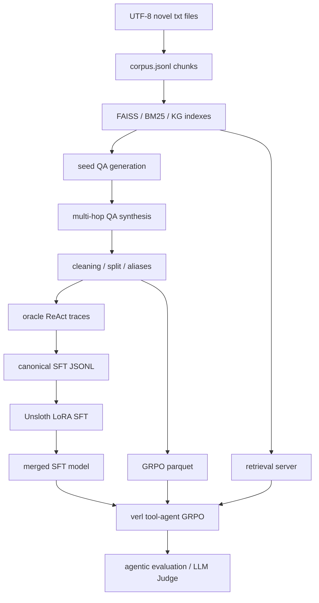

# AgenticRAG-RL

[简体中文](README.zh-CN.md) | [Detailed Chinese workflow](demo/README.md)

AgenticRAG-RL is a vertical-domain multi-hop Agentic RAG and RL reproduction project for Chinese novel question answering. The runnable track lives in [`demo/`](demo/) and covers the full path from corpus construction to retrieval, oracle traces, supervised fine-tuning, tool-agent GRPO, and evaluation.

The current default corpus is a set of UTF-8 Chinese novel text files. The project is designed so the same pipeline can be adapted to another domain corpus with the same chunk, retrieval, QA, trace, SFT, GRPO, and evaluation contracts.

## Why This Project

Most Agentic RAG demos stop at a hand-written retriever and a few prompts. This repository focuses on the engineering pieces needed to reproduce and diagnose a training-oriented Agentic RAG system:

- build a domain corpus and aligned chunk IDs;
- construct keyword, dense, graph, and hybrid retrieval indexes;
- synthesize and clean multi-hop QA data;
- build oracle ReAct traces for cold-start SFT;
- train a canonical Qwen3 tool-use protocol with assistant-only labels;
- prepare verl-compatible tool-agent GRPO data and rewards;
- evaluate answer quality, evidence recall, and protocol stability.

## Features

- UTF-8 Chinese novel parsing with stable paragraph-window chunk IDs.
- FAISS + BGE-M3 dense retrieval, BM25 keyword retrieval, optional KG extraction, RRF fusion, and reranking.
- Multi-hop seed QA generation, quality filtering, alias enrichment, and train/test splitting.
- Oracle trace generation for canonical Qwen3 ReAct messages with `tool` role support.
- Unsloth LoRA SFT with assistant-only label masks and weighted protocol-boundary loss.
- verl multi-turn tool-agent GRPO entrypoint with retrieval tools and custom reward scoring.
- FastAPI retrieval server for local evaluation and GRPO rollout tools.
- Pipeline, rule-based agentic, HF model agentic, and LLM-as-Judge evaluation scripts.
- SwanLab and local JSONL/dashboard hooks for SFT observation and resume tracking.

## Repository Layout

```text
.
├── demo/                 # Current runnable Chinese-novel Agentic RAG + SFT + GRPO project
│   ├── data/             # Corpus, indexes, QA, SFT, GRPO, and evaluation artifacts
│   ├── docs/             # Detailed Chinese technical documentation
│   ├── scripts/          # Data, indexing, training, evaluation, and diagnostics CLIs
│   ├── src/              # agentic_rag_rl package
│   ├── tests/            # Unit and integration tests
│   └── training/         # Unsloth SFT, verl GRPO, rewards, tools, monitoring
├── example/              # Original/reference project materials and upstream-style examples
├── images/               # Project screenshots or visual assets
└── LICENSE               # MIT license for the code
```

Use `demo/` as the source of truth for the active implementation. The `example/` tree is reference material and should not be treated as the current default pipeline.

## Architecture



## Quick Start

The local workflow is developed for Windows 11 with PowerShell and `uv`. Run commands from `demo/` unless noted otherwise.

```powershell
cd .\demo
python .\scripts\setup_env.py
Copy-Item .\.env.example .\.env
```

If `python` resolves to the Windows Store placeholder instead of a real interpreter, run the setup script through the uv-managed environment:

```powershell
uv run --no-sync python .\scripts\setup_env.py
```

Fill `.env` only if you need online LLM calls for KG extraction, seed QA generation, multi-hop QA judging, or LLM-as-Judge. The local tests and many smoke checks do not require an API key.

If you have manually installed the Unsloth training stack into `.venv`, prefer `uv run --no-sync ...` for training and tests. Plain `uv run ...` may sync against the minimal `pyproject.toml` and remove packages that are only listed in `requirements.txt` or were installed manually.

## Local Smoke Workflow

Run tests after preparing the environment:

```powershell
uv run --no-sync python -m pytest -q
```

Run a tiny rule-based agentic evaluation over the included smoke data:

```powershell
uv run --no-sync python .\scripts\eval_agentic.py `
  --data .\data\smoke_novel\qa_pairs.jsonl `
  --corpus .\data\smoke_novel\corpus.jsonl `
  --max-samples 2
```

To rebuild the main local artifacts, follow the detailed guide in [`demo/README.md`](demo/README.md). The short order is:

```text
parse text corpus -> build indexes -> generate seed QA -> synthesize multi-hop QA
-> build oracle traces -> convert SFT data -> prepare GRPO parquet -> evaluate
```

Index rebuilds require local BGE models when using local paths:

```powershell
uv run --no-sync hf download BAAI/bge-m3 --local-dir .\models\bge-m3
uv run --no-sync hf download BAAI/bge-reranker-v2-m3 --local-dir .\models\bge-reranker-v2-m3
```

## Training Overview

Windows local development is intended for data processing, retrieval serving, SFT data conversion, smoke tests, and small-scale checks.

Unsloth SFT uses [`training/unsloth_sft_v4.yaml`](demo/training/unsloth_sft_v4.yaml) and the main entrypoint:

```powershell
uv run --no-sync python .\scripts\train_sft_unsloth.py `
  --config .\training\unsloth_sft_v4.yaml
```

GRPO uses verl, vLLM, Ray, and the tool-agent rollout loop. Run it in Linux, WSL, or a remote multi-GPU environment after starting the retrieval server:

```bash
export VERL_DIR=/path/to/verl
export PROJECT_DIR=/path/to/AgenticRAG-RL/demo
bash ./training/start_grpo_tool_agent.sh
```

## Retrieval API

Start the retrieval server with prebuilt indexes:

```powershell
uv run --no-sync python .\training\tools\retrieval_server.py `
  --index-dir .\data\novel\indexes `
  --embedding-model .\models\bge-m3 `
  --reranker-model .\models\bge-reranker-v2-m3 `
  --port 8790
```

Endpoints:

- `GET /health` returns `{"status": "ok"}`.
- `POST /search` accepts `query`, `top_k`, and `tool`.

Supported `tool` values:

- `keyword_search`
- `dense_search`
- `semantic_search`
- `graph_search`
- `hybrid_search`

## Results

The current effective SFT baseline is `training/outputs/unsloth_sft_qwen3_4b_lora_react_v4/checkpoint-3633`. Its strict 50-sample held-out agent-loop summary is stored in [`demo/results/sft_compare/react_v4_full_ckpt3633_50_summary.json`](demo/results/sft_compare/react_v4_full_ckpt3633_50_summary.json):

| Metric | Value |
| --- | ---: |
| `avg_em` | `0.84` |
| `avg_f1` | `0.8433` |
| `avg_hop_recall` | `0.75` |
| `answer_tag_rate` | `1.0` |
| `valid_tool_call_rate` | `1.0` |
| `think_tag_rate` | `1.0` |
| `starts_with_closing_tool_rate` | `0.0` |
| `malformed_tool_fragment_rate` | `0.0` |
| `max_turns_exceeded_rate` | `0.0` |

Expanded QA-pair diagnostics are also tracked under `demo/results/sft_compare/`, but the strict held-out summary above is the primary README result.

## Documentation

- [Runnable Chinese workflow](demo/README.md)
- [Architecture](demo/docs/工程架构.md)
- [Environment setup](demo/docs/环境安装.md)
- [Index construction](demo/docs/索引构建.md)
- [SFT/LoRA data flow](demo/docs/SFT_LORA/SFT_LORA数据流.md)
- [SFT/LoRA training and monitoring](demo/docs/SFT_LORA/SFT_LORA训练&观测.md)
- [SFT/LoRA evaluation](demo/docs/SFT_LORA/SFT_LORA训练测评.md)
- [RL data flow](demo/docs/RL/RL数据流.md)
- [RL training and monitoring](demo/docs/RL/RL训练&观测.md)
- [RL evaluation](demo/docs/RL/RL训练测评.md)
- [FAQ](demo/docs/FQA.md)

## Testing

Prepare dependencies first:

```powershell
cd .\demo
python .\scripts\setup_env.py
uv run --no-sync python -m pytest -q
```

The `--no-sync` flag is intentional. This project keeps runtime dependencies in [`demo/requirements.txt`](demo/requirements.txt), while [`demo/pyproject.toml`](demo/pyproject.toml) is minimal; running `uv run` without `--no-sync` can rebuild the environment without test dependencies.

## License and Data Note

The code is released under the [MIT License](LICENSE).

The repository may contain local or generated corpora, indexes, model-output traces, and evaluation artifacts for reproduction. The MIT license applies to the code. Make sure you have the right to use any domain corpus, model weights, or generated artifacts before redistributing them or using them outside your own experiments.
