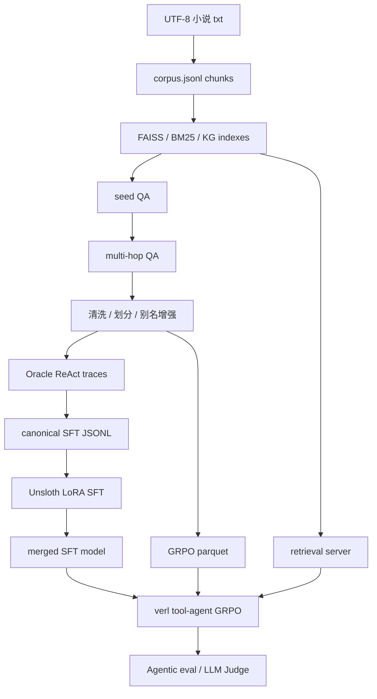

# AgenticRAG-RL

[English](README.md) | [中文详细复现手册](demo/README.md)

AgenticRAG-RL 是一个面向中文小说多跳问答的垂直领域 Agentic RAG + SFT + GRPO 复现工程。当前可运行主线在 [`demo/`](demo/) 目录下，覆盖从语料构建、检索索引、QA 合成、Oracle trace、SFT 冷启动、verl tool-agent GRPO 到评测诊断的完整链路。

根目录中文 README 只作为 GitHub 入口和索引；完整命令、字段解释和训练记录请看 [`demo/README.md`](demo/README.md)。

## 项目定位

本项目不是只演示一次检索问答，而是复现一个可训练、可诊断的 Agentic RAG 系统：

- 将 UTF-8 小说文本解析成稳定 `chunk_id` 的 corpus；
- 构建 FAISS/BGE-M3、BM25、KG、rerank 等检索组件；
- 生成、清洗并划分多跳 QA；
- 构造 canonical Qwen3 ReAct Oracle traces；
- 使用 Unsloth LoRA 做 SFT 冷启动；
- 准备 verl tool-agent GRPO 数据、工具和 reward；
- 用答案指标、证据召回和协议稳定性共同评测。

## 目录结构

```text
.
├── demo/                 # 当前可运行的中文小说 Agentic RAG + SFT + GRPO 主工程
│   ├── data/             # corpus、索引、QA、SFT、GRPO 和评测产物
│   ├── docs/             # 中文技术文档
│   ├── scripts/          # 数据、索引、训练、评测和诊断脚本
│   ├── src/              # agentic_rag_rl 包
│   ├── tests/            # 单元测试和集成测试
│   └── training/         # Unsloth SFT、verl GRPO、reward、tool、监控
├── example/              # 原始/参考工程材料，不是当前默认主线
├── images/               # 截图或视觉资产
└── LICENSE               # 代码使用 MIT License
```

## 核心流程



## 快速开始

本地默认环境是 Windows 11 + PowerShell + `uv`。除特别说明外，命令都在 `demo/` 下执行。

```powershell
cd .\demo
python .\scripts\setup_env.py
Copy-Item .\.env.example .\.env
```

如果 `python` 解析到 Windows Store 占位程序，而不是真实解释器，可以改用 uv 环境里的解释器执行同一个脚本：

```powershell
uv run --no-sync python .\scripts\setup_env.py
```

只有在 KG 抽取、seed QA 生成、多跳 QA LLM 质检或 LLM-as-Judge 时才需要填写 `.env` 中的在线模型 API Key。单测和部分 smoke 检查不需要 API Key。

如果 `.venv` 中已经手动安装 Unsloth、TRL、datasets、PEFT 等训练栈，后续优先使用：

```powershell
uv run --no-sync python ...
```

这样可以避免 `uv run` 根据最小化的 `pyproject.toml` 自动同步并移除手动安装的训练依赖。

## 本机 Smoke

先安装依赖并运行测试：

```powershell
uv run --no-sync python -m pytest -q
```

使用内置小样本跑一次规则型 agentic eval：

```powershell
uv run --no-sync python .\scripts\eval_agentic.py `
  --data .\data\smoke_novel\qa_pairs.jsonl `
  --corpus .\data\smoke_novel\corpus.jsonl `
  --max-samples 2
```

完整本地数据闭环请按 [`demo/README.md`](demo/README.md) 执行，简化顺序是：

```text
文本解析 -> 索引构建 -> seed QA -> 多跳 QA -> Oracle traces
-> SFT 数据 -> GRPO parquet -> Agentic / Judge 评测
```

## 训练边界

- Windows 本机：适合数据处理、检索服务、SFT 数据转换、单测、smoke eval 和小规模验证。
- Unsloth SFT：入口是 [`demo/scripts/train_sft_unsloth.py`](demo/scripts/train_sft_unsloth.py)，配置是 [`demo/training/unsloth_sft_v4.yaml`](demo/training/unsloth_sft_v4.yaml)。
- verl GRPO：入口是 [`demo/training/start_grpo_tool_agent.sh`](demo/training/start_grpo_tool_agent.sh)，建议在 Linux、WSL 或远程多 GPU 环境运行。
- 旧的 `example/` 目录和历史训练入口只作为参考，不代表当前默认主线。

## 检索服务

启动带索引的 retrieval server：

```powershell
uv run --no-sync python .\training\tools\retrieval_server.py `
  --index-dir .\data\novel\indexes `
  --embedding-model .\models\bge-m3 `
  --reranker-model .\models\bge-reranker-v2-m3 `
  --port 8790
```

接口：

- `GET /health`
- `POST /search`

`/search` 支持的 `tool`：

- `keyword_search`
- `dense_search`
- `semantic_search`
- `graph_search`
- `hybrid_search`

## 当前结果

当前有效 SFT baseline 是 `training/outputs/unsloth_sft_qwen3_4b_lora_react_v4/checkpoint-3633`。严格 50 条 held-out Agent loop 结果见 [`demo/results/sft_compare/react_v4_full_ckpt3633_50_summary.json`](demo/results/sft_compare/react_v4_full_ckpt3633_50_summary.json)：

| 指标 | 数值 |
| --- | ---: |
| `avg_em` | `0.84` |
| `avg_f1` | `0.8433` |
| `avg_hop_recall` | `0.75` |
| `answer_tag_rate` | `1.0` |
| `valid_tool_call_rate` | `1.0` |
| `think_tag_rate` | `1.0` |
| `starts_with_closing_tool_rate` | `0.0` |
| `malformed_tool_fragment_rate` | `0.0` |
| `max_turns_exceeded_rate` | `0.0` |

`demo/results/sft_compare/` 中还有扩展诊断结果，但 README 以 held-out 50 条主测评为主。

## 文档索引

- [中文长流程手册](demo/README.md)
- [工程架构](demo/docs/工程架构.md)
- [环境安装](demo/docs/环境安装.md)
- [索引构建](demo/docs/索引构建.md)
- [SFT/LoRA 数据流](demo/docs/SFT_LORA/SFT_LORA数据流.md)
- [SFT/LoRA 训练与观测](demo/docs/SFT_LORA/SFT_LORA训练&观测.md)
- [SFT/LoRA 训练测评](demo/docs/SFT_LORA/SFT_LORA训练测评.md)
- [RL 数据流](demo/docs/RL/RL数据流.md)
- [RL 训练与观测](demo/docs/RL/RL训练&观测.md)
- [RL 训练测评](demo/docs/RL/RL训练测评.md)
- [FQA](demo/docs/FQA.md)

## 测试

推荐顺序：

```powershell
cd .\demo
python .\scripts\setup_env.py
uv run --no-sync python -m pytest -q
```

这里使用 `--no-sync` 是刻意的：运行依赖主要在 [`demo/requirements.txt`](demo/requirements.txt)，而 [`demo/pyproject.toml`](demo/pyproject.toml) 当前只保留最小项目元信息；不带 `--no-sync` 可能导致环境被重新同步到缺少测试依赖的状态。

## 许可与数据说明

代码使用 [MIT License](LICENSE)。

仓库中可能包含本地语料、生成数据、索引、模型输出 trace 和评测产物。MIT License 只覆盖代码；语料、模型权重和生成产物的再分发或外部使用，需要你自行确认来源授权和合规边界。
