# 中文小说多跳 Agentic RAG & RL 复现工程

这个目录是 `9.2.1 垂直领域多跳 Agentic RAG & RL 简历项目.pdf` 的工程化复现版本。默认训练语料是 `data/original_data/平凡的世界utf8.txt`，任务域是中文小说人物、地点、事件、关系多跳阅读问答。

本工程采用 `uv` 管理本地 Python 环境。Windows 11 本机负责数据处理、检索服务、SFT/GRPO 数据构造和 smoke test；完整 SFT/GRPO 训练建议迁移到 Linux / WSL2 / A100 级 GPU 环境。

## 复现范围

- UTF-8 小说文本解析与稳定 chunk 切分
- `BM25 + dense + rerank` 轻量检索骨架
- 小说域 seed QA 与多跳合成样本生成
- Oracle traces、SFT 数据转换、LLaMA-Factory 兼容导出
- Agentic GRPO 数据准备、reward 计算、retrieval server
- Pipeline/Agentic 评测、Judge 打分、hop-aware 诊断
- Windows 11 本机 smoke test
- 外部 Linux / WSL / A100 环境的 Stage1 / Stage2 / Stage3 启动脚本

## 目录结构

```text
demo/
├── bootstrap/
├── data/
│   ├── original_data/平凡的世界utf8.txt
│   ├── novel/
│   ├── novel_eval/
│   └── smoke_novel/
├── docs/
├── requirements.txt
├── requirements-verl.txt
├── scripts/
├── src/
├── tests/
└── training/
```

## 整体流程图

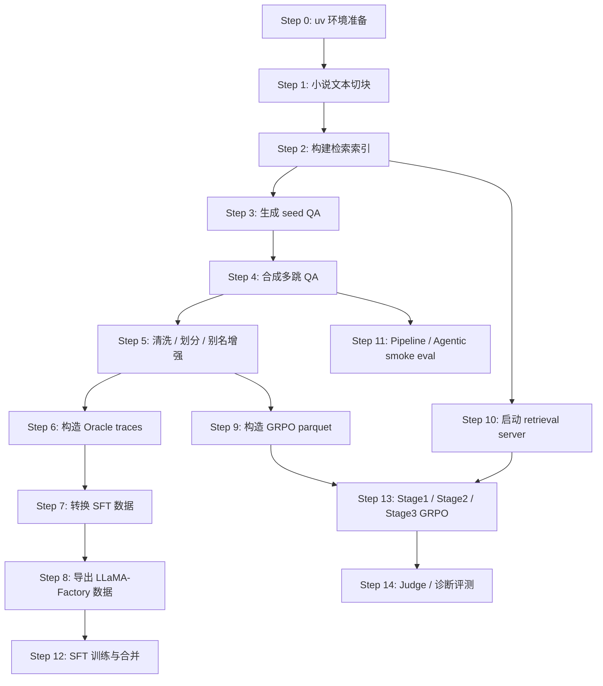

## Step 0: 使用 uv 准备本地环境

**目标**：创建可复现的本地 Python 环境，后续所有本机命令都通过 `uv run python ...` 执行。

**详细说明**：

- 该步骤先进入 `demo` 工程根目录，保证后续相对路径都从同一个目录解析。
- `uv venv .venv --python 3.12` 会在当前目录创建 `.venv`，并绑定 Python 3.12 解释器。
- `uv pip install -r .\requirements.txt` 会把本机数据处理、检索、评测所需依赖安装进 `.venv`。
- 后续命令使用 `uv run python ...`，由 `uv` 自动选择 `.venv`，减少手动激活环境导致的路径错误。

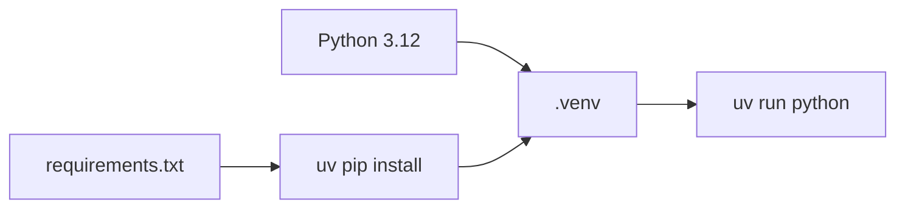

**需要**：

- Windows 11
- PowerShell
- 已安装 `uv`
- Python 3.12
- 当前工作目录为 `C:\Workspace\AI\Learning\AgenticRAG-RL\demo`

**怎么做**：

```powershell
Set-Location C:\Workspace\AI\Learning\AgenticRAG-RL\demo
uv venv .venv --python 3.12
uv pip install -r .\requirements.txt
```

**能拿到的结果**：

- `.venv/` 本地虚拟环境
- 可通过 `uv run python ...` 调用的项目依赖
- 不需要手动执行 `.\.venv\Scripts\Activate.ps1`

**数据结构与字段用途**：

| 产物 | 结构 / 字段 | 含义 | 后续使用位置 |
| --- | --- | --- | --- |
| `.venv/` | Python 虚拟环境目录 | 隔离本机依赖，避免污染全局 Python | 所有 `uv run python ...` 命令 |
| `requirements.txt` | Python 包列表 | 本机数据处理、检索、评测所需依赖 | Step 1 到 Step 11 |
| `pyproject.toml` | 项目元信息与 pytest 配置 | 指定源码路径和测试路径 | Step 11、单元测试 |

## Step 1: 解析《平凡的世界》文本并切块

**目标**：把原始 UTF-8 小说文本转换成统一 corpus 契约，供检索、QA 合成和训练数据构造使用。

**详细说明**：

- `parse_text_corpus.py` 读取 `平凡的世界utf8.txt`，按空行和长度窗口切分为多个 chunk。
- 切分时会保留每个 chunk 在原始文本中的行号范围，用于后续人工定位证据。
- 生成 `chunk_id` 时使用稳定递增编号，例如 `corpus_chunkids_000001`，保证重新生成后 ID 可预测。
- 脚本会扫描 chunk 中出现的人物名称，写入 `metadata.character_aliases`。
- 输出的 `corpus.jsonl` 是后续检索、QA 合成、Oracle trace 和评测的共同源数据。


**需要**：

- 输入：`data/original_data/平凡的世界utf8.txt`
- 脚本：`scripts/parse_text_corpus.py`
- 输出目录：`data/novel/`

**怎么做**：

```powershell
uv run python .\scripts\parse_text_corpus.py `
  --input .\data\original_data\平凡的世界utf8.txt `
  --output .\data\novel\corpus.jsonl
```

**能拿到的结果**：

- `data/novel/corpus.jsonl`
- 每条 chunk 包含 `chunk_id/title/text/metadata`
- `chunk_id` 形如 `corpus_chunkids_000001`
- `metadata` 包含 `source_file/line_start/line_end/character_aliases`

**数据结构与字段用途**：

`corpus.jsonl` 每行是一条独立 JSON，结构如下：

```json
{
  "chunk_id": "corpus_chunkids_000001",
  "title": "平凡的世界 段落 1",
  "text": "小说原文片段",
  "metadata": {
    "source_file": "平凡的世界utf8.txt",
    "line_start": 2,
    "line_end": 22,
    "character_aliases": ["孙少平"]
  }
}
```

| 字段 | 含义 | 后续使用位置 |
| --- | --- | --- |
| `chunk_id` | chunk 的稳定唯一 ID，默认前缀是 `corpus_chunkids` | 索引对齐、QA hop 的 `doc_chunk_id`、GRPO `gold_chunks`、hop-aware 评测 |
| `title` | chunk 的可读标题，默认使用“平凡的世界 段落 N” | 检索结果展示、index bundle、调试证据 |
| `text` | 实际参与检索和作为证据的小说片段 | BM25/dense 检索、tool response、Oracle traces、Agentic eval |
| `metadata.source_file` | 原始文本文件名 | 数据溯源、排查生成错误 |
| `metadata.line_start` | chunk 在原始 txt 中的起始行 | 证据定位、人工审查 |
| `metadata.line_end` | chunk 在原始 txt 中的结束行 | 证据定位、人工审查 |
| `metadata.character_aliases` | 在 chunk 中命中的人物名称或人物别名 | seed QA 生成、查询分解、诊断分析 |

## Step 2: 构建检索索引

**目标**：为 corpus 构建本机可跑的轻量索引，支持 keyword、dense 和 hybrid 检索。

**详细说明**：

- `build_index.py` 先加载 `corpus.jsonl`，把每条 JSON 转成内部 `Chunk` 对象。
- 索引构建会保留 chunk 顺序、chunk 文本和 metadata，便于检索结果回填原始证据。
- 当前工程的本机索引是轻量版，主要保存 chunk store 和 ID 清单；真实检索时由 `HybridRetriever` 在内存中构建 BM25 与 TF-IDF dense 表示。
- `chunk_store.pkl` 用于快速恢复检索所需的 chunk 内容，`manifest.json` 用于检查索引规模是否与 corpus 一致。

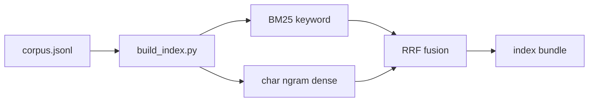

**需要**：

- 输入：`data/novel/corpus.jsonl`
- 脚本：`scripts/build_index.py`
- 输出目录：`data/novel/indexes/`

**怎么做**：

```powershell
uv run python .\scripts\build_index.py `
  --corpus .\data\novel\corpus.jsonl `
  --index-dir .\data\novel\indexes
```

**能拿到的结果**：

- `data/novel/indexes/manifest.json`
- `data/novel/indexes/chunk_ids.json`
- `data/novel/indexes/chunk_store.pkl`
- 后续检索服务和评测可直接加载 corpus 或索引产物

**数据结构与字段用途**：

| 产物 | 结构 / 字段 | 含义 | 后续使用位置 |
| --- | --- | --- | --- |
| `manifest.json` | `chunk_count/index_type` 等索引摘要 | 记录索引规模和类型 | 检查索引是否与 corpus 对齐 |
| `chunk_ids.json` | chunk ID 列表 | 保留索引顺序 | 检索结果排序、调试索引错位 |
| `chunk_store.pkl` | `chunk_id -> chunk record` | 存储检索返回所需文本和 metadata | retrieval server、Agentic evidence |

## Step 3: 生成小说域 seed QA

**目标**：通过豆包大模型 `doubao-seed-1-6-flash-250828` 从 chunk 中生成原子化、可验证、唯一答案的小说域基础问答。

**详细说明**：

- `gen_seed_qa.py` 逐条读取 corpus chunk，并把 chunk 文本发送给豆包模型生成 seed QA。
- 模型必须只基于当前 chunk 生成问题，输出 JSON 数组，字段为 `question/answer/qa_type/entities`。
- Prompt 核心要求参考原项目“种子 QA 生成”，但改成小说域标准：原子性、可验证性、时间 / 阶段明确性、唯一答案。
- `answer` 必须是人物名、地点名、物品名、明确关系或明确行为结果之一，拒绝主观判断、抽象感悟、长段解释和多原因并列。
- `qa_type` 固定收敛为 5 类：`character`、`place`、`object`、`relation`、`action_result`。
- 如果片段有明确时间、年代、季节、上学阶段或事件阶段，问题必须写入；如果片段没有明确时间或阶段，不强制补时间，也不能编造时间。
- 脚本会把模型输出规范化，并补充 `doc_chunk_id` 和默认检索工具 `keyword_search`。
- 如果模型返回旧类型，脚本会映射到新的 5 类，例如 `character_relation -> relation`、`object_reference -> object`、`character_behavior -> action_result`。
- 每条 seed QA 都绑定一个 `doc_chunk_id`，表示这个问题的答案可以从哪个 chunk 中获得。
- 脚本默认启用断点续写：如果 `seeds.jsonl` 已存在，会读取已有 `doc_chunk_id`，跳过已经生成过 seed 的 chunk，只处理剩余 chunk。
- 如果要清空旧结果重新生成，需要显式添加 `--overwrite`。
- seed QA 是单跳监督信号，后续多跳合成会把多个 seed 组合成更复杂问题。

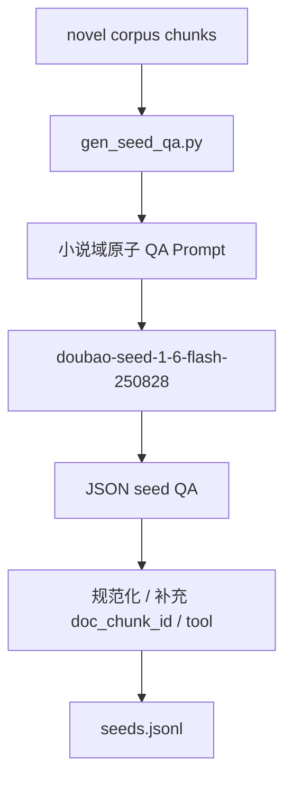

**需要**：

- 输入：`data/novel/corpus.jsonl`
- 脚本：`scripts/gen_seed_qa.py`
- 环境文件：复制 `.env.example` 为 `.env`，填写 `ARK_API_KEY`
- 默认 Provider：`doubao`
- 默认模型：`doubao-seed-1-6-flash-250828`
- 默认 Base URL：`https://ark.cn-beijing.volces.com/api/v3`
- 输出：`data/novel_eval/seeds.jsonl`

**怎么做**：

```powershell
uv run python .\scripts\gen_seed_qa.py `
  --corpus .\data\novel\corpus.jsonl `
  --output .\data\novel_eval\seeds.jsonl
```

失败后继续执行同一条命令即可续写；如果确认要从头生成，执行：

```powershell
uv run python .\scripts\gen_seed_qa.py `
  --corpus .\data\novel\corpus.jsonl `
  --output .\data\novel_eval\seeds.jsonl `
  --overwrite
```

**能拿到的结果**：

- `data/novel_eval/seeds.jsonl`
- 每条 seed 包含 `question/answer/doc_chunk_id/tool/entities/qa_type`
- 每条 seed 的 `question/answer/qa_type/entities` 来自豆包模型，`doc_chunk_id/tool` 由脚本补齐

**数据结构与字段用途**：

| 字段 | 含义 | 后续使用位置 |
| --- | --- | --- |
| `question` | 单跳基础问题 | 多跳 QA 的 hop question |
| `answer` | 单跳答案 | 多跳 QA 的 hop answer、answer aliases 来源 |
| `doc_chunk_id` | 支撑该 seed 的证据 chunk | `hops[].doc_chunk_id`、Oracle trace 检索目标 |
| `tool` | 默认检索工具，如 `keyword_search` | Oracle trace 工具调用 |
| `entities` | 问答中涉及的人物 / 地点 | 多跳组合、查询分解 |
| `qa_type` | Seed QA 类型，只允许 `character/place/object/relation/action_result` | 分层统计、诊断评测、多跳 hop 类型 |

**小说域 Prompt 核心要求**：

| 约束 | 小说域标准 |
| --- | --- |
| 原子性 | 每个 QA 只包含一个不可拆分事实，不能把多个动作、多个原因、多个关系并列在同一个答案里 |
| 可验证性 | 答案必须直接来自片段，且属于人物名、地点名、物品名、明确关系或明确行为结果之一 |
| 时间 / 阶段明确性 | 片段出现明确时间、年代、季节、上学阶段或事件阶段时，问题必须写入；片段没有则不强制、不编造 |
| 唯一答案 | 问题必须足够具体，使片段中只有一个明确答案，避免“他/她/这个人”等指代不清 |
| 类型收敛 | `qa_type` 只使用 `character/place/object/relation/action_result`，避免过细分类造成模型乱分桶 |

## Step 4: 合成多跳 QA

**目标**：参考原项目的“逐跳扩展”思路，从单跳 seed QA 出发，逐步检索相关 chunk 并扩展成 2-hop / 3-hop 阅读问答任务。

**详细说明**：

- `domain_multihop_synthesis.py` 加载 seed QA 和 corpus，并在内存中创建 `HybridRetriever`。
- 每条 seed QA 会先作为 hop1；扩展下一跳时，主查询使用当前 hop 的 `question`，辅查询使用当前 hop 的 `answer`。
- 检索结果会合并去重，并跳过已经使用过的 `doc_chunk_id`，从新的 chunk 中选择已有 seed QA 作为下一跳。
- 当前实现复现“逐跳扩展”的数据流：`seed -> 检索候选 chunk -> 选择候选 QA -> 豆包 thinking 模型合并为多跳样本`。
- 多跳合并默认使用 `doubao-seed-2-0-pro-260215`，只负责生成自然的 `final_question/final_answer/answer_aliases`；逐跳检索和候选 QA 选择仍由规则流程完成。
- 如果只想本机离线 smoke，可以加 `--disable-llm-merge`，此时会回退到规则模板合并。
- 每个 hop 都保留 `question/answer/doc_chunk_id/qa_type/search_tools`，其中 `qa_type` 继承 seed QA 的 5 类类型，用于构造 Oracle trace、计算 `gold_chunks` 和诊断检索路径。
- `answer_aliases` 会记录可接受答案变体，降低训练和评测中因表述不同造成的误判。
- `--target-count` 控制生成数量，本机 smoke 可以使用较小数量，完整训练可以扩展。
- 脚本默认启用断点续写：如果 `qa_pairs.jsonl` 已存在，会读取已有样本数量和 hop 链路签名，只补齐到 `--target-count`，并在调用豆包合并模型前跳过已经生成过的链路。
- 如果要清空旧结果重新合成，需要显式添加 `--overwrite`。

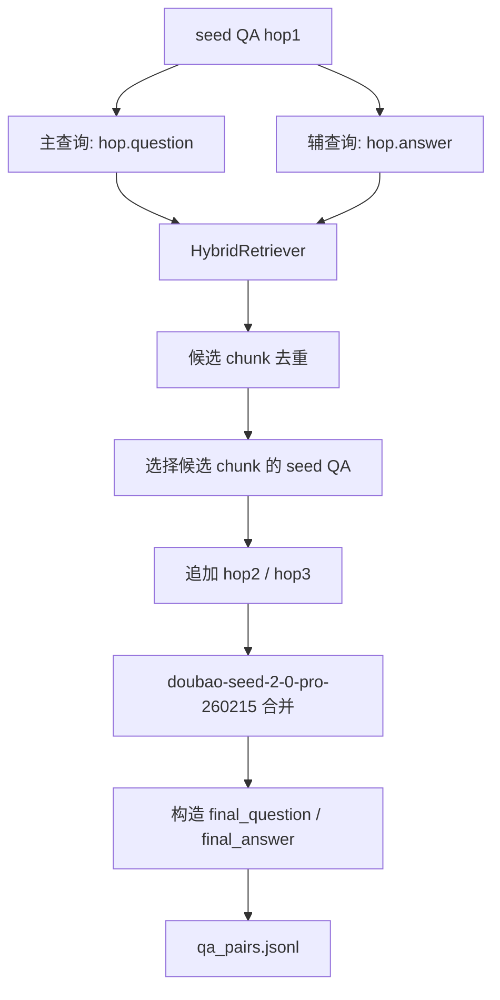

**需要**：

- 输入：`data/novel_eval/seeds.jsonl`
- 输入：`data/novel/corpus.jsonl`
- 脚本：`scripts/domain_multihop_synthesis.py`
- 环境文件：`.env` 中填写 `ARK_API_KEY`
- 默认 Provider：`doubao`
- 默认合并模型：`doubao-seed-2-0-pro-260215`
- 输出：`data/novel_eval/qa_pairs.jsonl`

**怎么做**：

```powershell
uv run python .\scripts\domain_multihop_synthesis.py `
  --seeds .\data\novel_eval\seeds.jsonl `
  --corpus .\data\novel\corpus.jsonl `
  --output .\data\novel_eval\qa_pairs.jsonl `
  --target-count 50
```

失败后继续执行同一条命令即可续写；如果确认要从头合成，执行：

```powershell
uv run python .\scripts\domain_multihop_synthesis.py `
  --seeds .\data\novel_eval\seeds.jsonl `
  --corpus .\data\novel\corpus.jsonl `
  --output .\data\novel_eval\qa_pairs.jsonl `
  --target-count 50 `
  --overwrite
```

**能拿到的结果**：

- `data/novel_eval/qa_pairs.jsonl`
- 每条样本包含 `final_question/final_answer/hop_count/qa_type/subset/hops/answer_aliases`
- `hop_count >= 2`
- 每个 hop 都有合法 `doc_chunk_id`

**数据结构与字段用途**：

| 字段 | 含义 | 后续使用位置 |
| --- | --- | --- |
| `final_question` | 需要多跳检索回答的最终问题 | SFT prompt、GRPO prompt、eval 输入 |
| `final_answer` | 标准最终答案 | EM/F1、reward target、Judge reference |
| `hop_count` | 需要的推理跳数 | reward 搜索充分性、hop-aware 指标 |
| `qa_type` | 多跳题型 | 评测分桶、错误诊断 |
| `subset` | 样本子集标签 | train/test 统计、实验对比 |
| `hops[]` | 每跳 question/answer/doc_chunk_id/qa_type/search_tools，hop 级 `qa_type` 继承 seed QA 的 5 类类型 | Oracle traces、`gold_chunks`、hop recall |
| `answer_aliases` | 可接受答案别名 | reward correctness、Judge 打分 |

## Step 5: 清洗、划分和 answer aliases 增强

**目标**：清理非法样本，按 train/test 划分，并增强答案别名，减少评测和 reward 对表述差异的误判。

**详细说明**：

- `clean_synthesis.py` 会检查每条多跳样本是否至少包含两个 hop，并确认每个 `doc_chunk_id` 都能在 corpus 中找到。
- `split_train_test.py` 会把清洗后的样本固定划分为训练集和测试集，便于后续重复实验对比。
- `gen_enhanced_aliases.py` 会基于标准答案和已有别名生成增强别名集合。
- 该步骤的核心作用是把“能生成”的样本变成“适合训练和评测”的样本。

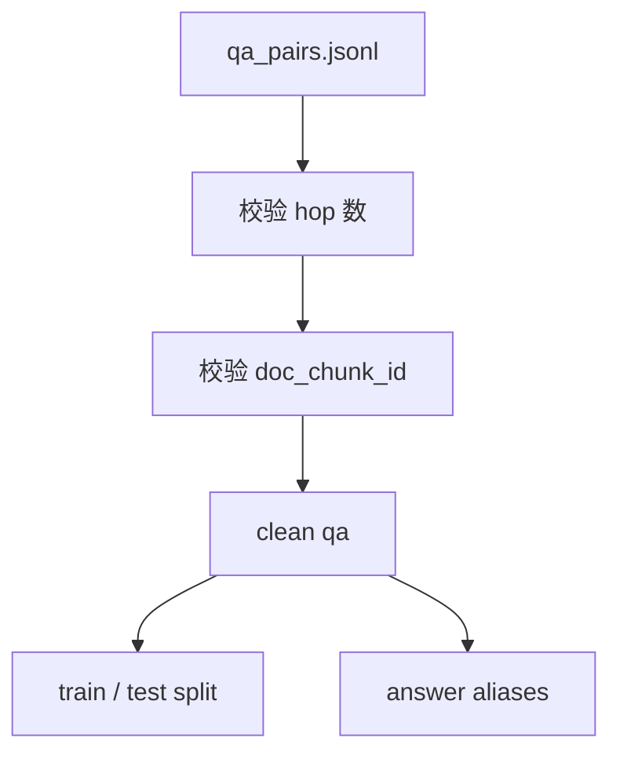

**需要**：

- 输入：`data/novel_eval/qa_pairs.jsonl`
- 输入：`data/novel/corpus.jsonl`
- 脚本：`clean_synthesis.py`、`split_train_test.py`、`gen_enhanced_aliases.py`

**怎么做**：

```powershell
uv run python .\scripts\clean_synthesis.py `
  --input .\data\novel_eval\qa_pairs.jsonl `
  --output .\data\novel_eval\qa_pairs_clean.jsonl `
  --corpus .\data\novel\corpus.jsonl

uv run python .\scripts\split_train_test.py `
  --input .\data\novel_eval\qa_pairs_clean.jsonl `
  --train-output .\data\novel_eval\train.jsonl `
  --test-output .\data\novel_eval\test.jsonl

uv run python .\scripts\gen_enhanced_aliases.py `
  --input .\data\novel_eval\qa_pairs_clean.jsonl `
  --output .\data\novel_eval\qa_pairs_aliases.json
```

**能拿到的结果**：

- `data/novel_eval/qa_pairs_clean.jsonl`
- `data/novel_eval/train.jsonl`
- `data/novel_eval/test.jsonl`
- `data/novel_eval/qa_pairs_aliases.json`

**数据结构与字段用途**：

| 产物 | 结构 / 字段 | 含义 | 后续使用位置 |
| --- | --- | --- | --- |
| `qa_pairs_clean.jsonl` | 与 `qa_pairs.jsonl` 相同 | 去除非法 hop 或缺证据样本 | 后续训练数据生成的推荐输入 |
| `train.jsonl` | 多跳 QA 子集 | 训练集 | SFT / GRPO 数据构造 |
| `test.jsonl` | 多跳 QA 子集 | 固定评测集 | Agentic eval、LLM Judge |
| `qa_pairs_aliases.json` | 增强后的 `answer_aliases` | 扩展答案可接受表达 | reward、Judge、人工审查 |

## Step 6: 构造 Oracle traces

**目标**：为每条多跳 QA 构造标准工具调用轨迹，作为 SFT 的监督信号，也作为 GRPO prompt 协议参考。

**详细说明**：

- `build_oracle_traces.py` 读取多跳 QA 中的 `hops[]`，按 gold hop 顺序构造理想检索轨迹。
- 对每个 hop，脚本会生成一条 assistant 的 `<tool_call>`，再把对应 chunk 包装成 `<tool_response>`。
- 最后一轮 assistant 消息使用 `<answer>...</answer>` 输出最终答案。
- 这种 trace 不依赖模型 rollout，因此覆盖率稳定，适合作为 SFT 的格式学习数据。
- Oracle trace 的轨迹较理想，后续 GRPO 会让模型在真实多轮检索环境中继续学习。

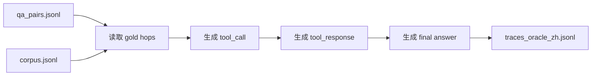

**需要**：

- 输入：`data/novel_eval/qa_pairs.jsonl`
- 输入：`data/novel/corpus.jsonl`
- 脚本：`scripts/build_oracle_traces.py`
- 输出：`data/novel_eval/traces_oracle_zh.jsonl`

**怎么做**：

```powershell
uv run python .\scripts\build_oracle_traces.py `
  --qa .\data\novel_eval\qa_pairs.jsonl `
  --corpus .\data\novel\corpus.jsonl `
  --output .\data\novel_eval\traces_oracle_zh.jsonl `
  --use-zh
```

**能拿到的结果**：

- `data/novel_eval/traces_oracle_zh.jsonl`
- 每条 trace 包含 `messages[]`
- 工具调用采用 Hermes 风格 `<tool_call>{"name": "...", "arguments": {...}}</tool_call>`
- 最终答案使用 `<answer>...</answer>`

**数据结构与字段用途**：

| 字段 | 含义 | 后续使用位置 |
| --- | --- | --- |
| `messages[]` | system/user/assistant/tool_response 多轮消息 | SFT 监督数据、协议回放 |
| `gold_chunks` | 标准证据 chunk ID 列表 | reward hop recall、诊断评测 |
| `answer_aliases` | 标准答案别名 | reward correctness |
| `hop_count` | 标准推理跳数 | 搜索充分性 reward |
| `<tool_call>` | Hermes 工具调用协议 | SFT 学习工具调用、GRPO rollout |
| `<tool_response>` | 检索证据返回 | 训练模型 grounded answer |
| `<answer>` | 最终答案标签 | reward 抽取答案、评测抽取答案 |

## Step 7: 转换 SFT 训练数据

**目标**：把 Oracle traces 转换成 ReAct/SFT 记录和 ShareGPT 格式，供 LLaMA-Factory 使用。

**详细说明**：

- `trace_to_sft.py` 读取 Oracle trace，把 system、user、assistant、tool 消息转换为 SFT 可训练的多轮对话。
- 工具返回消息会被转换为用户侧消息，以适配常见 ShareGPT / chat template 训练格式。
- 转换过程会保留 `<tool_call>`、`<tool_response>` 和 `<answer>`，确保模型学习同一套协议。
- 输出的多个 JSONL 文件内容相近，主要用于兼容不同训练脚本或调试入口。

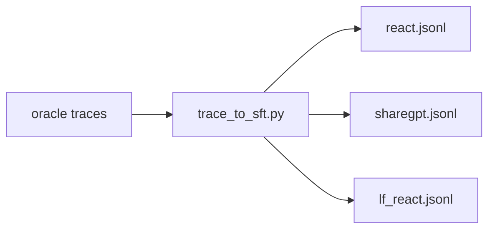

**需要**：

- 输入：`data/novel_eval/traces_oracle_zh.jsonl`
- 脚本：`scripts/trace_to_sft.py`
- 输出目录：`data/novel_eval/sft/`

**怎么做**：

```powershell
uv run python .\scripts\trace_to_sft.py `
  --input .\data\novel_eval\traces_oracle_zh.jsonl `
  --output-dir .\data\novel_eval\sft `
  --lang zh
```

**能拿到的结果**：

- `data/novel_eval/sft/react.jsonl`
- `data/novel_eval/sft/sharegpt.jsonl`
- `data/novel_eval/sft/lf_react.jsonl`
- 可检查每条记录是否保留工具调用和 `<answer>` 协议

**数据结构与字段用途**：

| 产物 | 结构 / 字段 | 含义 | 后续使用位置 |
| --- | --- | --- | --- |
| `react.jsonl` | `messages[]` ReAct 轨迹 | 保留原始工具调用过程 | 调试、协议检查 |
| `sharegpt.jsonl` | ShareGPT `messages[]` | LLaMA-Factory 可消费格式 | Step 8 |
| `lf_react.jsonl` | ShareGPT 兼容副本 | 兼容不同数据入口命名 | SFT 训练 |
| `messages[].role` | system/user/assistant | 标识对话角色 | tokenizer / template |
| `messages[].content` | 消息正文 | 包含工具调用和答案标签 | SFT loss |

## Step 8: 导出 LLaMA-Factory 数据目录

**目标**：把 ShareGPT SFT 数据打包成 LLaMA-Factory 可识别的数据集目录。

**详细说明**：

- `convert_sft_to_llamafactory.py` 读取 `sharegpt.jsonl`，转换成 LLaMA-Factory 使用的 `data.json`。
- 脚本同时生成 `dataset_info.json`，声明数据集名称、文件名、格式和消息列映射。
- `training/sft_zh_react.yaml` 通过 dataset 名 `novel_agent_zh_react` 引用该数据目录。
- 这一步不训练模型，只负责把数据整理成训练框架能直接读取的目录结构。

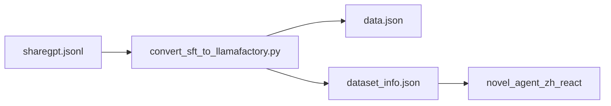

**需要**：

- 输入目录：`data/novel_eval/sft/`
- 脚本：`scripts/convert_sft_to_llamafactory.py`
- 输出目录：`data/novel_eval/sft_zh_llamafactory/`

**怎么做**：

```powershell
uv run python .\scripts\convert_sft_to_llamafactory.py `
  --input-dir .\data\novel_eval\sft `
  --output-dir .\data\novel_eval\sft_zh_llamafactory
```

**能拿到的结果**：

- `data/novel_eval/sft_zh_llamafactory/data.json`
- `data/novel_eval/sft_zh_llamafactory/dataset_info.json`
- dataset 名：`novel_agent_zh_react`
- SFT 配置：`training/sft_zh_react.yaml`

**数据结构与字段用途**：

| 产物 | 结构 / 字段 | 含义 | 后续使用位置 |
| --- | --- | --- | --- |
| `data.json` | ShareGPT 样本数组 | 真实 SFT 样本 | LLaMA-Factory train |
| `dataset_info.json` | `novel_agent_zh_react` 数据集定义 | 告诉 LLaMA-Factory 如何读取 `data.json` | `training/sft_zh_react.yaml` |
| `training/sft_zh_react.yaml` | `dataset/template/model/output_dir` | SFT 训练配置 | Step 12 |

## Step 9: 构造 GRPO parquet 数据

**目标**：把多跳 QA 转换成 `verl` Agentic GRPO 需要的 parquet 行，保留 raw chat、agent name 和 reward ground truth。

**详细说明**：

- `prepare_agentic_grpo_data.py` 读取多跳 QA，并调用 `build_grpo_rows` 构造 `verl` 训练行。
- 每条样本的 `prompt` 保留原始 chat 消息，包含 system prompt 和用户问题。
- `agent_name` 固定为 `tool_agent`，用于让 `verl` 选择带工具调用的 agent loop。
- `reward_model.ground_truth` 会写入标准答案、答案别名、gold chunks 和 hop 数，供 reward 函数打分。
- 脚本按 `val-ratio` 划分 train/val，并以 parquet 格式保存，减少训练时的解析成本。

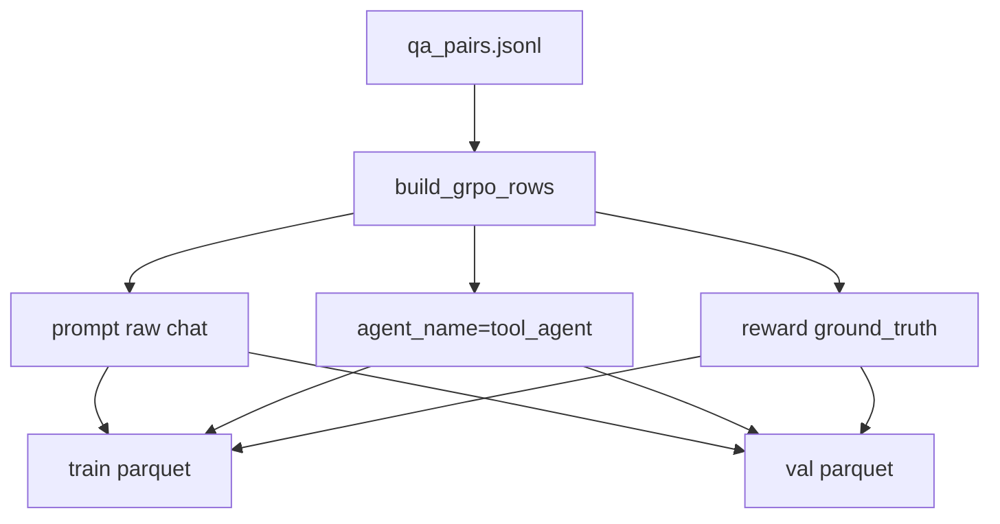

**需要**：

- 输入：`data/novel_eval/qa_pairs.jsonl`
- 脚本：`scripts/prepare_agentic_grpo_data.py`
- 输出：`data/novel_eval/grpo_agentic_train.parquet`
- 输出：`data/novel_eval/grpo_agentic_val.parquet`

**怎么做**：

```powershell
uv run python .\scripts\prepare_agentic_grpo_data.py `
  --input .\data\novel_eval\qa_pairs.jsonl `
  --train-output .\data\novel_eval\grpo_agentic_train.parquet `
  --val-output .\data\novel_eval\grpo_agentic_val.parquet
```

**能拿到的结果**：

- GRPO train parquet
- GRPO val parquet
- 每行包含 `prompt/agent_name/reward_model.ground_truth`
- `ground_truth` 包含 `target/question/answer_aliases/gold_chunks/hop_count`

**数据结构与字段用途**：

| 字段 | 含义 | 后续使用位置 |
| --- | --- | --- |
| `prompt` | 原始 chat prompt，包含 system 和 user question | `verl` Agentic rollout 输入 |
| `agent_name` | 默认 `tool_agent` | `verl` 路由到工具 Agent loop |
| `reward_model.ground_truth.target` | 标准答案 | reward correctness |
| `reward_model.ground_truth.question` | 原始问题 | Judge / debug |
| `reward_model.ground_truth.answer_aliases` | 答案别名 | correctness 兼容匹配 |
| `reward_model.ground_truth.gold_chunks` | 标准证据 chunk | hop recall / faithfulness |
| `reward_model.ground_truth.hop_count` | 标准跳数 | 搜索充分性约束 |

## Step 10: 启动小说检索服务

**目标**：为 Agentic rollout / GRPO 多轮工具调用提供 HTTP 检索工具服务。

**详细说明**：

- `retrieval_server.py` 启动 FastAPI 服务，并在内存中加载小说 corpus。
- 服务启动后会构造 `HybridRetriever`，支持 keyword、dense 和 hybrid 三类检索请求。
- `/search` 接口接收 `query/top_k/tool`，返回 chunk ID、标题、文本、分数和 metadata。
- `novel_tool_config.yaml` 会告诉 `verl` 每个工具应该请求哪个 HTTP endpoint，以及如何组织 payload。
- 本机 smoke 和远端 GRPO 可以使用同一套服务协议，差异只在运行机器和模型规模。

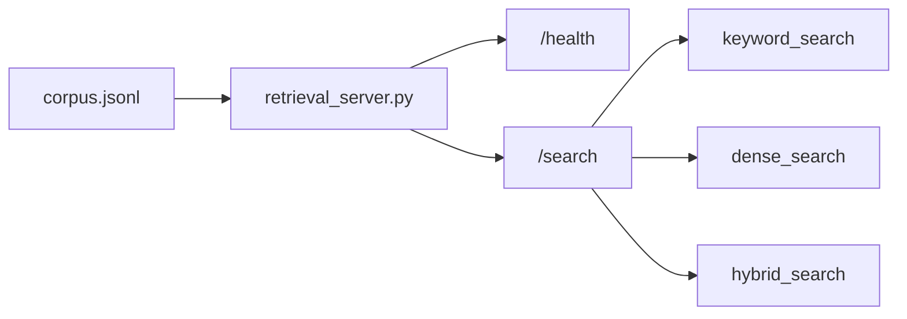

**需要**：

- 输入：`data/novel/corpus.jsonl`
- 服务脚本：`training/tools/retrieval_server.py`
- 默认端口：`8790`
- Tool config：`training/config/novel_tool_config.yaml`

**怎么做**：

```powershell
uv run python .\training\tools\retrieval_server.py `
  --port 8790 `
  --corpus .\data\novel\corpus.jsonl
```

**能拿到的结果**：

- `http://127.0.0.1:8790/health`
- `http://127.0.0.1:8790/search`
- 支持 `keyword_search/dense_search/hybrid_search`
- GRPO 训练脚本可通过 `novel_tool_config.yaml` 调用该服务

**数据结构与字段用途**：

| 接口 / 配置 | 结构 / 字段 | 含义 | 后续使用位置 |
| --- | --- | --- | --- |
| `/health` | `{"status": "ok"}` | 服务存活检查 | smoke test、训练前检查 |
| `/search` request | `query/top_k/tool` | 检索请求 | Agentic rollout 工具调用 |
| `/search` response | `results[]` | 检索结果列表 | tool response、证据记录 |
| `results[].chunk_id` | corpus chunk ID | 证据 ID | hop recall、reward |
| `results[].text` | 证据文本 | 回答依据 | faithfulness、Judge |
| `novel_tool_config.yaml` | tool name / endpoint / payload | `verl` 工具配置 | GRPO Stage1/2/3 |

## Step 11: 本机 smoke 评测

**目标**：在不启动真实大模型训练的情况下，验证数据、检索、agentic rollout 和 reward 所需字段能闭环。

**详细说明**：

- `eval_agentic.py` 加载 QA 数据和 corpus，在本地创建 `HybridRetriever`。
- 每条样本会调用规则化的 `run_agentic_episode`，模拟多轮检索和答案生成。
- 脚本会记录预测答案、召回 chunk、标准 gold chunks、工具调用次数和证据文本。
- 该步骤不评估大模型能力，而是验证数据契约、检索链路和评测字段是否完整。
- 如果该步骤失败，优先检查前面生成的 corpus、QA、chunk ID 和检索结果。

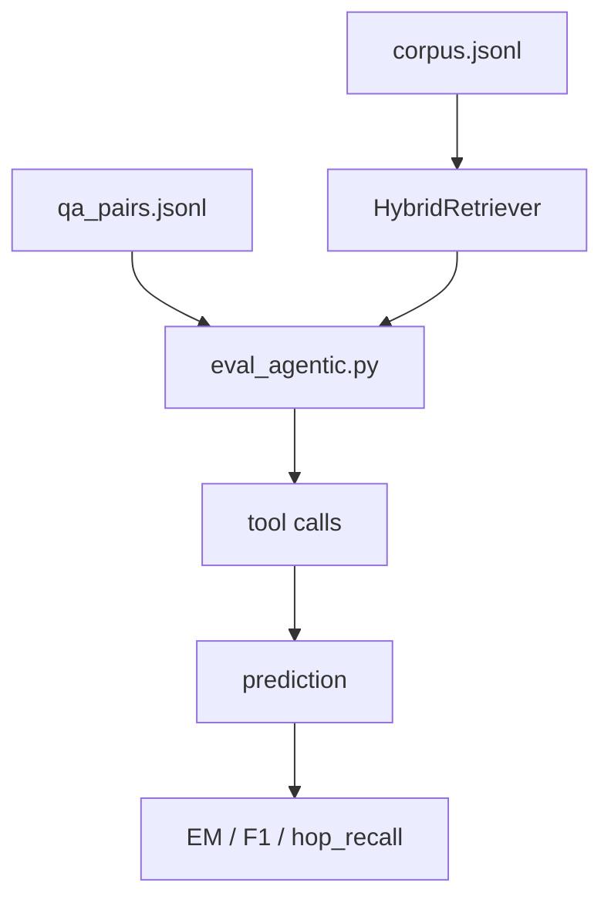

**需要**：

- 输入：`data/novel_eval/qa_pairs.jsonl`
- 输入：`data/novel/corpus.jsonl`
- 脚本：`scripts/eval_agentic.py`

**怎么做**：

```powershell
uv run python .\scripts\eval_agentic.py `
  --data .\data\novel_eval\qa_pairs.jsonl `
  --corpus .\data\novel\corpus.jsonl `
  --max-samples 2
```

**能拿到的结果**：

- 控制台输出 `summary`
- 每条样本包含 `prediction/retrieved_chunk_ids/gold_chunks/tool_calls/evidence`
- 可观察 `avg_em/avg_f1/avg_hop_recall`
- 如果答案为空或证据为空，说明前序 corpus、QA 或检索链路有问题

**数据结构与字段用途**：

| 字段 | 含义 | 后续使用位置 |
| --- | --- | --- |
| `summary.count` | 评测样本数 | smoke 是否覆盖样本 |
| `summary.avg_em` | 平均 exact match | 答案精确性粗评 |
| `summary.avg_f1` | 平均 token F1 | 答案相似度粗评 |
| `summary.avg_hop_recall` | 标准证据召回率 | 检索质量诊断 |
| `results[].prediction` | Agentic 输出答案 | 错误分析 |
| `results[].retrieved_chunk_ids` | 实际召回 chunk | reward / hop-aware 诊断 |
| `results[].evidence` | 检索证据详情 | 人工审查、faithfulness 分析 |

## Step 12: SFT 训练与 checkpoint 合并

**目标**：用 Oracle traces 让模型先学会 Hermes 工具调用格式、检索步骤和 `<answer>` 答案协议。

**详细说明**：

- SFT 阶段使用 Step 8 导出的 ShareGPT 数据，让基座模型先模仿理想工具调用轨迹。
- 训练时 `qwen3_nothink` 模板负责把多轮消息转成模型可学习的 token 序列。
- LoRA 训练只更新少量适配器权重，降低显存和训练成本。
- export 阶段会把 LoRA adapter 合并回基座模型，生成后续 GRPO 使用的 merged model。
- 本机主要验证数据格式；完整 SFT 建议在更大显存环境中执行。

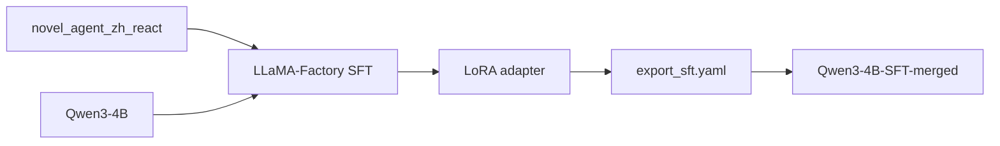

**需要**：

- LLaMA-Factory 环境
- 基座模型：默认 `Qwen3-4B`
- 数据目录：`data/novel_eval/sft_zh_llamafactory/`
- 配置：`training/sft_zh_react.yaml`
- 本机 16GB 显存只建议跑低参 smoke；完整训练建议远端 GPU

**怎么做**：

```powershell
# 在已准备好的 LLaMA-Factory 环境中执行，命令示例按实际安装路径调整
llamafactory-cli train .\training\sft_zh_react.yaml
llamafactory-cli export .\training\export_sft.yaml
```

**能拿到的结果**：

- LoRA 输出：`training/outputs/sft_qwen3_4b_zh_react`
- 合并模型：`models/Qwen3-4B-SFT-merged`
- 该模型作为 GRPO Stage1 的默认 base

**数据结构与字段用途**：

| 产物 / 配置 | 结构 / 字段 | 含义 | 后续使用位置 |
| --- | --- | --- | --- |
| `training/sft_zh_react.yaml` | model/dataset/template/output_dir | SFT 训练参数 | LLaMA-Factory |
| `training/outputs/sft_qwen3_4b_zh_react` | LoRA adapter | 学到工具调用格式的增量权重 | export |
| `models/Qwen3-4B-SFT-merged` | 合并后的 HF 模型目录 | GRPO 初始模型 | Stage1 / v11e |

## Step 13: Agentic GRPO 训练

**目标**：在 `verl` Agentic RL 中让模型通过检索工具多轮推理，并用 reward 约束 correctness、faithfulness、hop recall 和搜索行为。

**详细说明**：

- Stage1 使用 SFT merged model 作为初始模型，读取 GRPO train/val parquet。
- rollout 时模型根据 prompt 调用检索工具，工具请求会通过 `novel_tool_config.yaml` 转发到 retrieval server。
- reward 函数从模型输出中抽取 `<answer>`，并结合答案别名、gold chunks、hop count 和工具调用记录打分。
- Stage1 默认使用 `v6a` 强化 grounding，Stage2 使用 `v5a` 强化 correctness，Stage3 使用 `v9a` 做对照实验。
- PowerShell 脚本提供 `-PrintOnly` 模式，先打印完整命令和路径，确认无误后再在 GPU 环境执行真实训练。

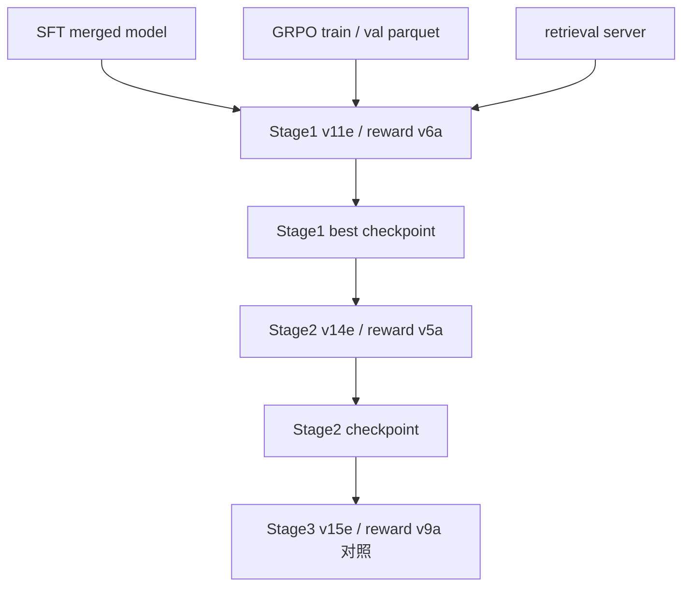

**需要**：

- 远端 Linux / WSL2 / A100 级 GPU
- `verl`、`vLLM`、`flash-attn`
- 已启动 retrieval server
- GRPO parquet：`data/novel_eval/grpo_agentic_train.parquet` 和 `data/novel_eval/grpo_agentic_val.parquet`
- Tool config：`training/config/novel_tool_config.yaml`
- Reward：`training/reward_agentic_rag.py`

**怎么做**：

```powershell
.\training\run_stage1_v11e.ps1 -PrintOnly
.\training\run_stage2_v14e.ps1 -PrintOnly
.\training\run_stage3_v15e.ps1 -PrintOnly
```

确认路径无误后，在目标 GPU 环境去掉 `-PrintOnly` 执行。

**能拿到的结果**：

- Stage1 / `v11e`：使用 reward `v6a`，目标是 grounding-first
- Stage2 / `v14e`：以上一阶段 checkpoint 为 base，使用 reward `v5a`
- Stage3 / `v15e`：使用 reward `v9a`，作为检索强化对照实验
- 可合并 checkpoint，并进入后续 Agentic 评测

**数据结构与字段用途**：

| 组件 | 结构 / 字段 | 含义 | 后续使用位置 |
| --- | --- | --- | --- |
| `grpo_agentic_train.parquet` | `prompt/agent_name/reward_model` | 训练 rollout 数据 | `verl.trainer.main_ppo` |
| `grpo_agentic_val.parquet` | 同 train parquet | 验证 rollout 数据 | checkpoint 选择 |
| `reward_agentic_rag.py` | `compute_score` | 自定义 reward 入口 | `verl` reward function |
| `AGENTIC_RAG_REWARD_VERSION` | `v6a/v5a/v9a` | 切换 reward 公式 | Stage1/2/3 |
| `novel_tool_config.yaml` | tool endpoint | 多轮检索工具配置 | rollout 工具调用 |

## Step 14: 评测与诊断

**目标**：比较 SFT、Stage1、Stage2、Stage3 的效果，避免只验证“能跑”，而忽略多跳检索质量和答案可信度。

**详细说明**：

- 评测阶段使用固定 QA 集和同一份 corpus，保证不同 checkpoint 的结果可比。
- Pipeline eval 作为非 agentic 基线，主要衡量直接检索回答的上限和问题难度。
- Agentic eval 会记录多轮工具调用、召回证据和最终答案，用于分析模型是否真的按 hop 搜索。
- LLM Judge 可作为补充评估 correctness、faithfulness 和 context precision。
- 最终应同时看答案指标、证据召回、工具调用行为和人工可审查证据，而不是只看单一分数。

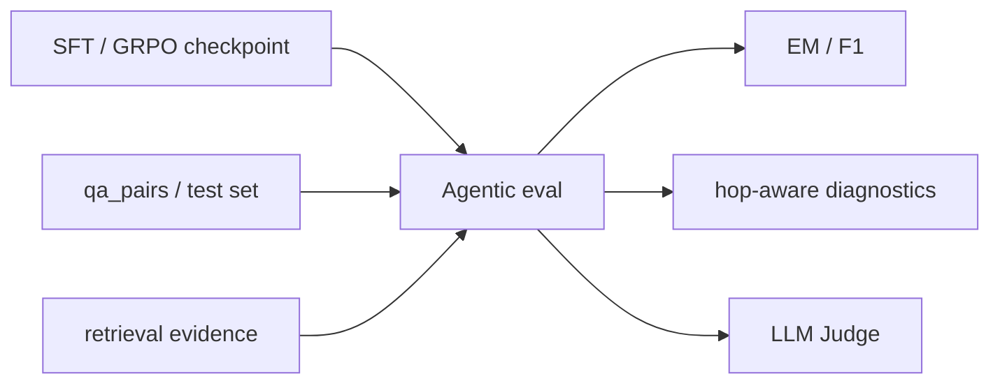

**需要**：

- 测试集：`data/novel_eval/test.jsonl` 或 `data/novel_eval/qa_pairs.jsonl`
- corpus：`data/novel/corpus.jsonl`
- 检索服务
- 可选 LLM Judge 服务
- 脚本：`eval_agentic.py`、`run_cloud_eval.py`、`run_llm_judge.py`

**怎么做**：

```powershell
uv run python .\scripts\eval_agentic.py `
  --data .\data\novel_eval\qa_pairs.jsonl `
  --corpus .\data\novel\corpus.jsonl `
  --max-samples 20 `
  --output .\results\agentic_eval.json

uv run python .\scripts\run_cloud_eval.py `
  --data .\data\novel_eval\qa_pairs.jsonl `
  --corpus .\data\novel\corpus.jsonl `
  --output .\results\pipeline_eval.json
```

**能拿到的结果**：

- `results/agentic_eval.json`
- `results/pipeline_eval.json`
- 指标包括 `EM/F1/hop_recall/tool_calls/evidence`
- 可扩展 LLM Judge 评分，观察 correctness、faithfulness 和 context precision

**数据结构与字段用途**：

| 产物 / 字段 | 含义 | 后续使用位置 |
| --- | --- | --- |
| `agentic_eval.json.summary` | Agentic 整体指标 | 对比 SFT / GRPO checkpoint |
| `agentic_eval.json.results[]` | 单样本预测、证据和指标 | 错误分析 |
| `pipeline_eval.json.summary` | 非 agentic pipeline 基线指标 | 对照实验 |
| `EM/F1` | 答案匹配指标 | correctness 趋势 |
| `hop_recall` | 证据召回指标 | grounding 趋势 |
| `tool_calls` | 工具调用次数 | 搜索行为诊断 |
| `evidence` | 召回证据文本 | faithfulness / Judge |
## 一键本机 smoke 顺序

如果只想验证本机闭环，按下面顺序执行即可：

执行到 `gen_seed_qa.py` 前，需要先复制环境变量示例并填写敏感信息：

```powershell
Set-Location C:\Workspace\AI\Learning\AgenticRAG-RL\demo
Copy-Item .\.env.example .\.env
```

在 `.env` 中填写 `ARK_API_KEY`。脚本启动时会自动读取 `.env` 中的环境变量。

```powershell
uv run python -m pytest
uv run python .\scripts\parse_text_corpus.py --input .\data\original_data\平凡的世界utf8.txt --output .\data\novel\corpus.jsonl
uv run python .\scripts\build_index.py --corpus .\data\novel\corpus.jsonl --index-dir .\data\novel\indexes
uv run python .\scripts\gen_seed_qa.py --corpus .\data\novel\corpus.jsonl --output .\data\novel_eval\seeds.jsonl
uv run python .\scripts\domain_multihop_synthesis.py --seeds .\data\novel_eval\seeds.jsonl --corpus .\data\novel\corpus.jsonl --output .\data\novel_eval\qa_pairs.jsonl --target-count 50
uv run python .\scripts\build_oracle_traces.py --qa .\data\novel_eval\qa_pairs.jsonl --corpus .\data\novel\corpus.jsonl --output .\data\novel_eval\traces_oracle_zh.jsonl --use-zh
uv run python .\scripts\trace_to_sft.py --input .\data\novel_eval\traces_oracle_zh.jsonl --output-dir .\data\novel_eval\sft --lang zh
uv run python .\scripts\convert_sft_to_llamafactory.py --input-dir .\data\novel_eval\sft --output-dir .\data\novel_eval\sft_zh_llamafactory
uv run python .\scripts\prepare_agentic_grpo_data.py --input .\data\novel_eval\qa_pairs.jsonl --train-output .\data\novel_eval\grpo_agentic_train.parquet --val-output .\data\novel_eval\grpo_agentic_val.parquet
uv run python .\scripts\eval_agentic.py --data .\data\novel_eval\qa_pairs.jsonl --corpus .\data\novel\corpus.jsonl --max-samples 2
```

## 环境边界

- Windows 11 本机：数据处理、SFT 数据转换、CPU retrieval server、smoke evaluation。
- RTX 4070 Ti SUPER 16GB：适合低参模型或 1-2 条样本 rollout smoke，不适合完整 GRPO。
- 远端 Linux / WSL / A100：完整 LLaMA-Factory SFT、verl GRPO、vLLM rollout 和 Judge。
