# 中文小说多跳 Agentic RAG & RL 复现工程

这个目录是 `9.2.1 垂直领域多跳 Agentic RAG & RL 简历项目.pdf` 的工程化复现版本。默认训练语料是 `data/original_data/*.txt` 下的金庸系列小说，任务域是中文武侠小说人物、地点、事件、关系多跳阅读问答。

本工程采用 `uv` 管理本地 Python 环境。Windows 11 本机负责数据处理、检索服务、SFT/GRPO 数据构造和 smoke test；完整 SFT/GRPO 训练建议迁移到 Linux / WSL2 / A100 级 GPU 环境。

## 复现范围

- UTF-8 多文档小说文本解析与稳定 chunk 切分
- `FAISS(BGE-M3) + BM25 + KG + rerank` 检索索引骨架
- 小说域 seed QA 与多跳合成样本生成
- Oracle traces、SFT 数据转换、Unsloth 兼容导出
- Agentic GRPO 数据准备、reward 计算、retrieval server
- Pipeline/Agentic 评测、Judge 打分、hop-aware 诊断
- Windows 11 本机 smoke test
- 外部 Linux / WSL / A100 环境的 Unsloth SFT / GRPO 训练入口

## 目录结构

```text
demo/
├── bootstrap/
├── data/
│   ├── original_data/*.txt
│   ├── novel/
│   ├── novel_eval/
│   └── smoke_novel/
├── docs/
├── requirements.txt
├── scripts/
├── src/
├── tests/
└── training/
```

## 文档与文件索引

README 是主流程入口；更细的设计、安装、成本和测评说明放在 `docs/` 下。建议先看本文件跑通链路，再按需要进入专题文档。

### 文档索引

| 文档 | 主要用途 |
| --- | --- |
| `docs/工程架构.md` | 总览数据链路、训练链路、本机和远端职责 |
| `docs/环境安装.md` | Windows 11 + uv + CUDA Torch + Unsloth Core 安装与验证 |
| `docs/索引构建.md` | 解释 FAISS、BM25、KG、chunk store、RRF 和 rerank 的设计取舍 |
| `docs/训练命令.md` | Unsloth SFT LoRA、LoRA 合并、GRPO/RL 的命令模板 |
| `docs/训练测评.md` | Base 和 SFT LoRA 训练后模型的生成评测对比方法 |
| `docs/训练样本长度计算.md` | 统计 SFT 样本 token 长度，辅助设置 `max_seq_length` |
| `docs/计算资源推算.md` | 估算 SFT、GRPO、rollout、retrieval server 的显存和算力边界 |
| `docs/数据构造价格推算.md` | 估算 KG、seed QA、多跳合成、LLM Judge 的 API token 与费用 |

### 关键产物索引

| 产物 | 来源 | 后续用途 |
| --- | --- | --- |
| `data/novel/corpus.jsonl` | Step 1 文本解析与切块 | 检索索引、QA 合成、Oracle trace、评测共同源数据 |
| `data/novel/indexes/` | Step 2 索引构建 | 正式 retrieval server 加载 FAISS/BM25/KG/chunk store |
| `data/novel_eval/seeds*.jsonl` | Step 3/5 seed QA 生成与清洗 | 多跳 QA 合成的单跳事实单元 |
| `data/novel_eval/qa_pairs*.jsonl` | Step 4/5 多跳 QA 合成、清洗、划分 | SFT、GRPO、评测的核心 QA 数据 |
| `data/novel_eval/traces_oracle_zh.jsonl` | Step 6 Oracle trace 构造 | SFT 学习工具调用轨迹 |
| `data/novel_eval/sft_zh_unsloth/train.jsonl` | Step 8 Unsloth 数据导出 | SFT LoRA 冷启动训练输入 |
| `data/novel_eval/grpo_agentic_*.parquet` | Step 9 GRPO 数据构造 | GRPO/RL 训练输入与 reward ground truth |
| `training/outputs/unsloth_sft_qwen3_4b_lora` | Step 12 SFT LoRA 训练 | LoRA adapter，供合并或 adapter 方式测评 |
| `models/Qwen3-4B-Instruct-2507-Unsloth-SFT-merged` | Step 12 LoRA 合并 | GRPO 初始模型、SFT 后生成评测模型 |
| `results/` | Step 11/14 评测 | Agentic/Pipeline/SFT 对比和 LLM Judge 报告 |

### 关键脚本索引

| 分组 | 脚本 | 用途 |
| --- | --- | --- |
| 数据解析 | `scripts/parse_text_corpus.py` | 把 `data/original_data/*.txt` 转为 `corpus.jsonl` |
| 索引和检索 | `scripts/build_index.py`、`training/tools/retrieval_server.py` | 构建离线索引并启动检索服务 |
| QA 构造 | `scripts/gen_seed_qa.py`、`scripts/clean_seed_qa.py`、`scripts/domain_multihop_synthesis.py`、`scripts/split_train_test.py`、`scripts/gen_enhanced_aliases.py` | 生成、清洗、合成、划分和增强 QA |
| SFT/GRPO 数据 | `scripts/build_oracle_traces.py`、`scripts/trace_to_sft.py`、`scripts/convert_sft_to_unsloth.py`、`scripts/prepare_agentic_grpo_data.py` | 构造 Oracle traces、SFT JSONL 和 GRPO parquet |
| 训练 | `scripts/train_sft_unsloth.py`、`scripts/export_unsloth_lora.py`、`scripts/train_grpo_unsloth.py` | SFT LoRA、LoRA 合并、GRPO/RL 训练入口 |
| 评测 | `scripts/eval_agentic.py`、`scripts/run_cloud_eval.py`、`scripts/eval_hf_model.py`、`scripts/compare_predictions.py`、`scripts/run_llm_judge.py` | 本机 smoke、模型生成对比和 LLM-as-Judge |

## 整体流程图

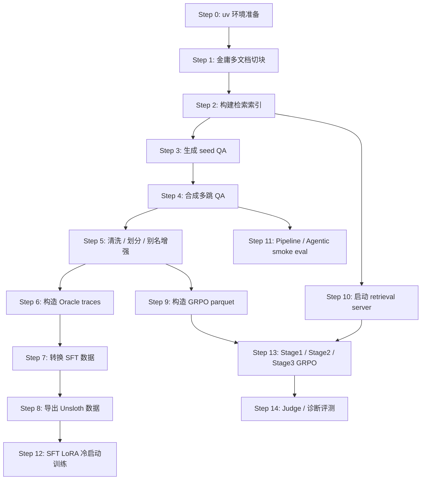

## Step 0: 使用 uv 准备本地环境

**目标**：创建可复现的本地 Python 环境，后续本机数据处理、检索、评测命令默认通过 `uv run python ...` 执行。

**详细说明**：

- 该步骤先进入 `demo` 工程根目录，保证后续相对路径都从同一个目录解析。
- `pyproject.toml` 当前要求 `Python >=3.13`，建议直接用 Python 3.13 创建 `.venv`。
- 本机数据处理、检索和评测依赖来自 `requirements.txt`，用 `uv pip install -r .\requirements.txt` 安装。
- 如果当前 `.venv` 已手动安装 Unsloth、TRL、datasets 等训练栈，后续同步项目时使用 `uv sync --inexact`，避免删除这些额外包。
- Unsloth 训练栈不内置在项目依赖中，Windows CUDA Torch 和 Unsloth Core 安装请按 `docs/环境安装.md` 单独完成。
- 运行 Unsloth 相关训练脚本时，推荐使用 `uv run --no-sync python ...`，避免 `uv run` 自动同步环境时影响手动安装的训练栈。

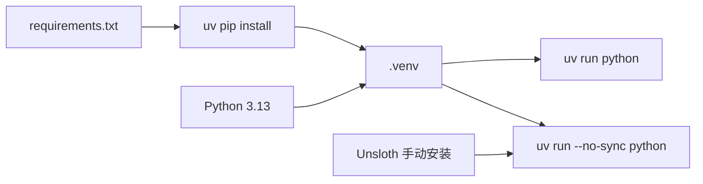

**需要**：

- Windows 11
- PowerShell
- 已安装 `uv`
- Python 3.13
- 当前工作目录为 `E:\AI\AgenticRAG-RL\demo`

**怎么做**：

```powershell
Set-Location E:\AI\AgenticRAG-RL\demo
uv venv .venv --python 3.13
uv pip install -r .\requirements.txt
```

如果已经安装了 Unsloth 训练栈，并且只想同步项目元信息而保留额外包：

```powershell
uv sync --inexact
```

**能拿到的结果**：

- `.venv/` 本地虚拟环境
- 可通过 `uv run python ...` 调用的数据处理、检索和评测依赖
- 可通过 `uv run --no-sync python ...` 调用已手动安装的 Unsloth 训练栈
- 不需要手动执行 `.\.venv\Scripts\Activate.ps1`

**数据结构与字段用途**：

| 产物 | 结构 / 字段 | 含义 | 后续使用位置 |
| --- | --- | --- | --- |
| `.venv/` | Python 虚拟环境目录 | 隔离本机依赖，避免污染全局 Python | 所有 `uv run python ...` 命令 |
| `requirements.txt` | Python 包列表 | 本机数据处理、检索、评测所需依赖 | Step 1 到 Step 11 |
| `pyproject.toml` | 项目元信息与 pytest 配置 | 指定源码路径和测试路径 | Step 11、单元测试 |

## Step 1: 解析金庸系列文本并切块

**目标**：把原始 UTF-8 小说文本转换成统一 corpus 契约，供检索、QA 合成和训练数据构造使用。

**详细说明**：

- `parse_text_corpus.py` 默认读取 `data/original_data/*.txt`，一次解析目录下全部金庸小说文档。
- 脚本先识别章节标题，再在章节内按段落窗口切块，默认 `500` 字符上限、`50` 字符 overlap、最小 `50` 字符。
- 章节标题支持 `一 青衫磊落险峰行`、`第一回 烧饼馅子`、`后记`、`附录 ...`；无章节短篇会按整篇作为一个 section。
- 切分时会保留每个 chunk 在原始 txt 中的行号范围，用于后续人工定位证据。
- 生成 `chunk_id` 时按来源文件使用稳定前缀，例如 `tlbb_0001`、`xkx_0001`、`xajh_0001`、`yttlj_0001`、`yue_0001`。
- 脚本会扫描 chunk 中出现的人物名称，写入 `metadata.character_aliases`。
- 输出的 `corpus.jsonl` 是后续检索、QA 合成、Oracle trace 和评测的共同源数据。

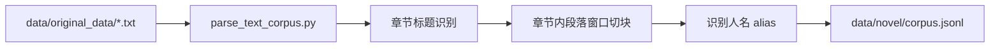

**需要**：

- 输入：`data/original_data/*.txt`
- 脚本：`scripts/parse_text_corpus.py`
- 输出目录：`data/novel/`

**怎么做**：

```powershell
uv run python .\scripts\parse_text_corpus.py `
  --input-dir .\data\original_data `
  --output .\data\novel\corpus.jsonl
```

**能拿到的结果**：

- `data/novel/corpus.jsonl`
- 每条 chunk 包含 `chunk_id/text/title/pages/section/metadata`
- `chunk_id` 形如 `tlbb_0001`
- `title` 形如 `天龙八部`
- `section` 形如 `一 青衫磊落险峰行`
- `metadata` 包含 `source_file/novel_title/author/line_start/line_end/section_index/chunk_index_in_section/section_heading/character_aliases`

**数据结构与字段用途**：

`corpus.jsonl` 每行是一条独立 JSON，结构如下：

```json
{
  "chunk_id": "tlbb_0001",
  "title": "天龙八部",
  "text": "小说原文片段",
  "pages": [],
  "section": "一 青衫磊落险峰行",
  "metadata": {
    "source_file": "金庸-天龙八部.txt",
    "novel_title": "天龙八部",
    "author": "金庸",
    "line_start": 48,
    "line_end": 55,
    "section_index": 1,
    "chunk_index_in_section": 1,
    "section_heading": "一 青衫磊落险峰行",
    "character_aliases": ["乔峰"]
  }
}
```

| 字段 | 含义 | 后续使用位置 |
| --- | --- | --- |
| `chunk_id` | chunk 的稳定唯一 ID，按小说来源使用前缀 | 索引对齐、QA hop 的 `doc_chunk_id`、GRPO `gold_chunks`、hop-aware 评测 |
| `title` | 小说标题，例如 `天龙八部` | 检索结果展示、index bundle、调试证据 |
| `text` | 实际参与检索和作为证据的段落窗口文本 | BM25/FAISS 检索、tool response、Oracle traces、Agentic eval |
| `pages` | txt 语料固定为空数组，用于兼容根项目 PDF corpus 契约 | chunk store、未来 PDF 语料扩展 |
| `section` | 章节或特殊段落标题 | 检索结果展示、人工审查 |
| `metadata.source_file` | 原始文本文件名 | 数据溯源、排查生成错误 |
| `metadata.novel_title` | 小说标题 | 过滤、诊断、展示 |
| `metadata.author` | 作者，当前固定为 `金庸` | 过滤、诊断、展示 |
| `metadata.line_start` | chunk 在原始 txt 中的起始行 | 证据定位、人工审查 |
| `metadata.line_end` | chunk 在原始 txt 中的结束行 | 证据定位、人工审查 |
| `metadata.section_index` | section 在当前文件内的递增序号 | 章节排序、人工审查 |
| `metadata.chunk_index_in_section` | chunk 在当前 section 内的递增序号 | 定位长章节内的片段 |
| `metadata.section_heading` | 原始 section 标题行 | 数据溯源、排查章节识别 |
| `metadata.character_aliases` | 在 chunk 中命中的人物名称或人物别名 | seed QA 生成、查询分解、诊断分析 |

## Step 2: 构建检索索引

**目标**：为 corpus 构建与根项目一致的检索索引，支持 FAISS 语义检索、BM25 关键词检索、KG 图检索和 hybrid 检索。

**详细说明**：

- `build_index.py` 加载 `corpus.jsonl` 后，一次性构建 `faiss.index`、`bm25.pkl`、`chunk_store.pkl` 和 `chunk_ids.json`。
- FAISS 使用 BGE-M3 对每个 chunk 编码，`normalize_embeddings=True`，再写入 `IndexFlatIP`。
- BM25 使用 `jieba` 中文分词和英文/数字正则切分，查询和建库共用同一套 tokenizer。
- 未加 `--skip-kg` 时，脚本会并发调用豆包抽取三元组，构建 `knowledge_graph.json` 和 `entity_embeddings.pkl`；默认最大并发为 `5`，可通过 `--max-concurrency` 调整。
- 构建过程会打印 `build_index.progress`、`index_build.progress`、`index_save.progress` 三类进度日志，覆盖语料加载、BM25 分词、BM25 构建、BGE-M3 embedding、FAISS 写入、KG 抽取、实体 embedding 和索引保存。
- KG 三元组抽取会打印 `kg_extraction.progress completed=.../... failed=...`，长时间运行时可据此判断是否仍在推进。
- KG 抽取会把每个 chunk 的状态逐条追加到 `triples_cache.jsonl`：成功写 `status=ok`，失败写 `status=failed`。重新执行同一命令时只跳过 `ok` 的 chunk，失败和未完成 chunk 会重新请求豆包；最终缓存会按 chunk 顺序重写。
- CrossEncoder reranker 不预构建索引，运行检索服务时通过 `--reranker-model` 加载，对 FAISS/BM25/KG 候选进行精排。
- 当前 `hybrid_search` 主要融合 `keyword_search + semantic/dense_search`；`graph_search` 是独立工具。KG 稳定后可再把 graph candidates 纳入 hybrid RRF 融合。

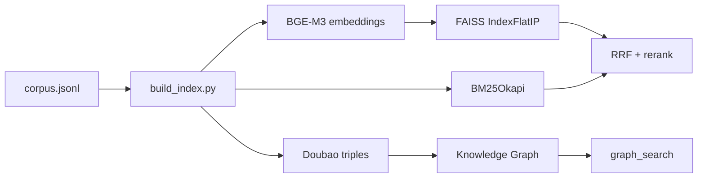

**需要**：

- 输入：`data/novel/corpus.jsonl`
- 脚本：`scripts/build_index.py`
- 输出目录：`data/novel/indexes/`
- 本地 embedding 模型：`models/bge-m3`
- 可选 reranker 模型：`models/bge-reranker-v2-m3`

**怎么做**：

如果本地还没有 BGE 模型，先下载：

```powershell
uv run hf download BAAI/bge-m3 --local-dir .\models\bge-m3
uv run hf download BAAI/bge-reranker-v2-m3 --local-dir .\models\bge-reranker-v2-m3
```

然后构建索引：

```powershell
uv run python .\scripts\build_index.py `
  --corpus .\data\novel\corpus.jsonl `
  --index-dir .\data\novel\indexes `
  --embedding-model .\models\bge-m3 `
  --reranker-model .\models\bge-reranker-v2-m3 `
  --max-concurrency 5 `
  --skip-kg
```

去掉 `--skip-kg` 会启用知识图谱构建，需要 `.env` 中配置在线模型供应商的 API Key。`--max-concurrency` 控制同时发起的在线 LLM 三元组抽取请求数；如果遇到接口限流、网络不稳定或失败数上升，可以先降到 `1` 或 `2`。

如果使用 NewAPI 在线模型抽取 KG 三元组，设置 `NEWAPI_API_KEY` 后执行：

```powershell
uv run python .\scripts\build_index.py `
  --corpus .\data\novel\corpus.jsonl `
  --index-dir .\data\novel\indexes `
  --embedding-model .\models\bge-m3 `
  --reranker-model .\models\bge-reranker-v2-m3 `
  --llm-provider newapi `
  --kg-model gpt-5.5 `
  --max-concurrency 5
```

NewAPI 只支持在线 OpenAI-compatible 请求，不支持 `--use-batch-inference`。

如果使用 RightCode 在线模型抽取 KG 三元组，设置 `RIGHTCODE_API_KEY` 后执行：

```powershell
uv run python .\scripts\build_index.py `
  --corpus .\data\novel\corpus.jsonl `
  --index-dir .\data\novel\indexes `
  --embedding-model .\models\bge-m3 `
  --reranker-model .\models\bge-reranker-v2-m3 `
  --llm-provider rightcode `
  --kg-model gpt-5.5 `
  --max-concurrency 5
```

RightCode 只支持在线 OpenAI-compatible 请求，不支持 `--use-batch-inference`。

如果使用 Doubao 批量推理任务抽取 KG 三元组，去掉 `--skip-kg` 并添加 `--use-batch-inference`：

```powershell
uv run python .\scripts\build_index.py `
  --corpus .\data\novel\corpus.jsonl `
  --index-dir .\data\novel\indexes `
  --embedding-model .\models\bge-m3 `
  --reranker-model .\models\bge-reranker-v2-m3 `
  --use-batch-inference
```

批量模式不是在线并发请求，`--max-concurrency` 只影响非批量 KG 抽取。批量模式下每个 pending chunk 会写成一条 Batch Job 请求，由火山方舟调度执行；原始请求和响应备份默认保存到 `data/batch_jobs/kg/`，脚本解析后回填 `data/novel/indexes/triples_cache.jsonl` 并继续生成 KG 索引产物。`--use-batch-inference` 仅支持 `--llm-provider doubao`。

### 在线模型供应商选择

当前在线大模型业务支持三个 provider：

| Provider | 接口 | API Key | 默认模型 | 是否支持 Batch Job |
| --- | --- | --- | --- | --- |
| `doubao` | 火山方舟 OpenAI-compatible | `ARK_API_KEY` | `doubao-seed-2-0-pro-260215` | 支持 |
| `newapi` | `https://api.6i2.com/v1` OpenAI-compatible | `NEWAPI_API_KEY` | `gpt-5.5` | 不支持 |
| `rightcode` | `https://api.right.codes/v1` OpenAI-compatible | `RIGHTCODE_API_KEY` | `gpt-5.5` | 不支持 |

可通过命令行选择 provider 和模型：

| 业务 | provider 参数 | 模型参数 |
| --- | --- | --- |
| Step 2 KG 三元组抽取 | `--llm-provider newapi` | `--kg-model gpt-5.5` |
| Step 3 seed QA 生成 | `--llm-provider newapi` | `--model gpt-5.5` |
| Step 4 多跳 QA 合并 + 质量门禁 | `--llm-provider newapi` | `--merge-model gpt-5.5 --judge-model gpt-5.5` |
| LLM-as-Judge | `--llm-provider newapi` | `--judge-model gpt-5.5` |
| Step 2 KG 三元组抽取 | `--llm-provider rightcode` | `--kg-model gpt-5.5` |
| Step 3 seed QA 生成 | `--llm-provider rightcode` | `--model gpt-5.5` |
| Step 4 多跳 QA 合并 + 质量门禁 | `--llm-provider rightcode` | `--merge-model gpt-5.5 --judge-model gpt-5.5` |
| LLM-as-Judge | `--llm-provider rightcode` | `--judge-model gpt-5.5` |

也可以在 `.env` 中配置默认值：

```text
NEWAPI_API_KEY=...
NEWAPI_BASE_URL=https://api.6i2.com/v1
NEWAPI_MODEL=gpt-5.5
NEWAPI_KG_MODEL=gpt-5.5
NEWAPI_THINKING_MODEL=gpt-5.5
NEWAPI_JUDGE_MODEL=gpt-5.5
RIGHTCODE_API_KEY=...
RIGHTCODE_BASE_URL=https://api.right.codes/v1
RIGHTCODE_MODEL=gpt-5.5
RIGHTCODE_KG_MODEL=gpt-5.5
RIGHTCODE_THINKING_MODEL=gpt-5.5
RIGHTCODE_JUDGE_MODEL=gpt-5.5
```

### Doubao 批量推理任务通用说明

当前工程使用火山方舟[批量推理任务](https://www.volcengine.com/docs/82379/1399517?lang=zh)：脚本会生成请求 JSONL，上传到 TOS，创建 Batch Job，轮询任务状态，完成后下载 `results.jsonl/errors.jsonl`。下载后的原始请求和原始响应会作为可追溯备份保存在 `data/batch_jobs/...`；业务脚本会继续解析这些原始结果，并写入各步骤真正消费的业务执行产物。

启用前需要在 `.env` 中配置火山引擎 AK/SK 和 TOS 存储桶：

```text
DOUBAO_USE_BATCH_INFERENCE=1
VOLC_ACCESSKEY=...
VOLC_SECRETKEY=...
TOS_BUCKET=你的存储桶
TOS_ENDPOINT=tos-cn-beijing.volces.com
TOS_REGION=cn-beijing
DOUBAO_BATCH_INPUT_PREFIX=agentic-rag-rl/batch/input/
DOUBAO_BATCH_OUTPUT_PREFIX=agentic-rag-rl/batch/output/
DOUBAO_BATCH_PROJECT_NAME=default
DOUBAO_BATCH_COMPLETION_WINDOW=1d
```

如需显式指定基础模型和版本，可加：

```powershell
--batch-foundation-model doubao-seed-2-0-pro `
--batch-model-version 260215
```

支持同一开关的业务脚本包括：

| 业务 | 脚本 | 开启方式 |
| --- | --- | --- |
| Step 2 KG 三元组抽取 | `scripts/build_index.py` | `--use-batch-inference` |
| Step 3 seed QA 生成 | `scripts/gen_seed_qa.py` | `--use-batch-inference` |
| Step 4 多跳 QA 合并 | `scripts/domain_multihop_synthesis.py` | `--use-batch-inference` |
| LLM-as-Judge | `scripts/run_llm_judge.py` | `--use-batch-inference` |

批量推理任务不是在线并发请求，`--max-concurrency` 只影响非批量模式。批量模式的吞吐由火山方舟 Batch Job 调度决定；本地脚本通过 `--batch-poll-interval` 控制轮询间隔，通过 `--batch-wait-timeout` 控制最长等待时间。

**Batch Job 原始备份与业务执行产物的关系**：

`data/batch_jobs/...` 只保存 Batch Job 的原始请求和原始响应备份，默认包含 `requests.jsonl`、`results.jsonl`、`errors.jsonl`。这些文件用于追溯、排错和成本核对，不是后续训练、检索或评测直接消费的主文件。脚本会解析 `results.jsonl/errors.jsonl`，再转换或回填为本步骤的业务执行产物；如果手动传入 `--batch-work-dir`，原始备份目录以该参数为准。

| 业务 | Batch Job 原始备份目录 | 原始备份文件 | 业务执行产物 | 后续用途 |
| --- | --- | --- | --- | --- |
| Step 2 KG 三元组抽取 | `data/batch_jobs/kg/` | `requests.jsonl`、`results.jsonl`、`errors.jsonl` | `data/novel/indexes/triples_cache.jsonl`、`knowledge_graph.json`、`entity_embeddings.pkl` | 构建 KG 索引和图检索 |
| Step 3 seed QA 生成 | `data/batch_jobs/seed_qa/` | `requests.jsonl`、`results.jsonl`、`errors.jsonl` | `data/novel_eval/seeds.jsonl`、`seeds.checkpoint.jsonl`、`seeds.failed.jsonl` | Step 4 输入和 seed 审计 |
| Step 4 多跳 QA 合并 | `data/batch_jobs/multihop_merge/` | `requests.jsonl`、`results.jsonl`、`errors.jsonl` | `data/novel_eval/qa_pairs.jsonl`、`qa_pairs.checkpoint.jsonl`、`qa_pairs.failed.jsonl`、`qa_pairs.rejected.jsonl` | SFT、GRPO 和 eval 基础 QA |
| LLM-as-Judge | `data/batch_jobs/llm_judge/` | `requests.jsonl`、`results.jsonl`、`errors.jsonl` | `--output` 指定的 judged JSON，以及对应 `*_judged.checkpoint.jsonl` | 评测报告和诊断分析 |

**怎么看 Batch Job 执行状态和进度**：

本地脚本创建批量任务后会按固定间隔轮询任务状态，默认每 `60` 秒查询一次。日志中重点看 `batch_job.poll`：

```text
batch_job.start request_count=7898 job_name=agentic-rag-kg bucket=... input_key=... output_prefix=...
batch_job.poll job_id=bi-... phase=Running counts=... message=...
batch_job.poll job_id=bi-... phase=Completed counts=... message=...
batch_job.completed job_id=bi-... status=...
batch_job.results_loaded job_id=bi-... result_count=...
```

字段含义：

| 字段 | 含义 |
| --- | --- |
| `job_id` | 火山方舟批量推理任务 ID，可在控制台中搜索 |
| `phase` | 当前任务状态，例如排队、运行、完成或失败 |
| `counts` | 方舟返回的请求统计，如果接口返回该字段，会包含请求总数、成功数、失败数等 |
| `input_key` | 上传到 TOS 的请求 JSONL 文件路径 |
| `output_prefix` | 方舟写回结果文件的 TOS 前缀 |

如果想降低查询频率，可以加：

```powershell
--batch-poll-interval 300
```

这表示每 `300` 秒查询一次任务状态。任务完成后，脚本会从 TOS 下载原始响应备份：

```text
results.jsonl
errors.jsonl
```

默认原始备份目录如下：

| 业务 | 默认本地目录 |
| --- | --- |
| Step 2 KG 三元组抽取 | `data/batch_jobs/kg/` |
| Step 3 seed QA 生成 | `data/batch_jobs/seed_qa/` |
| Step 4 多跳 QA 合并 | `data/batch_jobs/multihop_merge/` |
| LLM-as-Judge | `data/batch_jobs/llm_judge/` |

也可以进入火山方舟控制台的批量推理任务页面，用日志中的 `job_id` 查询任务详情。控制台通常能看到更完整的任务状态、失败原因、输入 TOS 路径、输出 TOS 路径和请求统计。

构建时应能看到类似日志：

```text
build_index.progress stage=load_corpus_start corpus=...
index_build.progress stage=bm25_tokenize_progress completed=840/8411
index_build.progress stage=embedding_encode_start model=...
index_build.progress stage=faiss_build_done ntotal=8411
kg_extraction.progress completed=12/8193 failed=0 chunk_id=...
index_save.progress stage=done output_dir=...
```

**能拿到的结果**：

- `data/novel/indexes/manifest.json`
- `data/novel/indexes/faiss.index`
- `data/novel/indexes/bm25.pkl`
- `data/novel/indexes/chunk_ids.json`
- `data/novel/indexes/chunk_store.pkl`
- `data/novel/indexes/knowledge_graph.json`
- `data/novel/indexes/entity_embeddings.pkl`
- `data/novel/indexes/triples_cache.jsonl`
- `data/batch_jobs/kg/requests.jsonl`、`results.jsonl`、`errors.jsonl`，仅使用 Doubao 批量推理任务时产生，属于 Batch Job 原始备份 / 可追溯文件
- 后续检索服务和评测可加载 corpus 或索引产物；正式三路检索应优先加载索引产物

**数据结构与字段用途**：

| 产物 | 结构 / 字段 | 含义 | 后续使用位置 |
| --- | --- | --- | --- |
| `manifest.json` | `chunk_count/index_type/embedding_model` 等摘要 | 记录索引规模和类型 | 检查索引是否与 corpus 对齐 |
| `faiss.index` | BGE-M3 向量的 `IndexFlatIP` | 语义检索 | `semantic_search`、`hybrid_search` |
| `bm25.pkl` | `BM25Okapi` 对象 | 关键词检索 | `keyword_search`、`hybrid_search` |
| `chunk_ids.json` | 与 FAISS 行号对齐的 chunk ID 列表 | FAISS row id 到 chunk id 的映射 | 检索结果回填 |
| `chunk_store.pkl` | `chunk_id -> chunk record` | 存储检索返回所需文本和 metadata | retrieval server、Agentic evidence |
| `knowledge_graph.json` | NetworkX node-link JSON | 实体关系图 | `graph_search` |
| `entity_embeddings.pkl` | 实体名、实体行号和实体向量 | query 到图实体的语义匹配 | `graph_search` |
| `triples_cache.jsonl` | 每行一条 `chunk_id/status/triples` checkpoint | 避免重复调用 LLM 抽取三元组；失败 chunk 下次自动重试 | 重建 KG |

检索工具边界要分清：`keyword_search` 走 BM25，`semantic_search`/`dense_search` 走 FAISS，`graph_search` 走 KG，`hybrid_search` 当前是关键词和语义候选的融合重排工具，不等同于三路索引自动融合。

## Step 3: 生成小说域 seed QA

**目标**：对齐根项目“种子 QA 生成”流程，从每个小说 corpus chunk 中抽取原子化、可验证、唯一答案的单跳 QA。Seed QA 是后续逐跳扩展、多跳合成、Oracle trace、SFT 和 GRPO 的最小事实单元，因此质量优先级高于数量。

**核心原则**：

- 每条 seed QA 只绑定一个 `doc_chunk_id`，答案必须能从该 chunk 中获得。
- 每条 seed QA 只表达一个不可拆分事实，不能把多个动作、多个物品、多个原因或多个关系并入同一个答案。
- 问题必须具体到能定位唯一答案，避免“他 / 她 / 这个人 / 那件事”等脱离上下文后无法解析的指代。
- 答案必须短、明确、可验证；不接受主观判断、抽象感悟、长段解释和多原因概括。
- 如果片段出现明确时间、年代、季节、上学阶段或事件阶段，问题必须写入该限定；如果片段没有明确时间或阶段，不能编造。
- 生成后的 seed 还需要经过质量过滤和答案精炼；仅靠 prompt 约束不能视为正式质量验收。

**生成流程**：

```text
Step 1: 读取 corpus chunk
        每个 chunk 独立处理，不能跨 chunk 引入事实

Step 2: 调用 LLM 生成候选 seed QA
        每个 chunk 默认最多生成 2 条
        LLM 只输出 JSON 数组，不输出解释文本

Step 3: 规范化字段
        保留 question / answer / qa_type / entities
        补充 doc_chunk_id 和 tool=keyword_search
        将旧 qa_type 映射到小说域 5 类

Step 4: 首轮质量过滤
        过滤答案泄露、复合答案、过长答案、指代不清和重复问题
        答案可验证性在质量审计和后续多跳验证中继续复查

Step 5: 答案精炼
        将冗长答案压缩成最短事实表达
        不补充原文没有的新信息

Step 6: 写入 seeds.jsonl
        作为可复查的 seed QA 结果

Step 7: 可选离线复洗
        clean_seed_qa.py 读取 seeds.jsonl，输出 seeds_clean.jsonl 和 seeds_dropped.jsonl
        Step 4 多跳合成默认使用 seeds_clean.jsonl
```

**当前脚本行为**：

- `gen_seed_qa.py` 逐条读取 `data/novel/corpus.jsonl`，并把每个 chunk 文本发送给豆包模型生成 seed QA。
- 默认模型为 `doubao-seed-2-0-pro-260215`，对应 Doubao-Seed-2.0 Pro，默认每个 chunk 最多生成 2 条 seed。
- 默认并发数为 `5`，可通过 `--max-concurrency` 调整；每完成一个 chunk 就重写 `seeds.jsonl`，并保证输出按 corpus chunk 顺序排列。
- 并发生成会打印 `seed_qa_generation.chunk_done ... progress=.../... failed=...`，用于观察请求进度和失败数。
- 模型输出必须是 JSON 数组，元素字段为 `question/answer/qa_type/entities`。
- 脚本会补充 `doc_chunk_id` 和默认检索工具 `keyword_search`。
- 脚本会把旧类型映射到小说域 5 类，例如 `character_relation -> relation`、`object_reference -> object`、`character_behavior -> action_result`。
- 脚本默认启用断点续写：`seeds.checkpoint.jsonl` 记录每个 chunk 的 `status=ok/failed`；重新执行同一命令时只跳过 `ok` 的 chunk，失败和未完成 chunk 会重新请求豆包。
- 如果豆包返回非法 JSON 或单个 chunk 多次失败，脚本默认把失败 chunk 写入 `seeds.failed.jsonl` 并继续后续 chunk，避免整个任务中断。
- 再次执行同一命令时，脚本会从第一条 corpus chunk 开始逐条校验；失败 chunk 成功后会插入回 `seeds.jsonl` 对应的 corpus 顺序位置，而不是追加到文件末尾。
- 如果要清空旧结果重新生成，需要显式添加 `--overwrite`。
- 当前脚本已经实现 prompt 约束、字段规范化、类型收敛、首轮质量过滤和答案精炼；正式训练前建议再执行 `clean_seed_qa.py` 复洗，并审计 `seeds_dropped.jsonl`。

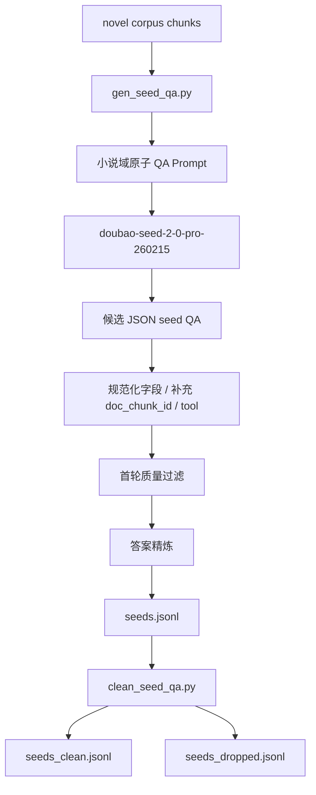

**需要**：

- 输入：`data/novel/corpus.jsonl`
- 脚本：`scripts/gen_seed_qa.py`
- 清洗脚本：`scripts/clean_seed_qa.py`
- 环境文件：复制 `.env.example` 为 `.env`，填写所选供应商 API Key
- 默认 Provider：`doubao`，也可用 `--llm-provider newapi` 或 `--llm-provider rightcode`
- 默认模型：Doubao 使用 `doubao-seed-2-0-pro-260215`，NewAPI 使用 `gpt-5.5`，RightCode 使用 `gpt-5.5`
- 默认最大并发：`5`
- 默认 Base URL：`https://ark.cn-beijing.volces.com/api/v3`
- 输出：`data/novel_eval/seeds.jsonl`

**怎么做**：

```powershell
uv run python .\scripts\gen_seed_qa.py `
  --corpus .\data\novel\corpus.jsonl `
  --output .\data\novel_eval\seeds.jsonl `
  --max-concurrency 5
```

失败后继续执行同一条命令即可续写；如果确认要从头生成，执行：

```powershell
uv run python .\scripts\gen_seed_qa.py `
  --corpus .\data\novel\corpus.jsonl `
  --output .\data\novel_eval\seeds.jsonl `
  --overwrite
```

`--max-concurrency` 控制同时发起的豆包请求数。默认值是 `5`；如果遇到接口限流、网络不稳定或失败数上升，可以先降到 `1` 或 `2`。

如果使用 NewAPI 在线模型生成 seed QA：

```powershell
uv run python .\scripts\gen_seed_qa.py `
  --corpus .\data\novel\corpus.jsonl `
  --output .\data\novel_eval\seeds.jsonl `
  --llm-provider newapi `
  --model gpt-5.5 `
  --max-concurrency 5
```

如果使用 RightCode 在线模型生成 seed QA：

```powershell
uv run python .\scripts\gen_seed_qa.py `
  --corpus .\data\novel\corpus.jsonl `
  --output .\data\novel_eval\seeds.jsonl `
  --llm-provider rightcode `
  --model gpt-5.5 `
  --max-concurrency 5
```

如果使用 Doubao 批量推理任务生成 seed QA，添加 `--use-batch-inference`，不需要设置 `--max-concurrency`：

```powershell
uv run python .\scripts\gen_seed_qa.py `
  --corpus .\data\novel\corpus.jsonl `
  --output .\data\novel_eval\seeds.jsonl `
  --use-batch-inference
```

批量模式下，每个 pending chunk 会写成一条 Batch Job 请求。任务完成后脚本会把原始请求和响应备份到 `data/batch_jobs/seed_qa/requests.jsonl`、`results.jsonl`、`errors.jsonl`，再解析模型输出，并按 corpus chunk 顺序回填业务执行产物 `data/novel_eval/seeds.jsonl`、`seeds.checkpoint.jsonl` 和 `seeds.failed.jsonl`。`seeds.jsonl` 是后续 Step 4 使用的 seed QA 主文件，不是 Batch Job 原始响应文件。

生成后执行离线复洗，产出 Step 4 默认使用的 `seeds_clean.jsonl`：

```powershell
uv run python .\scripts\clean_seed_qa.py `
  --input .\data\novel_eval\seeds.jsonl `
  --corpus .\data\novel\corpus.jsonl `
  --output .\data\novel_eval\seeds_clean.jsonl `
  --dropped-output .\data\novel_eval\seeds_dropped.jsonl
```

**能拿到的结果**：

- `data/novel_eval/seeds.jsonl`
- `data/novel_eval/seeds.checkpoint.jsonl`
- `data/novel_eval/seeds_clean.jsonl`
- `data/novel_eval/seeds_dropped.jsonl`
- `data/novel_eval/seeds.failed.jsonl`，仅当部分 chunk 多次失败时产生
- `data/batch_jobs/seed_qa/requests.jsonl`、`results.jsonl`、`errors.jsonl`，仅使用 Doubao 批量推理任务时产生，属于 Batch Job 原始备份 / 可追溯文件
- 每条 seed 包含 `question/answer/doc_chunk_id/tool/entities/qa_type`
- 每条 seed 的 `question/answer/qa_type/entities` 来自豆包模型，`doc_chunk_id/tool` 由脚本补齐
- 正式训练建议使用经过质量过滤和答案精炼后的 seed 数据，而不是直接把未清洗候选 seed 进入多跳合成

**数据结构与字段用途**：

| 字段 | 含义 | 后续使用位置 |
| --- | --- | --- |
| `question` | 单跳基础问题 | 多跳 QA 的 hop question |
| `answer` | 单跳答案 | 多跳 QA 的 hop answer、answer aliases 来源 |
| `doc_chunk_id` | 支撑该 seed 的证据 chunk | `hops[].doc_chunk_id`、Oracle trace 检索目标 |
| `tool` | 默认检索工具，如 `keyword_search` | Oracle trace 工具调用 |
| `entities` | 问答中涉及的人物 / 地点 | 多跳组合、查询分解 |
| `qa_type` | Seed QA 类型，只允许 `character/place/object/relation/action_result` | 分层统计、诊断评测、多跳 hop 类型 |

**小说域 Prompt 核心要求**：

| 约束 | 小说域标准 |
| --- | --- |
| 原子性 | 每个 QA 只包含一个不可拆分事实，不能把多个动作、多个原因、多个关系并列在同一个答案里 |
| 可验证性 | 答案必须直接来自片段，且属于人物名、地点名、物品名、明确关系或明确行为结果之一 |
| 时间 / 阶段明确性 | 片段出现明确时间、年代、季节、上学阶段或事件阶段时，问题必须写入；片段没有则不强制、不编造 |
| 唯一答案 | 问题必须足够具体，使片段中只有一个明确答案，避免“他/她/这个人”等指代不清 |
| 类型收敛 | `qa_type` 只使用 `character/place/object/relation/action_result`，避免过细分类造成模型乱分桶 |

**质量过滤标准**：

| 检查项 | 过滤规则 |
| --- | --- |
| 字段完整 | 必须包含 `question/answer/doc_chunk_id/tool/entities/qa_type` |
| chunk 可用 | `doc_chunk_id` 必须存在于 `data/novel/corpus.jsonl` |
| 答案可验证 | `answer` 应能从对应 chunk 直接获得；关系类和行为结果类允许轻度归纳，但必须可由 chunk 明确支持 |
| 答案不泄露 | `answer` 不能直接出现在 `question` 中，例如“郝红梅的名字叫什么？ -> 郝红梅”应过滤 |
| 答案短化 | `answer` 默认应为短文本；过长答案、完整句子和大段解释应过滤或精炼 |
| 原子性 | `answer` 不能包含多个并列事实；包含“、/和/或/以及/；”的答案需要重点审查 |
| 问题明确 | `question` 不能依赖“他/她/这个人/那位”等上下文外指代 |
| 问题自然 | `question` 不能出现“根据文档/根据片段/上文提到”等查表痕迹 |
| 类型合法 | `qa_type` 必须属于 `character/place/object/relation/action_result` |
| 去重 | 按 `question`、`question+answer` 和 `doc_chunk_id+question` 去重 |
| entities 规范 | `entities` 必须是字符串列表，不能把多个实体塞进一个逗号分隔字符串 |

**答案精炼标准**：

- 只保留问题所需的最小答案片段。
- 不添加原文没有的新信息。
- 复合物品或多个动作如果不可避免，应优先拆成多个 seed QA。
- 关系类答案应精炼为短关系词，例如 `父女`、`姐夫和小舅子`。
- 行为结果类答案应精炼为短动作或短结果，例如 `借书`、`被老师没收`、`去县城`。
- 过长原因解释应改写为更具体的事实问题，或直接过滤。

**质量验收建议**：

生成 `seeds.jsonl` 后，至少检查以下统计：

```text
JSON 解析错误数
缺字段样本数
doc_chunk_id 不存在样本数
qa_type 非法样本数
answer 出现在 question 中的样本数
answer 过长样本数
疑似复合 answer 样本数
重复 question / question+answer 数
entities 格式异常样本数
```

只有当上述问题降到可接受范围后，才建议进入 Step 4 多跳合成。

## Step 4: 合成多跳 QA

**目标**：模仿原项目 AgenticRAGTracer 的“自底向上逐跳扩展”流程，从单跳 seed QA 出发，经检索候选、候选 QA 选择、merge prompt 合并和质量验证，生成适合 SFT / GRPO / eval 使用的 2-hop / 3-hop 小说阅读问答样本。

**核心原则**：

- 多跳样本不是把几个单跳问题机械拼接，而是把 `N-hop 链 + 新 QA` 合并为一个自然的 `(N+1)-hop final_question`。
- 每扩展一跳都必须保留完整 `hops[]`，包括 `question/answer/doc_chunk_id/qa_type/search_tools`。
- 最终问题必须让模型通过多轮检索收集证据才能回答，不能把中间答案直接写进问题里。
- 合并后的 `final_answer` 在当前 v1 流程中强制等于最后一跳短答案，避免组合答案和偏离 gold hop。
- 结构清洗只能证明字段和 chunk 引用有效，不能替代语义级四重验证。

**逐跳扩展流程**：

```text
Step 1: 选择一个 seed QA 作为 hop1
        要求 seed answer 是短文本，且绑定唯一 doc_chunk_id

Step 2: 基于当前链路检索候选 chunk
        主查询优先使用当前链路问题或当前 hop.question
        辅查询使用当前 hop.answer 做实体线索检索
        跳过已经在当前链路中使用过的 doc_chunk_id

Step 3: 从候选 chunk 中选择可接续的 seed QA 作为下一跳
        新 hop 必须来自新的 doc_chunk_id
        新 hop 的 qa_type 继续使用 seed QA 的 5 类类型
        只接受答案/实体桥接链，或同一目标多证据链
        拒绝只靠泛词、类别、题材、字数或表面联想连接的链
        记录候选 chunk 被哪些检索工具命中到 search_tools

Step 4: 使用 merge prompt 合并 N-hop 链和新 QA
        输出 final_question / final_answer / qa_type / answer_aliases
        final_question 必须自然、无合成痕迹、无中间答案泄露
        final_answer 必须等于最后一跳 answer

Step 5: 对候选多跳样本做质量验证
        规则检查：字段、hop 数、chunk 引用、当前 seed 成员、答案长度、别名数量
        LLM Judge：链路是否合理，是否存在虚假关联、简单拼接或单跳退化
        不通过样本写入 qa_pairs.rejected.jsonl，不进入 qa_pairs.jsonl

Step 6: 通过规则门禁和 LLM 语义门禁后写入 qa_pairs.jsonl
        保留 final_question/final_answer/hop_count/qa_type/subset/hops/answer_aliases
```

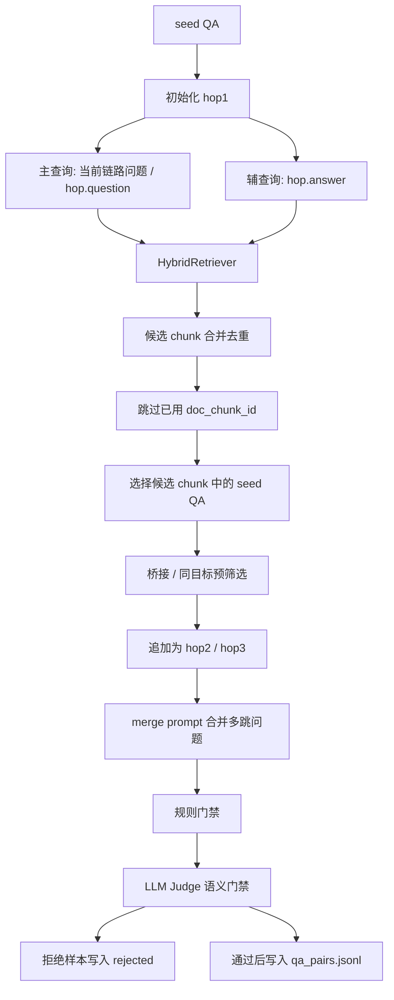

**小说域适配**：

| 环节 | 原项目金融域思路 | 小说域实现 / 要求 |
| --- | --- | --- |
| seed QA | 从年报 chunk 抽取原子事实 | 从小说段落抽取人物、地点、物品、关系、行为结果 |
| 答案类型 | 数字、日期、唯一实体名 | 人物名、地点名、物品名、明确关系、明确行为结果 |
| 检索 query | 上一跳 answer 或 final_question | 主查询用问题语义，辅查询用答案实体线索 |
| 候选选择 | 从检索 chunk 生成或选择新 QA | 优先选择已有 seed QA，避免重新生成不可控答案 |
| 合并模型 | 强模型 merge | 默认 `doubao-seed-2-0-pro-260215` 做自然问题合并 |
| 多跳类型 | inference / comparison | 当前小说域主流程固定为 `inference` |
| 质量风险 | 数字查表、虚假跨公司关联 | 指代不清、答案泄露、剧情常识猜中、机械拼接 |

**当前脚本行为**：

- `domain_multihop_synthesis.py` 默认加载 `seeds_clean.jsonl` 和 `corpus.jsonl`，并在内存中创建 `HybridRetriever`。
- 每条 seed QA 会先作为 `hop1`；扩展下一跳时，主查询使用当前 hop 的 `question`，辅查询使用当前 hop 的 `answer`。
- 检索结果会合并去重，并跳过已经使用过的 `doc_chunk_id`；下一跳必须和当前链路形成答案/实体桥接，或属于同一目标的多证据链。
- 多跳合并默认使用 `doubao-seed-2-0-pro-260215`，生成 `final_question/final_answer/qa_type/answer_aliases`；当前 v1 强制 `final_answer` 等于最后一跳 `answer`。
- `--quality-gate` 默认是 `llm`：先做规则门禁，再调用同一 provider 的 Judge 模型做语义和多跳必要性审查；只想做低成本硬规则检查时可设为 `rules`。
- `--judge-model` 默认跟随 `--merge-model`；如果显式传入，则用于 Step 4 生成后的 LLM 语义门禁。
- `--rank-model` 默认跟随 `--judge-model`；当同一候选组内有多条样本通过门禁时，用于选择最优样本。
- 被规则门禁或 Judge 拒绝的候选样本不会写入 `qa_pairs.jsonl`，会写入 `qa_pairs.rejected.jsonl`，包含 `chain_key/stage/problem_codes/final_question/hops` 等追踪字段。
- `--candidate-multiplier N` 控制每个输出槽位最多生成 N 条候选；`llm` 模式默认 `5`，`rules` 模式默认 `10`。
- 正数倍率模式下，`--target-count 50 --candidate-multiplier 5` 表示最多处理 50 个候选组，每组最多 5 条候选，每组最多写入 1 条最终 QA；如果某组没有候选通过门禁，会直接放弃该组，所以最终输出可能小于 50。
- 在线模式可设置 `--candidate-multiplier -1` 使用旧补样语义：持续尝试候选，直到通过样本达到 `--target-count` 或候选耗尽；`--use-batch-inference` 不支持 `-1`。
- LLM 合并默认最大并发数为 `5`，可通过 `--max-concurrency` 调整；正数倍率模式下并发发生在同一候选组内。
- LLM 合并会打印 `multihop_synthesis.group_added` / `multihop_synthesis.appended`，显示候选组、已写入样本、失败数和拒绝数。
- 使用真实 LLM merge 时，合并失败的链路会写入 `qa_pairs.failed.jsonl` 和 `qa_pairs.checkpoint.jsonl` 的 `status=failed` 记录；重新执行同一命令时，失败链路不会被当作已完成，会重新尝试生成。
- 如果只想本机离线 smoke，可以加 `--disable-llm-merge --quality-gate rules`，此时会回退到规则模板合并；严格规则可能拒绝模板题，该模式只适合连通性测试，不适合作为正式训练数据。
- 每个 hop 都保留 `question/answer/doc_chunk_id/qa_type/search_tools`，其中 hop 级 `qa_type` 继承 seed QA 的 5 类类型。
- `--target-count` 在正数倍率模式下控制候选组数量，在 `--candidate-multiplier -1` 模式下控制目标通过样本数量。
- 脚本默认启用断点续写：如果 `qa_pairs.jsonl` 已存在，会读取已有样本数量和 hop 链路签名，只处理剩余槽位，并跳过已经生成过的链路。
- 如果要清空旧结果重新合成，需要显式添加 `--overwrite`。

**正式数据质量门槛**：

| 检查项 | 必须满足的条件 |
| --- | --- |
| 字段完整性 | 每条样本包含 `final_question/final_answer/hop_count/qa_type/subset/hops/answer_aliases` |
| hop 数 | `hop_count >= 2`，且 `hop_count == len(hops)` |
| hop 顺序 | `hop_idx` 从 1 连续递增 |
| chunk 可用性 | 每个 `doc_chunk_id` 必须存在于 `data/novel/corpus.jsonl` |
| chunk 去重 | 同一条多跳链内不重复使用同一个 `doc_chunk_id` |
| seed 成员 | 每个 hop 的 `doc_chunk_id/question/answer` 必须仍存在于当前 `seeds_clean.jsonl` |
| 顶层类型 | 多跳样本 `qa_type` 固定为 `inference` |
| hop 类型 | hop 级 `qa_type` 只能是 `character/place/object/relation/action_result` |
| 自然性 | `final_question` 不能出现“第1步 / 第2步 / hop / 逐步检索 / 最终答案是什么”等合成痕迹 |
| 无泄露 | `final_question` 不能直接包含中间 hop answer 或最终答案 |
| 多跳必要性 | 不能退化成只看最后一跳即可回答的单跳题 |
| 答案短化 | `final_answer` 必须等于最后一跳 `answer`，且应为短答案；拒绝长段解释、编号列表和多个事实并列 |
| 别名约束 | `answer_aliases` 给出 1-3 个短别名，必须包含 `final_answer`，不能重复，不能引入冲突事实 |

**四重验证目标**：

根项目要求逐跳扩展后的候选样本全部通过四重验证才进入最终 QA。小说域也应保留同一验收思想：

| 验证 | 目的 | 小说域判断标准 |
| --- | --- | --- |
| 语义检查 | 判断多跳逻辑是否合理 | 问题读起来自然，hop 间存在真实剧情、人物、地点或事件依赖 |
| 纯推理不可答 | 确保不能只靠模型常识回答 | 不给文档时，LLM 不应稳定答对 `final_answer` |
| 单文档不可答 | 确保需要多跳证据 | 任意单个 gold chunk 都不足以回答完整 `final_question` |
| 全文档可答 | 确保问题本身可回答 | 给出所有 gold chunks 时，LLM 能得到与 `final_answer/answer_aliases` 等价的答案 |

当前 `domain_multihop_synthesis.py` 默认在写入前执行规则门禁和 LLM Judge 语义门禁，拒绝样本会进入 `qa_pairs.rejected.jsonl` 便于追溯。`clean_synthesis.py` 仍只做 hop 数和 `doc_chunk_id` 有效性清洗，不能替代 Step 4 的语义级质量门禁。

**需要**：

- 输入：`data/novel_eval/seeds_clean.jsonl`
- 输入：`data/novel/corpus.jsonl`
- 脚本：`scripts/domain_multihop_synthesis.py`
- 环境文件：`.env` 中填写所选供应商 API Key
- 默认 Provider：`doubao`，也可用 `--llm-provider newapi` 或 `--llm-provider rightcode`
- 默认合并模型：Doubao 使用 `doubao-seed-2-0-pro-260215`，NewAPI 使用 `gpt-5.5`，RightCode 使用 `gpt-5.5`
- 默认质量门禁：`--quality-gate llm`，先规则过滤，再调用 `--judge-model` 做语义审查
- 默认候选倍率：LLM 门禁模式下 `--candidate-multiplier 5`，即每个输出槽位最多 5 条候选
- 默认最大并发：`5`
- 输出：`data/novel_eval/qa_pairs.jsonl`
- 拒绝样本输出：`data/novel_eval/qa_pairs.rejected.jsonl`

**怎么做**：

```powershell
uv run python .\scripts\domain_multihop_synthesis.py `
  --seeds .\data\novel_eval\seeds_clean.jsonl `
  --corpus .\data\novel\corpus.jsonl `
  --output .\data\novel_eval\qa_pairs.jsonl `
  --target-count 50 `
  --quality-gate llm `
  --candidate-multiplier 5 `
  --max-concurrency 5
```

`--candidate-multiplier 5` 的正数模式不会补样到 50 条通过样本，而是处理 50 个候选组，每组最多 5 条，组内通过门禁的候选会由 `--rank-model` 选择最优样本写入。`--max-concurrency` 控制同一候选组内同时发起的多跳 merge 请求数。默认值是 `5`；如果遇到接口限流或合并失败数上升，可以先降到 `1` 或 `2`。`--quality-gate llm` 是正式数据默认模式；如果只想先看硬规则过滤结果，可改为 `--quality-gate rules`。

如果需要旧的“持续补样直到得到 50 条通过样本”语义，使用在线模式并设置 `--candidate-multiplier -1`：

```powershell
uv run python .\scripts\domain_multihop_synthesis.py `
  --seeds .\data\novel_eval\seeds_clean.jsonl `
  --corpus .\data\novel\corpus.jsonl `
  --output .\data\novel_eval\qa_pairs.jsonl `
  --target-count 50 `
  --quality-gate llm `
  --candidate-multiplier -1 `
  --max-concurrency 5
```

如果使用 NewAPI 在线模型做多跳 QA 合并：

```powershell
uv run python .\scripts\domain_multihop_synthesis.py `
  --seeds .\data\novel_eval\seeds_clean.jsonl `
  --corpus .\data\novel\corpus.jsonl `
  --output .\data\novel_eval\qa_pairs.jsonl `
  --target-count 50 `
  --llm-provider newapi `
  --merge-model gpt-5.5 `
  --judge-model gpt-5.5 `
  --quality-gate llm `
  --candidate-multiplier 5 `
  --max-concurrency 5
```

NewAPI 的模型名必须以当前网关实际可用通道为准；如果 `gpt-5.5` 返回 `model_not_found`，需要替换为该 NewAPI 分组下可用的模型名。

如果使用 RightCode 在线模型做多跳 QA 合并：

```powershell
uv run python .\scripts\domain_multihop_synthesis.py `
  --seeds .\data\novel_eval\seeds_clean.jsonl `
  --corpus .\data\novel\corpus.jsonl `
  --output .\data\novel_eval\qa_pairs.jsonl `
  --target-count 50 `
  --llm-provider rightcode `
  --merge-model gpt-5.5 `
  --judge-model gpt-5.5 `
  --quality-gate llm `
  --candidate-multiplier 5 `
  --max-concurrency 5
```

如果使用 Doubao 批量推理任务做多跳 QA 合并，添加 `--use-batch-inference`，不需要设置 `--max-concurrency`：

```powershell
uv run python .\scripts\domain_multihop_synthesis.py `
  --seeds .\data\novel_eval\seeds_clean.jsonl `
  --corpus .\data\novel\corpus.jsonl `
  --output .\data\novel_eval\qa_pairs.jsonl `
  --target-count 50 `
  --quality-gate llm `
  --candidate-multiplier 5 `
  --use-batch-inference
```

批量模式会先构造 `target-count * candidate-multiplier` 条候选 hop 链，把每条候选链的 merge prompt 写入 Batch Job。任务完成后脚本会把原始请求和响应备份到 `data/batch_jobs/multihop_merge/requests.jsonl`、`results.jsonl`、`errors.jsonl`，再按连续候选组解析 `final_question/final_answer/qa_type/answer_aliases`。每组候选通过规则门禁和可选 LLM Judge 后，如果有多条通过，则调用 `--rank-model` 选出 1 条最佳样本写入 `data/novel_eval/qa_pairs.jsonl` 和 checkpoint；如果全组没有通过样本，则放弃该组并记录 `NO_PASSING_CANDIDATE`。`qa_pairs.jsonl` 是后续 SFT、GRPO 和 eval 使用的多跳 QA 主文件，不是 Batch Job 原始响应文件。可用 `--batch-max-candidates` 调整绝对候选数；批量模式不支持 `--candidate-multiplier -1`。

失败后继续执行同一条命令即可续写；如果确认要从头合成，执行：

```powershell
uv run python .\scripts\domain_multihop_synthesis.py `
  --seeds .\data\novel_eval\seeds_clean.jsonl `
  --corpus .\data\novel\corpus.jsonl `
  --output .\data\novel_eval\qa_pairs.jsonl `
  --target-count 50 `
  --quality-gate llm `
  --candidate-multiplier 5 `
  --max-concurrency 5 `
  --overwrite
```

**能拿到的结果**：

- `data/novel_eval/qa_pairs.jsonl`
- `data/novel_eval/qa_pairs.checkpoint.jsonl`
- `data/novel_eval/qa_pairs.failed.jsonl`，仅当部分候选链多次失败时产生
- `data/novel_eval/qa_pairs.rejected.jsonl`，记录未通过规则门禁、LLM Judge、组内无通过候选或通过但未被 Rank 选中的候选样本
- `data/batch_jobs/multihop_merge/requests.jsonl`、`results.jsonl`、`errors.jsonl`，仅使用 Doubao 批量推理任务时产生，属于 Batch Job 原始备份 / 可追溯文件
- 每条样本包含 `final_question/final_answer/hop_count/qa_type/subset/hops/answer_aliases`
- `hop_count >= 2`
- 每个 hop 都有合法 `doc_chunk_id`

**数据结构与字段用途**：

| 字段 | 含义 | 后续使用位置 |
| --- | --- | --- |
| `final_question` | 需要多跳检索回答的最终问题 | SFT prompt、GRPO prompt、eval 输入 |
| `final_answer` | 标准最终答案 | EM/F1、reward target、Judge reference |
| `hop_count` | 需要的推理跳数 | reward 搜索充分性、hop-aware 指标 |
| `qa_type` | 多跳题型 | 评测分桶、错误诊断 |
| `subset` | 样本子集标签 | train/test 统计、实验对比 |
| `hops[]` | 每跳 question/answer/doc_chunk_id/qa_type/search_tools，hop 级 `qa_type` 继承 seed QA 的 5 类类型 | Oracle traces、`gold_chunks`、hop recall |
| `answer_aliases` | 可接受答案别名 | reward correctness、Judge 打分 |

**多跳合并 Prompt 核心要求**：

| 约束 | 小说域标准 |
| --- | --- |
| 自然性 | `final_question` 必须是自然中文问题，不能直接暴露“第 1 步 / 第 2 步 / hop”这类合成痕迹 |
| 多跳必要性 | `final_question` 必须需要全部 hop 才能回答，不能退化为只看最后一跳即可回答的单跳题 |
| 无答案泄露 | `final_question` 禁止直接包含任何 hop 的 `answer`，也禁止包含 `final_answer` |
| 答案短化 | 当前 v1 强制 `final_answer` 等于最后一跳 `answer`，不允许组合多个答案 |
| 类型固定 | 合并后的多跳样本 `qa_type` 固定为 `inference`，hop 级类型仍继承 seed QA 的 5 类 |
| 别名约束 | `answer_aliases` 给出 1-3 个可接受短答案，必须包含 `final_answer`，不能重复，不能引入冲突事实 |
| 输出格式 | 只能输出 JSON 对象，字段为 `final_question/final_answer/qa_type/answer_aliases`，不能输出解释文本 |

## Step 5: 清洗、划分和 answer aliases 增强

**目标**：清理非法样本，按 train/test 划分，并增强答案别名，减少评测和 reward 对表述差异的误判。

**详细说明**：

- `clean_synthesis.py` 会检查每条多跳样本是否至少包含两个 hop，并确认每个 `doc_chunk_id` 都能在 corpus 中找到。
- `split_train_test.py` 会把清洗后的样本固定划分为训练集和测试集，便于后续重复实验对比。
- `gen_enhanced_aliases.py` 会基于标准答案和已有别名生成增强别名集合。
- `gen_enhanced_aliases.py` 当前是规则处理，不调用豆包或其他大模型，因此没有独立 Prompt。
- 该步骤的核心作用是把“能生成”的样本变成“适合训练和评测”的样本。

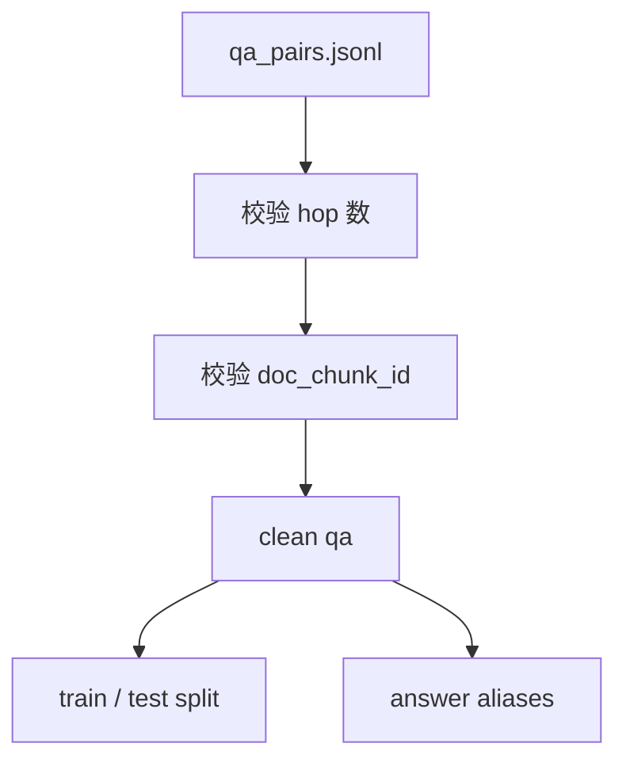

**需要**：

- 输入：`data/novel_eval/qa_pairs.jsonl`
- 输入：`data/novel/corpus.jsonl`
- 脚本：`clean_synthesis.py`、`split_train_test.py`、`gen_enhanced_aliases.py`

**怎么做**：

```powershell
uv run python .\scripts\clean_synthesis.py `
  --input .\data\novel_eval\qa_pairs.jsonl `
  --output .\data\novel_eval\qa_pairs_clean.jsonl `
  --corpus .\data\novel\corpus.jsonl

uv run python .\scripts\split_train_test.py `
  --input .\data\novel_eval\qa_pairs_clean.jsonl `
  --output .\data\novel_eval

uv run python .\scripts\gen_enhanced_aliases.py `
  --input .\data\novel_eval\qa_pairs_clean.jsonl `
  --output .\data\novel_eval\qa_pairs_aliases.json
```

**能拿到的结果**：

- `data/novel_eval/qa_pairs_clean.jsonl`
- `data/novel_eval/train.jsonl`
- `data/novel_eval/test.jsonl`
- `data/novel_eval/qa_pairs_aliases.json`

**数据结构与字段用途**：

| 产物 | 结构 / 字段 | 含义 | 后续使用位置 |
| --- | --- | --- | --- |
| `qa_pairs_clean.jsonl` | 与 `qa_pairs.jsonl` 相同 | 去除非法 hop 或缺证据样本 | 后续训练数据生成的推荐输入 |
| `train.jsonl` | 多跳 QA 子集 | 训练集 | SFT / GRPO 数据构造 |
| `test.jsonl` | 多跳 QA 子集 | 固定评测集 | Agentic eval、LLM Judge |
| `qa_pairs_aliases.json` | 增强后的 `answer_aliases` | 扩展答案可接受表达 | reward、Judge、人工审查 |

## Step 6: 构造 Oracle traces

**目标**：为每条多跳 QA 构造标准工具调用轨迹，作为 SFT 的监督信号，也作为 GRPO prompt 协议参考。

**详细说明**：

- `build_oracle_traces.py` 读取多跳 QA 中的 `hops[]`，按 gold hop 顺序构造理想检索轨迹。
- 对每个 hop，脚本会生成一条 assistant 的 `<tool_call>`，再把对应 chunk 包装成 `<tool_response>`。
- 最后一轮 assistant 消息使用 `<answer>...</answer>` 输出最终答案。
- 这种 trace 不依赖模型 rollout，因此覆盖率稳定，适合作为 SFT 的格式学习数据。
- Oracle trace 的轨迹较理想，后续 GRPO 会让模型在真实多轮检索环境中继续学习。

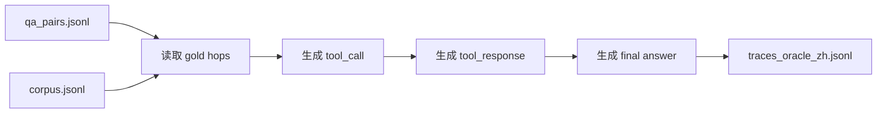

**需要**：

- 输入：`data/novel_eval/qa_pairs.jsonl`
- 输入：`data/novel/corpus.jsonl`
- 脚本：`scripts/build_oracle_traces.py`
- 输出：`data/novel_eval/traces_oracle_zh.jsonl`

**怎么做**：

```powershell
uv run python .\scripts\build_oracle_traces.py `
  --qa .\data\novel_eval\qa_pairs.jsonl `
  --corpus .\data\novel\corpus.jsonl `
  --output .\data\novel_eval\traces_oracle_zh.jsonl `
  --use-zh
```

**能拿到的结果**：

- `data/novel_eval/traces_oracle_zh.jsonl`
- 每条 trace 包含 `messages[]`
- 工具调用采用 Hermes 风格 `<tool_call>{"name": "...", "arguments": {...}}</tool_call>`
- 最终答案使用 `<answer>...</answer>`

**数据结构与字段用途**：

| 字段 | 含义 | 后续使用位置 |
| --- | --- | --- |
| `messages[]` | system/user/assistant/tool_response 多轮消息 | SFT 监督数据、协议回放 |
| `gold_chunks` | 标准证据 chunk ID 列表 | reward hop recall、诊断评测 |
| `answer_aliases` | 标准答案别名 | reward correctness |
| `hop_count` | 标准推理跳数 | 搜索充分性 reward |
| `<tool_call>` | Hermes 工具调用协议 | SFT 学习工具调用、GRPO rollout |
| `<tool_response>` | 检索证据返回 | 训练模型 grounded answer |
| `<answer>` | 最终答案标签 | reward 抽取答案、评测抽取答案 |

**Oracle Trace Prompt / 协议核心要求**：

| 约束 | 标准 |
| --- | --- |
| Agent 角色 | system prompt 固定为“中文小说阅读问答 Agent”，任务是逐步搜索人物、地点、事件和关系证据 |
| 工具调用 | assistant 使用 Hermes 风格 `<tool_call>{"name": "...", "arguments": {"query": "..."}}</tool_call>` |
| 工具名称 | 只能使用 `keyword_search`、`dense_search`、`hybrid_search` 三类检索工具 |
| 工具响应 | tool 消息使用 `<tool_response>...</tool_response>` 包装检索到的 chunk 文本 |
| 逐跳顺序 | Oracle trace 按 `hops[]` 的 gold 顺序调用工具，保证每跳都有可追溯证据 |
| 最终答案 | 最后一条 assistant 消息必须用 `<answer>...</answer>` 包裹最终答案 |

## Step 7: 转换 SFT 训练数据

**目标**：把 Oracle traces 转换成 ReAct/SFT 记录和 ShareGPT 格式，供 Unsloth 使用。

**详细说明**：

- `trace_to_sft.py` 读取 Oracle trace，把 system、user、assistant、tool 消息转换为 SFT 可训练的多轮对话。
- 工具返回消息会被转换为用户侧消息，以适配常见 ShareGPT / chat template 训练格式。
- 转换过程会保留 `<tool_call>`、`<tool_response>` 和 `<answer>`，确保模型学习同一套协议。
- 输出的多个 JSONL 文件内容相近，主要用于兼容不同训练脚本或调试入口。

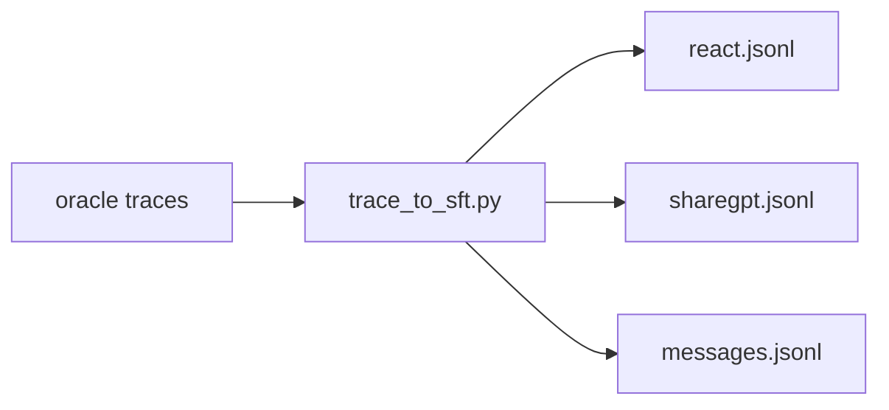

**需要**：

- 输入：`data/novel_eval/traces_oracle_zh.jsonl`
- 脚本：`scripts/trace_to_sft.py`
- 输出目录：`data/novel_eval/sft/`

**怎么做**：

```powershell
uv run python .\scripts\trace_to_sft.py `
  --input .\data\novel_eval\traces_oracle_zh.jsonl `
  --output-dir .\data\novel_eval\sft `
  --lang zh
```

**能拿到的结果**：

- `data/novel_eval/sft/react.jsonl`
- `data/novel_eval/sft/sharegpt.jsonl`
- `data/novel_eval/sft/messages.jsonl`
- 可检查每条记录是否保留工具调用和 `<answer>` 协议

**数据结构与字段用途**：

| 产物 | 结构 / 字段 | 含义 | 后续使用位置 |
| --- | --- | --- | --- |
| `react.jsonl` | `messages[]` ReAct 轨迹 | 保留原始工具调用过程 | 调试、协议检查 |
| `sharegpt.jsonl` | ShareGPT `messages[]` | Unsloth 可消费格式 | Step 8 |
| `messages.jsonl` | ShareGPT 兼容副本 | 兼容不同数据入口命名 | SFT 训练 |
| `messages[].role` | system/user/assistant | 标识对话角色 | tokenizer / template |
| `messages[].content` | 消息正文 | 包含工具调用和答案标签 | SFT loss |

**SFT Prompt / 模板核心要求**：

| 约束 | 标准 |
| --- | --- |
| 模板一致 | SFT 使用 `qwen3_nothink` 模板，和后续 GRPO 共用同一套 chat / tool calling 协议 |
| System prompt | 保留中文小说阅读问答 Agent system prompt，不在转换中改写任务角色 |
| 工具协议 | 保留 `<tool_call>`、`<tool_response>` 原文，避免训练和 rollout 协议不一致 |
| 答案协议 | 保留 `<answer>...</answer>`，后续 reward 和 eval 都依赖该标签抽取最终答案 |
| 消息角色 | 只保留训练框架可消费的 `system/user/assistant` 消息结构，工具返回会转换成用户侧上下文 |

## Step 8: 导出 Unsloth 数据目录

**目标**：把 ShareGPT SFT 数据打包成 Unsloth 可识别的数据集目录。

**详细说明**：

- `convert_sft_to_unsloth.py` 读取 `sharegpt.jsonl`，转换成 Unsloth 使用的 `train.jsonl`。
- 脚本同时生成 `manifest.json`，记录来源、样本数和数据格式。
- `training/unsloth_sft.yaml` 直接引用 `data/novel_eval/sft_zh_unsloth/train.jsonl`。
- 这一步不训练模型，只负责把数据整理成训练框架能直接读取的目录结构。

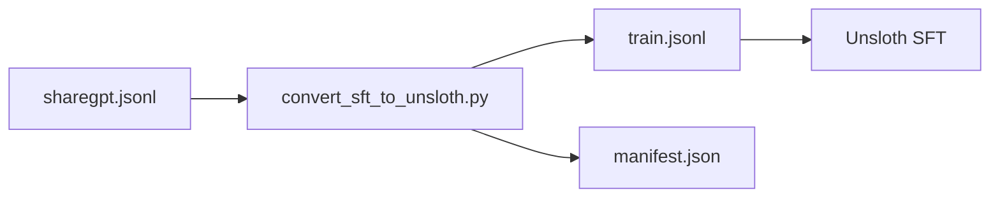

**需要**：

- 输入目录：`data/novel_eval/sft/`
- 脚本：`scripts/convert_sft_to_unsloth.py`
- 输出目录：`data/novel_eval/sft_zh_unsloth/`

**怎么做**：

```powershell
uv run python .\scripts\convert_sft_to_unsloth.py `
  --input-dir .\data\novel_eval\sft `
  --output-dir .\data\novel_eval\sft_zh_unsloth
```

**能拿到的结果**：

- `data/novel_eval/sft_zh_unsloth/train.jsonl`
- `data/novel_eval/sft_zh_unsloth/manifest.json`
- SFT 配置：`training/unsloth_sft.yaml`

**数据结构与字段用途**：

| 产物 | 结构 / 字段 | 含义 | 后续使用位置 |
| --- | --- | --- | --- |
| `train.jsonl` | 每行一个 `messages[]` 样本 | 真实 SFT 样本 | Unsloth train |
| `manifest.json` | 数据格式和来源说明 | 记录转换来源、样本数和训练器 | 数据审计 |
| `training/unsloth_sft.yaml` | `dataset/template/model/output_dir` | SFT 训练配置 | Step 12 |

## Step 9: 构造 GRPO parquet 数据

**目标**：把多跳 QA 转换成 Unsloth GRPO 可读取的 parquet 行，保留 raw chat 和 reward ground truth。

**详细说明**：

- `prepare_agentic_grpo_data.py` 读取多跳 QA，并调用 `build_grpo_rows` 构造 GRPO 训练行。
- 每条样本的 `prompt` 保留原始 chat 消息，包含 system prompt 和用户问题。
- `agent_name` 字段保留在 parquet 中，便于后续区分不同 agent 类型。
- `reward_model.ground_truth` 会写入标准答案、答案别名、gold chunks 和 hop 数，供 reward 函数打分。
- 脚本按 `val-ratio` 划分 train/val，并以 parquet 格式保存，减少训练时的解析成本。

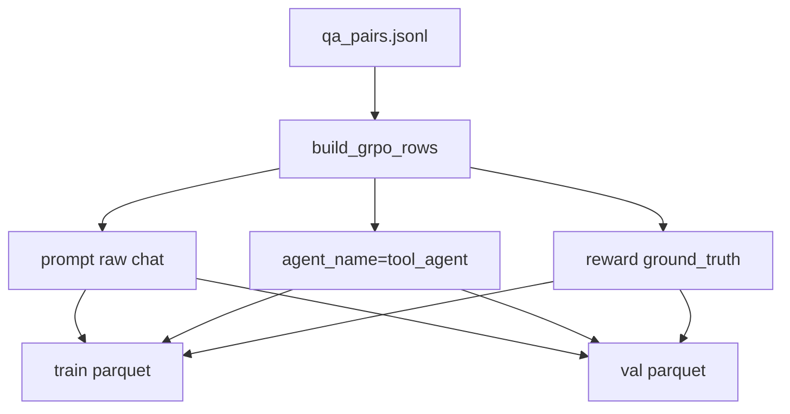

**需要**：

- 输入：`data/novel_eval/qa_pairs.jsonl`
- 脚本：`scripts/prepare_agentic_grpo_data.py`
- 输出：`data/novel_eval/grpo_agentic_train.parquet`
- 输出：`data/novel_eval/grpo_agentic_val.parquet`

**怎么做**：

```powershell
uv run python .\scripts\prepare_agentic_grpo_data.py `
  --input .\data\novel_eval\qa_pairs.jsonl `
  --train-output .\data\novel_eval\grpo_agentic_train.parquet `
  --val-output .\data\novel_eval\grpo_agentic_val.parquet
```

**能拿到的结果**：

- GRPO train parquet
- GRPO val parquet
- 每行包含 `prompt/agent_name/reward_model.ground_truth`
- `ground_truth` 包含 `target/question/answer_aliases/gold_chunks/hop_count`

**数据结构与字段用途**：

| 字段 | 含义 | 后续使用位置 |
| --- | --- | --- |
| `prompt` | 原始 chat prompt，包含 system 和 user question | Unsloth GRPO 输入 |
| `agent_name` | 默认 `tool_agent` | 区分 agent 类型 |
| `reward_model.ground_truth.target` | 标准答案 | reward correctness |
| `reward_model.ground_truth.question` | 原始问题 | Judge / debug |
| `reward_model.ground_truth.answer_aliases` | 答案别名 | correctness 兼容匹配 |
| `reward_model.ground_truth.gold_chunks` | 标准证据 chunk | hop recall / faithfulness |
| `reward_model.ground_truth.hop_count` | 标准跳数 | 搜索充分性约束 |

**GRPO Prompt 核心要求**：

| 约束 | 标准 |
| --- | --- |
| Raw chat | `prompt` 必须保留原始 chat 结构，包含 system prompt 和用户最终问题 |
| Agent 路由 | `agent_name` 当前用于数据标识，不作为 Unsloth 主入口的强依赖 |
| System prompt | 与 SFT 一致：模型必须通过文本检索工具逐步搜索证据，最后用 `<answer>` 输出 |
| 监督目标 | `reward_model.ground_truth` 必须包含 `target/question/answer_aliases/gold_chunks/hop_count` |
| 训练边界 | prompt 不直接泄露 gold chunks；gold chunks 只进入 reward ground truth，不进入用户问题 |

## Step 10: 启动小说检索服务

**目标**：为 Agentic rollout / GRPO 多轮工具调用提供 HTTP 检索工具服务。

**详细说明**：

- `retrieval_server.py` 启动 FastAPI 服务，并在内存中加载小说 corpus。
- 服务启动后会构造 `HybridRetriever`，支持 keyword、dense 和 hybrid 三类检索请求。
- `/search` 接口接收 `query/top_k/tool`，返回 chunk ID、标题、文本、分数和 metadata。
- Unsloth GRPO 首版复用 reward 逻辑；如需完整多轮工具调用闭环，后续需要把该 HTTP 服务接入 rollout。
- 本机 smoke 和外部 GPU 训练可以使用同一套服务协议，差异只在运行机器和模型规模。

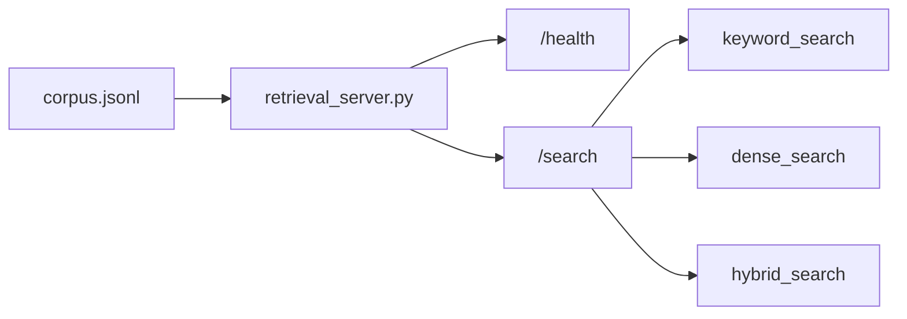

**需要**：

- 输入：`data/novel/corpus.jsonl`
- 服务脚本：`training/tools/retrieval_server.py`
- 默认端口：`8790`

**怎么做**：

```powershell
uv run python .\training\tools\retrieval_server.py `
  --port 8790 `
  --corpus .\data\novel\corpus.jsonl
```

**能拿到的结果**：

- `http://127.0.0.1:8790/health`
- `http://127.0.0.1:8790/search`
- 支持 `keyword_search/dense_search/hybrid_search`
- GRPO/RL 扩展可通过该 HTTP 服务接入检索工具

**数据结构与字段用途**：

| 接口 / 配置 | 结构 / 字段 | 含义 | 后续使用位置 |
| --- | --- | --- | --- |
| `/health` | `{"status": "ok"}` | 服务存活检查 | smoke test、训练前检查 |
| `/search` request | `query/top_k/tool` | 检索请求 | Agentic rollout 工具调用 |
| `/search` response | `results[]` | 检索结果列表 | tool response、证据记录 |
| `results[].chunk_id` | corpus chunk ID | 证据 ID | hop recall、reward |
| `results[].text` | 证据文本 | 回答依据 | faithfulness、Judge |

**Tool Calling Prompt / 工具约束**：

| 约束 | 标准 |
| --- | --- |
| `keyword_search` | 用于精确匹配人物、地点、事件关键词 |
| `dense_search` | 用于语义匹配小说片段 |
| `hybrid_search` | 用于同时结合关键词和语义检索，并做融合排序 |
| 参数格式 | 每个工具只接收 `{"query": "..."}`，避免训练和服务端 schema 漂移 |
| 返回证据 | 工具返回必须包含 `chunk_id/title/text/score/metadata`，供模型回答和 reward 诊断使用 |

## Step 11: 本机 smoke 评测

**目标**：在不启动真实大模型训练的情况下，验证数据、检索、agentic rollout 和 reward 所需字段能闭环。

**详细说明**：

- `eval_agentic.py` 加载 QA 数据和 corpus，在本地创建 `HybridRetriever`。
- 每条样本会调用规则化的 `run_agentic_episode`，模拟多轮检索和答案生成。
- 脚本会记录预测答案、召回 chunk、标准 gold chunks、工具调用次数和证据文本。
- 该步骤不评估大模型能力，而是验证数据契约、检索链路和评测字段是否完整。
- 如果该步骤失败，优先检查前面生成的 corpus、QA、chunk ID 和检索结果。

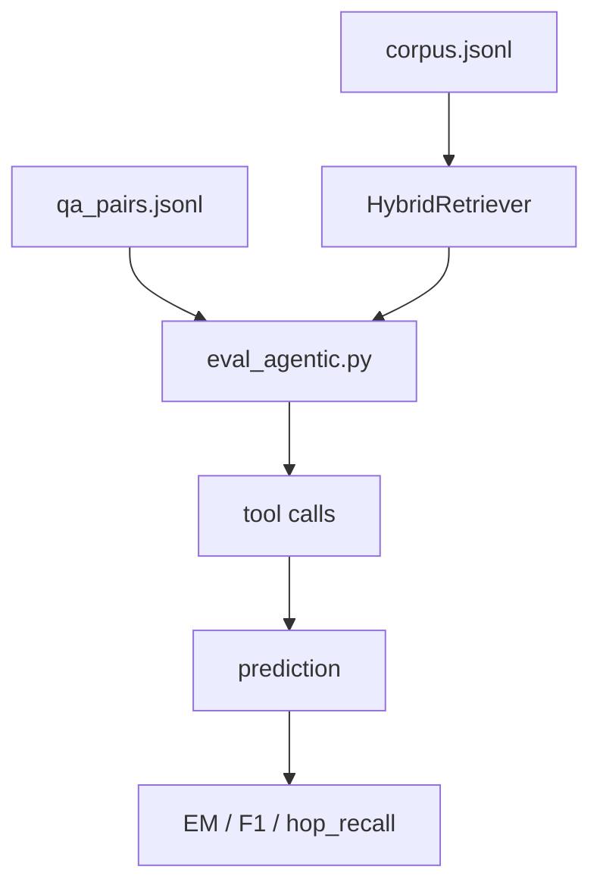

**需要**：

- 输入：`data/novel_eval/qa_pairs.jsonl`
- 输入：`data/novel/corpus.jsonl`
- 脚本：`scripts/eval_agentic.py`

**怎么做**：

```powershell
uv run python .\scripts\eval_agentic.py `
  --data .\data\novel_eval\qa_pairs.jsonl `
  --corpus .\data\novel\corpus.jsonl `
  --max-samples 2
```

**能拿到的结果**：

- 控制台输出 `summary`
- 每条样本包含 `prediction/retrieved_chunk_ids/gold_chunks/tool_calls/evidence`
- 可观察 `avg_em/avg_f1/avg_hop_recall`
- 如果答案为空或证据为空，说明前序 corpus、QA 或检索链路有问题

**数据结构与字段用途**：

| 字段 | 含义 | 后续使用位置 |
| --- | --- | --- |
| `summary.count` | 评测样本数 | smoke 是否覆盖样本 |
| `summary.avg_em` | 平均 exact match | 答案精确性粗评 |
| `summary.avg_f1` | 平均 token F1 | 答案相似度粗评 |
| `summary.avg_hop_recall` | 标准证据召回率 | 检索质量诊断 |
| `results[].prediction` | Agentic 输出答案 | 错误分析 |
| `results[].retrieved_chunk_ids` | 实际召回 chunk | reward / hop-aware 诊断 |
| `results[].evidence` | 检索证据详情 | 人工审查、faithfulness 分析 |

## Step 12: SFT LoRA 冷启动训练

**目标**：在 GRPO/RL 前先做 SFT LoRA 冷启动，让基座模型学会中文小说 Agent 的工具调用轨迹、ReAct 搜索步骤和 `<answer>...</answer>` 最终答案协议。

**详细说明**：

- SFT 使用 Step 8 导出的 Unsloth JSONL，即 `data/novel_eval/sft_zh_unsloth/train.jsonl`。
- 训练样本来自 Oracle traces，模型先模仿理想检索路径，而不是直接进入高噪声 RL。
- `qwen3_nothink` 模板负责把多轮消息渲染成 Qwen3 可学习的 chat token 序列。
- LoRA 只训练 adapter 权重，默认输出到 `training/outputs/unsloth_sft_qwen3_4b_lora`。
- 合并阶段把 LoRA adapter 写回基座模型，生成后续 GRPO 默认使用的 merged model。
- 当前 repo 不内置 Unsloth；训练前先按 `docs/环境安装.md` 装好 CUDA Torch、Unsloth、TRL、datasets、PEFT 等训练栈。

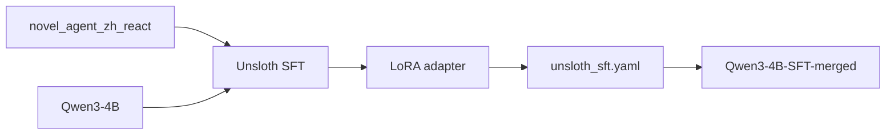

**需要**：

- Unsloth 环境
- 基座模型：默认 `Qwen/Qwen3-4B-Instruct-2507`
- 数据文件：`data/novel_eval/sft_zh_unsloth/train.jsonl`
- 配置：`training/unsloth_sft.yaml`
- 本机 16GB 显存只建议低参或 QLoRA smoke；完整训练建议 24GB 以上 GPU 或远端 GPU

**怎么做**：

先确认 Unsloth 训练栈可用：

```powershell
uv run --no-sync python -c "import torch; print(torch.__version__, torch.cuda.is_available()); from unsloth import FastLanguageModel; print('unsloth ok')"
```

如果 Oracle traces 或 SFT 中间目录刚更新，先重新导出 Unsloth 数据：

```powershell
uv run python .\scripts\convert_sft_to_unsloth.py `
  --input-dir .\data\novel_eval\sft `
  --output-dir .\data\novel_eval\sft_zh_unsloth
```

训练前统计样本 token 长度，判断 `max_seq_length` 是否合理：

```powershell
uv run python .\scripts\calc_sample_lengths.py `
  --config .\training\unsloth_sft.yaml `
  --limits 1024 2048 4096
```

执行 SFT LoRA 冷启动训练：

```powershell
uv run --no-sync python .\scripts\train_sft_unsloth.py `
  --config .\training\unsloth_sft.yaml `
  --output-dir .\training\outputs\unsloth_sft_qwen3_4b_lora
```

训练完成后导出 merged model：

```powershell
uv run --no-sync python .\scripts\export_unsloth_lora.py `
  --config .\training\unsloth_sft.yaml `
  --adapter-path .\training\outputs\unsloth_sft_qwen3_4b_lora `
  --export-dir .\models\Qwen3-4B-Instruct-2507-Unsloth-SFT-merged
```

**能拿到的结果**：

- LoRA 输出：`training/outputs/unsloth_sft_qwen3_4b_lora`
- 合并模型：`models/Qwen3-4B-Instruct-2507-Unsloth-SFT-merged`
- 该模型作为 GRPO Stage1 的默认 base

**数据结构与字段用途**：

| 产物 / 配置 | 结构 / 字段 | 含义 | 后续使用位置 |
| --- | --- | --- | --- |
| `training/unsloth_sft.yaml` | model/dataset/template/output_dir | SFT 训练参数 | Unsloth |
| `training/outputs/unsloth_sft_qwen3_4b_lora` | LoRA adapter | 学到工具调用格式的增量权重 | export |
| `models/Qwen3-4B-Instruct-2507-Unsloth-SFT-merged` | 合并后的 HF 模型目录 | GRPO 初始模型 | GRPO / RL |
| `results/sft_compare/summary.json` | Base/SFT 指标对比 | 判断冷启动是否提升协议遵循和答案指标 | Step 14 |

## Step 13: Unsloth GRPO / RL 训练

**目标**：使用 Unsloth + TRL GRPO 入口复用项目 reward 逻辑，让模型在后训练阶段强化 correctness、faithfulness、hop recall 和搜索行为。

**详细说明**：

- GRPO 使用 SFT merged model 作为初始模型，读取 GRPO train/val parquet。
- 当前入口复用已有 reward 函数；多轮工具调用闭环如果需要完全等价替代旧远端 rollout，需要后续单独增强。
- reward 函数从模型输出中抽取 `<answer>`，并结合答案别名、gold chunks、hop count 和工具调用记录打分。
- 默认使用 `AGENTIC_RAG_REWARD_VERSION=v6a`，可通过 `training/unsloth_grpo.yaml` 调整。

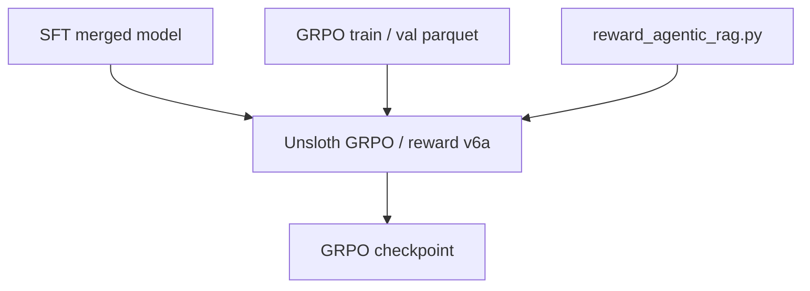

**需要**：

- 外部 GPU 环境
- Unsloth、TRL、datasets
- 已启动 retrieval server
- GRPO parquet：`data/novel_eval/grpo_agentic_train.parquet` 和 `data/novel_eval/grpo_agentic_val.parquet`
- 配置：`training/unsloth_grpo.yaml`
- Reward：`training/reward_agentic_rag.py`

**怎么做**：

```powershell
uv run python .\scripts\train_grpo_unsloth.py `
  --config .\training\unsloth_grpo.yaml
```

**能拿到的结果**：

- GRPO checkpoint：`training/outputs/unsloth_grpo_qwen3_4b`
- 可进入后续 Agentic 评测

**数据结构与字段用途**：

| 组件 | 结构 / 字段 | 含义 | 后续使用位置 |
| --- | --- | --- | --- |
| `grpo_agentic_train.parquet` | `prompt/agent_name/reward_model` | 训练 rollout 数据 | Unsloth GRPO |
| `grpo_agentic_val.parquet` | 同 train parquet | 验证 rollout 数据 | checkpoint 选择 |
| `reward_agentic_rag.py` | `compute_score` | 自定义 reward 入口 | GRPO reward function |
| `AGENTIC_RAG_REWARD_VERSION` | `v6a/v5a/v9a` | 切换 reward 公式 | GRPO/RL |

**Rollout Prompt 核心要求**：

| 约束 | 标准 |
| --- | --- |
| 多轮检索 | 模型应先调用检索工具获取证据，不应直接凭参数记忆回答 |
| 证据优先 | 回答必须基于 tool response 中的小说片段，避免编造人物关系或事件 |
| 工具 JSON | 工具调用必须符合 Hermes JSON 格式，字段为 `name` 和 `arguments` |
| 答案标签 | 最终输出必须包含且只依赖 `<answer>...</answer>` 中的短答案 |
| Reward 对齐 | prompt 行为目标和 reward 分量一致：正确性、faithfulness、hop recall、合理工具调用 |

## Step 14: 评测与诊断

**目标**：比较 SFT、Stage1、Stage2、Stage3 的效果，避免只验证“能跑”，而忽略多跳检索质量和答案可信度。

**详细说明**：

- 评测阶段使用固定 QA 集和同一份 corpus，保证不同 checkpoint 的结果可比。
- Pipeline eval 作为非 agentic 基线，主要衡量直接检索回答的上限和问题难度。
- Agentic eval 会记录多轮工具调用、召回证据和最终答案，用于分析模型是否真的按 hop 搜索。
- LLM Judge 可作为补充评估 correctness、faithfulness 和 context precision。
- 最终应同时看答案指标、证据召回、工具调用行为和人工可审查证据，而不是只看单一分数。

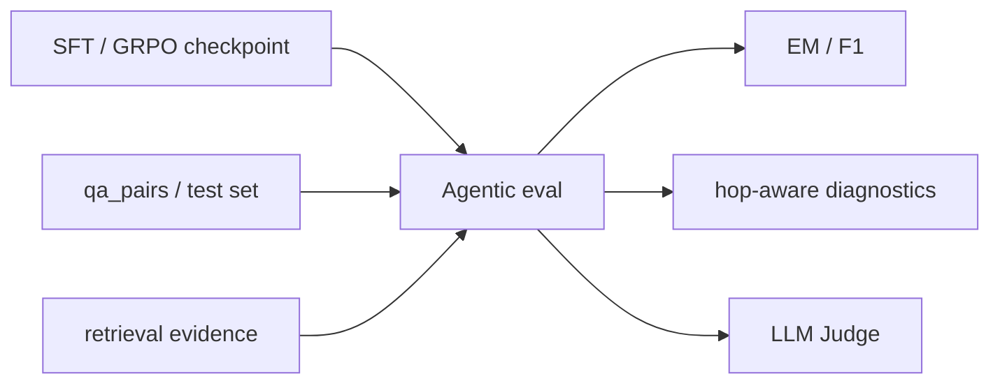

**需要**：

- 测试集：`data/novel_eval/test.jsonl` 或 `data/novel_eval/qa_pairs.jsonl`
- corpus：`data/novel/corpus.jsonl`
- 检索服务
- 可选 LLM Judge 服务
- 脚本：`eval_agentic.py`、`run_cloud_eval.py`、`run_llm_judge.py`
- LLM Judge 默认最大并发：`5`，可通过 `--max-concurrency` 调整
- `run_llm_judge.py` 会逐条追加 `*_judged.checkpoint.jsonl`，并在每条样本完成后重写最终 JSON。重新执行同一命令时只跳过已经 `status=ok` 的样本，失败样本会重新请求 Judge，并按原始输入 index 插入回结果顺序。

**怎么做**：

```powershell
uv run python .\scripts\eval_agentic.py `
  --data .\data\novel_eval\qa_pairs.jsonl `
  --corpus .\data\novel\corpus.jsonl `
  --max-samples 20 `
  --output .\results\agentic_eval.json

uv run python .\scripts\run_cloud_eval.py `
  --data .\data\novel_eval\qa_pairs.jsonl `
  --corpus .\data\novel\corpus.jsonl `
  --output .\results\pipeline_eval.json

uv run python .\scripts\run_llm_judge.py `
  .\results\agentic_eval.json `
  --output .\results\agentic_eval_judged.json `
  --max-concurrency 5
```

如果使用 NewAPI 在线模型跑 LLM-as-Judge：

```powershell
uv run python .\scripts\run_llm_judge.py `
  .\results\agentic_eval.json `
  --output .\results\agentic_eval_judged.json `
  --llm-provider newapi `
  --judge-model gpt-5.5 `
  --max-concurrency 5
```

如果使用 RightCode 在线模型跑 LLM-as-Judge：

```powershell
uv run python .\scripts\run_llm_judge.py `
  .\results\agentic_eval.json `
  --output .\results\agentic_eval_judged.json `
  --llm-provider rightcode `
  --judge-model gpt-5.5 `
  --max-concurrency 5
```

如果使用 Doubao 批量推理任务跑 LLM-as-Judge，添加 `--use-batch-inference`，不需要设置 `--max-concurrency`：

```powershell
uv run python .\scripts\run_llm_judge.py `
  .\results\agentic_eval.json `
  --output .\results\agentic_eval_judged.json `
  --use-batch-inference
```

批量模式会把每条待评测样本写成一条 Batch Job 请求。任务完成后脚本会把原始请求和响应备份到 `data/batch_jobs/llm_judge/requests.jsonl`、`results.jsonl`、`errors.jsonl`，再解析 Judge JSON，并写入 `--output` 指定的 judged JSON 和对应 `*_judged.checkpoint.jsonl`；已有 `status=ok` 的样本仍会被跳过。最终报告和诊断应读取 `--output` 指定的 judged JSON，不直接读取 Batch Job 原始 `results.jsonl`。

### SFT LoRA 训练前后测评

`eval_agentic.py` 和 `run_cloud_eval.py` 主要验证数据、检索、证据字段和规则型 pipeline 是否闭环；它们不加载 SFT 后的 Qwen 模型，不能单独代表训练前后模型能力对比。SFT LoRA 对比应使用 `eval_hf_model.py` 让 base model 和 SFT model 在同一测试集上生成答案，再用 `compare_predictions.py` 汇总。

固定测试集，优先使用 held-out 数据：

```text
data\novel_eval\test.jsonl
```

生成训练前 Base 模型预测：

```powershell
New-Item -ItemType Directory -Force .\results\sft_compare

uv run --no-sync python .\scripts\eval_hf_model.py `
  --model Qwen/Qwen3-4B-Instruct-2507 `
  --data .\data\novel_eval\test.jsonl `
  --output .\results\sft_compare\base_predictions.jsonl `
  --template qwen3_nothink `
  --max-samples 50 `
  --max-new-tokens 512 `
  --temperature 0
```

如果本地已经保存 base 模型，也可以把 `--model` 换成 `.\models\Qwen3-4B-Instruct-2507-Base`，便于复现实验路径。

生成 SFT merged model 预测：

```powershell
uv run --no-sync python .\scripts\eval_hf_model.py `
  --model .\models\Qwen3-4B-Instruct-2507-Unsloth-SFT-merged `
  --data .\data\novel_eval\test.jsonl `
  --output .\results\sft_compare\sft_predictions.jsonl `
  --template qwen3_nothink `
  --max-samples 50 `
  --max-new-tokens 512 `
  --temperature 0
```

如果不导出 merged model，也可以直接测 base + adapter：

```powershell
uv run --no-sync python .\scripts\eval_hf_model.py `
  --model Qwen/Qwen3-4B-Instruct-2507 `
  --adapter .\training\outputs\unsloth_sft_qwen3_4b_lora `
  --data .\data\novel_eval\test.jsonl `
  --output .\results\sft_compare\sft_lora_predictions.jsonl `
  --template qwen3_nothink `
  --max-samples 50 `
  --max-new-tokens 512 `
  --temperature 0
```

计算统一指标：

```powershell
uv run python .\scripts\compare_predictions.py `
  --base .\results\sft_compare\base_predictions.jsonl `
  --sft .\results\sft_compare\sft_predictions.jsonl `
  --output .\results\sft_compare\summary.json
```

重点看这些指标：

| 指标 | 含义 |
| --- | --- |
| `avg_em` | 标准答案或别名的 exact match |
| `avg_f1` | 标准答案或别名的 token F1 |
| `answer_tag_rate` | 输出是否稳定包含 `<answer>...</answer>` |
| `tool_call_rate` | 是否生成 `<tool_call>...</tool_call>` |
| `valid_tool_call_rate` | `<tool_call>` 内 JSON 是否可解析 |
| `avg_generation_chars` | 平均生成长度，辅助发现异常长输出 |

可选再对 base 和 SFT 的 `_as_eval.json` 跑 LLM-as-Judge：

```powershell
uv run python .\scripts\run_llm_judge.py `
  .\results\sft_compare\base_predictions_as_eval.json `
  --output .\results\sft_compare\base_judged.json `
  --max-concurrency 5

uv run python .\scripts\run_llm_judge.py `
  .\results\sft_compare\sft_predictions_as_eval.json `
  --output .\results\sft_compare\sft_judged.json `
  --max-concurrency 5
```

**能拿到的结果**：

- `results/agentic_eval.json`
- `results/pipeline_eval.json`
- `results/agentic_eval_judged.json`，或 `--output` 指定的其他 judged JSON
- `results/sft_compare/base_predictions.jsonl`
- `results/sft_compare/sft_predictions.jsonl`
- `results/sft_compare/summary.json`
- `results/sft_compare/base_judged.json` 和 `sft_judged.json`，仅在执行可选 Judge 时产生
- `results/agentic_eval_judged.checkpoint.jsonl`，文件名前缀随 `--output` 变化
- `data/batch_jobs/llm_judge/requests.jsonl`、`results.jsonl`、`errors.jsonl`，仅使用 Doubao 批量推理任务时产生，属于 Batch Job 原始备份 / 可追溯文件
- 指标包括 `EM/F1/hop_recall/tool_calls/evidence`
- 可扩展 LLM Judge 评分，观察 correctness、faithfulness 和 context precision

**数据结构与字段用途**：

| 产物 / 字段 | 含义 | 后续使用位置 |
| --- | --- | --- |
| `agentic_eval.json.summary` | Agentic 整体指标 | 对比 SFT / GRPO checkpoint |
| `agentic_eval.json.results[]` | 单样本预测、证据和指标 | 错误分析 |
| `pipeline_eval.json.summary` | 非 agentic pipeline 基线指标 | 对照实验 |
| `sft_compare/summary.json.summary.base` | Base 模型生成指标 | SFT 训练前基线 |
| `sft_compare/summary.json.summary.sft` | SFT 模型生成指标 | SFT LoRA 冷启动效果 |
| `sft_compare/summary.json.summary.delta` | SFT 相对 Base 的指标变化 | 判断协议遵循和答案指标是否提升 |
| `EM/F1` | 答案匹配指标 | correctness 趋势 |
| `hop_recall` | 证据召回指标 | grounding 趋势 |
| `tool_calls` | 工具调用次数 | 搜索行为诊断 |
| `evidence` | 召回证据文本 | faithfulness / Judge |

## 一键本机 smoke 顺序

如果只想验证本机数据闭环，按下面顺序执行即可。该顺序不包含完整 SFT/GRPO 训练，只验证 corpus、索引、QA、SFT 数据、GRPO 数据和规则型 agentic eval 是否连通。

执行到 `gen_seed_qa.py` 前，需要先复制环境变量示例并填写敏感信息：

```powershell
Set-Location E:\AI\AgenticRAG-RL\demo
Copy-Item .\.env.example .\.env
```

在 `.env` 中填写所选在线模型供应商的 API Key。使用默认 Doubao 时填写 `ARK_API_KEY`；使用 NewAPI 时填写 `NEWAPI_API_KEY`；使用 RightCode 时填写 `RIGHTCODE_API_KEY`。脚本启动时会自动读取 `.env` 中的环境变量。

```powershell
uv run python -m pytest
uv run python .\scripts\parse_text_corpus.py --input-dir .\data\original_data --output .\data\novel\corpus.jsonl
uv run python .\scripts\build_index.py --corpus .\data\novel\corpus.jsonl --index-dir .\data\novel\indexes --embedding-model .\models\bge-m3 --reranker-model .\models\bge-reranker-v2-m3 --max-concurrency 5 --skip-kg
uv run python .\scripts\gen_seed_qa.py --corpus .\data\novel\corpus.jsonl --output .\data\novel_eval\seeds.jsonl
uv run python .\scripts\clean_seed_qa.py --input .\data\novel_eval\seeds.jsonl --corpus .\data\novel\corpus.jsonl --output .\data\novel_eval\seeds_clean.jsonl --dropped-output .\data\novel_eval\seeds_dropped.jsonl
uv run python .\scripts\domain_multihop_synthesis.py --seeds .\data\novel_eval\seeds_clean.jsonl --corpus .\data\novel\corpus.jsonl --output .\data\novel_eval\qa_pairs.jsonl --target-count 50 --quality-gate llm --candidate-multiplier 5 --max-concurrency 5
uv run python .\scripts\build_oracle_traces.py --qa .\data\novel_eval\qa_pairs.jsonl --corpus .\data\novel\corpus.jsonl --output .\data\novel_eval\traces_oracle_zh.jsonl --use-zh
uv run python .\scripts\trace_to_sft.py --input .\data\novel_eval\traces_oracle_zh.jsonl --output-dir .\data\novel_eval\sft --lang zh
uv run python .\scripts\convert_sft_to_unsloth.py --input-dir .\data\novel_eval\sft --output-dir .\data\novel_eval\sft_zh_unsloth
uv run python .\scripts\prepare_agentic_grpo_data.py --input .\data\novel_eval\qa_pairs.jsonl --train-output .\data\novel_eval\grpo_agentic_train.parquet --val-output .\data\novel_eval\grpo_agentic_val.parquet
uv run python .\scripts\eval_agentic.py --data .\data\novel_eval\qa_pairs.jsonl --corpus .\data\novel\corpus.jsonl --max-samples 2
```

切换到金庸多文档 corpus 后，旧的 `seeds.jsonl`、`qa_pairs.jsonl`、oracle traces、SFT/GRPO 数据都不再和新 `chunk_id` 对齐，需要按上面的顺序重新生成。

### 训练冷启动与测评顺序

SFT LoRA 是 GRPO 前的冷启动阶段，建议在数据闭环 smoke 通过后单独执行。训练前先按 `docs/环境安装.md` 确认 Unsloth 环境：

```powershell
uv run --no-sync python -c "import torch; print(torch.__version__, torch.cuda.is_available()); from unsloth import FastLanguageModel; print('unsloth ok')"
```

然后执行 SFT 数据刷新、长度统计、LoRA 训练、合并和训练前后测评：

```powershell
uv run python .\scripts\convert_sft_to_unsloth.py --input-dir .\data\novel_eval\sft --output-dir .\data\novel_eval\sft_zh_unsloth
uv run python .\scripts\calc_sample_lengths.py --config .\training\unsloth_sft.yaml --limits 1024 2048 4096
uv run --no-sync python .\scripts\train_sft_unsloth.py --config .\training\unsloth_sft.yaml --output-dir .\training\outputs\unsloth_sft_qwen3_4b_lora
uv run --no-sync python .\scripts\export_unsloth_lora.py --config .\training\unsloth_sft.yaml --adapter-path .\training\outputs\unsloth_sft_qwen3_4b_lora --export-dir .\models\Qwen3-4B-Instruct-2507-Unsloth-SFT-merged
New-Item -ItemType Directory -Force .\results\sft_compare
uv run --no-sync python .\scripts\eval_hf_model.py --model Qwen/Qwen3-4B-Instruct-2507 --data .\data\novel_eval\test.jsonl --output .\results\sft_compare\base_predictions.jsonl --template qwen3_nothink --max-samples 50 --max-new-tokens 512 --temperature 0
uv run --no-sync python .\scripts\eval_hf_model.py --model .\models\Qwen3-4B-Instruct-2507-Unsloth-SFT-merged --data .\data\novel_eval\test.jsonl --output .\results\sft_compare\sft_predictions.jsonl --template qwen3_nothink --max-samples 50 --max-new-tokens 512 --temperature 0
uv run python .\scripts\compare_predictions.py --base .\results\sft_compare\base_predictions.jsonl --sft .\results\sft_compare\sft_predictions.jsonl --output .\results\sft_compare\summary.json
```

如果只想测 LoRA adapter 而不合并模型，把 SFT 预测命令替换为 `--model Qwen/Qwen3-4B-Instruct-2507 --adapter .\training\outputs\unsloth_sft_qwen3_4b_lora`。

## 环境边界

- Windows 11 本机：数据处理、SFT 数据转换、CPU retrieval server、smoke evaluation。
- 当前 repo 不内置 Unsloth 依赖；Windows CUDA Torch、Unsloth Core、TRL、datasets、PEFT 等训练栈需要单独安装。
- 单卡 16GB：适合数据流程、小模型或 QLoRA smoke；当前默认 `Qwen3-4B + LoRA rank 64 + max_seq_length 4096` 容易 OOM。
- 单卡 24GB：更适合 4B LoRA SFT；GRPO 仍建议缩小 batch、response length 或只做 smoke。
- 外部 GPU 环境：完整 Unsloth SFT、Unsloth GRPO/RL、长样本 rollout 和 Judge。
- 数据构造成本主要来自按 chunk 调用在线 LLM 的 KG 抽取和 seed QA 生成；正式全量构造前建议先小样本抽查质量，并参考 `docs/数据构造价格推算.md` 预留预算。

