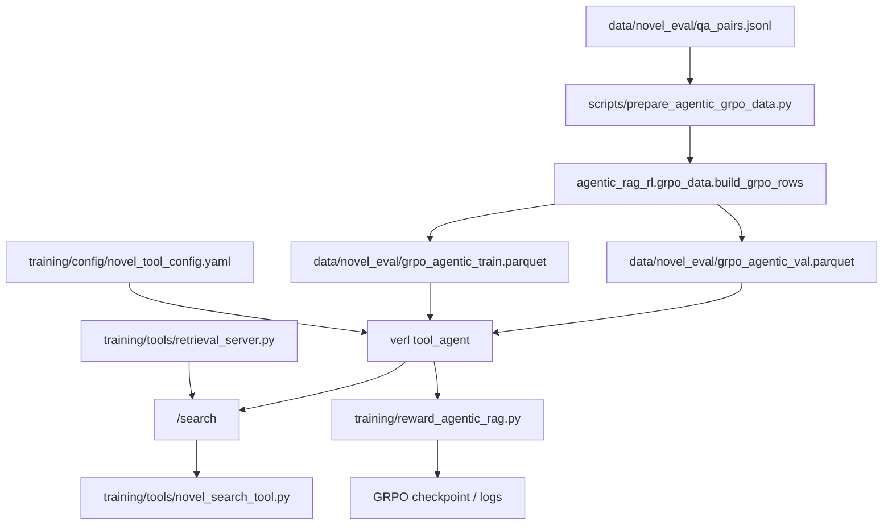

# RL 数据流

本文只记录当前 demo 工程的强化学习主线数据流：从多跳 QA 到 verl multi-turn `tool_agent` GRPO parquet，再到训练时真实工具调用和 reward 评分。RL 数据不复用 SFT messages；它只复用同一批多跳 QA、同一套工具协议和同一个检索索引。

## 总：主数据生成顺序



1. `qa_pairs.jsonl` 是 RL 的样本来源，包含 `final_question/final_answer/hops/answer_aliases/hop_count/subset` 等字段。
2. `prepare_agentic_grpo_data.py` 读取多跳 QA，调用 `build_grpo_rows()` 转成 verl 可读的 parquet 行。
3. 脚本按 `--val-ratio 0.1 --seed 42` 切分训练集和验证集。
4. parquet 只保存 raw chat、ground truth、样本元信息和工具实例创建参数；工具 schema 不写入 parquet。
5. 正式训练时，`training/start_grpo_tool_agent.sh` 调用 verl `main_ppo` 并启用 multi-turn `tool_agent`。
6. `tool_agent` 按 `training/config/novel_tool_config.yaml` 加载 `keyword_search/dense_search/hybrid_search` 三个工具。
7. 工具实现通过 HTTP 调用 retrieval server 的 `/search`，把检索结果以 `[chunk_id] text` 形式返回给模型。
8. rollout 结束后，`training/reward_agentic_rag.py::compute_score` 从最终输出、工具响应和 ground truth 中计算 reward。

## 当前生成命令

```powershell
uv run python `
  ./scripts/prepare_agentic_grpo_data.py `
  --input ./data/novel_eval/qa_pairs.jsonl `
  --train-output ./data/novel_eval/grpo_agentic_train.parquet `
  --val-output ./data/novel_eval/grpo_agentic_val.parquet `
  --val-ratio 0.1 `
  --seed 42
```

当前主线数据规模：

| 文件 | 数量 | 用途 |
| --- | ---: | --- |
| `data/novel_eval/grpo_agentic_train.parquet` | 2700 | verl GRPO train rollout |
| `data/novel_eval/grpo_agentic_val.parquet` | 300 | verl GRPO validation rollout |

## Parquet 行结构

每行字段固定为：

```text
data_source / prompt / ability / reward_model / extra_info / metadata
```

字段约束：

| 字段 | 当前约束 |
| --- | --- |
| `data_source` | 固定 `novel_agentic_rag` |
| `prompt` | 只包含 system 和 user question，不包含 oracle evidence、gold chunks 或标准答案 |
| `ability` | 固定 `multi_hop_qa` |
| `reward_model.ground_truth` | 包含 `target/answer/question/answer_aliases/gold_chunks/hop_count` |
| `extra_info.index` | 构造 parquet 时的样本序号 |
| `extra_info.need_tools_kwargs` | 固定 `true`，用于告诉 verl 给工具创建阶段传入上下文 |
| `extra_info.tools_kwargs` | 给 `keyword_search/dense_search/hybrid_search` 注入 `ground_truth/question/data_source` |
| `extra_info.split` | `train` 或 `val` |
| `metadata` | 保存 `subset/hop_count/qa_type/tool_names`，用于审计和分组统计 |

`prompt` 不泄漏训练答案；reward 所需的标准答案、别名和 gold chunks 只放在 `reward_model.ground_truth` 中。这样可以让模型在 rollout 中真实检索，而不是从输入 prompt 直接看到证据。

## 工具 schema 来源

当前 RL 主线的工具 schema 只来自：

```text
training/config/novel_tool_config.yaml
```

暴露给模型的工具是：

```text
keyword_search
dense_search
hybrid_search
```

`graph_search` 不进入当前 canonical GRPO tool schema。索引层可以保留 KG 能力，但主训练协议必须和 SFT v4 学到的三工具 schema 对齐，避免 RL 阶段引入未冷启动过的工具动作。

## 与 SFT 数据的区别

| 项 | SFT LoRA | RL / GRPO |
| --- | --- | --- |
| 输入来源 | `traces_oracle_zh.jsonl` 转出的 messages | `qa_pairs.jsonl` 直接转 parquet |
| 是否包含 oracle 轨迹 | 是 | 否 |
| 是否训练固定 assistant span | 是，assistant-only loss | 否，由 rollout 采样后按 reward 更新 |
| 工具调用 | 数据中已有标准 `<tool_call>` | 模型训练时真实生成 `<tool_call>` |
| 工具响应 | SFT renderer 渲染 `tool` role | verl tool_agent 调用 retrieval server 返回 |
| 主要验收 | 协议稳定、答案和检索指标 | 不退化 SFT 协议，并提升或保持检索/答案质量 |

## 数据审计清单

重新生成 RL 数据后，至少确认：

1. train/val parquet 行数符合预期，当前为 `2700/300`。
2. `prompt` 只有 `system/user` 两个角色。
3. `prompt` 中不包含 `gold_chunks`、标准答案或 evidence 文本。
4. `reward_model.ground_truth.gold_chunks` 与 QA hops 的 `doc_chunk_id` 对齐。
5. `extra_info.tools_kwargs` 的 key 只有 `keyword_search/dense_search/hybrid_search`。
6. `metadata.tool_names` 与 `training/config/novel_tool_config.yaml` 中的工具一致。
