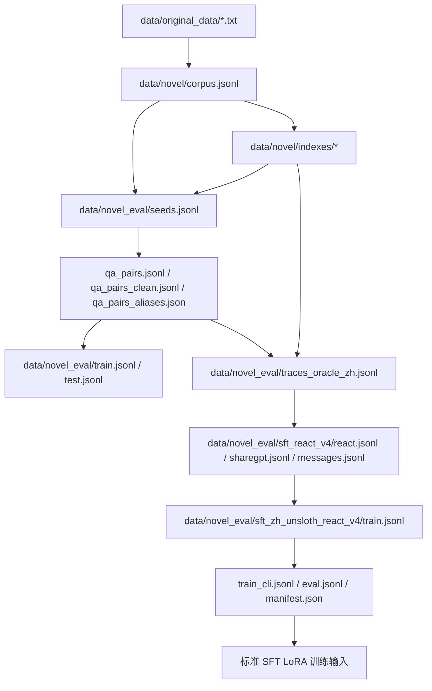

# 数据流

本文只记录 demo 工程的主数据链路：从小说原文解析、索引构建、多跳 QA、Oracle trace，到 canonical ReAct SFT 和命令行 SFT train/eval split。补充诊断数据、失败缓存、checkpoint、日志和训练输出不在本文展开。

## 总：主数据生成顺序



1. 原始小说文本 `data/original_data/*.txt` 经过解析和切块，生成 `data/novel/corpus.jsonl`。
2. `corpus.jsonl` 被索引构建脚本处理，生成 `data/novel/indexes/*`，供后续检索、Oracle trace 和 Agent loop 使用。
3. 语料和索引用于生成单跳种子 QA：`data/novel_eval/seeds.jsonl`，清洗后得到 `seeds_clean.jsonl`。
4. 单跳种子 QA 被组合、改写和清洗成多跳 QA：`qa_pairs.jsonl`、`qa_pairs_clean.jsonl`、`qa_pairs_aliases.json`。
5. 多跳 QA 被切分成训练候选集和最终 held-out 测评集：`data/novel_eval/train.jsonl` 与 `data/novel_eval/test.jsonl`。
6. 多跳 QA 和检索索引生成 Oracle ReAct 轨迹：`data/novel_eval/traces_oracle_zh.jsonl`。
7. Oracle traces 转换为 canonical ReAct SFT v4 数据：`data/novel_eval/sft_react_v4/react.jsonl`、`sharegpt.jsonl`、`messages.jsonl`。
8. `sft_react_v4/sharegpt.jsonl` 转换为 Unsloth 训练入口文件：`data/novel_eval/sft_zh_unsloth_react_v4/train.jsonl`。
9. 全量 SFT 文件被切成互不重叠的命令行训练/验证文件：`train_cli.jsonl`、`eval.jsonl`，并更新 `manifest.json`。
10. 标准 SFT LoRA 训练读取 `train_cli.jsonl` 和 `eval.jsonl`，通过项目 canonical Qwen3 ReAct renderer 渲染并使用 assistant-only loss。

主链路常用脚本顺序：

```powershell
uv run python `
  ./scripts/parse_text_corpus.py
uv run python `
  ./scripts/build_index.py
uv run python `
  ./scripts/build_knowledge_graph.py
uv run python `
  ./scripts/gen_seed_qa.py
uv run python `
  ./scripts/clean_seed_qa.py
uv run python `
  ./scripts/domain_multihop_synthesis.py
uv run python `
  ./scripts/clean_synthesis.py
uv run python `
  ./scripts/gen_enhanced_aliases.py
uv run python `
  ./scripts/split_train_test.py
uv run python `
  ./scripts/build_oracle_traces.py
uv run python `
  ./scripts/trace_to_sft.py
uv run python `
  ./scripts/convert_sft_to_unsloth.py
uv run python `
  ./scripts/split_sft_train_eval.py
uv run --no-sync python `
  ./scripts/train_sft_unsloth.py `
  --config ./training/unsloth_sft_v4.yaml `
  --overwrite
```

## 分：主链路数据文件说明

### 1. `data/novel/corpus.jsonl`

**生成来源**：由 `data/original_data/*.txt` 通过文本解析和切块生成，主脚本是 `scripts/parse_text_corpus.py`。

**数据格式**：JSONL，每行一个小说 chunk。核心字段：

| 字段 | 含义 |
| --- | --- |
| `chunk_id` | 全局唯一 chunk id，例如 `xkx_0001` |
| `title` | 小说名 |
| `text` | chunk 正文 |
| `metadata` | 来源文件、行号、章节、别名等解析信息 |
| `section` | 章节或段落归属 |

**样例**：

```json
{
  "chunk_id": "xkx_0001",
  "title": "侠客行",
  "text": "“金庸作品集”新序\n小说是写给人看的。小说的内容是人。...",
  "metadata": {
    "source_file": "金庸-侠客行.txt",
    "novel_title": "侠客行",
    "author": "金庸",
    "line_start": 1,
    "line_end": 15,
    "section_index": 1,
    "chunk_index_in_section": 1,
    "section_heading": "序",
    "character_aliases": []
  },
  "pages": [],
  "section": "序"
}
```

**作用**：这是全工程最底层的结构化小说语料。后续所有检索索引、QA 合成、Oracle trace 和评测证据都通过 `chunk_id` 回到这里。

**后续使用**：`scripts/build_index.py`、`scripts/build_knowledge_graph.py`、QA 合成脚本和本地检索器读取该文件。

### 2. `data/novel/indexes/*`

**生成来源**：由 `corpus.jsonl` 构建，主脚本包括 `scripts/build_index.py` 和 `scripts/build_knowledge_graph.py`。

**数据格式**：索引目录混合保存 JSON、JSONL、Pickle 和 FAISS 二进制文件。

| 文件 | 格式 | 作用 |
| --- | --- | --- |
| `faiss.index` | FAISS 二进制 | dense 向量检索索引 |
| `bm25.pkl` | Pickle | BM25 关键词检索索引 |
| `chunk_store.pkl` | Pickle | chunk id 到 chunk 内容的快速映射 |
| `chunk_ids.json` | JSON array | FAISS 向量行号到 `chunk_id` 的映射 |
| `knowledge_graph.json` | JSON graph | 实体关系图，用于关系证据和 KG 诊断 |
| `triples_cache.jsonl` | JSONL | 从语料抽取的关系三元组缓存 |
| `manifest.json` | JSON | 索引元信息和构建参数 |

**样例：`manifest.json`**：

```json
{
  "chunk_count": 8411,
  "index_type": "faiss_bge_m3+bm25+kg",
  "embedding_model": ".\\models\\bge-m3",
  "embedding_dim": 1024,
  "faiss": true,
  "bm25": true,
  "knowledge_graph": true,
  "triple_count": 61311,
  "llm_max_concurrency": 5,
  "reranker_model": ".\\models\\bge-reranker-v2-m3"
}
```

**样例：`chunk_ids.json`**：

```json
[
  "xkx_0001",
  "xkx_0002",
  "..."
]
```

**作用**：为 `keyword_search`、`dense_search`、`hybrid_search` 等工具提供真实检索能力。Oracle trace 构造和 HF Agent loop eval 都依赖这些索引。

**后续使用**：`scripts/build_oracle_traces.py`、`scripts/eval_hf_agentic.py`、GRPO retrieval server 和本地 smoke eval。

### 3. `data/novel_eval/seeds.jsonl` 与 `seeds_clean.jsonl`

**生成来源**：由 `corpus.jsonl` 和检索索引合成单跳种子 QA，主脚本是 `scripts/gen_seed_qa.py`；清洗脚本是 `scripts/clean_seed_qa.py`。

**数据格式**：JSONL，每行一个单跳 QA seed。核心字段：

| 字段 | 含义 |
| --- | --- |
| `question` | 单跳问题 |
| `answer` | 单跳答案 |
| `doc_chunk_id` | 支撑该答案的 gold chunk |
| `tool` | 推荐检索工具，当前多为 `keyword_search` |
| `entities` | 问题涉及实体 |
| `qa_type` | 问题类型，例如 `character`、`place`、`object` |

**样例**：

```json
{
  "question": "长篇小说《鲁滨逊飘流记》中出现的仆人叫什么名字？",
  "answer": "星期五",
  "qa_type": "character",
  "entities": ["鲁滨逊飘流记", "仆人"],
  "doc_chunk_id": "xkx_0001",
  "tool": "keyword_search"
}
```

**作用**：提供可组合的单跳事实单元。多跳 QA 不是直接从原文随机生成，而是由这些有 gold chunk 的单跳事实拼接、改写而来。

**后续使用**：`scripts/domain_multihop_synthesis.py` 读取 seed，组合成 2-hop / 3-hop 的最终问题。

### 4. `data/novel_eval/qa_pairs.jsonl`、`qa_pairs_clean.jsonl`、`qa_pairs_aliases.json`

**生成来源**：由 `seeds_clean.jsonl` 合成多跳 QA，主脚本包括 `scripts/domain_multihop_synthesis.py`、`scripts/clean_synthesis.py` 和 `scripts/gen_enhanced_aliases.py`。

**数据格式**：

- `qa_pairs.jsonl`：JSONL，每行一个多跳 QA。
- `qa_pairs_clean.jsonl`：清洗后的多跳 QA，结构与 `qa_pairs.jsonl` 一致。
- `qa_pairs_aliases.json`：JSON array，加入或增强 `answer_aliases` 后的多跳 QA。

核心字段：

| 字段 | 含义 |
| --- | --- |
| `final_question` | 多跳最终问题 |
| `final_answer` | 最终答案 |
| `hop_count` | 跳数，通常为 2 或 3 |
| `qa_type` | QA 类型 |
| `subset` | 数据子集标识，例如 `2hop_novel_stepwise` |
| `hops` | 每一跳的子问题、答案和 gold chunk |
| `answer_aliases` | 可接受答案别名 |

**样例**：

```json
{
  "final_question": "文中那位卖饼老者自称来自的集市，是因哪位历史人物得名的？",
  "final_answer": "侯赢",
  "hop_count": 2,
  "qa_type": "inference",
  "subset": "2hop_novel_stepwise",
  "hops": [
    {
      "hop_idx": 1,
      "question": "卖饼老者自称是哪个集市的人？",
      "answer": "侯监集",
      "doc_chunk_id": "xkx_0017",
      "qa_type": "place",
      "search_tools": ["keyword_search"]
    },
    {
      "hop_idx": 2,
      "question": "侯监集因哪位历史人物得名？",
      "answer": "侯赢",
      "doc_chunk_id": "xkx_0014",
      "qa_type": "character",
      "search_tools": ["keyword_search"]
    }
  ],
  "answer_aliases": ["侯赢"]
}
```

**作用**：这是后续训练和评测的 QA 任务源。它保存最终问题、最终答案、每跳 gold evidence 和可接受答案别名。

**后续使用**：`scripts/split_train_test.py` 切分 QA train/test；`scripts/build_oracle_traces.py` 基于每条 QA 的 hops 构造 Oracle ReAct 轨迹。

### 5. `data/novel_eval/train.jsonl` 与 `test.jsonl`

**生成来源**：由多跳 QA 通过 `scripts/split_train_test.py` 切分得到。

**数据格式**：JSONL，每行一个多跳 QA，字段结构与 `qa_pairs_clean.jsonl` 基本一致。

**样例：`train.jsonl`**：

```json
{
  "final_question": "殷素素险些晕倒时，抓住其肩头才站稳的那个人，曾用什么兵器去点谢逊手臂弯的小海穴？",
  "final_answer": "判官笔",
  "hop_count": 2,
  "qa_type": "inference",
  "subset": "2hop_novel_stepwise",
  "hops": [
    {
      "hop_idx": 1,
      "question": "殷素素险些晕倒时抓住了谁的肩头才站稳？",
      "answer": "张翠山",
      "doc_chunk_id": "yttlj_0331",
      "qa_type": "character",
      "search_tools": ["keyword_search"]
    },
    {
      "hop_idx": 2,
      "question": "张翠山用来点谢逊手臂弯小海穴的兵器是什么？",
      "answer": "判官笔",
      "doc_chunk_id": "yttlj_0316",
      "qa_type": "object",
      "search_tools": ["keyword_search"]
    }
  ],
  "answer_aliases": ["判官笔"]
}
```

**样例：`test.jsonl`**：

```json
{
  "final_question": "用曾被主角拿来阻止攀援上山崖的汉子的那种物品来惊退猛兽、并感叹古松救了自己性命的人是谁？",
  "final_answer": "段誉",
  "hop_count": 2,
  "hops": [
    {"hop_idx": 1, "answer": "石头", "doc_chunk_id": "tlbb_0188"},
    {"hop_idx": 2, "answer": "段誉", "doc_chunk_id": "tlbb_0080"}
  ],
  "answer_aliases": ["段誉"]
}
```

**作用**：

- `train.jsonl` 是构造 Oracle trace 和 SFT 数据的 QA 来源。
- `test.jsonl` 是最终 held-out 测评集，只用于模型评测。

**后续使用**：`train.jsonl` 进入 `scripts/build_oracle_traces.py`；`test.jsonl` 进入 `scripts/eval_hf_agentic.py` 等最终测评入口。`test.jsonl` 不进入 SFT 训练，也不作为 SFT eval dataset。

### 6. `data/novel_eval/traces_oracle_zh.jsonl`

**生成来源**：由多跳 QA、gold hops 和检索索引生成，主脚本是 `scripts/build_oracle_traces.py`。

**数据格式**：JSONL，每行一条 Oracle ReAct 轨迹。核心字段：

| 字段 | 含义 |
| --- | --- |
| `plan` | 从 QA `hops` 和 `search_tools` 生成的结构化检索计划 |
| `tool_calls` | 每跳应调用的工具名、query 和返回数量 |
| `evidence` | 每跳 gold chunk 渲染出的工具响应证据 |
| `messages` | 由 `plan/evidence` 渲染出的 system/user/assistant/tool 多轮轨迹 |
| `metadata.final_question` | 原始最终问题 |
| `metadata.final_answer` | 标准最终答案 |
| `metadata.gold_chunks` | 每跳 gold chunk id |
| `metadata.answer_aliases` | 可接受答案别名 |

**样例**：

```json
{
  "messages": [
    {
      "role": "system",
      "content": "你是一个中文小说阅读问答 Agent。你需要通过文本检索工具逐步搜索人物、地点、事件和关系证据，最后用 <answer>...</answer> 输出最终答案。"
    },
    {
      "role": "user",
      "content": "文中那位卖饼老者自称来自的集市，是因哪位历史人物得名的？"
    },
    {
      "role": "assistant",
      "content": "<think>要回答最终问题，先查：卖饼老者自称是哪个集市的人？</think>\n<tool_call>\n{\"name\":\"keyword_search\",\"arguments\":{\"query\":\"卖饼老者自称是哪个集市的人？\"}}\n</tool_call>"
    },
    {
      "role": "tool",
      "content": "chunk_id: xkx_0017\n..."
    },
    "...",
    {
      "role": "assistant",
      "content": "<answer>侯赢</answer>"
    }
  ],
  "plan": [
    {
      "id": 1,
      "sub_query": "卖饼老者自称是哪个集市的人？",
      "tool": "keyword_search",
      "depends_on": [],
      "gold_answer": "侯监集",
      "gold_chunk_id": "xkx_0017"
    },
    {
      "id": 2,
      "sub_query": "侯监集因哪位历史人物得名？",
      "tool": "hybrid_search",
      "depends_on": [1],
      "gold_answer": "侯赢",
      "gold_chunk_id": "xkx_0014"
    }
  ],
  "metadata": {
    "final_question": "文中那位卖饼老者自称来自的集市，是因哪位历史人物得名的？",
    "final_answer": "侯赢",
    "hop_count": 2,
    "gold_chunks": ["xkx_0017", "xkx_0014"],
    "answer_aliases": ["侯赢"]
  }
}
```

**作用**：Oracle trace 是 SFT 的直接上游。它把多跳 QA 的 gold hops 和 `search_tools` 转成结构化检索计划，再渲染成“理想 Agent 应该如何逐步检索并回答”的监督轨迹。第 1 跳 think 使用 `要回答最终问题，先查：{sub_query}`；后续跳使用 `已获得上一跳线索“{previous_answer}”，继续查：{sub_query}`。

**后续使用**：`scripts/trace_to_sft.py` 将该文件转换为 canonical ReAct SFT JSONL。

### 7. `data/novel_eval/sft_react_v4/react.jsonl`、`sharegpt.jsonl`、`messages.jsonl`

**生成来源**：由 `traces_oracle_zh.jsonl` 通过 `scripts/trace_to_sft.py` 生成。

**数据格式**：JSONL，每行一个 canonical SFT record。当前三个文件内容结构一致，均包含：

| 字段 | 含义 |
| --- | --- |
| `messages` | 项目 canonical Qwen3 ReAct renderer 可渲染的多轮消息 |
| `tools` | Qwen3 function tool schema，包含 `keyword_search`、`dense_search`、`hybrid_search` |
| `metadata` | 原 QA 信息、gold chunks、样本类型等 |

**样例：`full_trace` record**：

```json
{
  "messages": [
    {"role": "system", "content": "你是一个中文小说阅读问答 Agent。..."},
    {"role": "user", "content": "文中那位卖饼老者自称来自的集市，是因哪位历史人物得名的？"},
    {"role": "assistant", "content": "<think>要回答最终问题，先查：卖饼老者自称是哪个集市的人？</think>\n<tool_call>\n{\"name\":\"keyword_search\",\"arguments\":{\"query\":\"卖饼老者自称是哪个集市的人？\"}}\n</tool_call>"},
    {"role": "tool", "content": "chunk_id: xkx_0017\n..."},
    {"role": "assistant", "content": "<answer>侯赢</answer>"}
  ],
  "tools": [
    {"type": "function", "function": {"name": "keyword_search", "...": "..."}},
    {"type": "function", "function": {"name": "dense_search", "...": "..."}},
    {"type": "function", "function": {"name": "hybrid_search", "...": "..."}}
  ],
  "metadata": {
    "final_answer": "侯赢",
    "gold_chunks": ["xkx_0017", "xkx_0014"],
    "sample_type": "full_trace",
    "tool_turn_count": 2
  }
}
```

**样例：`first_action_only` record 结构**：

```json
{
  "messages": [
    {"role": "system", "content": "你是一个中文小说阅读问答 Agent。..."},
    {"role": "user", "content": "原始最终问题"},
    {"role": "assistant", "content": "<think>要回答最终问题，先查：第一跳问题</think>\n<tool_call>\n{\"name\":\"keyword_search\",\"arguments\":{\"query\":\"第一跳问题\"}}\n</tool_call>"}
  ],
  "tools": ["同一套 Qwen3 tool schema"],
  "metadata": {
    "sample_type": "first_action_only",
    "target_tool_turn": 1,
    "repeat_index": 1,
    "repeat_count": 2
  }
}
```

**样例：`final_answer_only` record 结构**：

```json
{
  "messages": [
    {"role": "system", "content": "你是一个中文小说阅读问答 Agent。..."},
    {"role": "user", "content": "原始最终问题"},
    {"role": "assistant", "content": "<think>要回答最终问题，先查：第一跳问题</think>\n<tool_call>\n{\"name\":\"keyword_search\",\"arguments\":{\"query\":\"第一跳问题\"}}\n</tool_call>", "loss": false},
    {"role": "tool", "content": "[chunk-a] 证据..."},
    {"role": "assistant", "content": "<answer>最终答案</answer>", "loss": true}
  ],
  "tools": ["同一套 Qwen3 tool schema"],
  "metadata": {
    "sample_type": "final_answer_only",
    "history_tool_turn_count": 1
  }
}
```

**作用**：

- `full_trace` 让模型学习完整 ReAct 工具调用路径。
- `first_action_only` 以 2 倍权重强化首轮 assistant 必须从短 `<think>` 开始，修复首轮 `</tool_call>` 崩溃。
- `next_action_only` 带前序自然 assistant/tool 历史，只监督下一轮工具动作。
- `final_answer_only` 带完整自然 assistant/tool 历史，只监督最终 `<answer>`。
- 带 `loss: false` 的历史 assistant turn 只作为上下文，不参与 loss。
- `tool` role 被保留，tool content 不提前手写 `<tool_response>`，由项目 canonical Qwen3 ReAct renderer 在训练渲染时处理。

**后续使用**：`scripts/convert_sft_to_unsloth.py` 读取 `sharegpt.jsonl` 并输出 Unsloth 主训练 JSONL。

### 8. `data/novel_eval/sft_zh_unsloth_react_v4/train.jsonl`

**生成来源**：由 `data/novel_eval/sft_react_v4/sharegpt.jsonl` 通过 `scripts/convert_sft_to_unsloth.py` 生成。

**数据格式**：JSONL，每行一个 Unsloth 可读取的 canonical SFT record。字段仍是 `messages`、`tools`、`metadata`。

**当前数量**：

```text
Oracle traces: 3000 条
full_trace: 3000 条
first_action_only: 6000 条
next_action_only: 4561 条
final_answer_only: 6000 条
sft_zh_unsloth_react_v4/train.jsonl: 19561 条
```

3000 条 Oracle traces 变成 19561 条 SFT records 的原因是：每条 trace 会生成完整轨迹、2 条首轮动作强化样本、若干下一跳动作样本和 2 条最终答案强化样本。

| `sample_type` | 数量 | 目的 |
| --- | ---: | --- |
| `full_trace` | 3000 | 学习完整多轮工具调用和最终回答 |
| `first_action_only` | 6000 | 2 倍强化首轮 `<think> + <tool_call>` 起始状态 |
| `next_action_only` | 4561 | 学习带历史证据时继续发起下一跳检索 |
| `final_answer_only` | 6000 | 2 倍强化证据足够后稳定输出 `<answer>` 并结束 |

**样例**：

```json
{
  "messages": [
    {"role": "system", "content": "你是一个中文小说阅读问答 Agent。..."},
    {"role": "user", "content": "文中那位卖饼老者自称来自的集市，是因哪位历史人物得名的？"},
    {"role": "assistant", "content": "<think>要回答最终问题，先查：...</think>\n<tool_call>\n{\"name\":\"keyword_search\",\"arguments\":{\"query\":\"...\"}}\n</tool_call>"},
    {"role": "tool", "content": "chunk_id: xkx_0017\n..."},
    {"role": "assistant", "content": "<answer>侯赢</answer>"}
  ],
  "tools": [
    {"type": "function", "function": {"name": "keyword_search", "...": "..."}},
    {"type": "function", "function": {"name": "dense_search", "...": "..."}},
    {"type": "function", "function": {"name": "hybrid_search", "...": "..."}}
  ],
  "metadata": {
    "final_question": "文中那位卖饼老者自称来自的集市，是因哪位历史人物得名的？",
    "final_answer": "侯赢",
    "gold_chunks": ["xkx_0017", "xkx_0014"],
    "sample_type": "full_trace"
  }
}
```

**作用**：这是 canonical SFT 全量导出，不直接作为当前标准命令行训练集使用。标准训练会先从它切出互不重叠的 `train_cli.jsonl` 和 `eval.jsonl`。

**后续使用**：`scripts/split_sft_train_eval.py` 读取该文件，生成 CLI train/eval split。

### 9. `data/novel_eval/sft_zh_unsloth_react_v4/train_cli.jsonl` 与 `eval.jsonl`

**生成来源**：由 `sft_zh_unsloth_react_v4/train.jsonl` 通过 `scripts/split_sft_train_eval.py` 切分得到。

**数据格式**：JSONL，结构与 `sft_zh_unsloth_react_v4/train.jsonl` 相同，仍包含 `messages`、`tools`、`metadata`。

**当前数量**：

| 文件 | 数量 | `full_trace` | `first_action_only` | `next_action_only` | `final_answer_only` | 用途 |
| --- | ---: | ---: | ---: | ---: | ---: | --- |
| `train_cli.jsonl` | 19361 | 2969 | 5939 | 4514 | 5939 | 标准 SFT LoRA 训练集 |
| `eval.jsonl` | 200 | 31 | 61 | 47 | 61 | 标准 SFT LoRA 验证集 |

当前 `manifest.json` 标记：

```text
split_eval_disjoint_from_train: true
```

并且当前文件整行 hash 交集为 0，说明 train/eval 内容不重叠。

**样例：`train_cli.jsonl`**：

```json
{
  "messages": [
    {"role": "system", "content": "你是一个中文小说阅读问答 Agent。..."},
    {"role": "user", "content": "赵敏对范遥说要去瞧的那个人，曾被困住他的陷阱与吴道通那黑黝黝毫不起眼的铁钳用同一种材质铸造；这个人是谁？"},
    {"role": "assistant", "content": "<think>要回答最终问题，先查：...</think>\n<tool_call>\n{\"name\":\"keyword_search\",\"arguments\":{\"query\":\"...\"}}\n</tool_call>"},
    {"role": "tool", "content": "chunk_id: xkx_0019\n..."},
    {"role": "assistant", "content": "<answer>张无忌</answer>"}
  ],
  "tools": [
    {"type": "function", "function": {"name": "keyword_search", "...": "..."}},
    {"type": "function", "function": {"name": "dense_search", "...": "..."}},
    {"type": "function", "function": {"name": "hybrid_search", "...": "..."}}
  ],
  "metadata": {
    "final_answer": "张无忌",
    "hop_count": 3,
    "gold_chunks": ["xkx_0019", "yttlj_1267", "yttlj_1461"],
    "sample_type": "full_trace",
    "tool_turn_count": 3
  }
}
```

**作用**：

- `train_cli.jsonl` 是 `training/unsloth_sft_v4.yaml` 的默认 `data_path`。
- `eval.jsonl` 是 `training/unsloth_sft_v4.yaml` 的默认 `eval_data_path`。
- 两者共同构成当前标准 SFT LoRA 的命令行训练/验证输入。

**后续使用**：`scripts/train_sft_unsloth.py` 和 `scripts/train_sft_unsloth_trace.py` 读取这两个文件，调用项目 canonical Qwen3 ReAct renderer 渲染训练文本，并通过 assistant-only label mask 只监督 assistant token。

### 10. `data/novel_eval/sft_zh_unsloth_react_v4/manifest.json`

**生成来源**：`scripts/convert_sft_to_unsloth.py` 创建基础 manifest，`scripts/split_sft_train_eval.py` 追加 split 统计信息。

**数据格式**：JSON，记录 SFT 导出和 train/eval split 的审计字段。

**样例**：

```json
{
  "format": "sharegpt_messages_jsonl",
  "source": "data\\novel_eval\\sft_react_v4\\sharegpt.jsonl",
  "output": "data\\novel_eval\\sft_zh_unsloth_react_v4\\train.jsonl",
  "count": 19561,
  "required_field": "messages",
  "trainer": "unsloth",
  "tool_schema": "qwen3",
  "chat_renderer": "canonical_qwen3_react",
  "tool_role_preserved": true,
  "message_loss_metadata": "assistant messages with loss=false are context only",
  "split_train_count": 19361,
  "split_eval_count": 200,
  "split_eval_stride": 82,
  "split_eval_disjoint_from_train": true,
  "split_train_sample_type_counts": {
    "final_answer_only": 5939,
    "first_action_only": 5939,
    "full_trace": 2969,
    "next_action_only": 4514
  },
  "split_eval_sample_type_counts": {
    "final_answer_only": 61,
    "first_action_only": 61,
    "full_trace": 31,
    "next_action_only": 47
  }
}
```

**作用**：这是主 SFT 数据的审计入口。它回答三个关键问题：

1. 当前 SFT 全量数据有多少条：`count=19561`。
2. 是否使用 Qwen3 tool schema 并保留 tool role：`tool_schema=qwen3`、`tool_role_preserved=true`。
3. 当前 CLI train/eval split 是否不重叠，以及四类主线样本数量是否符合 v4 分布。

**后续使用**：人工审查、训练前检查、文档核对和复现实验时使用。训练脚本不依赖 manifest 读取样本，但 manifest 是判断数据是否按预期生成的重要依据。

## 标准 SFT LoRA 训练如何消费这些数据

当前主 SFT 配置（`training/unsloth_sft_v4.yaml`，当前默认 `training/unsloth_sft.yaml` 也指向同一套 v4 数据）：

```yaml
data_path: ./data/novel_eval/sft_zh_unsloth_react_v4/train_cli.jsonl
eval_data_path: ./data/novel_eval/sft_zh_unsloth_react_v4/eval.jsonl
max_seq_length: 2048
packing: false
```

训练入口 `scripts/train_sft_unsloth.py` 对每条 record 执行：

1. 读取 `messages`。
2. 读取 record 级 `tools`。
3. 调用项目 canonical Qwen3 ReAct renderer 生成训练文本，不直接使用 tokenizer 原生 `tools=` 模板。
4. tokenization 后只把需要监督的 assistant span 的 label 保留为 token id，其余 system/user/tool/padding 和 `loss: false` 历史 assistant 都置为 `-100`。
5. 训练入口同时派生 `loss_weights`，对 assistant 首 token、`<think>`、`<answer>` 和 `<|im_end|>` 做协议边界加权监督；`</tool_call>` 不额外加权。
6. assistant span 包含该 assistant turn 的 `<|im_end|>`，用于学习工具调用或最终答案后停止本轮输出。

当前长度统计：

```text
data: data\novel_eval\sft_zh_unsloth_react_v4\train_cli.jsonl
samples: 19361
max_seq_length: 2048
min: 507 p50: 1292 avg: 1136.7 p90: 1773 p95: 1799 p99: 1840 max: 1885
> 1024: 10526 (54.4%)
> 2048: 0 (0.0%)
```

这说明当前 CLI 训练集不会因为 `max_seq_length=2048` 被截断。

## 其他过程文件

以下文件不作为标准 SFT LoRA 主链路输入，因此本文不逐项展开：

- `*.checkpoint.jsonl`、`*.failed.jsonl`、`*.rejected.jsonl` 等过程审计文件。
- SwanLab 日志、训练输出 checkpoint、merged model 和本地缓存目录。

这些文件用于过程恢复、训练观测或结果归档，不改变主线数据生成顺序。
