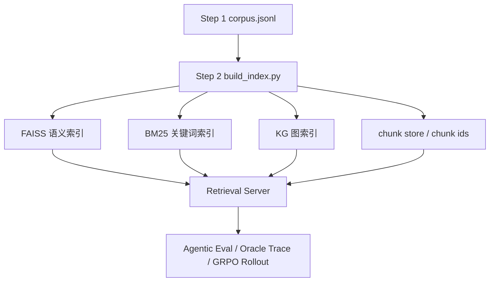
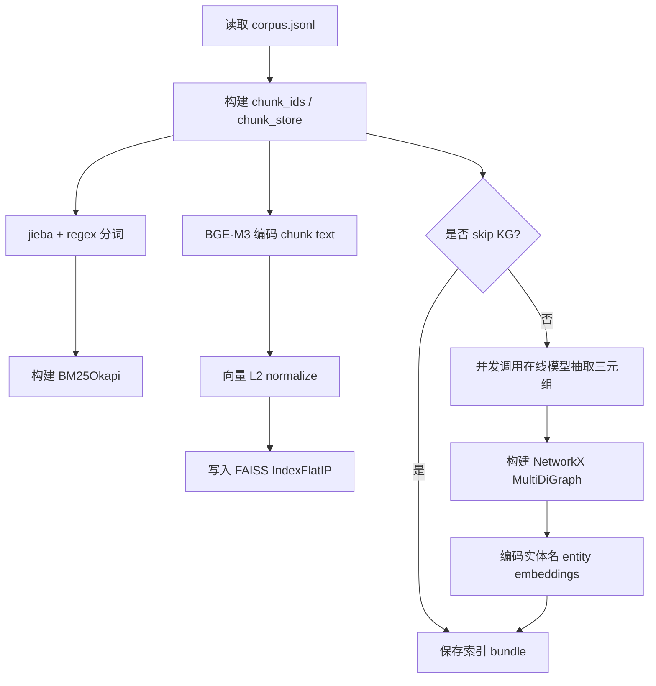

# 索引构建学习笔记

本文对应 `demo/README.md` 的 “Step 2: 构建检索索引”，目标是解释本工程为什么要构建 FAISS、BM25、KG、chunk store 等索引产物，以及这些产物在后续 Agentic RAG、SFT/GRPO 数据构造和评测中的作用。

## 1. Step 2 在整个工程中的位置

Step 1 已经把原始金庸小说文本切成 `data/novel/corpus.jsonl`，每条记录是一个可检索的 chunk。Step 2 的任务是把这些 chunk 变成“可高效查询”的多路索引。

如果没有 Step 2，后续模型或评测脚本只能从全量文本中逐条扫描，速度慢，而且无法模拟真实 RAG 系统中的检索工具行为。构建索引后，模型可以通过工具名发起查询：

- `keyword_search`：关键词检索，适合人名、地名、物品名等精确线索。
- `semantic_search` / `dense_search`：语义检索，适合表达不同但含义接近的问题。
- `graph_search`：知识图谱检索，适合人物关系、地点关系、事件链路等实体跳转。
- `hybrid_search`：融合关键词和语义检索结果，再重排。

主 SFT、Agent loop 和后续 GRPO 共享同一套 Qwen3 tool schema 与项目 canonical Qwen3 ReAct renderer。当前暴露给模型的 schema 包含 `keyword_search`、`dense_search`、`hybrid_search`；`graph_search` 仍可作为索引和检索实现能力保留，但不进入 canonical ReAct 主 schema。Oracle trace 默认每跳使用 `keyword_search` 命中 gold chunk，assistant 工具轮输出短 `<think>` 和 JSON tool call，评测和 reward 再用 `gold_chunks` / `retrieved_chunk_ids` 检查索引召回是否对齐。

v3 SFT 数据会把 tool response 中的单条证据文本截断到固定上限，保证 `max_seq_length: 2048` 下不截断训练样本。截断只影响模型上下文长度，不改变 `chunk_id`、索引、gold chunk 或评测召回口径。

工作流位置如下：



## 2. 输入和输出

### 输入

Step 2 的核心输入是：

```text
data/novel/corpus.jsonl
```

每条 chunk 至少包含：

| 字段 | 作用 |
| --- | --- |
| `chunk_id` | 稳定唯一 ID，是 FAISS 行号、BM25 文档序号、KG mention 和评测 gold chunk 的对齐键 |
| `text` | 真正参与索引和检索的文本 |
| `title` | 小说标题，用于展示和调试 |
| `section` | 章节标题，用于定位语境 |
| `metadata` | 原始文件、行号、人物别名等溯源信息 |

### 输出

索引输出目录默认是：

```text
data/novel/indexes/
```

主要产物如下：

| 产物 | 类型 | 作用 |
| --- | --- | --- |
| `manifest.json` | JSON | 记录索引摘要，例如 chunk 数量、embedding 模型、是否有 FAISS/BM25/KG |
| `faiss.index` | FAISS 二进制索引 | 存储每个 chunk 的 BGE-M3 向量，用于语义检索 |
| `bm25.pkl` | pickle | 存储 `BM25Okapi` 对象，用于关键词检索 |
| `chunk_ids.json` | JSON list | FAISS/BM25 内部行号到 `chunk_id` 的映射 |
| `chunk_store.pkl` | pickle dict | `chunk_id -> chunk record`，用于把检索命中还原成完整文本和 metadata |
| `knowledge_graph.json` | NetworkX node-link JSON | 实体关系图，用于图检索 |
| `entity_embeddings.pkl` | pickle | 实体名向量，用于把查询匹配到图谱实体 |
| `triples_cache.jsonl` | JSONL checkpoint | 每个 chunk 的 KG 抽取状态和三元组结果，用于断点续写 |

### 为什么要拆成这些产物

这一步最容易误解为“把文本存起来就行”。实际不是这样。一个可用的 RAG 检索系统至少要同时解决三件事：

1. 如何快速找到候选 chunk。
2. 如何把候选的内部行号还原成人类可读证据。
3. 如何保证训练、评测、reward 使用的是同一套 chunk ID。

所以工程没有只保存一个大 JSON，而是拆成多份索引产物：

| 设计 | 为什么这么做 | 好处 | 代价 |
| --- | --- | --- | --- |
| `faiss.index` 单独保存 | 向量索引用 FAISS 自己的二进制格式加载最快 | 检索性能好，兼容 FAISS 工具链 | 不能直接人工阅读 |
| `bm25.pkl` 单独保存 | BM25 对象构建后可直接反序列化 | 避免每次服务启动重新分词建库 | pickle 跨版本兼容性弱 |
| `chunk_ids.json` 单独保存 | FAISS 只知道向量行号，不知道业务 chunk ID | 保证 row index 能映射回 `chunk_id` | 必须和 `faiss.index` 保持同一顺序 |
| `chunk_store.pkl` 单独保存 | 检索命中后需要返回完整文本和 metadata | 服务无需再读原始 corpus | pickle 不适合跨语言系统 |
| `manifest.json` 单独保存 | 需要知道索引由哪个模型、多少 chunk 构建 | 便于排错和审计 | 只能记录摘要，不能证明索引内容完全正确 |
| `triples_cache.jsonl` 单独保存 | KG 抽取是长任务，必须可断点续写 | 失败可重试，避免重复花费 LLM 成本 | cache 需要维护状态和顺序 |

## 3. 构建命令

先下载本地 BGE 模型：

```text
uv run hf download BAAI/bge-m3 --local-dir ./models/bge-m3
uv run hf download BAAI/bge-reranker-v2-m3 --local-dir ./models/bge-reranker-v2-m3
```

只构建 FAISS + BM25，不构建 KG：

```text
uv run python ./scripts/build_index.py --corpus ./data/novel/corpus.jsonl --index-dir ./data/novel/indexes --embedding-model ./models/bge-m3 --reranker-model ./models/bge-reranker-v2-m3 --max-concurrency 5 --skip-kg
```

构建 FAISS + BM25 + KG：

```text
uv run python ./scripts/build_index.py --corpus ./data/novel/corpus.jsonl --index-dir ./data/novel/indexes --embedding-model ./models/bge-m3 --reranker-model ./models/bge-reranker-v2-m3 --max-concurrency 2
```

`--max-concurrency` 只影响 KG 抽取时并发调用在线大模型的数量。FAISS 和 BM25 构建不使用在线模型。

### 为什么建议先用 `--skip-kg`

正式三路索引当然包括 KG，但实践上建议先用 `--skip-kg` 跑通 FAISS + BM25。原因是：

- FAISS/BM25 是确定性构建，失败通常是模型路径、依赖或内存问题，容易排查。
- KG 需要调用在线大模型，模型输出有概率失败、超时或返回非 JSON，排查变量更多。
- 先跑通两路索引，可以先验证 corpus、chunk ID、embedding 模型和 retrieval server 是否正常。
- 后续去掉 `--skip-kg` 时，问题范围会收窄到 LLM 抽取和图谱构建。

取舍是：加 `--skip-kg` 后没有 `graph_search` 的真实图谱能力，只适合先验证索引构建主链路，不适合最终完整 Agentic RAG 测试。

## 4. 构建工作流

`scripts/build_index.py` 的流程可以拆成 7 步：



具体对应代码：

| 步骤 | 代码位置 | 说明 |
| --- | --- | --- |
| CLI 参数解析 | `scripts/build_index.py` | 解析 corpus、index-dir、embedding-model、skip-kg、max-concurrency |
| 加载 chunk | `agentic_rag_rl.io.load_chunks` | 把 `corpus.jsonl` 转成 `Chunk` 对象 |
| 构建索引 bundle | `agentic_rag_rl.indexing.build_index_bundle` | 主构建入口 |
| 保存索引 | `agentic_rag_rl.indexing.save_index_bundle` | 写出 FAISS、BM25、KG、chunk store 等产物 |
| 加载索引检索 | `agentic_rag_rl.retrieval.IndexedHybridRetriever` | retrieval server 使用的正式索引加载入口 |

### 为什么是“离线构建，在线加载”

索引构建被放在离线脚本里，而不是每次检索时实时计算，原因是：

- BGE-M3 编码所有 chunk 很慢，不适合每次启动服务都重复做。
- BM25 分词建库虽然比 embedding 快，但 corpus 变大后也会有启动成本。
- KG 抽取要调用大模型，不可能在查询时临时对全库抽图。
- 离线产物可以固定版本，让 SFT、GRPO、评测使用同一套检索环境。

这种设计的优点是服务启动快、结果稳定、可复现。缺点是 corpus 一旦变化，就必须重新构建索引；如果忘记重建，`chunk_ids.json`、`chunk_store.pkl` 和新 corpus 可能不一致，后续训练和评测会产生错位。

## 5. BM25 关键词检索

### 原理

BM25 是经典关键词检索算法，核心思想是：如果查询词在某个文档中出现，并且不是所有文档都常见的泛词，那么这个文档更相关。

它大致考虑三件事：

1. 词频：查询词在 chunk 中出现越多，分数越高，但增长会逐渐饱和。
2. 逆文档频率：越稀有的词越重要，例如“倚天剑”比“他说”更有区分度。
3. 文档长度归一化：避免长 chunk 因为词更多而天然占优。

本工程中，BM25 的构建方式是：

```text
chunk.text -> tokenize -> BM25Okapi(tokenized_corpus)
```

`tokenize` 的规则：

- 中文片段优先用 `jieba.lcut` 分词。
- 英文、数字用正则切分。
- 查询和建库使用同一套 tokenizer。

### 适合什么问题

BM25 适合：

- 人名精确匹配：`乔峰`、`令狐冲`、`张无忌`
- 地名精确匹配：`少室山`、`光明顶`
- 物品精确匹配：`倚天剑`、`屠龙刀`
- 原文中出现过的关键短语

### 为什么工程必须保留 BM25

即使已经有 BGE-M3 语义检索，BM25 仍然不能删。原因是小说问答里大量问题依赖精确实体：

- “倚天剑”不能被泛化成“武器”。
- “乔峰”和“萧峰”是否等价需要上下文或别名表，embedding 不一定稳定处理。
- 人名、门派、地名这类 token 对答案定位非常关键。

BM25 的优势是可解释、稳定、便宜。命中了就是因为词面重合，排查时可以直接看 query token 和 chunk token。它的劣势是召回边界硬，问法稍微变了就可能漏召回。

因此 BM25 在本工程中的定位是“精确召回基线”和“实体名兜底通道”，不是语义理解通道。

### 缺点

BM25 的主要问题是“不懂语义”：

- 问法换一种表达可能召不回来。
- 同义词、别名、代称处理弱。
- 对分词质量敏感，武侠小说中的人名、门派名、武功名可能被切错。
- 不能直接理解“某人的师父是谁”这种关系型问题，除非原文里关键词重合足够多。

## 6. FAISS + BGE-M3 语义检索

### 原理

语义检索先把每个 chunk 编码成向量，再把查询也编码成向量。向量距离越近，代表语义越相似。

本工程使用：

```text
BGE-M3 embedding -> normalize_embeddings=True -> FAISS IndexFlatIP
```

关键点：

- `BGE-M3` 是 embedding 模型，负责把文本转成 dense vector。
- `normalize_embeddings=True` 会把向量归一化成单位长度。
- `IndexFlatIP` 使用内积检索。
- 在向量已归一化的前提下，内积等价于 cosine similarity。

因此 FAISS 检索可以理解为：

```text
找出与 query 向量余弦相似度最高的 chunk 向量
```

### 为什么要用 FAISS

直接用 numpy 对全部向量做相似度计算也能工作，但 FAISS 是专门为向量检索优化的库：

- 对大量向量检索更快。
- 支持 GPU 和更多近似索引类型。
- 保存和加载索引方便。

当前工程使用 `IndexFlatIP`，它是精确检索，不是近似检索。优点是结果稳定，缺点是数据规模很大时内存和计算成本较高。

### 为什么用 BGE-M3

BGE-M3 的作用不是回答问题，而是把 query 和 chunk 映射到同一个语义空间。选择它的主要原因是：

- 支持中文语义检索，适合中文小说文本。
- 可以处理比普通短句 embedding 更复杂的段落语义。
- 和 `bge-reranker-v2-m3` 属于同一系列，检索与重排风格相对一致。

它的代价也明显：

- 模型体积比轻量 TF-IDF 大，首次下载和加载慢。
- 向量计算需要更多 CPU/GPU 时间。
- 对事实精确性没有保证，只能表示“语义接近”。

如果只是本机 smoke，可以用工程里的 `HybridRetriever` 走 TF-IDF 轻量路径；如果要接近真实 RAG 系统，就应该使用 BGE-M3 + FAISS 的正式索引路径。

### 为什么用 `IndexFlatIP`

FAISS 有很多索引类型，本工程选择 `IndexFlatIP` 是一个保守选择。

优点：

- 精确检索，不会因为近似索引漏掉最近邻。
- 构建简单，不需要训练聚类中心。
- 对 demo 规模数据足够快。
- 结果更稳定，便于调试和写测试。

缺点：

- 所有向量都要存内存。
- 查询时本质上仍要和全部向量比较。
- corpus 扩展到百万级 chunk 后会变慢，需要换 IVF、HNSW 或 PQ。

这个选择适合当前金庸小说 demo，因为数据规模不大，正确性和可解释调试优先于极限性能。

### 适合什么问题

语义检索适合：

- 问题和原文不完全同词，但意思接近。
- 描述型问题，例如“谁在危急时刻出手相助？”
- 需要根据上下文语义召回，而不是只靠人名或物品名。

### 缺点

语义检索的问题是：

- 对具体实体名的精确性不如 BM25。
- 向量模型可能把“语义相似但事实不同”的 chunk 排在前面。
- 长 chunk 中如果信息很多，单个向量可能混合多个主题。
- BGE-M3 模型加载和编码成本高于 BM25。
- `IndexFlatIP` 对小中规模数据简单可靠，但超大规模时需要改成 IVF/HNSW/PQ 等近似索引。

## 7. KG 知识图谱检索

### 构建原理

如果不加 `--skip-kg`，`build_index.py` 会为每个 chunk 调用在线大模型抽取三元组：

```text
(头实体, 关系, 尾实体)
```

例如：

```json
{"head": "张无忌", "relation": "持有", "tail": "屠龙刀"}
```

然后用 NetworkX 构建 `MultiDiGraph`：

- 节点：实体，例如人物、地点、门派、武功、物品。
- 边：关系，例如 `师从`、`属于`、`前往`、`击败`。
- 节点属性 `mentions`：这个实体在哪些 chunk 中出现过。
- 边属性 `chunk_id`：该关系来自哪个 chunk。

构建后保存：

```text
knowledge_graph.json
entity_embeddings.pkl
triples_cache.jsonl
```

### 为什么要构建 KG

BM25 和 FAISS 都是“从 query 到 chunk”的直接检索。多跳问答经常需要“从实体到实体”的跳转，例如：

```text
问题：某人师父所在门派后来发生了什么？
```

这类问题可能要先找到“某人 -> 师父”，再找“师父 -> 门派”，最后找“门派 -> 事件”。如果只靠 query 和 chunk 的相似度，第二跳和第三跳线索可能不在原始问题里，召回就会弱。

KG 的价值在于把文本里的实体关系显式化：

```text
人物 A --师从--> 人物 B --属于--> 门派 C
```

这样图检索可以沿着实体关系扩展候选 chunk，为多跳检索提供结构化线索。

### 为什么用 LLM 抽三元组，而不是规则抽取

武侠小说中的关系表达很灵活，例如师徒、结义、门派、兵器归属、前往地点、战斗结果等，很难靠规则完整覆盖。LLM 抽取的优势是：

- 能理解自然语言关系。
- 能从复杂句子中抽出实体和关系。
- 不需要手写大量正则和模板。

缺点是：

- 成本高。
- 输出不稳定。
- 可能幻觉。
- 实体规范化弱。

所以当前做法是务实折中：用 LLM 提升关系抽取覆盖率，再用 `triples_cache.jsonl` 做 checkpoint，降低重复调用成本。

### 图检索原理

图检索时，流程大致是：

1. 用 BGE-M3 把 query 编码成向量。
2. 用 query 向量和实体向量做相似度计算。
3. 取最相关的若干实体。
4. 从这些实体出发，在图上向前/向后扩展邻居。
5. 收集实体和边关联的 chunk。
6. 对候选 chunk rerank 后返回。

这类检索对多跳关系有帮助，因为图结构可以显式表达实体之间的连接。

### KG 检索的优势和代价

| 维度 | 优势 | 代价 |
| --- | --- | --- |
| 多跳能力 | 可以沿实体关系扩展，不只依赖原 query 词面 | 图谱抽错会把检索引向错误 chunk |
| 可解释性 | 可以看到实体、关系、来源 chunk | 当前文档未单独输出解释路径，只返回候选 chunk |
| 覆盖率 | LLM 能抽出规则难覆盖的隐含关系 | 可能漏抽、重复抽、关系名不统一 |
| 成本 | 抽取一次后可缓存复用 | 首次构建需要大量 LLM 调用 |

### 断点续写

KG 抽取是长时间 LLM 任务，因此本工程把每个 chunk 的状态写入 `triples_cache.jsonl`：

```json
{"chunk_id": "tlbb_0001", "status": "ok", "triples": [...]}
{"chunk_id": "tlbb_0002", "status": "failed", "error_type": "...", "error": "..."}
```

重新执行同一命令时：

- `status=ok` 的 chunk 会跳过。
- `status=failed` 的 chunk 会重新请求在线模型。
- 未出现于 cache 的 chunk 也会请求在线模型。
- 全部完成后，cache 会按 corpus chunk 顺序重写。

### 适合什么问题

KG 检索适合：

- 人物关系：谁是谁的师父、同门、敌人。
- 地点关系：某事件发生在哪里、人物从哪里到哪里。
- 物品归属：谁持有什么物品。
- 多跳推理：先找人物，再沿关系找到相关事件或地点。

### 缺点

KG 的主要风险来自 LLM 抽取：

- 三元组可能漏抽。
- 三元组可能抽错。
- 关系词可能不规范，例如同一种关系被写成多个近义表达。
- 实体规范化不足，例如“乔峰”和“萧峰”可能被当作两个节点。
- 成本高，需要调用在线模型，受速率限制、网络和费用影响。
- 生成的图谱质量高度依赖 prompt 和 chunk 质量。

因此 KG 不应被视为绝对事实库，而应被视为“辅助召回通道”。

## 8. RRF 融合和 rerank

### RRF 融合

`hybrid_search` 会先分别跑：

- `keyword_search`
- `semantic_search`

然后用 RRF 融合。

RRF 的思想是：不要直接比较不同检索器的原始分数，而是比较排名。一个 chunk 在多个检索器里排名都靠前，就应该更可靠。

公式近似为：

```text
score(chunk) += 1 / (k + rank)
```

其中 `rank` 是该 chunk 在某一路检索结果中的名次，`k` 默认是 60。

### rerank

融合后还会 rerank。

当前有两种 reranker：

| reranker | 代码 | 特点 |
| --- | --- | --- |
| `LightReranker` | 本地轻量重排 | 用原分数加 token overlap，速度快但效果有限 |
| `CrossEncoderReranker` | BGE reranker | 对 query 和 chunk 成对打分，效果更好但更慢 |

CrossEncoder reranker 不在 Step 2 预构建索引，而是在检索服务运行时通过 `--reranker-model` 加载。

### 为什么要融合再重排

单路检索经常有偏差：

- BM25 容易漏掉语义改写。
- 语义检索容易召回“看起来相关但事实不对”的片段。
- KG 容易受抽取质量影响。

融合的目标是扩大候选覆盖面，重排的目标是把更可能正确的证据放到前面。也就是：

```text
召回阶段：宁可多找一些候选，降低漏召回。
重排阶段：从候选里挑更相关的，降低噪声。
```

RRF 用排名融合而不是原始分数融合，是因为不同检索器的分数不可直接比较。BM25 分数、向量相似度、图谱分数的尺度不同，直接相加没有明确意义。排名则更稳定。

缺点是 RRF 丢掉了一部分分数强弱信息，而且当前实现的 `hybrid_search` 还没融合 graph candidates。

## 9. 正式索引检索和本地 smoke 检索的区别

工程里有两套检索路径，学习时要区分：

### 正式索引路径

当 retrieval server 启动时传入 `--index-dir`：

```text
uv run python ./training/tools/retrieval_server.py --index-dir ./data/novel/indexes --embedding-model ./models/bge-m3 --reranker-model ./models/bge-reranker-v2-m3
```

会使用：

```text
IndexedHybridRetriever
```

它加载：

- `bm25.pkl`
- `faiss.index`
- `chunk_ids.json`
- `chunk_store.pkl`
- 可选 `knowledge_graph.json`
- 可选 `entity_embeddings.pkl`

### 本地 smoke 路径

如果不传 `--index-dir`，retrieval server 会直接读取 corpus，并创建：

```text
HybridRetriever
```

它会在内存里构建：

- BM25
- `TfidfVectorizer(analyzer="char_wb", ngram_range=(2, 4))` 轻量 dense
- `LightReranker`

这条路径适合快速 smoke test，但不是 Step 2 的正式 BGE-M3/FAISS 索引路径。

## 10. 现有实现中的一个重要边界

README 中说支持 FAISS、BM25、KG 和 hybrid 检索，这是真的；但当前代码里要注意一个细节：

- `graph_search` 是单独的工具。
- `hybrid_search` 当前融合的是 `keyword_search + semantic_search`。
- `hybrid_search` 还没有把 `graph_search` 候选一起纳入 RRF 融合。

也就是说，如果你希望三路同时融合，需要后续增强 `IndexedHybridRetriever.hybrid_search`，把 graph candidates 也加入：

```text
RRF([keyword_results, semantic_results, graph_results])
```

当前工程更准确的理解是：

```text
keyword_search / semantic_search / graph_search 是三种可单独调用的工具；
hybrid_search 当前是关键词 + 语义的融合工具。
```

### 为什么当前先不把 graph 放进 hybrid

这是一个工程取舍，而不是理论上不应该融合。

暂不融合 graph 的原因：

- KG 构建是可选的，很多本机 smoke 会用 `--skip-kg`。
- 图谱质量依赖 LLM 抽取，早期不稳定时直接混入 hybrid 可能污染主检索。
- keyword + semantic 已经能覆盖大部分基础检索需求。
- graph_search 单独暴露，便于单独评估 KG 的有效性。

后续如果 KG 质量稳定，可以把 `IndexedHybridRetriever.hybrid_search` 改成三路融合：

```text
keyword_results = keyword_search(query)
semantic_results = semantic_search(query)
graph_results = graph_search(query)
fused = rrf_fuse([keyword_results, semantic_results, graph_results])
rerank(fused)
```

优点是工具更强，缺点是更难判断某次命中来自哪一路，也更依赖 KG 质量。

## 11. 为什么这些索引对 Agentic RAG 重要

Agentic RAG 不是简单“一次检索，一次回答”。模型会在多轮中决定：

- 先查哪个实体？
- 用关键词查还是语义查？
- 如果第一跳找到了人物，第二跳是否要查这个人物相关地点或关系？
- 最后答案是否被证据支持？

这些行为需要稳定的检索工具支撑。

不同索引承担不同角色：

| 索引 | 对 Agent 的作用 |
| --- | --- |
| BM25 | 给模型提供精确关键词定位能力 |
| FAISS | 给模型提供语义召回能力 |
| KG | 给模型提供实体关系跳转能力 |
| rerank | 降低候选噪声，把更相关证据排到前面 |
| chunk store | 把命中 ID 还原成模型可读证据文本 |

后续 SFT 的 oracle traces 和 GRPO 的 reward 都依赖 chunk ID、证据文本和检索结果。因此索引质量会直接影响训练数据质量和评测可信度。

### 为什么索引质量会影响 SFT 和 GRPO

SFT 阶段模型学习的是“如何调用工具、如何读取证据、如何输出答案”。如果检索结果不好，Oracle traces 里就会出现低质量证据，模型会学到错误的检索习惯。

GRPO 阶段 reward 会检查：

- 答案是否正确。
- 是否召回 gold chunks。
- 是否基于证据回答。
- 工具调用次数和搜索行为是否合理。

如果索引召回不到 gold chunks，模型即使策略正确也拿不到足够证据，reward 会变得噪声更大。因此索引不是外围工具，而是训练闭环的一部分。

### 为什么不只用大模型直接回答

这个工程强调 Agentic RAG 和 RL 后训练，而不是闭卷问答。直接让大模型凭参数回答有几个问题：

- 不能保证答案来自给定小说 corpus。
- 难以验证证据来源。
- 模型可能记忆或编造。
- 无法训练工具调用能力。
- reward 无法稳定判断检索行为是否正确。

构建索引的意义就是把回答约束到可检索、可审计、可评测的证据上。

## 12. 常见问题和排查

### 1. `Path .\models\bge-m3 not found`

说明本地没有 embedding 模型。先执行：

```text
uv run hf download BAAI/bge-m3 --local-dir ./models/bge-m3
```

### 2. KG 构建很慢

KG 构建会对每个 chunk 调用在线模型。可以：

- 先加 `--skip-kg` 只构建 FAISS + BM25。
- 把 `--max-concurrency` 从 5 降到 1 或 2，降低限流风险。
- 查看 `kg_extraction.progress completed=.../... failed=...` 判断是否仍在推进。

### 3. KG 中途失败后怎么办

直接重新执行同一条命令。`triples_cache.jsonl` 会让成功 chunk 跳过，失败 chunk 重试。

### 4. 检索结果和预期不一致

排查顺序：

1. 检查 `corpus.jsonl` 的 chunk 是否切得合理。
2. 检查 `chunk_ids.json` 和 `chunk_store.pkl` 是否与当前 corpus 对齐。
3. 用 `keyword_search` 单独查实体名。
4. 用 `semantic_search` 单独查自然语言问题。
5. 如果 KG 开启，检查 `triples_cache.jsonl` 中相关 chunk 是否抽出了实体关系。
6. 如果 rerank 后结果变差，先不传 `--reranker-model`，退回 `LightReranker` 对比。

## 13. 主要缺点总结

| 模块 | 缺点 |
| --- | --- |
| BM25 | 不懂语义；依赖分词；别名、同义表达弱 |
| FAISS + BGE-M3 | 可能语义相似但事实错误；模型加载和向量计算成本高 |
| IndexFlatIP | 精确但不是压缩索引，数据很大时内存和检索成本会上升 |
| KG | LLM 抽取可能错漏；实体归一化不足；成本高 |
| reranker | CrossEncoder 慢；轻量 reranker 效果有限 |
| chunk 粒度 | chunk 太大容易主题混杂，太小容易缺上下文 |
| 当前 hybrid | 只融合 keyword + semantic，未融合 graph |

## 14. 设计取舍总表

| 设计选择 | 为什么这么做 | 优点 | 缺点 | 什么时候要升级 |
| --- | --- | --- | --- | --- |
| 多路索引 | 小说问答既有实体精确匹配，也有语义改写和关系跳转 | 召回覆盖更全面 | 系统复杂度更高 | 当某一路明显无贡献时可裁剪 |
| BM25 + jieba | 中文关键词检索需要分词 | 快、便宜、可解释 | 分词错误影响召回 | 加领域词典、人名词典 |
| BGE-M3 + FAISS | 需要中文语义召回 | 能处理问法变化 | 成本高、可能事实混淆 | 更换更强 embedding 或蒸馏小模型 |
| `IndexFlatIP` | demo 数据规模不大，优先准确稳定 | 简单、精确、易调试 | 大规模慢、占内存 | 百万级 chunk 改 HNSW/IVF/PQ |
| LLM 抽 KG | 小说关系复杂，规则难覆盖 | 关系抽取覆盖更好 | 贵、不稳定、可能错 | 加实体归一化、人工校验或小模型抽取 |
| checkpoint JSONL | LLM 长任务容易中断 | 可续写、可重试、可审计 | 文件会有中间状态，需要最终重写 | 大规模任务可迁移到 SQLite/队列 |
| CrossEncoder rerank | 初召回后需要提高证据排序质量 | 精度通常更好 | 推理慢 | 高并发服务可改批量 rerank 或轻量 reranker |
| 保留 smoke retriever | 本机快速验证不依赖大模型索引 | 启动快、测试简单 | 不代表正式检索效果 | 正式实验必须用 indexed retriever |

## 15. 学习时建议关注的代码

| 文件 | 建议重点看 |
| --- | --- |
| `scripts/build_index.py` | CLI 参数、模型路径检查、KG 并发参数 |
| `src/agentic_rag_rl/indexing.py` | FAISS/BM25/KG 构建和保存逻辑 |
| `src/agentic_rag_rl/retrieval.py` | 正式索引加载、检索、RRF、rerank |
| `training/tools/retrieval_server.py` | 如何启动检索服务，何时用 indexed retriever |
| `src/agentic_rag_rl/server.py` | `/search` API 如何分发不同 tool |

## 16. 一句话总结

Step 2 的本质是把小说 chunk 从“静态文本文件”转换成“多路可查询证据库”。BM25 负责精确词面匹配，FAISS+BGE-M3 负责语义召回，KG 负责实体关系跳转，rerank 负责候选重排，chunk store 负责把命中的 ID 还原成模型可用证据。
