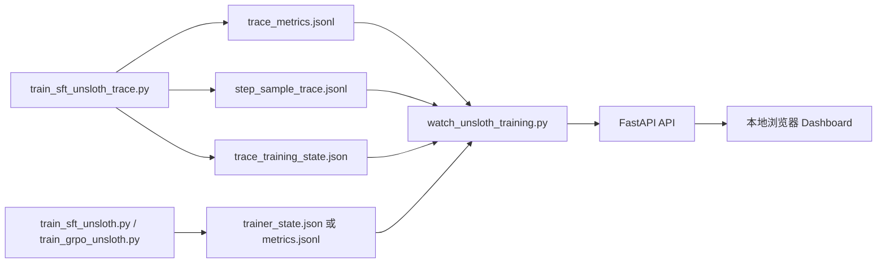

# Unsloth 自定义训练实时可视化方案

本文探索本工程在 Unsloth 自定义 SFT / GRPO 训练中如何做实时可视化。重点不是替代训练脚本，而是在不破坏现有训练稳定性的前提下，把 loss、eval loss、learning rate、gradient norm、样本追溯和 GRPO reward 变化实时看见。

## 结论

推荐采用“两层观测”：

| 层级 | 目标 | 推荐方案 |
| --- | --- | --- |
| 标准指标层 | 实时看 loss、eval loss、learning rate、grad norm、checkpoint 进度 | 训练脚本写 JSONL，同时可选打开 TensorBoard / W&B |
| 解释追溯层 | 解释某个异常 step 为什么异常，能反查样本、token 长度、hop、gold chunks | 复用 `train_sft_unsloth_trace.py` 的 `step_sample_trace.jsonl` 和 `trace_metrics.jsonl`，做项目原生 dashboard |

最适合本工程的第一版工具不是直接接入复杂实验平台，而是新增一个轻量本地观察器：

```text
scripts\watch_unsloth_training.py
```

它读取训练输出目录下的 JSONL / JSON 文件，通过 FastAPI + 本地网页展示曲线和异常 step 明细。这样能复用当前 `requirements.txt` 已有的 `fastapi`、`uvicorn`、`pandas`，不需要新增前端构建链路，也不依赖外部服务。

## 成功标准

实时可视化工具应满足：

- 训练不中断时，页面能在数秒内看到最新 step。
- 能同时展示 `loss`、`eval_loss`、`grad_norm`、`learning_rate`。
- 对 `grad_norm` 最高的 step，能一键展开对应样本。
- 能显示 `source_line`、`sample_id`、`question`、`answer`、`hop_count`、`gold_chunks`、`token_length`、`truncated`。
- 普通 `SFTTrainer` / `GRPOTrainer` 路径也能至少看到标准指标。
- 没有 trace 文件时页面不报错，而是降级展示 `trainer_state.json` 或 JSONL 指标。
- 训练脚本写日志失败时不能影响训练本身。

## 现状判断

### 已有能力

当前文档和脚本已经具备三个基础：

| 位置 | 当前能力 |
| --- | --- |
| `docs\训练命令.md` | 给出 SFT LoRA、LoRA 合并、GRPO / RL 的命令入口 |
| `docs\UnslothStudio训练.md` | 说明 Studio 中如何观察 training loss、gradient norm、learning rate、eval loss |
| `docs\训练追溯.md` | 说明如何用 `train_sft_unsloth_trace.py` 精确追溯 optimizer step 到样本 |
| `scripts\train_sft_unsloth_trace.py` | 已持续写出 `step_sample_trace.jsonl`、`trace_metrics.jsonl`、`trace_training_state.json` |
| `scripts\inspect_sft_trace.py` | 已支持按 step 或 top grad norm 反查样本 |

其中最有价值的是可追溯训练入口。它不是猜测 dataloader 顺序，而是在训练循环中把每个 optimizer step 实际包含的 micro-batch 样本写出来，所以适合作为实时可视化的核心数据源。

### 当前缺口

| 缺口 | 影响 |
| --- | --- |
| 普通 `train_sft_unsloth.py` 使用 `report_to: []` | 默认不会向 TensorBoard / W&B 上报 |
| 普通 SFT 入口没有 eval dataset 参数 | 普通 SFT 脚本只能实时看训练指标；需要 eval loss 时使用 trace 入口或后续扩展 eval dataset |
| `train_grpo_unsloth.py` 也使用 `report_to: []` | GRPO 标准曲线默认不进入实验平台 |
| `reward_func` 只返回 reward 分数列表 | 无法实时分析 correctness、faithfulness、hop recall 等 reward 分量 |
| `compute_score_breakdown` 当前只返回总分和版本 | 还没有暴露 `score_response(...).breakdown` 的完整分项 |
| 只有命令行追溯工具 | 能查异常，但不能持续观察和交互筛选 |

## 方案对比

| 方案 | 实时曲线 | 样本追溯 | 本地隐私 | 改造成本 | 结论 |
| --- | --- | --- | --- | --- | --- |
| Unsloth Studio 自带图表 | 有 | 无法精确追溯 step 样本 | 本地 | 低 | 适合手动训练观察，不足以解释异常样本 |
| TensorBoard | 有 | 无 | 本地 | 低 | 适合标准指标，作为可选项 |
| W&B | 有 | 可通过表格扩展 | 外部服务或私有部署 | 中 | 适合云端实验对比，不应作为唯一方案 |
| MLflow | 有 | 可扩展 | 本地或私有服务 | 中 | 对当前单机训练略重 |
| 项目原生 JSONL dashboard | 有 | 有 | 本地 | 中 | 最适合当前工程，推荐做第一版 |

## 推荐架构



### Dashboard 页面

第一版页面只做训练观测，不做训练控制。

| 区域 | 内容 |
| --- | --- |
| 顶部状态 | `global_step / total_steps`、epoch、最新 loss、最新 eval loss、最新 grad norm、最新 learning rate、最后更新时间 |
| 曲线区 | loss 曲线、eval loss 曲线、grad norm 曲线、learning rate 曲线 |
| 异常区 | top grad norm steps、NaN / inf、长时间无更新、eval loss 连续上升 |
| 样本区 | 点击 step 后展示该 step 的全部 micro-batch 样本 |
| 文件区 | 当前读取的 output dir、trace path、metrics path、state path |

### 数据读取顺序

观察器应按优先级读取：

1. `trace_metrics.jsonl`
2. `trace_training_state.json`
3. `step_sample_trace.jsonl`
4. `checkpoint-*\trainer_state.json`
5. `trainer_state.json`

如果是可追溯 SFT，优先使用前 3 个文件；如果是普通 SFT / GRPO，则读取统一的 `metrics.jsonl`，再退回到 Trainer 状态文件。

## 数据契约

### trace_metrics.jsonl

来自 `train_sft_unsloth_trace.py`，适合画曲线。

```json
{
  "step": 199,
  "epoch": 0.57,
  "loss": 0.4491,
  "learning_rate": 0.00008145,
  "grad_norm": 19.3473,
  "eval_loss": null,
  "sample_count": 8,
  "source_lines": [1585, 1586],
  "sample_ids": ["sft_001585", "sft_001586"]
}
```

### trace_training_state.json

适合做顶部状态卡片。

```json
{
  "global_step": 199,
  "total_steps": 1050,
  "epoch": 0.57,
  "last_loss": 0.4491,
  "last_grad_norm": 19.3473,
  "last_learning_rate": 0.00008145,
  "last_eval_loss": null,
  "trace_output": "training\\outputs\\...\\step_sample_trace.jsonl",
  "metrics_output": "training\\outputs\\...\\trace_metrics.jsonl"
}
```

### step_sample_trace.jsonl

适合做异常解释。

```json
{
  "step": 199,
  "loss": 0.4491,
  "grad_norm": 19.3473,
  "micro_batches": [
    {
      "micro_batch_index": 789,
      "items": [
        {
          "sample_id": "sft_001585",
          "source_line": 1585,
          "token_length": 1507,
          "truncated": false,
          "question": "...",
          "answer": "...",
          "hop_count": 2,
          "gold_chunks": ["yttlj_1238", "yttlj_1237"]
        }
      ]
    }
  ]
}
```

## 第一版工具设计

### 命令形态

已新增命令：

```powershell
Set-Location E:\AI\AgenticRAG-RL\demo

uv run python .\scripts\watch_unsloth_training.py `
  --output-dir .\training\outputs\unsloth_sft_qwen3_4b_lora_trace `
  --host 127.0.0.1 `
  --port 8891 `
  --refresh-seconds 3
```

浏览器打开：

```text
http://127.0.0.1:8891
```

### API 草案

| API | 用途 |
| --- | --- |
| `GET /` | 返回本地 dashboard HTML |
| `GET /api/state` | 返回最新训练状态 |
| `GET /api/metrics?limit=2000` | 返回曲线数据 |
| `GET /api/spikes?top=20` | 返回 grad norm 最高的 step |
| `GET /api/step/{step}` | 返回指定 step 的样本明细 |
| `GET /api/files` | 返回当前识别到的训练文件 |

### 实现约束

- 只读训练输出目录，不向训练进程发控制信号。
- JSONL 读取要容忍最后一行正在写入导致的半行 JSON。
- 默认只返回最近 N 个点，避免长训练时页面卡顿。
- 所有输出使用 UTF-8。
- 写入类训练脚本继续使用 CRLF JSONL，和现有追溯脚本保持一致。
- 页面不要依赖远程 CDN，避免离线训练环境打不开。

## 普通 SFT / GRPO 的接入方式

可追溯 SFT 已经有 JSONL。普通 SFT / GRPO 通过统一 callback 写出 dashboard 可读的指标：

```text
training\monitoring.py
```

核心入口：

```text
JsonlMetricsCallback
```

职责：

- 在 `on_log` 中把 Trainer logs 追加到 `metrics.jsonl`。
- 写入字段至少包含 `step`、`epoch`、`loss`、`eval_loss`、`learning_rate`、`grad_norm`、`train_runtime`。
- 写失败只打印 warning，不抛出异常中断训练。

两个训练脚本已增加可选参数：

```text
--metrics-output
--report-to tensorboard
--logging-dir
```

普通 SFT 后续如果需要在 `SFTTrainer` 路径直接观察 eval loss，再增加：

```text
--eval-data-path
--eval-steps
```

这样脚本训练可以和 Studio 一样观察 eval loss。

## GRPO / RL 可视化扩展

GRPO 的观测重点和 SFT 不同，除了 loss，还要看 reward 结构。

建议新增：

```text
training\outputs\unsloth_grpo_qwen3_4b\reward_metrics.jsonl
```

每条记录包含：

```json
{
  "step": 32,
  "mean_reward": 0.42,
  "min_reward": 0.11,
  "max_reward": 0.73,
  "judge_correctness": 0.36,
  "judge_faithfulness": 0.51,
  "grounded_answer": 0.48,
  "format": 0.10,
  "hop_recall": 0.40,
  "hop_precision_recall": 0.35,
  "search_effort": 0.75,
  "insufficient_search_penalty_rate": 0.18
}
```

实现上不建议在 `reward_func` 里只记录最终分数。应复用 `score_response(...).breakdown`，把 correctness、faithfulness、hop recall、format、search effort 等分量一并输出。这样才能判断 GRPO 是真的学会检索和 grounded answer，还是只靠格式奖励上涨。

## 告警规则

第一版可以做简单规则，不引入复杂统计：

| 告警 | 规则 |
| --- | --- |
| 训练停滞 | `trace_training_state.json` 超过 5 分钟未更新 |
| loss 异常 | 最新 loss 为 NaN / inf |
| grad norm 突刺 | 最新 grad norm 大于最近 50 step 中位数的 5 倍 |
| 截断样本 | 任一 top grad norm step 中存在 `truncated=true` |
| eval loss 恶化 | 最近 3 次 eval loss 连续上升 |
| 搜索不足 | GRPO 中 `insufficient_search_penalty_rate` 持续高于 30% |

这些告警只用于提示排查，不自动改学习率、batch size 或数据。

## 迭代路线

### P0：文档明确方案

完成本文，确定工具边界和数据契约。

### P1：只读 dashboard

已新增 `scripts\watch_unsloth_training.py`：

- 读取 trace 训练输出。
- 展示曲线和 top grad norm step。
- 点击 step 查看样本。
- 用一份小型 fixture 验证 JSONL 解析和 API 返回。

这一阶段不改训练脚本，风险最低。

### P2：统一 Trainer 指标输出

已新增 `training\monitoring.py`：

- 给普通 SFT / GRPO 增加 `JsonlMetricsCallback`。
- 支持 `--metrics-output`。
- 可选支持 `--report-to tensorboard`。
- 普通 SFT 的 eval dataset 仍作为后续扩展。

### P3：GRPO reward 分解

扩展 `compute_score_breakdown`：

- 返回 `score_response(...).breakdown`。
- `reward_func` 聚合 batch 内 reward 分量。
- dashboard 新增 reward 分量曲线。

### P4：实验对比

在训练结束后读取：

```text
results\sft_compare\summary.json
results\agentic_eval_judged.json
```

把训练曲线和 held-out 评测指标放在同一页面，但仍保持最终评测和训练过程观测分离。

## 当前建议

短期建议先用下面组合：

1. 正常训练和最终效果：继续使用 `docs\训练命令.md` 中的 SFT / GRPO / eval 命令。
2. 需要看异常样本：使用 `train_sft_unsloth_trace.py` 训练，并读取 `trace_metrics.jsonl`、`step_sample_trace.jsonl`。
3. 需要实时页面：运行 `scripts\watch_unsloth_training.py` 查看只读 dashboard。
4. 需要跨实验对比：再打开 TensorBoard / W&B，不把它们作为本工程唯一观测方案。

## 外部接口依据

- Hugging Face Transformers `TrainingArguments.report_to` 支持把 Trainer 指标交给 TensorBoard、W&B 等集成；见 [Transformers Trainer 参数文档](https://huggingface.co/docs/transformers/main_classes/trainer)。
- Transformers `TrainerCallback` 提供 `on_log` 等回调点，适合把 logs 追加到项目自己的 JSONL；见 [Transformers Callback 文档](https://huggingface.co/docs/transformers/main_classes/callback)。
- TRL `SFTTrainer` 基于 Transformers Trainer 训练参数，适合复用同一套 `report_to` 和 callback 思路；见 [TRL SFTTrainer 文档](https://huggingface.co/docs/trl/sft_trainer)。
- W&B 官方说明 Hugging Face Trainer 可以自动记录训练和评估指标；见 [W&B Hugging Face 集成文档](https://docs.wandb.ai/guides/integrations/huggingface/)。
