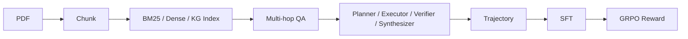

# 项目骨架图与数据流

这份 PDF 真正有价值的地方，不是“简历话术”，而是它把一个垂域多跳 Agentic RAG 项目拆成了能验证、能诊断、能训练的完整链路。

## 六个核心对象

后续所有学习都围绕这六个对象：

1. `corpus / chunk`
2. `index`
3. `hop`
4. `plan / evidence`
5. `trajectory`
6. `reward`

## 一条主链

## 这为什么不是普通 Advanced RAG

普通 `Advanced RAG` 仍然偏线性：

- 先改写 query
- 再检索
- 再 rerank
- 再生成答案

而这个项目的核心变化在于：`Agent` 会根据中间证据决定下一步要不要继续搜、搜什么、换什么工具、什么时候停。

这意味着它从“固定流水线优化”变成了“带闭环反馈的决策系统”。

## 你必须先吃透的四个问题

## 1. 为什么需要 hop-aware 评测

多跳系统失败时，单看 `EM/F1` 不够。你不知道它是：

- 没规划对
- 没搜到关键 chunk
- 提前停了
- 还是搜太多噪声

`hop-aware` 指标的意义就是把“答错”拆成更具体的失败类型。

## 2. 为什么金融语料里 BM25 更重要

因为金融文本里大量关键信号依赖精确命名：

- 公司名
- 法定代表人
- 股票代码
- 数字
- 日期

这类信息往往比自然语言语义更依赖精确字符串匹配，所以 `BM25` 常常比纯 dense 检索更稳定。

## 3. 为什么 Verifier 不是主因

原文最有价值的诊断结论之一是：

- `Verifier` 判不充分，很多时候其实没判错
- 真正的问题是 `replan` 后搜回来的内容和之前高度重叠

也就是“知道不够”不等于“有能力补救”。

## 4. 为什么 RL 必须先学 grounding

如果直接用 correctness 驱动 RL，模型很容易绕过检索，直接猜答案。

这就是 reward hacking。

先学 `grounding / faithfulness` 的作用，是先把策略空间收窄到“基于证据回答”，再追求“答对”。

## 你后续看代码时的阅读顺序

建议按下面顺序理解，而不是直接冲训练：

1. `chunk` 是怎么来的
2. 三路检索各自擅长什么
3. `plan -> evidence -> verify -> replan` 状态怎么流动
4. 评测指标如何反推系统问题
5. SFT 轨迹从哪来
6. RL reward 为什么会带偏模型

